# 1. Indice

- [1. Indice](#1-indice)
- [2. Transistore BJT come Amplificatore](#2-transistore-bjt-come-amplificatore)
	- [2.1. Amplificatore a Emettitore Comune](#21-amplificatore-a-emettitore-comune)
	- [2.2. Amplificatore a Collettore Comune](#22-amplificatore-a-collettore-comune)
- [3. MOSFET come Amplificatore](#3-mosfet-come-amplificatore)
	- [3.1. Amplificatore a Source Comune](#31-amplificatore-a-source-comune)
	- [3.2. Amplificatore a Drain Comune](#32-amplificatore-a-drain-comune)
- [4. Amplificatori MOSFET multistadio](#4-amplificatori-mosfet-multistadio)
- [5. Risposta In Frequenza](#5-risposta-in-frequenza)
- [6. Teoria Semplificata della Reazione](#6-teoria-semplificata-della-reazione)
	- [6.1. Resistenze di Feedback](#61-resistenze-di-feedback)

# 2. Transistore BJT come Amplificatore

Un amplificatore può essere visto come un quadripolo che prende in ingressoun segnale di entrata e restituisce in uscita lo stesso segnale **con potenza amplificata**.

La potenza in aggiunta viene recuperata dall'amplificatore da un alimentazione esterna alla quale deve essere collegato.

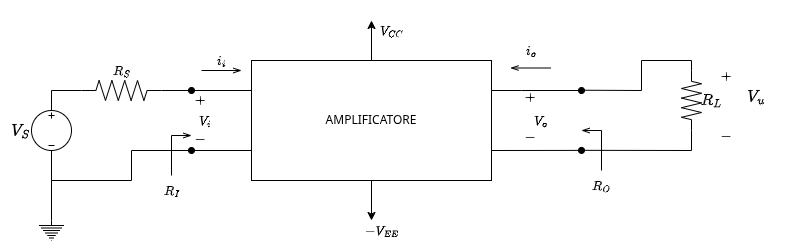

I vari amplificatori si classificano a partire da **4 parametri di merito**:
$$
\begin{align*}
A_V &= \frac{V_o}{V_i} & \text{Guadagno di Tensione} & & (\text{Calcolata tipicamente quando } R_L \to \infty) \\
A_I &= \frac{i_o}{i_i} & \text{Guadagno di Corrente} \\
R_I &= \frac{V_i}{i_i} & \text{Resistenza/Impedenza di Ingresso} \\
R_O &= \frac{V_o}{i_o} & \text{Resistenza/Impedenza di Uscita} & & (\text{Calcolata tipicamente quando } V_S = 0)\\
\end{align*}
$$

Un transistore può essere utilizzato in tre modi per comportarsi da Amplificatore:
- Amplificatore a _Emettitore Comune_
- Amlificatore a

## 2.1. Amplificatore a Emettitore Comune

Questo accoppiamento trasofrma il quadripolo in un tripolo accoppiando l'**emetittore** tra uscita ed entrata.

La connessione al transistore sfruttando i condensatori $C_B$ e $C_L$ permette di isolare dal carico esterno il punto di riposo del transistore.

Il condensatore $C_E$ è introdotto per cortocircuitare $R_E$ nelle fasi di carica.

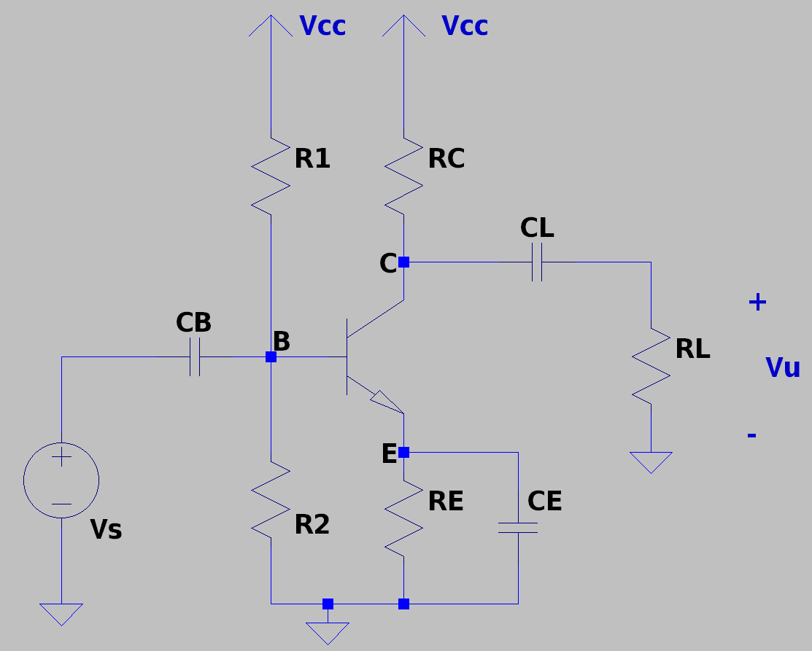

L'analisi DC è la medesima già fatta fin'ora che calcolerà i vari parametri $h_{ie}, h_{fe}, h_{re}, h_{oe}$.

Procediamo quindi ad effettuare l'analisi AC del circuito, scelgiendo frequenze tali che cortocircuitano perfettamente i nostri condensatori.

Il circuito equivalente per l'analisi è il seguente, sostituendo ai componenti non lineari il loro **modello per piccoli segnali semplificato**:

<figure>
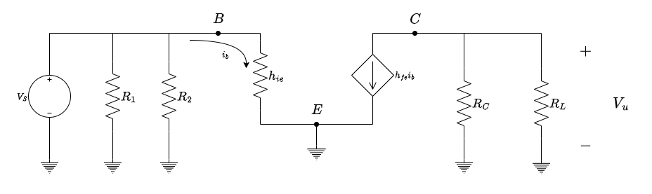
<figcaption>

Notiamo qui che l'introduzione del condensatore $C_E$ ci permette di circuitare $R_E$
</figcaption>
</figure>

Possiamo quindi adesso calcolare i vari parametri di:
$$
\begin{align*}
  A_I &= \frac{i_o}{i_i} = \frac{h_{fe}i_b}{i_b} = h_{fe} \\
  A_V &= \frac{V_o}{V_i} = \frac{-h_{fe}i_b \cdot (R_C\parallel R_L)}{V_S} = -\frac{h_{fe}i_b \cdot (R_C\parallel R_L)}{h_{ie}i_b} = -\frac{h_{fe}(R_C \parallel R_L)}{h_{ie}} \\
  R_O &= \frac{V_o}{i_o} = \frac{V_o}{0} = \begin{cases} \infty & \text{Sul nodo C} \\ R_C & \text{A valle di } R_C \\ R_L & \text{A valle di } R_L\end{cases} & & V_S \text{ è cortocircuitata} \\
  R_I &= \frac{V_i}{i_i} = \begin{cases} h_{ie} & \text{Sul nodo B} \\ h_{ie} \parallel R_1 \parallel R_2 & \text{A monte delle resistenze} \end{cases} & & \text{Il generatore ausiliario è acceso, ma non fornisce alcun contributo alla resistenza di ingresso}
\end{align*}
$$

Questo tipo di amplificatore produce quello che si chiama **Amplificazione Invertente**, in quanto il verso della tensione viene invertita tra ingresso e uscita.

Supponiamo adesso di rimuovere $C_E$ dalla nostra configurazione, quindi di non andare a circuitare la resistenza $R_E$:

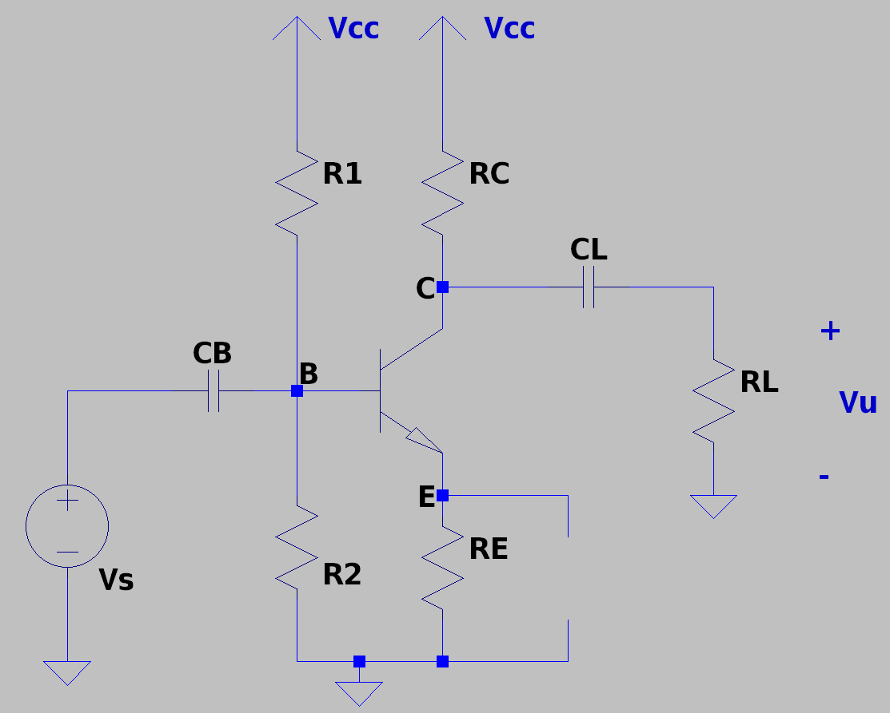

Nell'analisi AC otteniamo che $A_I$ e $R_O$ **non cambiano** rispetto a prima, mentre invece il _Guadagno di Tensione_:
$$
\begin{align*}
  A_V &= \frac{h_{fe} (R_C \parallel R_L)i_b}{h_{ie}i_b + R_Ei_E} \\
	  &= \frac{h_{fe} (R_C \parallel R_L)i_b}{h_{ie}i_b + R_E(1 + h_{fe})i_b} \\
	  &= -\frac{h_{fe} (R_C \parallel R_L)}{h_{ie} + R_E(h_{fe} + 1)}
\end{align*}
$$

Abbiamo quindi che la tensione di uscita **è diminuita rispetto a prima**. La resistenza $R_E$ è appunto chiamata **Resistenza di Degenerazione**, perché in sua assenza, introducendo un condensatore di bypass, si ottiene un guadagno molto più grande.

Tuttavia in alcuni casi la presenza di $R_E$ è utile. Ad esempio se avessimo $R_E(h_{ie} + 1) \gg h_{ie}$:
$$
\begin{CD}
{A_V \approx \frac{h_{fe}R_C}{R_E(h_{ie} + 1)} \approx \frac{h_{fe}R_C}{h_{fe}R_E} = \frac{R_C}{R_E}} \\
@VVV \\
{A_V = \frac{R_C}{R_E}}
\end{CD}
$$

In situazioni comuni $(h_{fe} \gg 1, R_E \not{\to} 0), mantenendo $R_E$ otteniamo un guadagno di tensione che è **indipendente dalle caratteristiche del transistore**, ma proporzionale solamente al **_rapporto tra due resistenze_**, ovvero dalle caratteristiche dei componenti esterni **sui quali abbiamo controllo**.

Per quanto riguarda la _Resistenza di Ingresso_:
$$
R_I =
\begin{cases}
  h_{ie} + R_E(h_{fe} + 1) & \text{Al nodo B} \\
  (h_{ie} + R_E(h_{fe} + 1)) \parallel R_1 \parallel R_2 & \text{A monte delle due resistenze}
\end{cases}
$$

Sulla resistenza di ingresso vige la **Regola della Riflessione della Resistenza Vista Base**, ovvero che la corrente che passa su $R_E$ non è solamente quella di base, ma ha anche il contributo del generatore ausiliario, per una corrente complessiva $i_E = i_b + h_{fe}i_b = i_b(h_{fe} + 1)$

## 2.2. Amplificatore a Collettore Comune

L'amplificatore a collettore comune, detto anche _Inseguitore di Emettitore_ (_Emitter Follower_), mette a comune invece dell'emettitre il collettore.
Immaginiamo di aver già studiato il punto di riposo, ottenendo che $h_{re} = h_{oe} = 0$, procedendo quindi direttamente con lo studio in alternata.

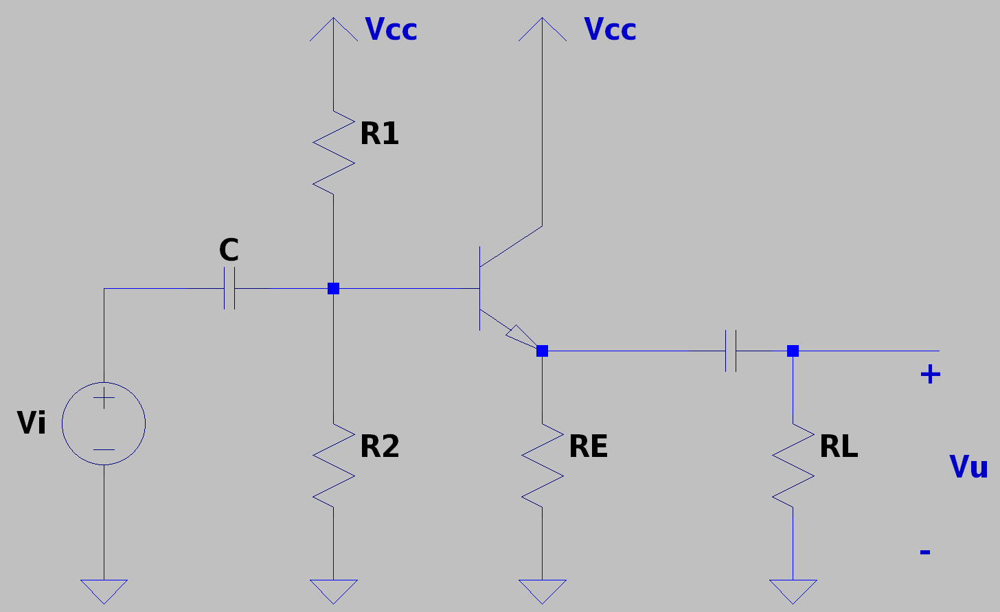

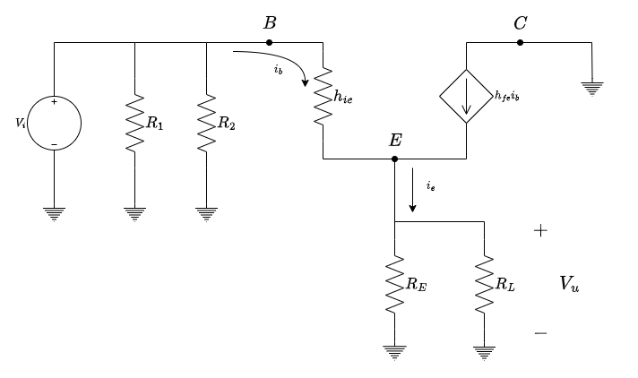

Procediamo quindi a calcolare i vari parametri.

Per quanto riguarda $R_I$, sul nodo `B`:
$$
\begin{align*}
	V_{p_i} &= h_{ie}i_b  + (R_E \parallel R_L)(i_b + h_{fe}i_b) = (h_{ie} + (R_E \parallel R_L)(h_{fe} + 1))i_b \\
	i_{p_i} &= i_b \\
	R_I &= \frac{V_{p_i}}{i_{p_i}} = h_{ie} + (R_E \parallel R_L)(h_{fe} + 1)
\end{align*}
$$

Se volessimo trovare la resistenza vista a monte delle resistenze presenti, è sufficiente mettere in parallelo $R_1, R_2$ e $R_I$.

Per quanto riguarda $R_O$ sul nodo `E`:
$$
\begin{align*}
	V_{p_o} &= -h_{ie}i_b \\
	i_{p_o} &= -(h_{fe} + 1)i_b \\
	R_O &= \frac{V_{p_o}}{i_{p_o}} = \frac{h_{ie}}{h_{fe} + 1}
\end{align*}
$$

La resistenza $R_I$ è solitamente piccola in quanto la quantità $h_{fe} + 1$ è tipicamente maggiore di $h_{ie}$.

Le resistenze seguono quella che chiamiamo la **_Regola della Riflessione_**:
> La resistenza dell'emetittore si riflette sulla base moltiplicata, mentre quella di base si riflette sull'emettitore divisa

Procediamo quindi a calcolare l'amplificazione di entrata $A_I$:
$$
\begin{align*}
	i_o &= -(h_{fe} + 1)i_b\\
	i_i &=  i_b \\
	A_I &= \frac{i_o}{i_i} = -(h_{fe} + 1)  \\
\end{align*}
$$

Questo valore ci dice che l'uscita è molto più elevata della corrente di entrata, di circa 200/300 volte, oltre ad essere di verso inverso.

Terminiamo quindi a calcolare il guadagno di tensione $A_V$:
$$
\begin{align*}
	V_o &= (R_E \parallel R_L)i_e = (R_E \parallel R_L)(h_{fe} + 1)i_b  \\
	V_i &=  h_{ie}i_b + (R_E \parallel R_L)(h_{fe} + 1)i_b \\
	A_V &= \frac{V_o}{V_i} = \frac{(R_E \parallel R_L)(h_{fe} + 1)}{h_{ie} + (R_E \parallel R_L)(h_{fe} + 1)}
\end{align*}
$$

Questa configurazione implica che il transistore sia **_non invertente_**.
Oltre a ciò se guardiamo la forma di $A_V$ notiamo che $A_V < 1$. Se effettuiamo i calcoli però possiamo notare come nella maggior parte dei casi in realtà $A_V \approx 1$.

Possiamo quindi dire che $V_E \approx V_B$, ergo il nome _Emitter Follower_, dato che la tensione ingresso (base) e uscita (emettitore) è più o meno la stessa.

Riassumendo quello che abbiamo trovato:
$$
\begin{align*}
  R_I &= \frac{V_{p_i}}{i_b} = \begin{cases} h_{ie} + (R_E \parallel R_L)(h_{fe}+1) & \text{Sul nodo B} \\ (h_{ie} + (R_E \parallel R_L)(h_{fe} + 1)) \parallel R_1 \parallel R_2 & \text{A monte delle resistenze} \end{cases} \\
  R_O &= \frac{V{p_o}}{i{p_o}} = \begin{cases} \frac{h_{ie}}{h_{fe} + 1} & \text{Sul nodo E} \\ (\frac{h_{ie}}{h_{fe} + 1}) \parallel R_E & \text{A valle di } R_E \\(\frac{h_{ie}}{h_{fe} + 1}) \parallel R_E \parallel R_L & \text{A valle di } R_L\end{cases} & & V_S \text{ è cortocircuitata} \\
  A_I &= \frac{i_o}{i_i} = -(h_{fe} + 1) \\
  A_V &= \frac{V_o}{V_i} = \frac{(R_E \parallel R_L)(h_{fe} + 1)}{h_{ie} + (R_E \parallel R_L)(h_{fe} + 1)} \\
\end{align*}
$$

Questo amplificatore, a differenza di quello a _Emettitore Comune_, oltre a non produrre inversioni di tensione, produce un **elevato guadagno di corrente**.
Questo circuito, che permette di ripristinare una corrente mantenendo la tensione costante, è detto **_buffer_**.

# 3. MOSFET come Amplificatore

Vediamo adesso come i `MOSFET` possono essere utilizzati come amplificatori

## 3.1. Amplificatore a Source Comune

Circuito Amplificatore

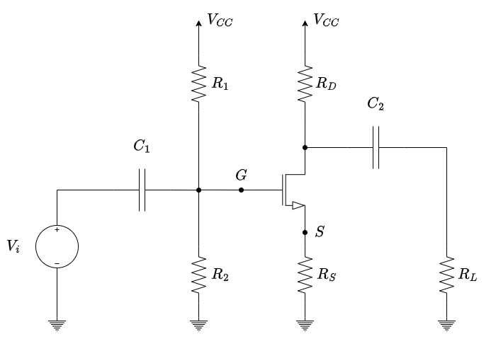

Circuito in AC

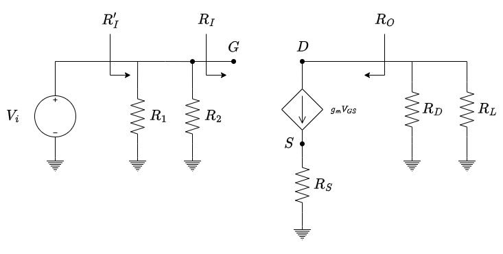

Dobbiamo intanto calcolare i quattro parametri $R_O, R_I, A_V$ e $A_I$.

Per quanto riguarda la resistenza di entrata il discorso è immediato:
$$
R_I = \begin{cases}
	\infty & \text{Al nodo } G\\
	R_1 \parallel R_2 & \text{A monte delle resistenze}
\end{cases}
$$

Analogamente anche l'amplificazione di corrente è immediata:
$$
A_I = \frac{i_O}{i_I} \to \infty
$$

Per quanto riguarda la resistenza vista di uscita al _Drain_, utilizziamo un _generatore di prova_ $V_P$ spegnendo $V_i$, ottenendo:
$$
\begin{cases}
	V_G = 0 \\
	V_S = R_S g_m V_{GS} \\
	V_{GS} = V_G - V_S = - V_S
\end{cases}
$$

Sostituendo la terza equazione nella seconda:
$$
\begin{align*}
	V_S &= R_S g_m (-V_S) \\
	V_S(1 + R_S g_m) &= 0 \\
	&\Downarrow \\
	V_S &= 0
\end{align*}
$$

Di conseguenza otteniamo che $i_P = 0$, ovvero:
$$
	R_O  = \begin{cases}
		\infty & \text{Al nodo } D\\
	R_L \parallel R_D & \text{A valle delle resistenze}
	\end{cases}
$$

Per quanto riguarda l'amplificazione di tensione, la calcoliamo ipotizzando $R_P = R_D \parallel R_L$:
$$
\begin{align*}
	V_O &= (-g_m V_{GS})R_P \\
	V_S &= R_S(g_m V_{GS}) \xrightarrow{V_{GS} = V_G - V_S} V_{GS} = V_G - R_S(g_mV_{GS}) \\
	V_{GS} &= \frac{V_G}{1 + g_mR_S}
\end{align*}
$$

Sapendo che $V_I = V_G$ otteniamo che la relazione finale:
$$
A_O = \frac{V_O}{V_I} = \frac{(-g_m R_P)V_{GS}}{(1 + g_mR_S)V_{GS}} = - \frac{g_mR_D}{1 + g_mR_S}
$$

Abbiamo quindi un'_**amplificazione invertente**_.

Se dovessimo aggiungere un condensatore in parallelo ad $R_S$, otterremo che:
$$
A_O = -g_m R_D
$$

Se invece impostassimo $g_mR_S \gg 1$:
$$
A_O = - \frac{R_D}{R_S}
$$

Ovvero otterremmo un amplificatore che _**dipende solo dalle resistenze interne**_.

Riassumendo tutto i parametri valgono:
$$
\large
\boxed{
	\begin{align*}
		R_I &= \begin{cases}\infty & \text{Al nodo } G\\R_1 \parallel R_2 & \text{A monte delle resistenze}\end{cases} \\[1.5em]
		R_O &= \begin{cases}\infty & \text{Al nodo } D\\R_L \parallel R_D & \text{A valle delle resistenze}\end{cases} \\[1.5em]
		A_I &= \frac{i_O}{i_I} \to \infty \\[1.5em]
		A_O &= \begin{cases}
			-\frac{g_m(R_D \parallel R_L)}{1 + g_mR_S} \\
			-g_m(R_D \parallel R_L)& R_S = 0 & \text{Cortocircuitata con un condensatore} \\
			-\frac{R_D \parallel R_L}{R_S} & g_mR_S \gg 1 & \text{Dipende solo dalla resistenze interne}
		\end{cases}
	\end{align*}
}
$$

## 3.2. Amplificatore a Drain Comune

Per quanto riguarda la configurazione a _Drain Comune_, il circuito di partenza è questo:

Circuito Amplificatore

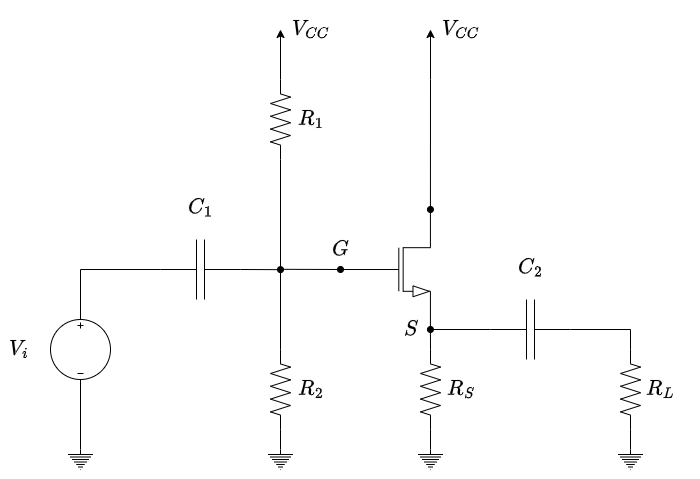

Circuito in AC

Per quanto riguarda l'ingresso _**la situazione è analoga a quella a source comune**_, così come l'_amplificazione di corrente_.

La resistenza vista di uscita invece è diversa, infatti se utilizziamo il generatore di prova otteniamo le seguenti relazioni:
$$
\begin{cases}
	V_G = 0 \\
	V_S = V_P \\
	i_P = -(g_mV_{GS}) = -g_m(V_G - V_S) = g_mV_P
\end{cases}
$$

La resistenza vista di uscita, al nodo $S$ è quindi:
$$
	R_O = \frac{V_P}{i_p} = \frac{1}{g_m}
$$

Tipicamente $g_m$ è un valore grosso, quindi la resistenza vista di uscita è tipcamente **piccola**.

Anche l'amplificazione di tensione è diversa in questo caso.
Chiamando sempre $R_P = R_S \parallel R_L$:
$$
\begin{align*}
	V_G &= V_I \\
	V_S &= V_O \\
	V_O &= R_S(g_mV_{GS}) \\
	V_{GS} &= V_G - V_S  = V_G - V_O
\end{align*}
$$

Otteniamo quindi:
$$
\begin{align*}
	V_O &= R_Pg_m(V_G - V_O) \\
	(1+R_Pg_m)V_O &= R_Pg_mV_G \\
	V_O &= \frac{R_Pg_mV_G}{1 + R_Pg_m}
\end{align*}
$$

Otteniamo quindi che:
$$
\begin{align*}
	A_V = \frac{V_O}{V_I} &= \frac{R_Pg_mV_I}{1 + R_Pg_m} \cdot \frac{1}{V_I} \\
						  &= \frac{R_Pg_m}{1 + R_Pg_m}
\end{align*}
$$

Questo valore positivo indica che il circuito _**è non invertente**_.

Inoltre se $g_mR_P \gg 1$ quello che otteniamo è che $A_V \approx 1$.

Riassumendo tutto i parametri valgono:
$$
\large
\boxed{
	\begin{align*}
		R_I &= \begin{cases}\infty & \text{Al nodo } G\\R_1 \parallel R_2 & \text{A monte delle resistenze}\end{cases} \\[1.5em]
		R_O &= \begin{cases}\frac{1}{g_m} & \text{Al nodo } S\\ \frac{1}{g_m} \parallel R_L \parallel R_D & \text{A valle delle resistenze}\end{cases} \\[1.5em]
		A_I &= \frac{i_O}{i_I} \to \infty \\[1.5em]
		A_O &= \begin{cases}
			\frac{g_m(R_S \parallel R_L)}{1 + g_m(R_S \parallel R_L)} \\
			1 & g_m(R_S \parallel R_L) \gg 1 & \text{Dipende solo dalla resistenze interne}
		\end{cases}
	\end{align*}
}
$$

Il circuito è quindi detto _**Source Follower**_, in quanto l'uscita cerca sempre di stabilizzarsi seguendo l'entrata.

# 4. Amplificatori MOSFET multistadio

Un _**Amplificatore Multistadio**_ è composto dalla cascata di più stadi.

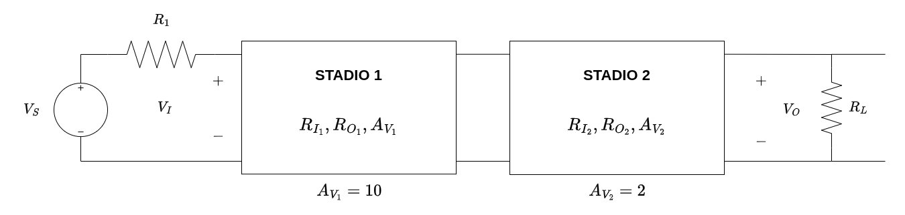

Per ogniuno di questi stadi conosciamo le caratteristiche.

Ipotizziamo che $A_{V_1} = 10$ e $A_{V_2} = 2$. Ci aspetteremmo un'amplificazione totale di $20$, ma questo _**non sempre accade**_.

> L'amplificazione complessiva _**non è il prodotto delle singole amplificazioni**_:
> $$
> 	A_V = \frac{V_O}{V_I} \ne \prod_i{A_{V_i}}
> $$

Questo risultato è semplice da dimostrare a partire dal circuito equivalente:

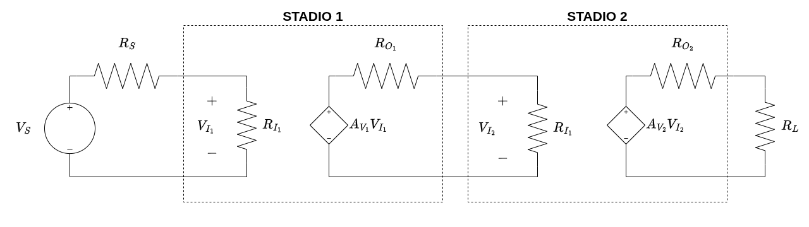

Dobbiamo quindi calcolare il rapporto $A_V = \frac{V_O}{V_{I_1}}$. LO faremo ipotizzando $R_L \to \infty$ per semplicità.

Possiamo dedurre che:
$$
\begin{align*}
	V_O &= A_{V_2}V_{I_2} \\
	V_{I_2} &= (A_{V_1}V_{I_1}) \frac{R_{I_2}}{R_{I_2} + R_{O_1}} \\
	V_I &= V_{I_1}
\end{align*}
$$

Il rapporto sarà quindi:
$$
\begin{align*}
	A_V = \frac{V_O}{V_I}\Bigg|_{R_L\to\infty} &= \frac{A_{V_2}\Bigl((A_{V_1}V_I) \frac{R_{I_2}}{R_{I_2} + R_{O_1}}\Bigr)}{V_I} \\
	&= A_{V_1}V_{V_2} \frac{R_{I_2}}{R_{I_2} + R_{O_1}}
\end{align*}
$$

Di conseguenza:
$$
\begin{CD}
	\begin{align*}
		R_{I_2} &\to \infty \\
		&\text{OR} \\
		R_{O_1} &\to 0
	\end{align*} @>>>
	{
		A_V = A_{V_1}A_{V_2}
	}
\end{CD}
$$

Affinché sia vero che il guadagno è il prodotto è quindi necessario che le resistenze rispettino almeno una di queste due condizioni, che erano quelle che avevamo fatto durante lo studio (resistenza di carico infinita).

# 5. Risposta In Frequenza

In un qualsiasi circuito dove è presente un condensatore e/o un induttore, la loro impedenza dipende dalla frequenza. Questa dipendenza modifica le loro dipendenze viste.

In particolare, per quanto riguarda i condensatori, la loro impedenza:
$$
\begin{matrix}
	z_c = \frac{1}{j\omega C} & \omega = 2\pi f
\end{matrix}
$$

A seconda del valore della frequenza $f$, possiamo quindi considerare il condensatore come un aperto/corto/componente presente. Questo comportamento è detto proprio _**risposta in frequenza**_.

Se andiamo a considerare i condensatori nello studio dell'amplificatore `MOSFET` a drain comune otteniamo questo circuito:

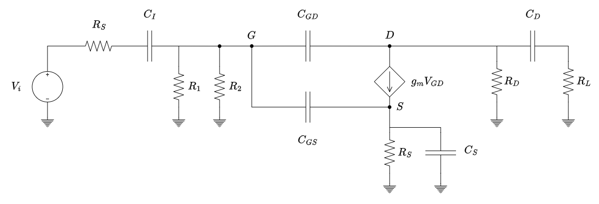

Per analizzare la risposta in frequenza dobbiamo quindi sfruttare la relazione:
$$
	H(s) = \frac{V_u(s)}{V_i(s)}
$$

Questo esercizio, per quanto tedioso, è comunque risolvibile con delle ottime basi di elettrotecnica.

Tuttavia, si presenta il problema che le capacità dei condensatori all'interno del circuito sono molto diverse tra loro:
- $C_I, C_D$ e $C_S$ sono nell'ordine dei $\mu F$ - $nF$
- $C_{GS}, C_{GD}$ sono nell'ordine dei $nF$ - $pF$

Quello che si fa quindi, invece di analizzare tutta la risposta in frequenza in un colpo solo, si divide o studio in:

|                                                     | Condesatori Esterni | Condensatori Interni |
| :-------------------------------------------------: | :-----------------: | :------------------: |
|      **Risposta in _Bassa_ Frequenza** `LF`      |       ATTIVI        |   CIRCUITI APERTI    |
| **Risposta in _Media_ Frequenza** `Centro Banda` |   CORTO CIRCUITI    |   CIRCUITI APERTI    |
|      **Risposta in _Alta_ Frequenza** `HF`       |   CORTO CIRCUITI    |        ATTIVI        |

Lo [lo studio dell'amplificatore MOSFET a drain comune](#32-amplificatore-a-drain-comune) che abbiamo fatto in precedenza è proprio uno studio in _**risposta in media frequenza**_.

Tipicamente il diagramma di ampiezza della risposta in frequenza è qualcosa del genere:

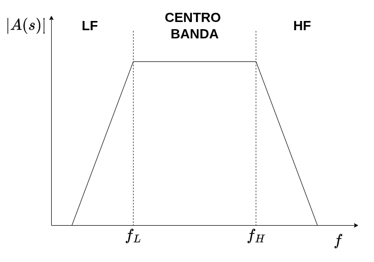

Chiamiamo:
- $f_L$ &emsp; **Liimte Inferiore Di Banda**
- $f_H$ &emsp; **Liimte Superiore Di Banda**

I circuiti che hanno queto diagramma di Bode, si dicono **accoppiati in AC** (_AC paired_). Infatti, per segnali a basse freqeunze la risposta in frequenza è _**pari a zero**_.

Esistono anche altri tipi di sistemi che hanno questa risposta in frequenza:

In questo caso questi sistemi _**non hanno una zona `LF`**_, e si dice che sono sistemi **accoppiati in DC** (_DC paired_).

# 6. Teoria Semplificata della Reazione

Ai nostri fini affrontiamo una versione "semplificata" della reazione.

Dal punto di vista elettronico quello che abbiamo è la seguente cosa:

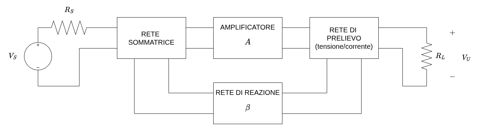

La rete di prelievo può prelevare:
- **Tensione**: permette di agire sulla tensione in uscita
- **Corrente**: permette di agire sulla corrente in uscita

La rete sommatrice può essere di:
- **Insersione in Serie**: mette la reazione in serie all'ingresso
- **Insersione in Parallelo**: mette la reazione in parallelo all'ingresso

> Le semplificazioni che facciamo nello studiare la Teoria della Reazione sono:
> 1. L'Amplificatore $A$ è un circuito _**unidirezionale**_, dove il segnale può andare solo dalla _rete sommatrice_ alla _rete di prelievo_
> 2. La _rete di reazione_ $\beta$ è un circuito _**unidirezionale**_, dove il segnale può andare solo dalla _rete di prelievo_  alla _rete sommatrice_
> 3. $\beta \not\propto R_S,R_L$, ovvero la _rete di reazione_ non dipende da $R_S, R_L$

Con queste semplificazioni il nostro schema a blocchi diventa:

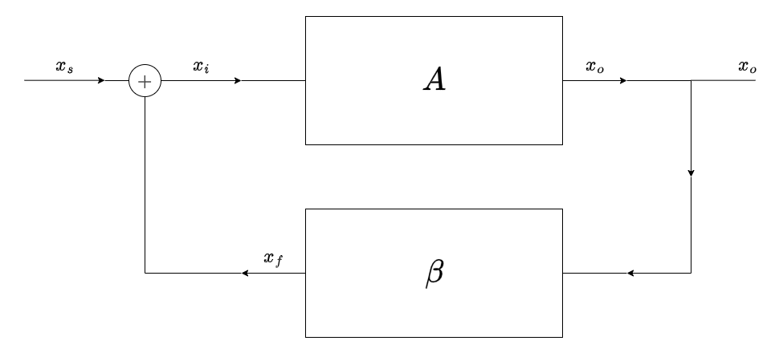

Da questo circuito possiamo dire:
$$
H(s) = \frac{x_o(s)}{x_s(s)}
$$

Sappiamo poi che:
$$
\begin{CD}
	\underbrace{
		\begin{align*}
			x_o &= A x_i \\
			x_i &= x_s + x_f \\
			x_f &= \beta x_o
		\end{align*}
	} \\
	@VVV \\
	{
		\begin{align*}
			x_o &= A(x_s + \beta x_o) \\
			(1-\beta A)x_o &= Ax_s \\
			\frac{x_o}{x_s} &= \frac{A}{1 - \beta A}
		\end{align*}
	}
\end{CD}
$$

Abbiamo quindi che la risposta in frequenza:
$$
\large
\boxed{
	H(s) = \frac{x_o}{x_s} = \frac{A}{1 - \beta A}
}
$$

Chiamiamo:
- $A$ &emsp; **Guadagno ad Anello Aperto**
- $\beta A$ &emsp; **Guadagno di Anello**
- $H$ &emsp; **Guadagno ad Anello Chiuso**

A seconda del rapporto tra _guadagno ad anello aperto_ e _guadagno ad anello chiuso_ si chiama:
$$
\begin{matrix}
	|H| < |A| & \textbf{Reazione Negativa} \\
	|H| > |A| & \textbf{Reazione Positiva}
\end{matrix}
$$

Storicamente si utilizzala la reazione positiva, che però comporta garndissimi rischi di stabilità del sistema. Questo era dovuto alle tipologia di `MOSFET` che erano disponibili. Oggi le componenti che abbiamo producono guadagni molto elevati, che ci permettono di reazionarli negativamente senza problemi.

Per capire perché dovremmo reazionare negativamente il sistema, vediamo cosa accade quando aumentiamo il _guadagno ad anello aperto_ dell'amplificatore:
$$
	\lim_{A \to \infty}{H(s)} = \lim_{A \to \infty}{\frac{A}{1 - \beta A}} = -\frac{1}{\beta}
$$

Questa scelta ci quindi permette di avere un guadagno ad anello chiuso _**indipendente dalle caratteristiche dell'amplificatore**_, producendo un sistema _**stabile e predicibile**_.

## 6.1. Resistenze di Feedback

Immaginiamo di avere un prelievo di tensione:

Per riuscire a capire il valore della _resistenza di feedback_ $R_{of}$, è conveniente sfruttare la relazione:
$$
	R_{of} = \frac{V_{OC}}{I_{CC}} := \frac{\text{Tensione Circuito Aperto}}{\text{Corrente cortocircuito}}
$$

La tensione in circuito aperto è semplice da ricavare, in quanto è quella di uscita dell'amplificatore:
$$
	V_{OC} = \frac{A}{1 - \beta A}x_s
$$

Per quanto riguarda la corrente di corto circuito, equivale a mettere in corto circuito l'uscita.
Fare qeusto comporta che gli **effetti della reazione vengono annullati**.

In questo caso otteniamo non solo che $x_s = x_i$, quindi $x_f = 0$, ma torniamo proprio allo studio che avevamo fatto precedentemente sugli amplificatori:
$$
	I_{CC} = \frac{A x_i}{R_o} = \frac{A}{R_o} x_s
$$

La reazione di feedback quindi:
$$
	R_{of} = \frac{V_{OC}}{I_{CC}} = \frac{Ax_s}{1 - \beta A} \cdot \frac{R_o}{Ax_s} = \frac{R_o}{1 - \beta A}
$$

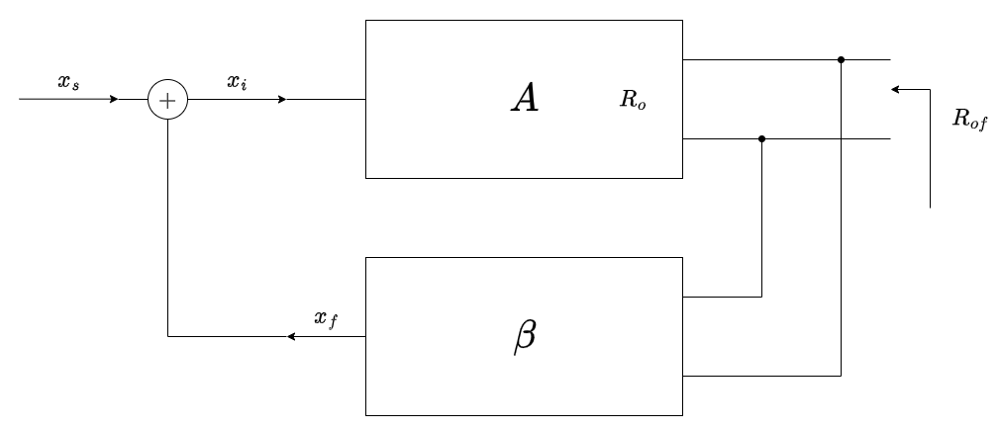

La reazione _**non solo modifica la funzione di trasferimento**_, ma, nel caso di _prelievi di tensione_, andiamo a _**modificare anche la resistenza di uscita**_.

Nel caso di reazione negativa, ovvero $\beta A \gg 1$, quello che accade è che $R_{of} \approx 0$, ovvero è come se fosse in corto circuito, assimilando il nostro sistema ad un _**generatore di tensione costante**_.

Analogamente anche la resistenza di ingresso viene modificata a seconda che si faccia una rete sommatrice in serie o in parallelo.