# 1. Indice

- [1. Indice](#1-indice)
- [2. Circuiti Digitali](#2-circuiti-digitali)
	- [2.1. Caratteristiche](#21-caratteristiche)
		- [2.1.1. Voltage Tranfer Characteristic - `VTC`](#211-voltage-tranfer-characteristic---vtc)
		- [2.1.2. Margini di Rumore](#212-margini-di-rumore)
		- [2.1.3. Porte Rigenerative](#213-porte-rigenerative)
		- [2.1.4. Potenza Dissipata](#214-potenza-dissipata)
		- [2.1.5. Tempo di propagazione](#215-tempo-di-propagazione)
		- [2.1.6. Power Delay Product - PDP](#216-power-delay-product---pdp)
		- [2.1.7. Fan IN - OUT](#217-fan-in---out)
- [3. Porte Logiche](#3-porte-logiche)
	- [3.1. Famiglie Logiche](#31-famiglie-logiche)
	- [3.2. Logica a Diodi](#32-logica-a-diodi)
		- [3.2.1. Porta `AND` a Diodi](#321-porta-and-a-diodi)
		- [3.2.2. Porta `OR`](#322-porta-or)
		- [3.2.3. Difetti Principali](#323-difetti-principali)
	- [3.3. Famiglia CMOS Complementare](#33-famiglia-cmos-complementare)
		- [3.3.1. Notazione](#331-notazione)
		- [3.3.2. Inverter](#332-inverter)
			- [3.3.2.1. Analisi Circuitale](#3321-analisi-circuitale)
			- [3.3.2.2. Analisi Zona a Transistori Saturi](#3322-analisi-zona-a-transistori-saturi)

# 2. Circuiti Digitali

Prima di poter parlare dei **Circuiti Digitali**, dobbiamo introdurre diversi termini.

Innanzitutto definiamo il _**Segnale Digitale**_:
> Un _**Segnale Digitale**_ è una sequenza _finita_ di **simboli logici**, rappresentati da _valori numerici_

I _Simboli Logici_ con i quali scelgiamo di operare nel mondo digitale sono nel nostro caso i _Simboli Binari_ `0` e `1`.

È però necessario associare a questi simboli digitali dei **riferimenti analogici**:
- `0` $\Leftrightarrow [V_{L,MIN}; V_{L,MAX}]$
- `1` $\Leftrightarrow [V_{H,MIN}; V_{H,MAX}]$

Affinché tutto funzioni correttamente i due intervalli di tensione _**devono essere disgiunti**_, ovvero $V_{L,MAX} < V_{H,MIN}$

## 2.1. Caratteristiche

### 2.1.1. Voltage Tranfer Characteristic - `VTC`

Prendiamo per esempio un _**Inverter**_:

<figure class="">
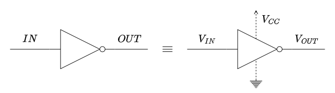
<figcaption>

Lo schema digitale è quello sulla sinistra, quello circuitale sulla destra
</figcaption>
</figure>

In pratica, viene spesso graficata la relazione tra la tensione di uscita in relazione alla tensione di entrata, chiamata `VTC`, ovvero _**Voltage Transfrer Characteristic**_.

<figure class="60">
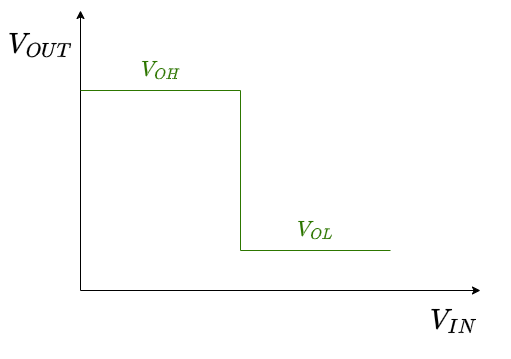
<figcaption>

Caratteristica _Ideale_, impossibile da ottenere nel mondo reale
</figcaption>
</figure>

<figure class="60">
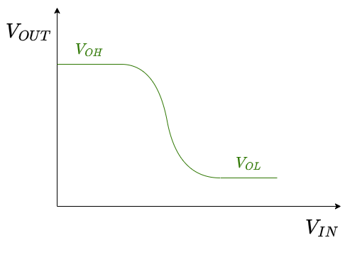
<figcaption>

Caratteristica _Reale_

</figcaption>
</figure>

Data quindi la caratteristica reale, è comune **individuare due punti**, nei quali:
$$
	\Bigg|{dV_{OUT} \over dV_{IN}}\Bigg| = 1
$$

A questo punto chiamiamo le tensioni associate ai due punti:

- $V_{OH,MIN}$ &emsp; _la più **bassa** tensione_ che interpretiamo come un `1` logico in _uscita_
- $V_{OL,MAX}$ &emsp; _la più **alta** tensione_ che interpretiamo come uno `0` logico in _uscita_
- $V_{IH,MIN}$ &emsp; _la più **bassa** tensione_ che interpretiamo come un `1` logico in _entrata_
- $V_{IL,MAX}$ &emsp; _la più **alta** tensione_ che interpretiamo come un `0` logico in _entrata_

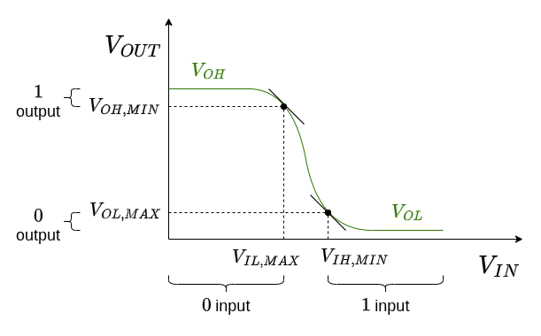

### 2.1.2. Margini di Rumore

Immaginando di mettere due inverter in serie, avremo:

Il primo inverter, sottoposto a tensione $V_1$, produce un uscita $V_2$ che può valere tra:
- $V_{OH,MIN} \le V_2 \le V_{CC}$ &emsp; se ha in uscita un `1` logico
- $0 \le V_2 \le V_{OL,MAX}$ &emsp; se ha in uscita uno `0` logico

Affinché il secondo _inverter_ funzioni correttamente, è necessario che le tensioni in entrata siano comprese tra:
- $0 \le V_2 \le V_{IL,MAX}$ &emsp; se dobbiamo interpretare uno `0` logico
- $V_{IH,MIN} \le V_2 \le V_{CC}$ &emsp; se dobbiamo interpretare un `1` logico

Se vogliamo quindi che non accada mai che l'uscita del primo inverter generi un segnale che venga mal interpretato da quello dopo, è **necessario** che:
$$
\large
\begin{matrix}
	V_{OH,MIN} > V_{IH,MIN} && V_{OL,MAX} < V_{IL,MAX}
\end{matrix}
$$

Definiamo quindi **_Margine di Rumore Alto_**, o $NM_H$:
$$
\Large
\boxed{
	NM_H := V_{OH,MIN} - V_{IH,MIN}
}
$$

Analogamente il  _**Margine di Rumore Basso**_, o $NH_L$:
$$
\Large
\boxed{
	NM_l := V_{IL,MAX} - V_{OL,MAX}
}
$$

Affinché tutto funzioni correttamente è quindi necessario che sia vero:
$$
\large
\boxed{
	\begin{cases}
		NM_H > 0 \\
		NM_L > 0
	\end{cases}
}
$$

Il margine di rumore ci fornisce anche **protezione contro i disturbi**.

Tipicamente, si cerca di avere sempre un _**comportamento simmetrico**_:
$$
\Large
NM_H = NM_L > 0
$$

Che significa che **_non si hanno preferenze tra lo_ `0` _e l'`1`_**.

### 2.1.3. Porte Rigenerative

Definiamo _**Porte Rigenerative**_:
> Circuiti Logici nei quali, tra i due punti a derivata in modulo unitaria della `VTC`, la derivata:
> $$
> {dV_{OUT} \over dV_{IN}} > 1
> $$

In questo tipo di porte:
- Sono invarianti logicamente
- Producono una tensione di uscita $V_3$ _**più forte**_ della tensione di ingresso $V_1$ (maggiore se `1`, minore se `0`)

Sempre nell'esempio dei due inverter in serie, se prendiamo in ingresso uno `0` "brutto", ovvero con una tensione $V_1 \to V_{IL, MAX}$, questa genera in uscita una tensione $V_2 > V_1$.

Questa tensione, in ingresso al secondo inverter, produrrà un segnale di uscita $V_3$ che sarà **minore** di $V_1$.

Questo comportamento è dato proprio dal fatto che la derivata nella zona intermedia è maggiore di uno.

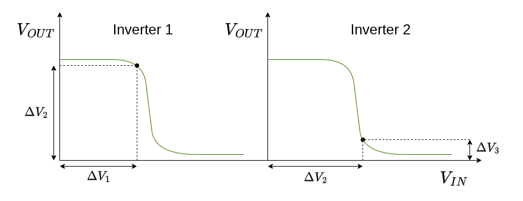

### 2.1.4. Potenza Dissipata

La potenza dissipata $P_D$ si divide in due tipologie:
- _**Statica**_: è la potenza dissipata quando la porta **non sta lavorando**
- _**Dinamica**_: è la potenza dissipata quando la porta **sta operando modificando l'uscita**

Dobbiamo cercare di:
- **Eliminare la potenza statica**: cercheremo un modo per rimuovere questo costo durante i periodi di _idle_
- **Minimizzare la potenza dinamica**: non possiamo eliminarla perché è necessaria energia per poter modificare un segnale. Tuttavia cerchiamo di ridurla al minimo

### 2.1.5. Tempo di propagazione

Quando commutiamo un segnale in ingresso ad una porta nel tempo, quello che otteniamo sono i grafici sulla destra

Identificando i punti nei quali la _tensione in ingresso_ è al $10\%$ e al $90\%$ del valore massimo $V_{IH}$ rispetto al valore minimo $V_{IL}$, definiamo:
- _**Rise Time**_ $t_R$: tempo impiegato dal segnale per andare dal $10\%$ al $90\%$
- _**Fall Time**_ $t_F$: tempo impiegato dal segnale per andare dal $90\%$ al $10\%$

L'uscita sarà **sempre un po' ritardata**, questa è dovuta ai circuiti interni alle porte.

Identificando gli istanti nei quali i due segnali sono al $50\%$ definiamo:
- _**Tempo di Propagazione Alto-Basso**_ $t_{P_{HL}}$: tempo necessario per diminuire l'uscita al $50\%$ del massimo
- _**Tempo di Propagazione Alto-Basso**_ $t_{P_{LH}}$: tempo necessario per aumentare l'uscita al $50\%$ del massimo

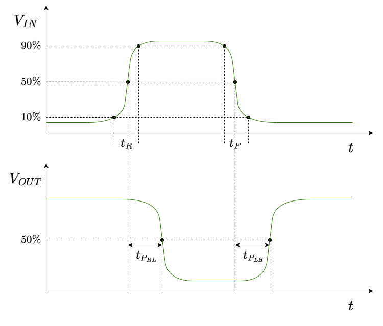

Definiamo **_Tempo Medio di Propagazione_**:
$$
t_P := \frac{t_{P_{HL}} + t_{P_{LH}}}{2}
$$

### 2.1.6. Power Delay Product - PDP

Mette in relazione la _Potenza Dissipata_ e il _Tempo di Propagazione_:
$$
\Large
\boxed{
	PDP := P_d \cdot t_P
}
$$

Questo parametro ci permette di capire quale tra due porte è più efficiente, in quanto noi cerchiamo:
- Porte che dissipano poca potenza
- Porte con tempi di risposta ridotti

### 2.1.7. Fan IN - OUT

Definiamo **Fan OUT** di una porta:
> Numero massimo di ingressi di una stessa porta collegabili all'uscita della porta

Ovvero il numero massimo di porte dello stesso tipo che possiamo collegare all'uscita.

Analogamente **Fan IN** di una porta:
> Numero massimo di ingressi di una stessa porta collegabili all'ingresso della porta

Ovvero il numero massimo di ingressi che possiamo fornire alla nostra porta.

# 3. Porte Logiche

## 3.1. Famiglie Logiche

In funzione della tecnologia che scegliamo per creare le nostre porte logiche, definiamo una **Famiglia Logica**.

Tutte le porte della stessa famiglia _**condividono le caratteristiche**_, e quindi possono essere messe in cascata l'una all'altra senza problemi.

Se invece volessimo usare due porte di due famiglie diverse è necessario interporre tra le due un **Circuito Interfaccia**, che converta le tensioni/correnti di uscita dalla prima nei valori corrispettivi di ingresso per la seconda.

Le porte logiche più utilizzate sono quelle basate su _**Tecnologia `CMOS`**_, che integra sullo stesso _chip_ sia `NMOS` che `PMOS` con caratteristiche simili tra loro.

Tra le famiglie che utilizzano questa tecnologia distinguiamo
1. _**Logica a Diodi**_
1. _**Famiglia `CMOS` Complementare**_
2. _**Famiglia Logica Pass-Transistor**_
3. **Famiglia Logica Dinamica**
4. **Famiglia Pseudo `NMOS`**

Nel corso vedremo le prime tre.

Esiste anche la famiglia che sfrutta transistori bipolari, ma oggi sono praticamente inutilizzati poiché i `CMOS` offrono molti più vantaggi.

## 3.2. Logica a Diodi

### 3.2.1. Porta `AND` a Diodi

In questo circuito conosciamo la tensione ai nodi $A$ e $B$:
$$
V_A = 5\;V \\
V_B = 5\;V
$$

Partiamo quindi dall'ipotesi che i due **_diodi siano interdetti_**.

Sostituiamo quindi ai diodi due circuiti aperti.

Quello che otteniamo dopo la sostituizione è un circuito senza una maglia.

Di conseguenza la tensione $V_u = V_{CC} = 5$ $V$.

Dobbiamo adesso verificare l'ipotesi, ovvero che $V_D < V_\gamma$:
$$
\begin{CD}
	{V_A = V_B = V_{CC}} @>>> {V_{D_A} = V_{D_B} = 0 < V_\gamma}
\end{CD}
$$

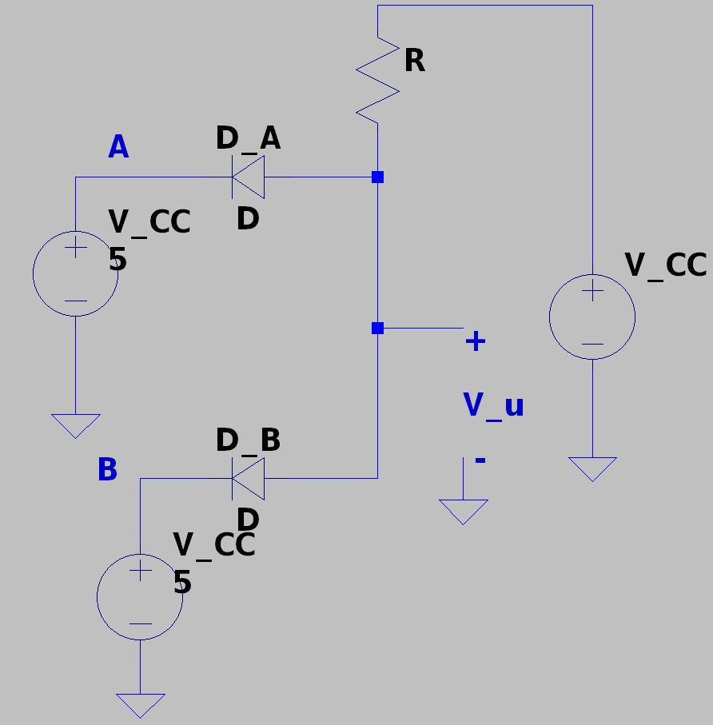

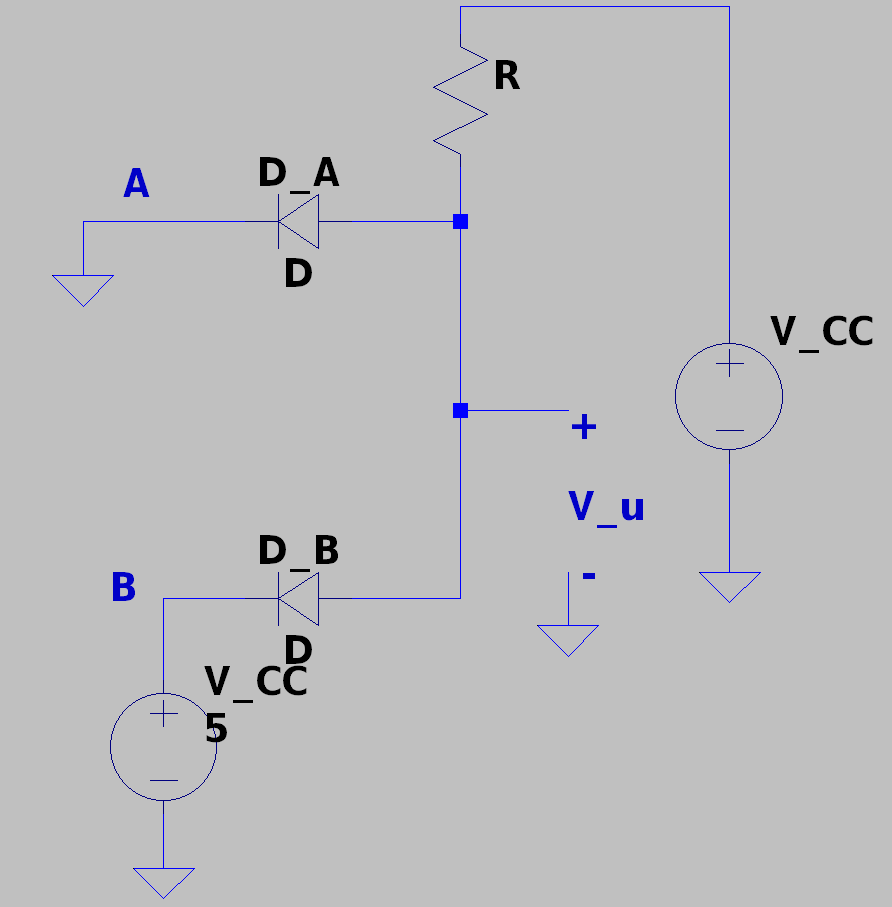

Ipotizziamo adesso invece che il circuito sia quello culla sinistra, ovvero che $V_A = 0$ $V$ e che $V_B = 5$ $V$.

Avendo collegato il catodo di $D_A$ a terra, diventa ragionevole in questo caso ipotizzare $D_A$ **ON**.

Supponendo di sostituire il diodo con un _diodo ideale_, ovvero con un corto.
Con questa nuova conformazione, otteniamo quindi che il catodo di $V_u$ è collegato a _ground_.
Di conseguenza avremo che $V_u = 0 - 0 = 0$.

Compiendo la verifica otteniamo quindi che:
- Per il diodo A: &emsp; $I_D = I_{CC} = \frac{V_CC}{R} > 0$
- Per il diodo B: &emsp; $V_{AK} = -V_{CC} = -5\;V < V_\gamma$

Analogamente sappiamo anche che se $V_A = 5$ $V$ e $V_B = 0$ $V$ otteniamo gli stessi risultati.

Vediamo quindi l'ultima conformazione, nella quale  entrambi i diodi sono **ON**: $V_{D_A} = V_{D_B} = 5$ $V$.

Esattamente come prima otteniamo che $V_u = 0 - 0 = 0$.

Per quanto riguarda la verifica effettuiamo le stesse considerazioni fatte prima, ottenendo che $I_A = I_B = \frac{V_{CC}}{R} > 0$.

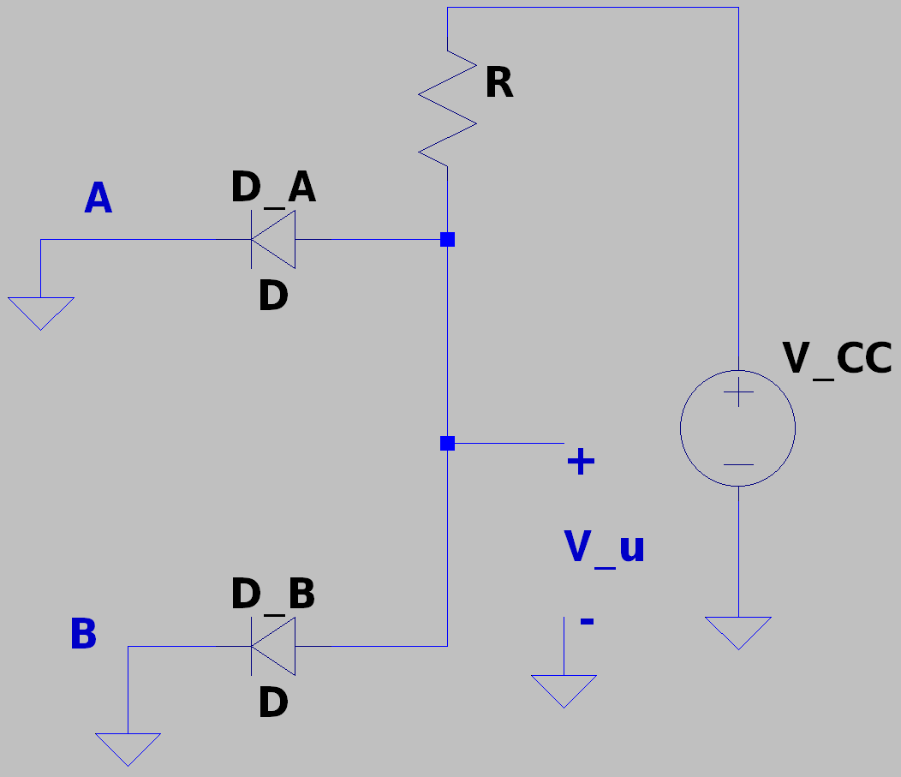

Riassumedo abbiamo ottenuto che:

|  $V_A$  |  $V_B$  |  $V_u$  |
| :-----: | :-----: | :-----: |
| $5$ $V$ | $5$ $V$ | $5$ $V$ |
| $0$ $V$ | $5$ $V$ | $0$ $V$ |
| $5$ $V$ | $0$ $V$ | $0$ $V$ |
| $0$ $V$ | $0$ $V$ | $0$ $V$ |

Notiamo che se associamo le tensioni $5$ $V$ con un `1` logico, e le tensioni $0$ $V$ le associamo lo `0` logico, quello che abbiamo appena costruito è una **_Porta `AND`_**.

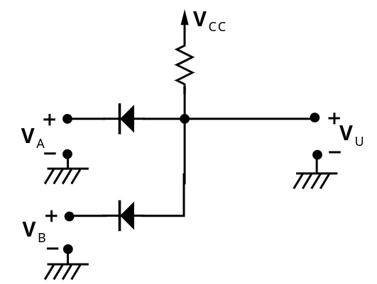

### 3.2.2. Porta `OR`

Ipotizziamo di avere questo circuito adesso:

Se partiamo dall'ipotesi che $V_A = V_B = V_{CC} = 5$ $V$, ha senso ipotizzare che i due diodi siano **ON**.

Di conseguenza otteniamo che $V_u = 5$ $V$.

La verifica è semplice in quanto: &emsp; $I_{D_A} = I_{D_B} = \frac{V_{CC}}{R} > 0$.

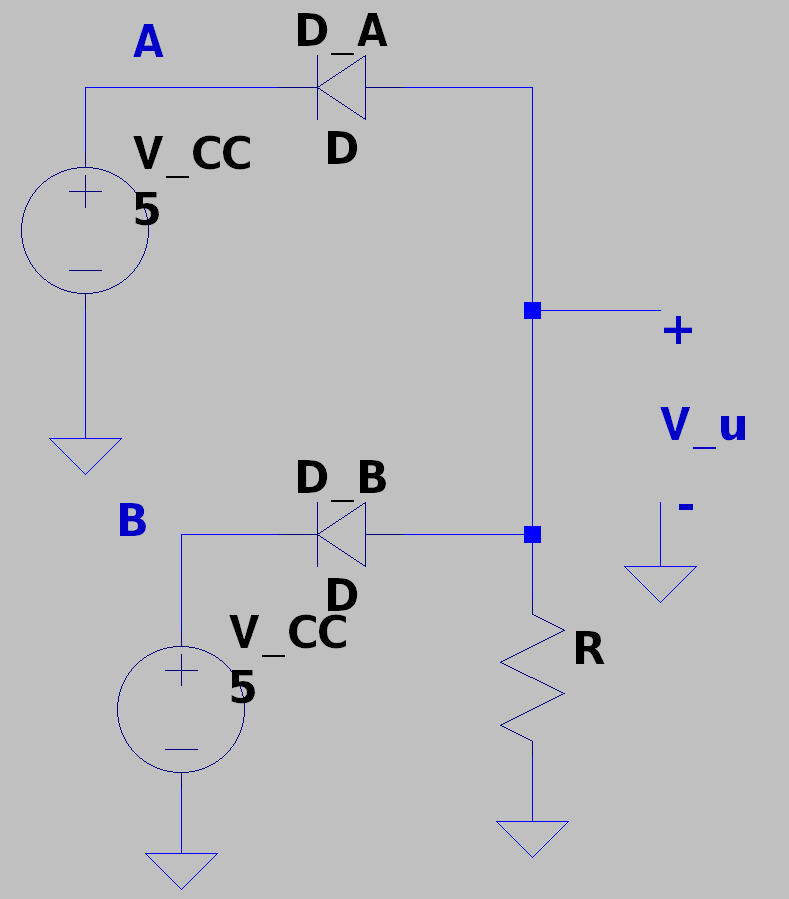

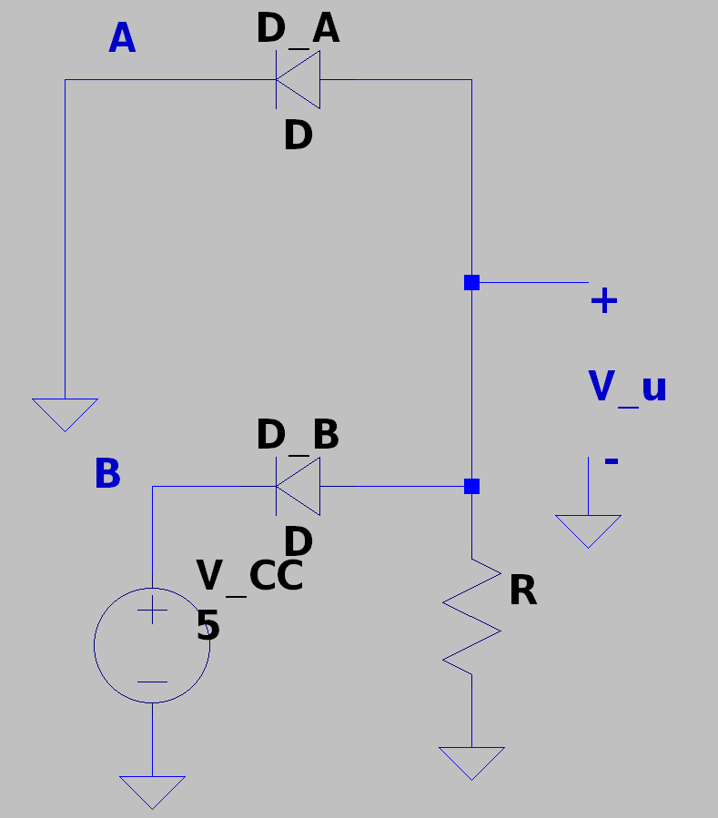

Nel secondo caso proposto sulla destra, abbiamo adesso che $V_A = 0$ $V$, mentre $V_B = V_{CC} = 5$ $V$. Ha quindi senso ipotizzare che $D_A$ sia **interdetto**, mentre $D_B$ sia **ON**.

Di conseguenza otteniamo che $V_u = V_CC = 5$ $V$.

La verifica è semplice in quanto:
$$
\begin{align*}
	V_{D_A} &= 0 - V_{V_CC} = -V_{CC} = -5\;V \\
	I_{D_B} &= \frac{V_{CC}}{R} > 0
\end{align*}
$$

Questa condizione è rispettata simmetricamente invertendo $D_A$ e $D_B$.

Procediamo con l'ultima conformazione abbiamo che $V_A = V_B = 0$ $V$.

In questo circuito **non abbiamo alcun generatore di tensione**.

Di conseguenza in ogni punto del circuito la tensione è la stessa, ovvero **_nulla_**.

Otteniamo quindi che $V_u = 0$ $V$.

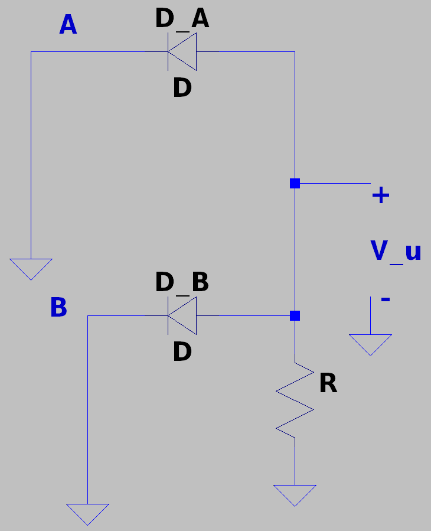

Riassumedo abbiamo adesso ottenuto che:

|  $V_A$  |  $V_B$  |  $V_u$  |
| :-----: | :-----: | :-----: |
| $5$ $V$ | $5$ $V$ | $5$ $V$ |
| $0$ $V$ | $5$ $V$ | $5$ $V$ |
| $5$ $V$ | $0$ $V$ | $5$ $V$ |
| $0$ $V$ | $0$ $V$ | $0$ $V$ |

Notiamo che se associamo le tensioni $5$ $V$ con un `1` logico, e le tensioni $0$ $V$ le associamo lo `0` logico, quello che abbiamo appena costruito è una **_Porta `OR`_**.

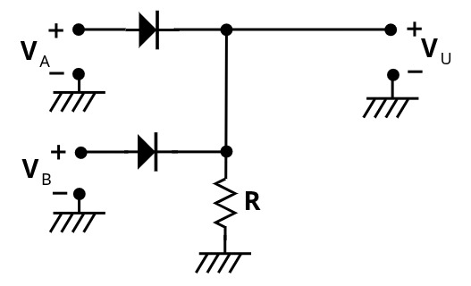

### 3.2.3. Difetti Principali

Nonostante sia possibile costruire le porte `AND` e `OR` attraverso i diodi, per costruire le porte in commercio si utilizzano altre tecniche, poiché questi circuiti presentano diverse problematiche.

La prima problematica è che i circuiti **_assorbono corrente_**. In particolare è necessario che le correnti di ingresso siano diverse da zero, in quanto il circuito "consuma" corrente.
Questo rende molto complesso la gestione di porte multiple, in quanto la corrente in ingresso alle ultime porte sarà molto inferiore a quella nelle prime.

Il secondo problema, più grave del primo, si presenta quando abbiamo due porte `OR` in cascata.

Nel caso proposto a destra, abbiamo due porte `OR`, dove un'entrata del secondo è l'uscita del primo, mentre tutte le altre entrate sono in conduzione.

Se utilizziamo il modello dei diodi ideali, la tensione rimane la stessa. Ma i diodi hanno una componente di consumo della tensione.

Prendendo quindi $V_\gamma = 0.7$ $V$, dalla cascata ottenuamo una tensione di $5 - 0.7  -0.7 = 3.6$ $V$.

Questo fenomeno si chiama **_Degrado dei Livelli Logici_**, e va a **limitare il numero massimo di porte in cascata** che possiamo avere.

Il terzo problema, forse il più grande, è che con i diodi **_non è possibile costruire una porta `NOT`_**.

La logica a diodi quindi non permette di costruire reti combinatorio complesse.

Tuttavia, queste porte non sono "inutili". Infatti vedremo più avanti che la porta `AND` a diodi, messa in cascata con un **inverter** costruito con un **transistor** è stata per tutti gli anni '50 e '60 la porta logica `NAND` utilizzata in quasi tutti i componenti.

## 3.3. Famiglia CMOS Complementare

### 3.3.1. Notazione

Nelle porte che vedremo utilizzeremo un diverso numero di `NMOS` e `CMOS`, quindi facciamo la seguente semplificazione:

Definiamo **Pull Up Network**:
> Rete di $N$ `PMOS` che operano quando la tensione in ingresso è _bassa_

Analogamente definiamo **Push Down Network**:
> Rete di $N$ `NMOS` che operano quando la tensione in ingresso è _alta_

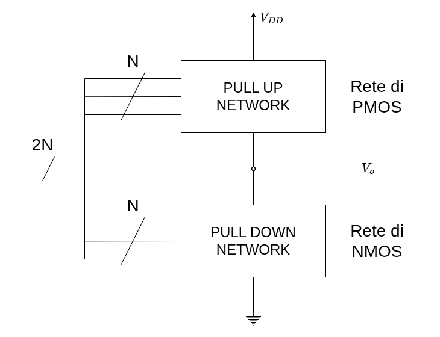

Questo tipo di soluzioni sono perfettamente funzionali, ma richiedono **due transistori per ogni varibile logica** che utilizziamo.

Inoltre, quando li analizzeremo, vedremo le soluzioni:
1. In forma grafica
2. In forma analitica **_nella condizione che_** $V_i = V_o$

### 3.3.2. Inverter

Dal punto di vista elettrico, possiamo pensare ad una porta inverter come sulla destra, dove la tensione in entrata pilota un interruttore:
1. $V_{IN} = 0$ $V$ $\to$ **Interruttore Aperto** 
1. $V_{IN} = V_{DD}$ $V$ $\to$ **Interruttore Chiuso** 

Quando l'interruttore è aperto, nel circuito superiore non passa corrente, perciò $V_{o} = V_{DD}$, mentre quando è aperto è connesso a _ground_, quindi $V_{o} = 0$

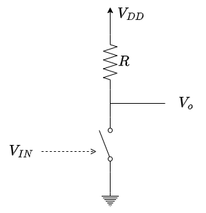

A questo punto dobbiamo solo capire come costruire l'interruttore.

In realtà abbiamo già visto come i **transistori** possono operare come interruttori:

Inverter Bipolare

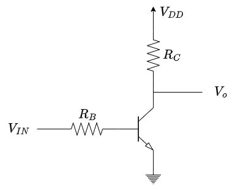

Inverter MOS

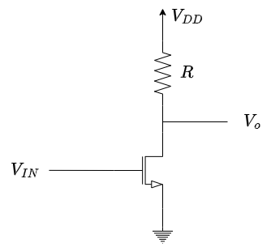

I transistori non sono però interruttori ideali, infatti possiamo dimostrare anche in modo grafico come in realtà:

<figure class="">
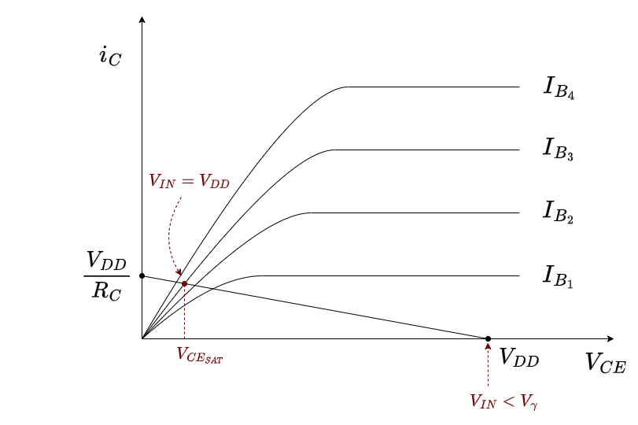
<figcaption>

Possiamo considerare i transistori bipolari in saturazione come **quasi** dei cortocircuiti
</figcaption>
</figure>

Questo tipo di circuiti hanno però dei problemi.

Il primo è che per poter avere una $V_{CE}$ più prossima allo zero, è necessario che $R_C$ sia **il più grande possibile**. Questo tipo di resistenze, dette resistenze integrali, sono tipicamente grosse.

Il secondo, più grave, è che quando l'interruttore è chiuso, sia sul **transistore che sulla resistenza passa corrente che _dissipa energia_**. Abbiamo quindi una **Potenza Statica** nel nostro circuito, oltre a quella già dissipata dal transistore.

Negli anni sono state proposte diverse soluzioni a questo problema, ed oggi quella utilizzata si basa sul fatto di poter creare transistori `CMOS`.

Invece di usare una resistenza e un interruttore, utilizziamo **due interruttori** $1$ e $2$.

- Quando $V_{IN} = 0$ se l'interruttore $1$ fosse $ON$ e $2$ fosse $OFF$: &emsp; $V_{o} = V_{DD}$ 
- Quando $V_{IN} = V_{DD}$ se l'interruttore $1$ fosse $OFF$ e $2$ fosse $ON$: &emsp; $V_{o} = 0$

In questo modo, sia che ci troviamo in uno o nell'altro caso, _**sugli interruttori non passa corrente**_, dato che almeno uno dei due interruttori è aperto.

Questo circuito ha quindi _**Potenza Statica Nulla**_.

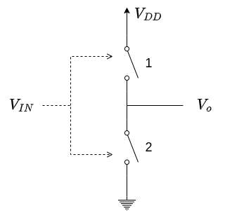

Per poter riuscire a creare questa porta sono necessari **due interruttori complementari l'uno rispetto all'altro**. Quando [abbiamo studiato i `MOS`](./Transistore%20a%20Effetto%20Di%20Campo#441-confronto-nnos---pmos) abbiamo proprio detto che l'`NMOS` e il `PMOS` possono essere considerati come circuiti complementari.

Il circuito inverter in tecnologia **`CMOS` complementare** è quindi il seguente:

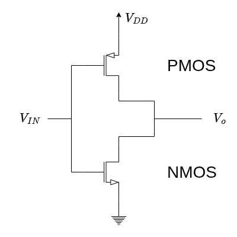

#### 3.3.2.1. Analisi Circuitale

Possiamo quindi analizzare questo circuito:

I due transistori hanno _Ground_ e _Drain_ in comune.

La soluzione è sufficientemente semplice. Essendo i due transistori **in serie**, devono essere attraversati dalla _stessa corrente_:
$$
i_{D_N} = -i_{D_P}
$$

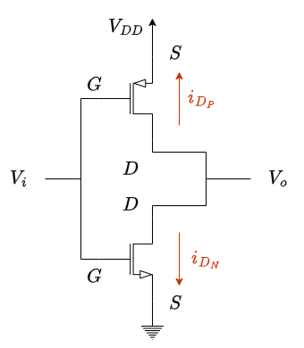

Per risolvere dal punto di vista grafico, possiamo effettuare il _plot_ di entrambi i transistori sullo stesso grafico. Dobbiamo quindi trovare un modo per unire sullo stesso piano cartesiano le due caratteristiche, dato che il primo grafica $i_{D_N}$ e $V_{DS_N}$ e il secondo $i_{D_P}$ e $V_{DS_P}$.

Facendo attenzione però possiamo vedere come:
- $V_{DS_N} = V_o$
- $V_{GS_{N}} = V_i$

Scegliamo quindi questi assi, poiché già relazionati alla tensione di ingresso e di uscita.

A questo punto dobbiamo riuscire a capire come tracciare il grafico del `PMOS` su questi assi, ma sappiamo che:
- $i_{D_P} = -i_{D_N} \qquad \to \qquad$ sufficiente "ribaltare" sul secondo quadrante
- $V_{DS_P} = V_{DS_N} - V_{DD} \qquad \to \qquad$ sufficiente "shiftare a destra" le curve di un fattore $V_{DD}$

Il risultato finale è quindi:

A questo punto quindi, supponendo $V_i = V_{i_1}$:
$$
\begin{cases}
	V_{GS_N} = V_i = V_{i_1} \\
	V_{GS_P} = V_{G_P} - V_{S_P} = V_{i_1} - V_{DD}
\end{cases}
$$

Il punto di riposo è quindi **l'intersezione tra un ramo del primo set e uno del secondo**, ovvero:
$$
	V_o = V_{o1}
$$

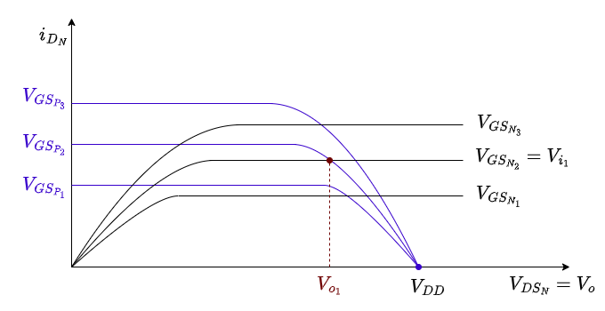

Il nostro scopo è però avere una relazione tra la **tensione di uscita** e la **tensione di ingresso**.

Partendo per step, analizziamo quando $V_i < V_{T_N}$, che comporta
- $V_{GS_N} = V_i < V_{T_N}$
- $V_{GS_P} = V_i -V_{DD}$

Quindi abbiamo che:
- `NMOS` **interdetto**: la caratteristica è $i_D = 0$
- `PMOS` **in conduzione**: la caratteristica sarà quella per $V_{GS_P} = V_i - V_{DD}$, che interseca l'origine in $(V_{DD}, 0)$

L'unico punto di intersezione tra le due caratteristiche è $V_o = V_{DD}$

Se invece studiamo quando $V_{T_N} < V_i < V^\ast$:
- $V_{GS_N} = V_i$
- $V_{GS_P} = V_i -V_{DD}$

Quindi abbiamo che:
- `NMOS` **saturazione**: la caratteristica sarà quella per $V_{GS_N} = V_i$, crescente per valori crescenti di $V_i$
- `PMOS` **triodo**: la caratteristica sarà quella per $V_{GS_P} = V_i - V_{DD}$, decrescente per valori crescenti di $V_i$

Al crescere di $V_i$ il punto di intersezione $V_o$ andrà a diminuire sempre più _velocemente_.

Il punto $V^\ast$ è un valore di tensione per il quale `NMOS` **saturazione** e `PMOS` **saturazione**. In questa zona possiamo avere, data la tensione $V^\ast$ **più possibili tensioni di uscita** $V_o$.

Se invece studiamo quando $V_i > V^\ast$ avremo che:
- `NMOS` **triodo**: la caratteristica sarà quella per $V_{GS_N} = V_i$, crescente per valori crescenti di $V_i$
- `PMOS` **saturazione**: la caratteristica sarà quella per $V_{GS_P} = V_i - V_{DD}$, decrescente per valori crescenti di $V_i$

Al crescere di $V_i$ il punto di intersezione $V_o$ andrà a diminuire sempre più _lentamente_.

L'ultimo caso è quindi quello per il quale $V_{GS_P} = V_{T_P}$, ovvero $V_i = V_{DD} + V_{TP}$, per il quale:
- `NMOS` **in conduzione**
- `PMOS` **interdetto**

Che quindi interseca le due caratteristiche quando $V_o = 0$

Ricordando che i transistori operano

|        |                         Conduzione                          |                             Saturazione                             |
| :----: | :---------------------------------------------------------: | :-----------------------------------------------------------------: |
| `NMOS` |                $V_{GS_N} = V_i \ge V_{T_N}$                 | $V_{DS_N} \ge V_{GS_N} - V_{T_N} \Rightarrow V_o \ge V_i - V_{T_N}$ |
| `CMOS` | $V_{GS_P} \le V_{T_P} \Rightarrow V_i \le V_{DD} + V_{T_P}$ | $V_{DS_P} \le V_{GS_P} - V_{T_P} \Rightarrow V_o \le V_i - V_{T_P}$ |

Mettendo insieme queste considerazioni, **possiamo graficare la relazione tra tensione di uscita e entrata**:

Possiamo identificare le 5 zone, ogniuna diversa dall'altre per lo stato di funzionamento di almeno uno dei due transistori:

<table>
  <thead>
    <tr>
      <th></th>
      <th><code>NMOS</code></th>
      <th><code>PMOS</code></th>
    </tr>
  </thead>
  <tbody>
    <tr>
      <td><strong>Zona 1</strong></td>
      <td>OFF</td>
      <td>TRIODO</td>
    </tr>
    <tr>
      <td><strong>Zona 2</strong></td>
      <td>SATURO</td>
      <td>TRIODO</td>
    </tr>
    <tr>
      <td><strong>Zona 3</strong></td>
      <td>SATURO</td>
      <td>SATURO</td>
    </tr>
    <tr>
      <td><strong>Zona 4</strong></td>
      <td>TRIODO</td>
      <td>SATURO</td>
    </tr>
    <tr>
      <td><strong>Zona 5</strong></td>
      <td>TRIODO</td>
      <td>OFF</td>
    </tr>
  </tbody>
</table>

A questo punto è quindi smeelice risolvere il circuito, poiché è sufficiente capire in quale zona ci troviamo.

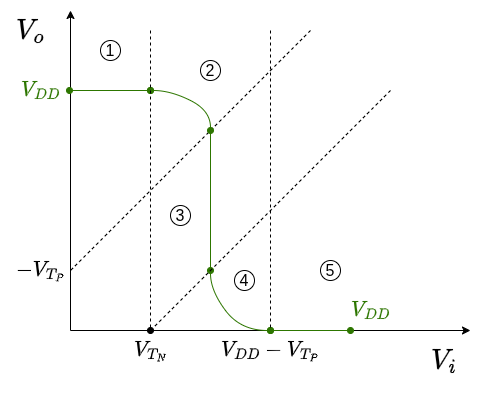

#### 3.3.2.2. Analisi Zona a Transistori Saturi

Noi andremo a studiare solamente la **zona 3**, ovvero quella per cui:
- `NMOS` **saturo**
- `PMOS` **saturo**

In questa zona:
$$
\begin{align*}
	i_{DS_N} &= K_N \cdot (V_{GS_N} - V_{T_N})^2 \\
	i_{DS_P} &= -K_P \cdot (V_{GS_P} - V_{T_P})^2 \\
	i_{DS_N} &= - i_{DS_P}
\end{align*}
$$

Unendo le relazioni otteniamo:
$$
\begin{align*}
	K_N \cdot (V_{GS_N} - V_{T_N})^2 &= K_P \cdot (V_{GS_P} - V_{T_P})^2  && {V_{GS_N} = V_i \atop V_{GS_P} = V_i - V_{DD}} \\[2em]
	K_N \cdot (V_i - V_{T_N})^2 &= K_P \cdot (V_i - V_{DD} - V_{T_P})^2 && \text{Prendiamo solamente una soluzione della radici} \\[1em]
	\sqrt{K_N} \cdot (V_i - V_{T_N}) &= -\sqrt{K_P} \cdot (V_i - V_{DD} - V_{T_P}) \\[0.75em]
	(\sqrt{K_N} + \sqrt{K_P}) V_i &= -\sqrt{K_P} \cdot (- V_{DD} - V_{T_P}) + \sqrt{K_N}V_{T_N} \\[0.75em]
	V_i &= \frac{\sqrt{K_P} \cdot (V_{DD} + V_{T_P}) + \sqrt{K_N}V_{T_N}}{\sqrt{K_N} + \sqrt{K_P}}
\end{align*}
$$

Notiamo come in questo tratto _**la caratteristica è indipendente da qualsiasi variabile**_, ma è definita **solo da costanti**.

Nella zona tre, **trascurando l'effetto di modulazione di canale**, la caratteristica _**viene verticale**_:

$$
\Large
\boxed{
	\begin{matrix}
		V^\ast = \frac{\sqrt{K_P} \cdot (V_{DD} + V_{T_P}) + \sqrt{K_N}V_{T_N}}{\sqrt{K_N} + \sqrt{K_P}} & & {\lambda_{PMOS} = 0 \atop \lambda_{NMOS} = 0}
	\end{matrix}
}
$$

Inoltre, nelle condizioni in cui:
$$
\Large
\begin{CD}
\begin{cases}
	V_{T_P} = - V_{T_N}\\
	K_P = K_N = K
\end{cases} @>>>
{
	V^\ast = \frac{\sqrt{K}(V_{DD} + V_{T_P} + V_{T_N})}{2 \sqrt{K}} = \frac{V_{DD}}{2}
}
\end{CD}
$$

Definiamo _**Soglia Logica**_ il valore di tensione della caratteristica che interseziona la bisettrice del primo quadrante, ovvero la tensione in ingresso $V_i$ che produce una tensione in uscita $V_o = V_i$.

Se il nostro inverter rispetta queste condizioni, possiede una _soglia logica perfettamente simmetrica_, pari alla **metà della tensione di alimentazione $V_{DD}$**.

Affinché questo sia vero _**devono necessariamente essere vere entrambe le relazioni**_:
- $V_{T_N} = - V_{T_P}$ &emsp; non abbiamo controllo, dobbiamo guardare le specifiche dei transistori
- $K_P = K_N$ &emsp; possiamo agire sulle dimnesioni dei transistori affinché la relazione sia vera, in quanto:
$$
\frac{\mu_N}{\mu_P} = \frac{\Bigl(\frac{W}{L}\Bigr)_P}{\Bigl(\frac{W}{L}\Bigr)_N}
$$

In questo tipo di porte i punti a derivata in modulo unitario _**sono simmetrici**_..