# 1. Indice

- [1. Indice](#1-indice)
- [2. Circuiti Digitali](#2-circuiti-digitali)
	- [2.1. Caratteristiche](#21-caratteristiche)
		- [2.1.1. Voltage Tranfer Characteristic - `VTC`](#211-voltage-tranfer-characteristic---vtc)
		- [2.1.2. Margini di Rumore](#212-margini-di-rumore)
		- [2.1.3. Porte Rigenerative](#213-porte-rigenerative)
		- [2.1.4. Potenza Dissipata](#214-potenza-dissipata)
		- [2.1.5. Potenza Dissipata](#215-potenza-dissipata)
		- [2.1.6. Tempo di propagazione](#216-tempo-di-propagazione)
		- [2.1.7. Power Delay Product - PDP](#217-power-delay-product---pdp)
		- [2.1.8. Fan IN - OUT](#218-fan-in---out)
- [3. Porte Logiche](#3-porte-logiche)
	- [3.1. Famiglie Logiche](#31-famiglie-logiche)
	- [3.2. Logica a Diodi](#32-logica-a-diodi)
		- [3.2.1. Porta `AND` a Diodi](#321-porta-and-a-diodi)
		- [3.2.2. Porta `OR`](#322-porta-or)
		- [3.2.3. Difetti Principali](#323-difetti-principali)
	- [3.3. Famiglia CMOS Complementare](#33-famiglia-cmos-complementare)
		- [3.3.1. Notazione](#331-notazione)
		- [3.3.2. Inverter](#332-inverter)
			- [3.3.2.1. Analisi Circuitale](#3321-analisi-circuitale)
			- [3.3.2.2. Analisi Zona a Transistori Saturi](#3322-analisi-zona-a-transistori-saturi)
			- [3.3.2.3. Analisi in Potenza](#3323-analisi-in-potenza)
		- [3.3.3. Reti Combinatorie](#333-reti-combinatorie)
			- [3.3.3.1. Porta `NOR` a 2 Ingressi](#3331-porta-nor-a-2-ingressi)
			- [3.3.3.2. Porta `NAND` a 2 Ingressi](#3332-porta-nand-a-2-ingressi)
			- [3.3.3.3. Porta Complessa a 4 Ingressi](#3333-porta-complessa-a-4-ingressi)
			- [3.3.3.4. Porta Complessa a 4 Ingressi](#3334-porta-complessa-a-4-ingressi)
			- [3.3.3.5. Porta `XOR` a 2 Ingressi](#3335-porta-xor-a-2-ingressi)
		- [3.3.4. Dimensionare i `MOSFET` nelle Reti Combinatorie](#334-dimensionare-i-mosfet-nelle-reti-combinatorie)
			- [3.3.4.1. Rete `NOR` a 4 Ingressi](#3341-rete-nor-a-4-ingressi)
			- [3.3.4.2. Rete `NAND` a 4 Ingressi](#3342-rete-nand-a-4-ingressi)
		- [3.3.5. Circuito di Protezione](#335-circuito-di-protezione)
	- [3.4. Famiglia Logica Pass-Transistor](#34-famiglia-logica-pass-transistor)
		- [3.4.1. Interruttori Ideali](#341-interruttori-ideali)
			- [3.4.1.1. Interruttore `NMOS`](#3411-interruttore-nmos)
			- [3.4.1.2. Interruttore PMOS](#3412-interruttore-pmos)
			- [3.4.1.3. Pass-Gate `CMOS`](#3413-pass-gate-cmos)
		- [3.4.2. Porte Logiche](#342-porte-logiche)
			- [3.4.2.1. Multiplexer 2x1](#3421-multiplexer-2x1)
			- [3.4.2.2. Porta `XOR` a 2 Ingressi](#3422-porta-xor-a-2-ingressi)

# 2. Circuiti Digitali

Prima di poter parlare dei **Circuiti Digitali**, dobbiamo introdurre diversi termini.

Innanzitutto definiamo il _**Segnale Digitale**_:
> Un _**Segnale Digitale**_ è una sequenza _finita_ di **simboli logici**, rappresentati da _valori numerici_

I _Simboli Logici_ con i quali scelgiamo di operare nel mondo digitale sono nel nostro caso i _Simboli Binari_ `0` e `1`.

È però necessario associare a questi simboli digitali dei **riferimenti analogici**:
- `0` $\Leftrightarrow [V_{L,MIN}; V_{L,MAX}]$
- `1` $\Leftrightarrow [V_{H,MIN}; V_{H,MAX}]$

Affinché tutto funzioni correttamente i due intervalli di tensione _**devono essere disgiunti**_, ovvero $V_{L,MAX} < V_{H,MIN}$

## 2.1. Caratteristiche

### 2.1.1. Voltage Tranfer Characteristic - `VTC`

Prendiamo per esempio un _**Inverter**_:

<figure class="">

<figcaption>

Lo schema digitale è quello sulla sinistra, quello circuitale sulla destra
</figcaption>
</figure>

In pratica, viene spesso graficata la relazione tra la tensione di uscita in relazione alla tensione di entrata, chiamata `VTC`, ovvero _**Voltage Transfrer Characteristic**_.

<figure class="60">

<figcaption>

Caratteristica _Ideale_, impossibile da ottenere nel mondo reale
</figcaption>
</figure>

<figure class="60">

<figcaption>

Caratteristica _Reale_

</figcaption>
</figure>

Data quindi la caratteristica reale, è comune **individuare due punti**, nei quali:
$$
	\Bigg|{dV_{OUT} \over dV_{IN}}\Bigg| = 1
$$

A questo punto chiamiamo le tensioni associate ai due punti:

- $V_{OH,MIN}$ &emsp; _la più **bassa** tensione_ che interpretiamo come un `1` logico in _uscita_
- $V_{OL,MAX}$ &emsp; _la più **alta** tensione_ che interpretiamo come uno `0` logico in _uscita_
- $V_{IH,MIN}$ &emsp; _la più **bassa** tensione_ che interpretiamo come un `1` logico in _entrata_
- $V_{IL,MAX}$ &emsp; _la più **alta** tensione_ che interpretiamo come un `0` logico in _entrata_

### 2.1.2. Margini di Rumore

Immaginando di mettere due inverter in serie, avremo:

Il primo inverter, sottoposto a tensione $V_1$, produce un uscita $V_2$ che può valere tra:
- $V_{OH,MIN} \le V_2 \le V_{CC}$ &emsp; se ha in uscita un `1` logico
- $0 \le V_2 \le V_{OL,MAX}$ &emsp; se ha in uscita uno `0` logico

Affinché il secondo _inverter_ funzioni correttamente, è necessario che le tensioni in entrata siano comprese tra:
- $0 \le V_2 \le V_{IL,MAX}$ &emsp; se dobbiamo interpretare uno `0` logico
- $V_{IH,MIN} \le V_2 \le V_{CC}$ &emsp; se dobbiamo interpretare un `1` logico

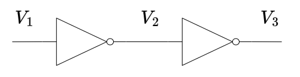

Se vogliamo quindi che non accada mai che l'uscita del primo inverter generi un segnale che venga mal interpretato da quello dopo, è **necessario** che:
$$
\large
\begin{matrix}
	V_{OH,MIN} > V_{IH,MIN} && V_{OL,MAX} < V_{IL,MAX}
\end{matrix}
$$

Definiamo quindi **_Margine di Rumore Alto_**, o $NM_H$:
$$
\Large
\boxed{
	NM_H := V_{OH,MIN} - V_{IH,MIN}
}
$$

Analogamente il  _**Margine di Rumore Basso**_, o $NH_L$:
$$
\Large
\boxed{
	NM_l := V_{IL,MAX} - V_{OL,MAX}
}
$$

Affinché tutto funzioni correttamente è quindi necessario che sia vero:
$$
\large
\boxed{
	\begin{cases}
		NM_H > 0 \\
		NM_L > 0
	\end{cases}
}
$$

Il margine di rumore ci fornisce anche **protezione contro i disturbi**.

Tipicamente, si cerca di avere sempre un _**comportamento simmetrico**_:
$$
\Large
NM_H = NM_L > 0
$$

Che significa che **_non si hanno preferenze tra lo_ `0` _e l'`1`_**.

### 2.1.3. Porte Rigenerative

Definiamo _**Porte Rigenerative**_:
> Circuiti Logici nei quali, tra i due punti a derivata in modulo unitaria della `VTC`, la derivata:
> $$
> {dV_{OUT} \over dV_{IN}} > 1
> $$

In questo tipo di porte:
- Sono invarianti logicamente
- Producono una tensione di uscita $V_3$ _**più forte**_ della tensione di ingresso $V_1$ (maggiore se `1`, minore se `0`)

Sempre nell'esempio dei due inverter in serie, se prendiamo in ingresso uno `0` "brutto", ovvero con una tensione $V_1 \to V_{IL, MAX}$, questa genera in uscita una tensione $V_2 > V_1$.

Questa tensione, in ingresso al secondo inverter, produrrà un segnale di uscita $V_3$ che sarà **minore** di $V_1$.

Questo comportamento è dato proprio dal fatto che la derivata nella zona intermedia è maggiore di uno.

### 2.1.4. Potenza Dissipata
### 2.1.5. Potenza Dissipata

La potenza dissipata $P_D$ si divide in due tipologie:
- _**Statica**_: è la potenza dissipata quando la porta **non sta lavorando**
- _**Dinamica**_: è la potenza dissipata quando la porta **sta operando modificando l'uscita**

Dobbiamo cercare di:
- **Eliminare la potenza statica**: cercheremo un modo per rimuovere questo costo durante i periodi di _idle_
- **Minimizzare la potenza dinamica**: non possiamo eliminarla perché è necessaria energia per poter modificare un segnale. Tuttavia cerchiamo di ridurla al minimo

### 2.1.6. Tempo di propagazione

Quando commutiamo un segnale in ingresso ad una porta nel tempo, quello che otteniamo sono i grafici sulla destra

Identificando i punti nei quali la _tensione in ingresso_ è al $10\%$ e al $90\%$ del valore massimo $V_{IH}$ rispetto al valore minimo $V_{IL}$, definiamo:
- _**Rise Time**_ $t_R$: tempo impiegato dal segnale per andare dal $10\%$ al $90\%$
- _**Fall Time**_ $t_F$: tempo impiegato dal segnale per andare dal $90\%$ al $10\%$

L'uscita sarà **sempre un po' ritardata**, questa è dovuta ai circuiti interni alle porte.

Identificando gli istanti nei quali i due segnali sono al $50\%$ definiamo:
- _**Tempo di Propagazione Alto-Basso**_ $t_{P_{HL}}$: tempo necessario per diminuire l'uscita al $50\%$ del massimo
- _**Tempo di Propagazione Alto-Basso**_ $t_{P_{LH}}$: tempo necessario per aumentare l'uscita al $50\%$ del massimo

Definiamo **_Tempo Medio di Propagazione_**:
$$
t_P := \frac{t_{P_{HL}} + t_{P_{LH}}}{2}
$$

### 2.1.7. Power Delay Product - PDP

Mette in relazione la _Potenza Dissipata_ e il _Tempo di Propagazione_:
$$
\Large
\boxed{
	PDP := P_d \cdot t_P
}
$$

Questo parametro ci permette di capire quale tra due porte è più efficiente, in quanto noi cerchiamo:
- Porte che dissipano poca potenza
- Porte con tempi di risposta ridotti

### 2.1.8. Fan IN - OUT

Definiamo **Fan OUT** di una porta:
> Numero massimo di ingressi di una stessa porta collegabili all'uscita della porta

Ovvero il numero massimo di porte dello stesso tipo che possiamo collegare all'uscita.

Analogamente **Fan IN** di una porta:
> Numero massimo di ingressi di una stessa porta collegabili all'ingresso della porta

Ovvero il numero massimo di ingressi che possiamo fornire alla nostra porta.

# 3. Porte Logiche

## 3.1. Famiglie Logiche

In funzione della tecnologia che scegliamo per creare le nostre porte logiche, definiamo una **Famiglia Logica**.

Tutte le porte della stessa famiglia _**condividono le caratteristiche**_, e quindi possono essere messe in cascata l'una all'altra senza problemi.

Se invece volessimo usare due porte di due famiglie diverse è necessario interporre tra le due un **Circuito Interfaccia**, che converta le tensioni/correnti di uscita dalla prima nei valori corrispettivi di ingresso per la seconda.

Le porte logiche più utilizzate sono quelle basate su _**Tecnologia `CMOS`**_, che integra sullo stesso _chip_ sia `NMOS` che `PMOS` con caratteristiche simili tra loro.

Tra le famiglie che utilizzano questa tecnologia distinguiamo
1. _**Logica a Diodi**_
2. _**Famiglia `CMOS` Complementare**_
3. _**Famiglia Logica Pass-Transistor**_
4. **Famiglia Logica Dinamica**
5. **Famiglia Pseudo `NMOS`**

Nel corso vedremo le prime tre.

Esiste anche la famiglia che sfrutta transistori bipolari, ma oggi sono praticamente inutilizzati poiché i `CMOS` offrono molti più vantaggi.
## 3.2. Logica a Diodi

### 3.2.1. Porta `AND` a Diodi

In questo circuito conosciamo la tensione ai nodi $A$ e $B$:
$$
V_A = 5\;V \\
V_B = 5\;V
$$

Partiamo quindi dall'ipotesi che i due **_diodi siano interdetti_**.

Sostituiamo quindi ai diodi due circuiti aperti.

Quello che otteniamo dopo la sostituizione è un circuito senza una maglia.

Di conseguenza la tensione $V_u = V_{CC} = 5$ $V$.

Dobbiamo adesso verificare l'ipotesi, ovvero che $V_D < V_\gamma$:
$$
\begin{CD}
	{V_A = V_B = V_{CC}} @>>> {V_{D_A} = V_{D_B} = 0 < V_\gamma}
\end{CD}
$$

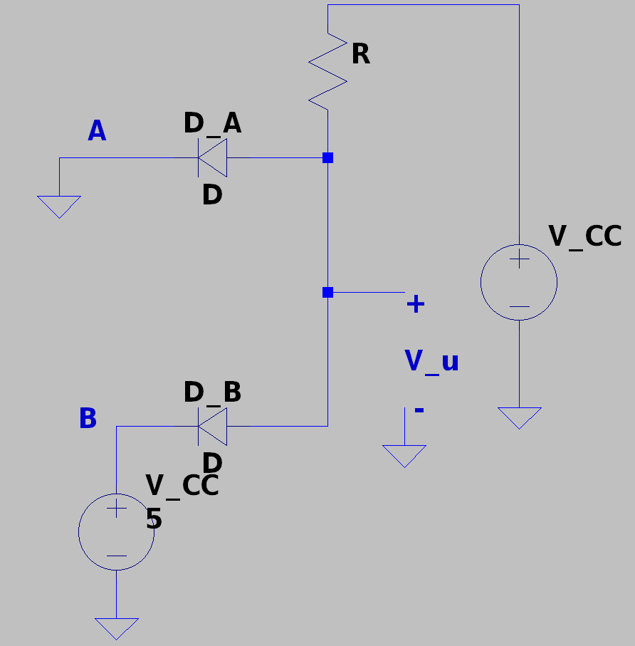

Ipotizziamo adesso invece che il circuito sia quello culla sinistra, ovvero che $V_A = 0$ $V$ e che $V_B = 5$ $V$.

Avendo collegato il catodo di $D_A$ a terra, diventa ragionevole in questo caso ipotizzare $D_A$ **ON**.

Supponendo di sostituire il diodo con un _diodo ideale_, ovvero con un corto.
Con questa nuova conformazione, otteniamo quindi che il catodo di $V_u$ è collegato a _ground_.
Di conseguenza avremo che $V_u = 0 - 0 = 0$.

Compiendo la verifica otteniamo quindi che:
- Per il diodo A: &emsp; $I_D = I_{CC} = \frac{V_CC}{R} > 0$
- Per il diodo B: &emsp; $V_{AK} = -V_{CC} = -5\;V < V_\gamma$

Analogamente sappiamo anche che se $V_A = 5$ $V$ e $V_B = 0$ $V$ otteniamo gli stessi risultati.

Vediamo quindi l'ultima conformazione, nella quale  entrambi i diodi sono **ON**: $V_{D_A} = V_{D_B} = 5$ $V$.

Esattamente come prima otteniamo che $V_u = 0 - 0 = 0$.

Per quanto riguarda la verifica effettuiamo le stesse considerazioni fatte prima, ottenendo che $I_A = I_B = \frac{V_{CC}}{R} > 0$.

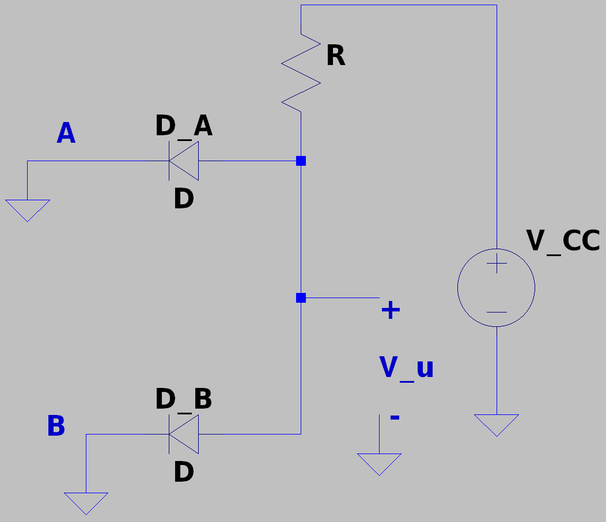

Riassumedo abbiamo ottenuto che:

|  $V_A$  |  $V_B$  |  $V_u$  |
| :-----: | :-----: | :-----: |
| $5$ $V$ | $5$ $V$ | $5$ $V$ |
| $0$ $V$ | $5$ $V$ | $0$ $V$ |
| $5$ $V$ | $0$ $V$ | $0$ $V$ |
| $0$ $V$ | $0$ $V$ | $0$ $V$ |

Notiamo che se associamo le tensioni $5$ $V$ con un `1` logico, e le tensioni $0$ $V$ le associamo lo `0` logico, quello che abbiamo appena costruito è una **_Porta `AND`_**.

### 3.2.2. Porta `OR`

Ipotizziamo di avere questo circuito adesso:

Se partiamo dall'ipotesi che $V_A = V_B = V_{CC} = 5$ $V$, ha senso ipotizzare che i due diodi siano **ON**.

Di conseguenza otteniamo che $V_u = 5$ $V$.

La verifica è semplice in quanto: &emsp; $I_{D_A} = I_{D_B} = \frac{V_{CC}}{R} > 0$.

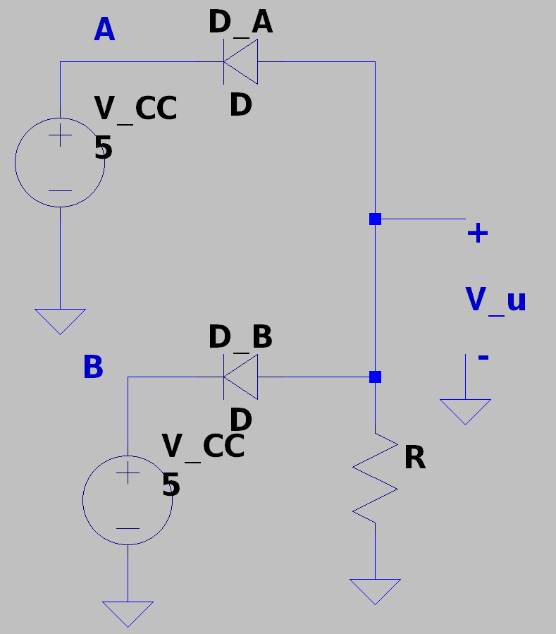

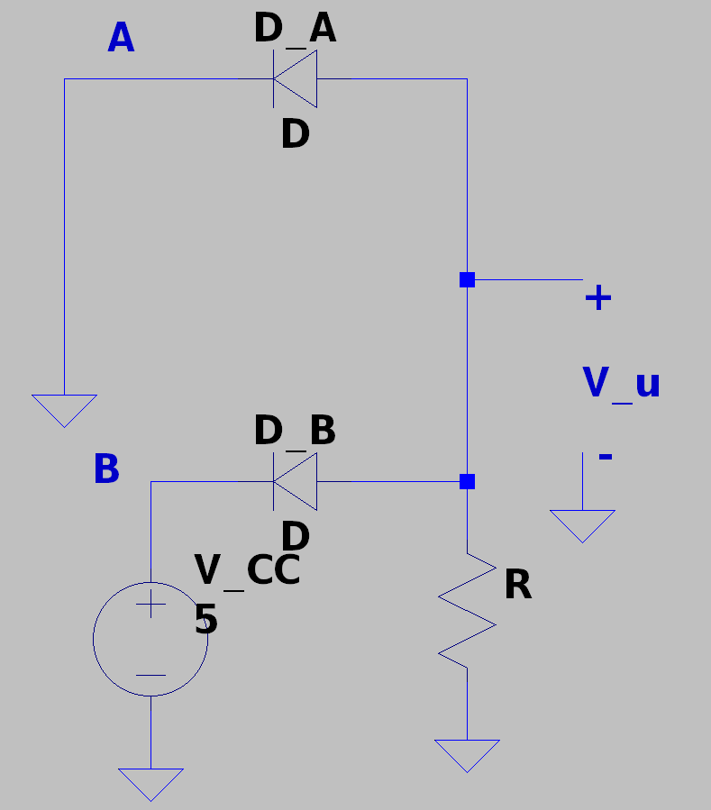

Nel secondo caso proposto sulla destra, abbiamo adesso che $V_A = 0$ $V$, mentre $V_B = V_{CC} = 5$ $V$. Ha quindi senso ipotizzare che $D_A$ sia **interdetto**, mentre $D_B$ sia **ON**.

Di conseguenza otteniamo che $V_u = V_CC = 5$ $V$.

La verifica è semplice in quanto:
$$
\begin{align*}
	V_{D_A} &= 0 - V_{V_CC} = -V_{CC} = -5\;V \\
	I_{D_B} &= \frac{V_{CC}}{R} > 0
\end{align*}
$$

Questa condizione è rispettata simmetricamente invertendo $D_A$ e $D_B$.

Procediamo con l'ultima conformazione abbiamo che $V_A = V_B = 0$ $V$.

In questo circuito **non abbiamo alcun generatore di tensione**.

Di conseguenza in ogni punto del circuito la tensione è la stessa, ovvero **_nulla_**.

Otteniamo quindi che $V_u = 0$ $V$.

Riassumedo abbiamo adesso ottenuto che:

|  $V_A$  |  $V_B$  |  $V_u$  |
| :-----: | :-----: | :-----: |
| $5$ $V$ | $5$ $V$ | $5$ $V$ |
| $0$ $V$ | $5$ $V$ | $5$ $V$ |
| $5$ $V$ | $0$ $V$ | $5$ $V$ |
| $0$ $V$ | $0$ $V$ | $0$ $V$ |

Notiamo che se associamo le tensioni $5$ $V$ con un `1` logico, e le tensioni $0$ $V$ le associamo lo `0` logico, quello che abbiamo appena costruito è una **_Porta `OR`_**.

### 3.2.3. Difetti Principali

Nonostante sia possibile costruire le porte `AND` e `OR` attraverso i diodi, per costruire le porte in commercio si utilizzano altre tecniche, poiché questi circuiti presentano diverse problematiche.

La prima problematica è che i circuiti **_assorbono corrente_**. In particolare è necessario che le correnti di ingresso siano diverse da zero, in quanto il circuito "consuma" corrente.
Questo rende molto complesso la gestione di porte multiple, in quanto la corrente in ingresso alle ultime porte sarà molto inferiore a quella nelle prime.

Il secondo problema, più grave del primo, si presenta quando abbiamo due porte `OR` in cascata.

Nel caso proposto a destra, abbiamo due porte `OR`, dove un'entrata del secondo è l'uscita del primo, mentre tutte le altre entrate sono in conduzione.

Se utilizziamo il modello dei diodi ideali, la tensione rimane la stessa. Ma i diodi hanno una componente di consumo della tensione.

Prendendo quindi $V_\gamma = 0.7$ $V$, dalla cascata ottenuamo una tensione di $5 - 0.7  -0.7 = 3.6$ $V$.

Questo fenomeno si chiama **_Degrado dei Livelli Logici_**, e va a **limitare il numero massimo di porte in cascata** che possiamo avere.

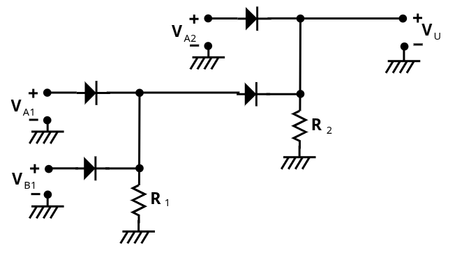

Il terzo problema, forse il più grande, è che con i diodi **_non è possibile costruire una porta `NOT`_**.

La logica a diodi quindi non permette di costruire reti combinatorio complesse.

Tuttavia, queste porte non sono "inutili". Infatti vedremo più avanti che la porta `AND` a diodi, messa in cascata con un **inverter** costruito con un **transistor** è stata per tutti gli anni '50 e '60 la porta logica `NAND` utilizzata in quasi tutti i componenti.

## 3.3. Famiglia CMOS Complementare

### 3.3.1. Notazione

Nelle porte che vedremo utilizzeremo un diverso numero di `NMOS` e `CMOS`, quindi facciamo la seguente semplificazione:

Definiamo **Pull Up Network**:
> Rete di $N$ `PMOS` che operano quando la tensione in ingresso è _bassa_

Analogamente definiamo **Push Down Network**:
> Rete di $N$ `NMOS` che operano quando la tensione in ingresso è _alta_

Questo tipo di soluzioni sono perfettamente funzionali, ma richiedono **due transistori per ogni varibile logica** che utilizziamo.

Inoltre, quando li analizzeremo, vedremo le soluzioni:
1. In forma grafica
2. In forma analitica **_nella condizione che_** $V_i = V_o$

### 3.3.2. Inverter

Dal punto di vista elettrico, possiamo pensare ad una porta inverter come sulla destra, dove la tensione in entrata pilota un interruttore:
1. $V_{IN} = 0$ $V$ $\to$ **Interruttore Aperto** 
1. $V_{IN} = V_{DD}$ $V$ $\to$ **Interruttore Chiuso** 

Quando l'interruttore è aperto, nel circuito superiore non passa corrente, perciò $V_{o} = V_{DD}$, mentre quando è aperto è connesso a _ground_, quindi $V_{o} = 0$

A questo punto dobbiamo solo capire come costruire l'interruttore.

In realtà abbiamo già visto come i **transistori** possono operare come interruttori:

Inverter Bipolare

Inverter MOS

I transistori non sono però interruttori ideali, infatti possiamo dimostrare anche in modo grafico come in realtà:

<figure class="">

<figcaption>

Possiamo considerare i transistori bipolari in saturazione come **quasi** dei cortocircuiti
</figcaption>
</figure>

Questo tipo di circuiti hanno però dei problemi.

Il primo è che per poter avere una $V_{CE}$ più prossima allo zero, è necessario che $R_C$ sia **il più grande possibile**. Questo tipo di resistenze, dette resistenze integrali, sono tipicamente grosse.

Il secondo, più grave, è che quando l'interruttore è chiuso, sia sul **transistore che sulla resistenza passa corrente che _dissipa energia_**. Abbiamo quindi una **Potenza Statica** nel nostro circuito, oltre a quella già dissipata dal transistore.

Negli anni sono state proposte diverse soluzioni a questo problema, ed oggi quella utilizzata si basa sul fatto di poter creare transistori `CMOS`.

Invece di usare una resistenza e un interruttore, utilizziamo **due interruttori** $1$ e $2$.

- Quando $V_{IN} = 0$ se l'interruttore $1$ fosse $ON$ e $2$ fosse $OFF$: &emsp; $V_{o} = V_{DD}$ 
- Quando $V_{IN} = V_{DD}$ se l'interruttore $1$ fosse $OFF$ e $2$ fosse $ON$: &emsp; $V_{o} = 0$

In questo modo, sia che ci troviamo in uno o nell'altro caso, _**sugli interruttori non passa corrente**_, dato che almeno uno dei due interruttori è aperto.

Questo circuito ha quindi _**Potenza Statica Nulla**_.

Per poter riuscire a creare questa porta sono necessari **due interruttori complementari l'uno rispetto all'altro**. Quando [abbiamo studiato i `MOS`](./Transistore%20a%20Effetto%20Di%20Campo#441-confronto-nnos---pmos) abbiamo proprio detto che l'`NMOS` e il `PMOS` possono essere considerati come circuiti complementari.

Il circuito inverter in tecnologia **`CMOS` complementare** è quindi il seguente:

#### 3.3.2.1. Analisi Circuitale

Possiamo quindi analizzare questo circuito:

I due transistori hanno _Ground_ e _Drain_ in comune.

La soluzione è sufficientemente semplice. Essendo i due transistori **in serie**, devono essere attraversati dalla _stessa corrente_:
$$
i_{D_N} = -i_{D_P}
$$

Per risolvere dal punto di vista grafico, possiamo effettuare il _plot_ di entrambi i transistori sullo stesso grafico. Dobbiamo quindi trovare un modo per unire sullo stesso piano cartesiano le due caratteristiche, dato che il primo grafica $i_{D_N}$ e $V_{DS_N}$ e il secondo $i_{D_P}$ e $V_{DS_P}$.

Facendo attenzione però possiamo vedere come:
- $V_{DS_N} = V_o$
- $V_{GS_{N}} = V_i$

Scegliamo quindi questi assi, poiché già relazionati alla tensione di ingresso e di uscita.

A questo punto dobbiamo riuscire a capire come tracciare il grafico del `PMOS` su questi assi, ma sappiamo che:
- $i_{D_P} = -i_{D_N} \qquad \to \qquad$ sufficiente "ribaltare" sul secondo quadrante
- $V_{DS_P} = V_{DS_N} - V_{DD} \qquad \to \qquad$ sufficiente "shiftare a destra" le curve di un fattore $V_{DD}$

Il risultato finale è quindi:

A questo punto quindi, supponendo $V_i = V_{i_1}$:
$$
\begin{cases}
	V_{GS_N} = V_i = V_{i_1} \\
	V_{GS_P} = V_{G_P} - V_{S_P} = V_{i_1} - V_{DD}
\end{cases}
$$

Il punto di riposo è quindi **l'intersezione tra un ramo del primo set e uno del secondo**, ovvero:
$$
	V_o = V_{o1}
$$

Il nostro scopo è però avere una relazione tra la **tensione di uscita** e la **tensione di ingresso**.

Partendo per step, analizziamo quando $V_i < V_{T_N}$, che comporta
- $V_{GS_N} = V_i < V_{T_N}$
- $V_{GS_P} = V_i -V_{DD}$

Quindi abbiamo che:
- `NMOS` **interdetto**: la caratteristica è $i_D = 0$
- `PMOS` **in conduzione**: la caratteristica sarà quella per $V_{GS_P} = V_i - V_{DD}$, che interseca l'origine in $(V_{DD}, 0)$

L'unico punto di intersezione tra le due caratteristiche è $V_o = V_{DD}$

Se invece studiamo quando $V_{T_N} < V_i < V^\ast$:
- $V_{GS_N} = V_i$
- $V_{GS_P} = V_i -V_{DD}$

Quindi abbiamo che:
- `NMOS` **saturazione**: la caratteristica sarà quella per $V_{GS_N} = V_i$, crescente per valori crescenti di $V_i$
- `PMOS` **triodo**: la caratteristica sarà quella per $V_{GS_P} = V_i - V_{DD}$, decrescente per valori crescenti di $V_i$

Al crescere di $V_i$ il punto di intersezione $V_o$ andrà a diminuire sempre più _velocemente_.

Il punto $V^\ast$ è un valore di tensione per il quale `NMOS` **saturazione** e `PMOS` **saturazione**. In questa zona possiamo avere, data la tensione $V^\ast$ **più possibili tensioni di uscita** $V_o$.

Se invece studiamo quando $V_i > V^\ast$ avremo che:
- `NMOS` **triodo**: la caratteristica sarà quella per $V_{GS_N} = V_i$, crescente per valori crescenti di $V_i$
- `PMOS` **saturazione**: la caratteristica sarà quella per $V_{GS_P} = V_i - V_{DD}$, decrescente per valori crescenti di $V_i$

Al crescere di $V_i$ il punto di intersezione $V_o$ andrà a diminuire sempre più _lentamente_.

L'ultimo caso è quindi quello per il quale $V_{GS_P} = V_{T_P}$, ovvero $V_i = V_{DD} + V_{TP}$, per il quale:
- `NMOS` **in conduzione**
- `PMOS` **interdetto**

Che quindi interseca le due caratteristiche quando $V_o = 0$

Ricordando che i transistori operano

|        |                         Conduzione                          |                             Saturazione                             |
| :----: | :---------------------------------------------------------: | :-----------------------------------------------------------------: |
| `NMOS` |                $V_{GS_N} = V_i \ge V_{T_N}$                 | $V_{DS_N} \ge V_{GS_N} - V_{T_N} \Rightarrow V_o \ge V_i - V_{T_N}$ |
| `CMOS` | $V_{GS_P} \le V_{T_P} \Rightarrow V_i \le V_{DD} + V_{T_P}$ | $V_{DS_P} \le V_{GS_P} - V_{T_P} \Rightarrow V_o \le V_i - V_{T_P}$ |

Mettendo insieme queste considerazioni, **possiamo graficare la relazione tra tensione di uscita e entrata**:

Possiamo identificare le 5 zone, ogniuna diversa dall'altre per lo stato di funzionamento di almeno uno dei due transistori:

<table>
  <thead>
    <tr>
      <th></th>
      <th><code>NMOS</code></th>
      <th><code>PMOS</code></th>
    </tr>
  </thead>
  <tbody>
    <tr>
      <td><strong>Zona 1</strong></td>
      <td>OFF</td>
      <td>TRIODO</td>
    </tr>
    <tr>
      <td><strong>Zona 2</strong></td>
      <td>SATURO</td>
      <td>TRIODO</td>
    </tr>
    <tr>
      <td><strong>Zona 3</strong></td>
      <td>SATURO</td>
      <td>SATURO</td>
    </tr>
    <tr>
      <td><strong>Zona 4</strong></td>
      <td>TRIODO</td>
      <td>SATURO</td>
    </tr>
    <tr>
      <td><strong>Zona 5</strong></td>
      <td>TRIODO</td>
      <td>OFF</td>
    </tr>
  </tbody>
</table>

A questo punto è quindi smeelice risolvere il circuito, poiché è sufficiente capire in quale zona ci troviamo.

#### 3.3.2.2. Analisi Zona a Transistori Saturi

Noi andremo a studiare solamente la **zona 3**, ovvero quella per cui:
- `NMOS` **saturo**
- `PMOS` **saturo**

In questa zona:
$$
\begin{align*}
	i_{DS_N} &= K_N \cdot (V_{GS_N} - V_{T_N})^2 \\
	i_{DS_P} &= -K_P \cdot (V_{GS_P} - V_{T_P})^2 \\
	i_{DS_N} &= - i_{DS_P}
\end{align*}
$$

Unendo le relazioni otteniamo:
$$
\begin{align*}
	K_N \cdot (V_{GS_N} - V_{T_N})^2 &= K_P \cdot (V_{GS_P} - V_{T_P})^2  && {V_{GS_N} = V_i \atop V_{GS_P} = V_i - V_{DD}} \\[2em]
	K_N \cdot (V_i - V_{T_N})^2 &= K_P \cdot (V_i - V_{DD} - V_{T_P})^2 && \text{Prendiamo solamente una soluzione della radici} \\[1em]
	\sqrt{K_N} \cdot (V_i - V_{T_N}) &= -\sqrt{K_P} \cdot (V_i - V_{DD} - V_{T_P}) \\[0.75em]
	(\sqrt{K_N} + \sqrt{K_P}) V_i &= -\sqrt{K_P} \cdot (- V_{DD} - V_{T_P}) + \sqrt{K_N}V_{T_N} \\[0.75em]
	V_i &= \frac{\sqrt{K_P} \cdot (V_{DD} + V_{T_P}) + \sqrt{K_N}V_{T_N}}{\sqrt{K_N} + \sqrt{K_P}}
\end{align*}
$$

Notiamo come in questo tratto _**la caratteristica è indipendente da qualsiasi variabile**_, ma è definita **solo da costanti**.

Nella zona tre, **trascurando l'effetto di modulazione di canale**, la caratteristica _**viene verticale**_:

$$
\Large
\boxed{
	\begin{matrix}
		V^\ast = \frac{\sqrt{K_P} \cdot (V_{DD} + V_{T_P}) + \sqrt{K_N}V_{T_N}}{\sqrt{K_N} + \sqrt{K_P}} & & {\lambda_{PMOS} = 0 \atop \lambda_{NMOS} = 0}
	\end{matrix}
}
$$

Inoltre, nelle condizioni in cui:
$$
\Large
\begin{CD}
\begin{cases}
	V_{T_P} = - V_{T_N}\\
	K_P = K_N = K
\end{cases} @>>>
{
	V^\ast = \frac{\sqrt{K}(V_{DD} + V_{T_P} + V_{T_N})}{2 \sqrt{K}} = \frac{V_{DD}}{2}
}
\end{CD}
$$

Definiamo _**Soglia Logica**_ il valore di tensione della caratteristica che interseziona la bisettrice del primo quadrante, ovvero la tensione in ingresso $V_i$ che produce una tensione in uscita $V_o = V_i$.

Se il nostro inverter rispetta queste condizioni, possiede una _soglia logica perfettamente simmetrica_, pari alla **metà della tensione di alimentazione $V_{DD}$**.

Affinché questo sia vero _**devono necessariamente essere vere entrambe le relazioni**_:
- $V_{T_N} = - V_{T_P}$ &emsp; non abbiamo controllo, dobbiamo guardare le specifiche dei transistori
- $K_P = K_N$ &emsp; possiamo agire sulle dimnesioni dei transistori affinché la relazione sia vera, in quanto:
$$
\Large
\frac{\mu_N}{\mu_P} = \frac{\Biggl(\frac{W}{L}\Biggr)_P}{\Biggl(\frac{W}{L}\Biggr)_N}
$$

In questo tipo di porte i punti a derivata in modulo unitario _**sono simmetrici**_.

#### 3.3.2.3. Analisi in Potenza

Nella porta inverter costruita con tecnologia `CMOS` abbiamo che:
- **Potenza Statica Ideale**: Sui transistori non passa mai corrente quindi $0$
- **Potenza Statica Reale**: molto piccola, dovuta a correnti parassite
- **Potenza Dinamica**: ce ne sono di diversi tipi
  1. _Potenza di "Cortocircuito"_: è la potenza dissipata quando i due transistori sono entrambi in conduzione (zona 3)
  2. _Carica/Scarica Capacità intrinseca_

Il secondo tipo di potenza dinamica è dovuta al fatto che durante due transistori i `MOSFET` possono agire "parassitivamente" come dei condensatori. Dovremo quindi prendere in considerazione il fatto che dovranno essere svuotati/caricati prima di commutare l'uscita.

Per spiegare meglio perché questa capacità è non solo presente ma **non eliminabile**, vediamo il circuito di seguito, dove poniamo **2 inverter in serie**.

La prima capacità parassita è identificata da $C_W$, che rappresenta la _Capacità del Filo_. Infatti ogni collegamento presenta resistenza, induttanza e capacità intrinseche non eliminabili.

La seconda e terza capacità parassita si presentano nelle _**Zone di svuotamento tra Drain e Body**_ dei `MOSFET`. Infatti, tra zona $n^+$ del drain e il substrato $p$ è presente una zona di svuotamento, che agisce proprio come un condensatore. La chiamiamo $C_{DB}$

La quarta e la quinta capacità parassita si trovano nelle _**Sovrapposizioni tra Gate e Drain**_ dei `MOSFET`. Nella piccola intersezione che ha la zona $n^+$ con la sezione del _Gate_, si forma infatti un piccolo condensatore. Chiamiamo questa capacità $C_{GD}$

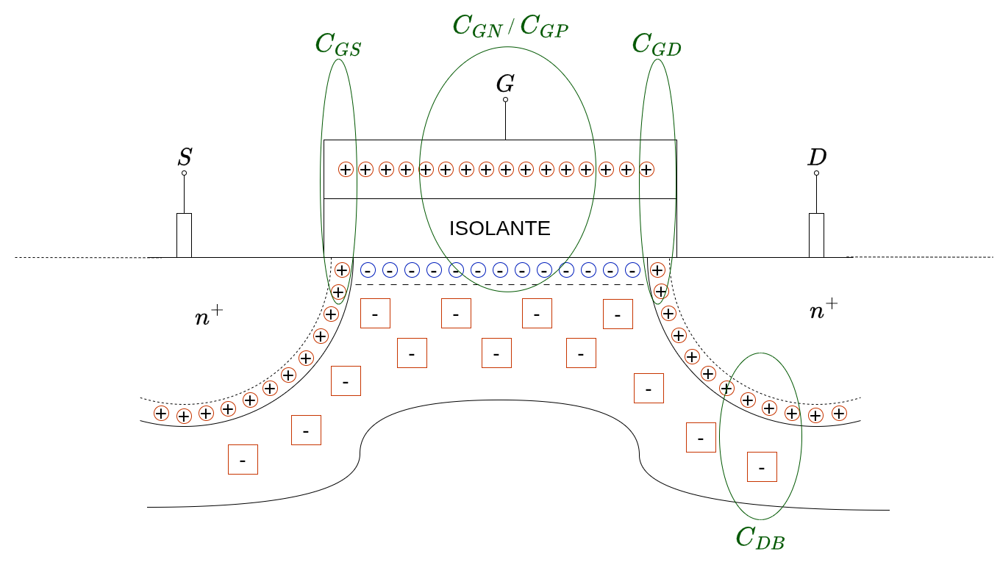

Avendo messo serie un altro _inverter_, si presentano quindi altre due capacità, tra il _Gate_ del secondo inverter e i due substrati dei suoi `MOSFET`. Le chiamiamo $C_{GP}$ e $C_{GN}$

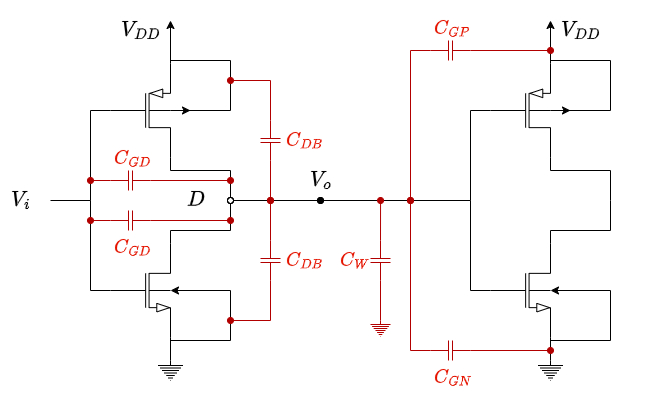

Poiché tutte queste capacità _**condividono il nodo**_ $D$, possiamo cercare un modo per trovare una _capacità equivalente_. È però importante ricordare che il circuito non va studiato staticamente, ma **per le variazioni**. Infatti, sia _groud_ chee $V_{CC}$, per quanto siano un valore numericamente fisso, durante le commutazioni possono essere considerati _**come se fossero lo stesso nodo**_, data la variazione simmetrica di condizioni all'interno dei transistori.

Possiamo quindi considerare $C_W$ i due $C_{DB}, C_{GP}$ e $C_{GN}$ come se fossero tutti in _parallelo_.

Per quanto riguarda i due condensatori collegati alla $V_i$ dobbiamo fare un discorso particolare, dato che **non hanno un armatura che ha tensione fissa**.

Infatti, se $V_i$ aumenta di $\Delta V$ allora $V_o$ diminuirà di $\Delta V$, aumentando la differenza tra le armature che sarà adesso $2 \Delta V$:
$$
	\Delta Q = C_{GD} \cdot 2 \Delta V
$$

Nelle altre capacità collegate a _ground_, abbiamo che la relazione è:
$$
	\Delta Q = C \cdot \Delta V
$$

Tuttavia, considerando le capacità connesse a $V_i$ come il loro doppio, possiamo rendere le due espressioni matematicamente uguali. Ciò comporta che possiamo trattare anche questi condensatori **se fossero collegate a _ground_**.

Questi condensatori possono quindi essere considerati in parallelo a gli atri, ottenendo una capacità equivalente:
$$
\Large
\boxed{
	C_{EQ} = C_W + C_{DB_N} + C_{DB_P} + C_{GN} + C_{GP} + 2 \cdot C_{GD_N} + 2 \cdot C_{GD_P}
}
$$

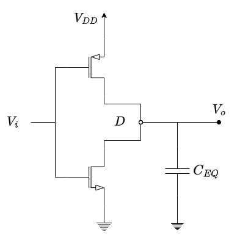

Nella pratica dei nostri transistori, questo valore dipende sia dal processo tecnologico, che fornisce informazioni sulle capacità per area, sia dalle dimensioni dei transistori che moltiplicano queste densità.
Nei processi moderni queste capacità, per dimensioni minime, si aggirano nell'ordine dei $O(fF) = O(10^{-15} F)$.

È importante sottolineare che questa capacità **aumenta per ogni porta in uscita collegata** aumentando sia il ritardo che la potenza dissipata. Ecco il perché dell'esistenza del **FAN OUT**.

Durante le commutazioni, la capacità dovrà essere **caricata e scaricata**. Ignorando i ritardi temporali, andiamo a vedere quanta potenza dissipiamo nei processi di carica/scarica della capacità.
Seppur caricare e/o scaricare un condensatore non consumi l'energia che gli forniamo, il processo di carcia/scarica comporta una dissipazione a carico nelle componenti che utilizziamo per permettere alla corrente di trasportare quest'energia.

Studiamo intanto il processo di _scarica_ del condensatore, ovvero la _Transizione di Uscita Alto $\to$ Basso_.

Poiché al termine del processo l'energia è nulla, la variazione di energia sarà:
$$
\large
\boxed{
	E_{HL} = E_i - E_f = \frac{1}{2}C_{EQ}V_{DD}^2
}
$$

Questa energia viene dissipata, _sotto forma di energia termica_, dall'`NMOS` che chiude il circuito con _ground_.

Nel processo di carica del condesatore, ovvero la _Transizione di Uscita Basso $\to$ Alto_ invece:
$$
\begin{cases}
	V_o = 0 & \text{Situazione Iniziale} \\
	V_o = V_{DD} & \text{Situazione Finale}
\end{cases}
$$

Facciamo in questo caso un altro ragionamento: per ottenere l'**energia dissipata** $E_{LH}$, calcoliamo prima l'energia erogata dalla batteria $E_B$, e vi sottraiamo l'energia che abbiamo immagazzinato nel condesatore $E_C$
$$
	E_{LH} = E_{B} - E_{C}
$$

L'energia della batteria:
$$
\begin{align*}
	E_B &= \int_0^{T}{V_B(\tau) i(\tau)\;d\tau} \\
		&= V_{DD} \int_0^T{i(\tau)\;d\tau} \\
		&= V_{DD} \cdot Q
\end{align*}
$$

L'integrale della corrente infatti è la carica, che nel nostro caso **si è depositata tutta sulle pareti del condensatore**.

Possiamo quindi riscrivere anche:
$$
	E_B = V_{DD} \cdot (C_{EQ}V_{DD}) = C_{EQ}V_{DD}^2
$$

A questo punto calcoliamo l'energia immagazzinata nel condensatore:
$$
	E_C = \frac{1}{2} C_{EQ} V_{DD}^2
$$

L'energia dissipata è quindi:
$$
\large
\boxed{
	E_{LH} = E_B - E_C =  \frac{1}{2}C_{EQ}V_{DD}^2
}
$$

L'energia dissipata in una doppia transizione sarà quindi:
$$
\Large
\boxed{
	E_D = E_{HL} + E_{LH} = C_{EQ}V_{DD}^2
}
$$

Per calcolare la **Potenza Dinamica** ipotizziamo che la commutazione avvenga con una _frequenza_ $\nu$, ottenendo:
$$
\Large
\boxed{
	P_D = \nu \cdot C_{EQ} \cdot V_{DD}^2
}
$$

Ecco spiegato perché storicamente abbiamo sempre cercato di diminuire la tensione di alimentazione di questo tipo di circuiti, passando da $5$ $V$ a $3.3$ $V$. Questa diminuzione però non può essere drastica, dato che è proprio nell'intervallo $[0, V_{DD}]$ che dobbiamo sancire le zone che interpretiamo ccome `0` e `1` logico, perciò diminuendolo troppo rischiamo di perdere tolleranza ai rumori.

### 3.3.3. Reti Combinatorie

Le reti combinatorio che affronteremo seguiranno tutte lo schema proposto sulla sinistra, ovvero:
- Due variabili di entrata `A` a `B`
- Una variabile di uscita `Y`

La rete di _PULL-UP_ `PUN`, composta da `PMOS`, e la rete di _PULL-DOWN_ `PDN`, composta da `NMOS`, sono **completamente disguinte e separate**, non operando mai in contemporanea.

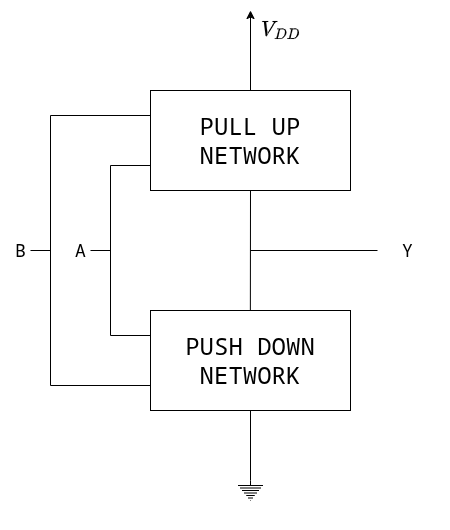

Pensando ai `MOSFET` come a degli interruttori, dove:
- `PMOS`: attivo basso
- `NMOS`: attivo alto

Possiamo vedere facilmente come:-
- **Due `MOSFET` in _serie_** equivalgono ad una `AND`
- **Due `MOSFET` in _parallelo_** equivalgono ad una `OR`

NMOS - Serie

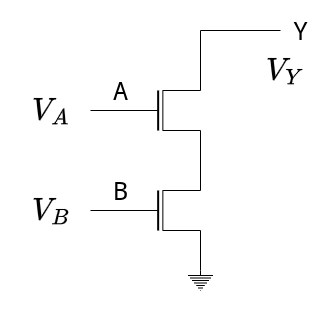

$V_y = 0$ sarà vera _**se e solo se**_ i due transistor $Q_A$ e $Q_B$ conducono.

Quindi:
$$
\begin{cases}
	V_A = V_{DD} \\
	V_B = V_{DD}
\end{cases} \to
\begin{cases}
	A = 1 \\
	B = 1
\end{cases}
$$

Abbiamo quindi che `Y = 0` quando `A = 1` e `B = 1`.

Abbiamo quindi ottenuto una _**Porta NAND**_:
$$
	\overline{Y} = A \cdot B
$$

NMOS Parallelo

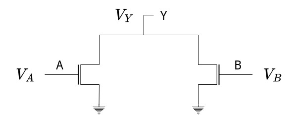

$V_y = 0$ sarà vera _**se e solo se**_ almeno uno due transistor conduce.

Abbiamo quindi che `Y = 1` quando almeno uno tra `A` e `B` vale `1`.

Abbiamo quindi ottenuto una _**Porta NOR**_:
$$
	\overline{Y} = A + B
$$

PMOS - Serie

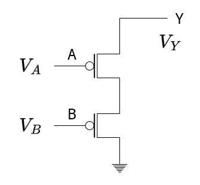

$V_y = V_{DD}$ sarà vera _**se e solo se**_ entrambi i transistori sono interdetti.

Abbiamo quindi che `Y = 0` quando sia `A = 0` e `B = 0`.

Abbiamo quindi ottenuto una _**Porta NOR**_:
$$
	Y = \overline{A} \cdot \overline{B}
$$

PMOS Parallelo

$V_y = V_{DD}$ sarà vera _**se e solo se**_ almeno uno due transistor è interdetto.

Abbiamo quindi che `Y = 1` quando almeno uno tra `A` e `B` vale `0`.

Abbiamo quindi ottenuto una _**Porta NAND**_:
$$
	Y = \overline{A} + \overline{B}
$$

Le regole quindi sono le seguenti:

|           |           `PMOS`           |                `NMOS`                 |
| :-------: | :------------------------: | :-----------------------------------: |
|   Serie   | $\overline{Y} = A \cdot B$ | $Y = \overline{A} \cdot \overline{B}$ |
| Parallelo |   $\overline{Y} = A + B$   |   $Y = \overline{A} + \overline{B}$   |

Per sintetizzare le due reti dobbiamo quindi:
- `PUN`: **trovare $Y$ in funzione delle variabili _negate_** &emsp; $Y = f_1(\overline{A}, \overline{B}, \overline{C}, ...)$
- `PDN`: **trovare $Y$ _negato_ in funzione delle variabili** &emsp; $\overline{Y} = f_2(A, B, C, ...)$

In generale vale **Proprietà della Dualità**:
> Nelle porte `CMOS`, una **condizione sufficiente** affinché la porta funzioni è che la `PUN` sia la _duale_ della `PDN` e viceversa.
> 
> Ovvero ad ogni _serie_ di una porta si ha un _parallelo_ nell'altra e viceversa.

#### 3.3.3.1. Porta `NOR` a 2 Ingressi

Nella porta `NOR` a due ingressi abbiamo che:
$$
	Y = \overline{A + B}
$$

Abbiamo quindi che:
- `PUN` &emsp; $Y = \overline{A} \cdot \overline{B}$
- `PDN` &emsp; $\overline{Y} = A + B$

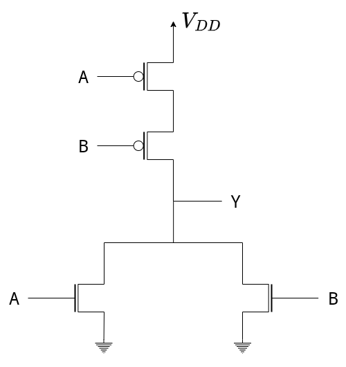

#### 3.3.3.2. Porta `NAND` a 2 Ingressi

Nella porta `NAND` a due ingressi abbiamo che:
$$
	Y = \overline{A \cdot B}
$$

Abbiamo quindi che:
- `PUN` &emsp; $Y = \overline{A} + \overline{B}$
- `PDN` &emsp; $\overline{Y} = A \cdot B$

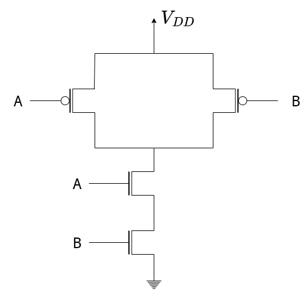

#### 3.3.3.3. Porta Complessa a 4 Ingressi
#### 3.3.3.4. Porta Complessa a 4 Ingressi

Vediamo come capire qual'è il circuito che ha come circuito di uscita:
$$
Y = \overline{A \cdot (B + CD)}
$$

Per quanto riguarda la `PUN` dobbiamo portarla nella forma dove ogni variabile è _negata_:
$$
\begin{align*}
	Y &= \overline{A} + \overline{B + CD} \\
	  &= \overline{A} + \overline{B} \cdot \overline{CD} \\
	  &= \overline{A} + (\overline{B} \cdot (\overline{C} + \overline{D})) \\
\end{align*}
$$

Per la `PDN` dobbiamo trovare la $\overline{Y}$:
$$
\overline{Y} = A \cdot (B + CD)
$$

La rete finale è quindi quella sulla destra.

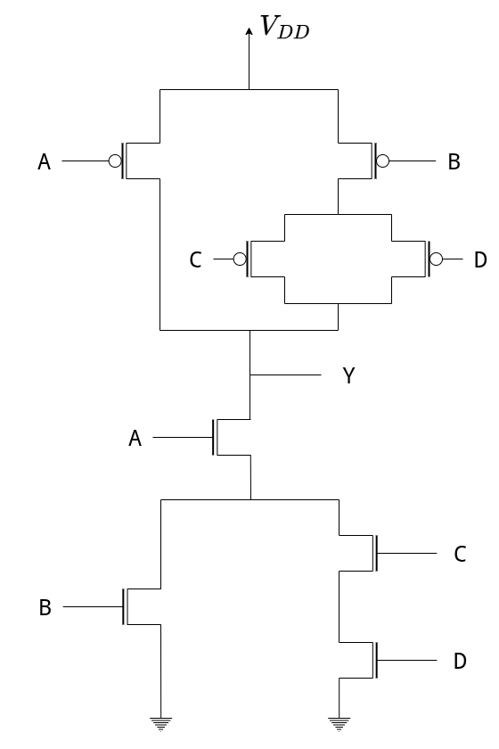

#### 3.3.3.5. Porta `XOR` a 2 Ingressi

Nello `XOR` a due ingressi ha come relazione:
$$
	Y = A\overline{B} + \overline{A}B
$$

La `PUN` abbiamo già la relazione, che però non è come la desideriamo, dato che le variabili di ingresso non sono tutte negate.

Analogamente nella `PDN`:
$$
\begin{align*}
	\overline{Y} &= \overline{A\overline{B} + \overline{A}B} \\
				 &= \overline{A\overline{B}} \cdot \overline{\overline{A}B} \\
				 &= (\overline{A} + B) \cdot (A + \overline{B}) \\
				 &= \cancel{\overline{A}A} + \overline{A}\overline{B} + BA + \cancel{B\overline{B}} \\
				 &= \overline{A}\overline{B} + AB
\end{align*}
$$

Anche in questo caso non riusciamo a trovare una relazione tra $Y$ negato e le entrate non negate come abbiamo fatto per le reti precedenti.

Nella costruzione dello schema dobbiamo quindi occuparci di _**negare gli ingressi che non sono come li desideriamo**_.

Per fare ciò dobbiamo _**inserire nello schema tanti inverter quanti sono necessari**_ per invertire tutte le variabili che ne hanno bisogno.

<figure class="70">
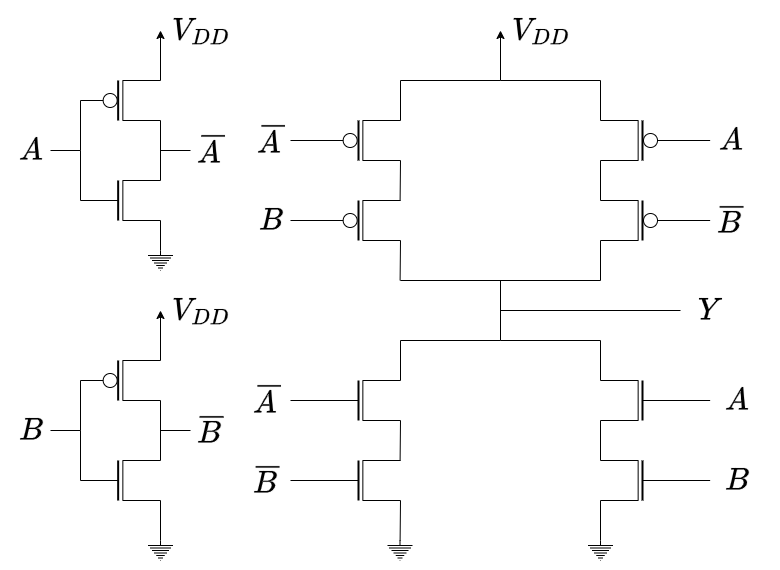
<figcaption>

Nella `PUN` neghiamo per ogni parallelo la variabile non negata.
Nella `PDN` neghiamo nel primo parallelo entrambe le variabili negate
</figcaption>
</figure>

In generale se non riusciamo a ricavare le formule canoniche per la `PUN` o per la `PDN`, è necessario introdurre tanti _inverter_ quante sono le variabili che non sono nel segno corretto.

### 3.3.4. Dimensionare i `MOSFET` nelle Reti Combinatorie

Abbiamo visto come sintetizzare delle porte logiche in tecnologia `CMOS`.

Tuttavia, avevamo detto precedentemente che il progettista non solo deve scelgiere come collegare i `MOSFET` tra di loro, ma deve anche _**dimensionarli**_.

Esistono diverse tecniche per fare ciò.

La prima tecnica, e anche quella che verrà richiesta all'esame, si basa sull'_**inverter**_.

Chiamiamo i rapporti:
$$
\begin{matrix}
	p = \Bigl(\frac{W}{L}\Bigr)_P &&
	n = \Bigl(\frac{W}{L}\Bigr)_N
\end{matrix}
$$

Ragionando in termini di costo, possiamo basare le nostre scelte su più parametri.

Una prima scelta può essere quella di costruirli per avere l'**Area Minima**, cercando di fare i `MOSFET` il _più piccolo possibile_. Tuttavia, poiché $\mu_n \ne \mu_p$, fare troppo piccoli entrambi i `MOSFET` renderebbe le loro dimesioni comparabili, provocando una grande asimmetria tra i transistori del `CMOS`, che sappiamo devono essere quanto più simili possibile per funzionare correttamente.

Infatti la relazione è:
$$
\begin{cases}
	\frac{\mu_n}{\mu_p} = \frac{n}{p} \\
	\mu_n > \mu_p \\
	n < p
\end{cases}
$$

Il secondo parametro che possiamo quindi seguire è quella di ricercare proprio la _**Simmetria**_.

Una scelta "ibrida", ovvero farli i più piccoli possibili mantenendoli simmetrici, provoca però dei ritardi importanti dal punto di vista dei _**Tempi di Risposta**_.

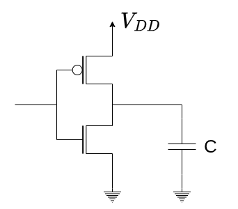

A partire quindi dalle specifiche richieste, possiamo quindi fare la nostra scelta sui valori di $n$ e $p$ affinché si ottengano le dimensioni ottimali.

Nel caso dell'_inverter_, la dimensione totale della porta in tecnologia `CMOS`:
$$
\begin{align*}
	A_{INV} &= W_LL_N + W_PL_P \\
			&= nL_N^2 + pL_P^2
\end{align*}
$$

In generale, se non abbiamo alcuna richiesta particolare di simmetria né tempi di risposta fissati, negli _inverter_ si opta sempre per _**minimizzare l'area**_.
Per fare ciò si sceglie $L_N = L_P = L_{min}$:
$$
\Large
\boxed{
	A_{INV} = \overbrace{(n+p)}^{\text{Fattore di Area}}L_{min}^2
}
$$

Nelle reti composte da `PUN` e `PDN`, l'_inverter_ diventa un _**punto di riferimento**_. Queste infatti, si dimensionano in modo che nel _Worst-Case_ queste abbiamo _**lo stesso tempo di ritardo**_ dell'_inverter_ con dimensioni $(p, n)$

Chiamiamo in questo caso:
$$
\begin{matrix}
	p = \Bigl(\frac{W}{L}\Bigr)_{PMOS} &&
	n = \Bigl(\frac{W}{L}\Bigr)_{NMOS}
\end{matrix}
$$

La corrente che passa nei singoli `MOSFET` sarà:
$$
i_{MOS} = \alpha\cdot \frac{W}{L}
$$

Dobbiamo adesso capire cosa succede quando abbiamo più `MOSFET` in serie/parallelo:

MOSFET in parallelo

Nei `MOSFET` in parallelo:

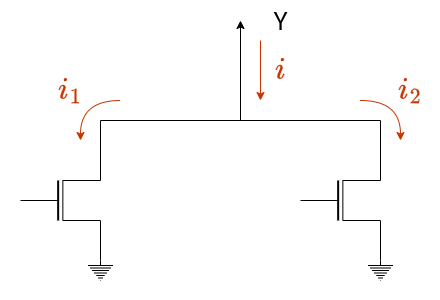

Sappiamo che:
$$
	i = i_1 + i_2
$$

Questi transistori sono sottoposti alla stessa tensione, quindi avranno stesso coefficiente $\alpha$.
Possiamo quindi scrivere:
$$
	i = \alpha \Biggl(\frac{W}{L}\Biggr)_1 + \alpha\Biggl(\frac{W}{L}\Biggr)_2 = \alpha\Biggl(\Biggl(\frac{W}{L}\Biggr)_1 + \Biggl(\frac{W}{L}\Biggr)_2\Biggr)
$$

Abbiamo quindi che il circuito equivalente:
$$
\large
	\Biggl(\frac{W}{L}\Biggr)_{EQ} = \Biggl(\frac{W}{L}\Biggr)_1 + \Biggl(\frac{W}{L}\Biggr)_2
$$

MOSFET in serie

Per quanto riguarda invece due `MOSFET` in serie:

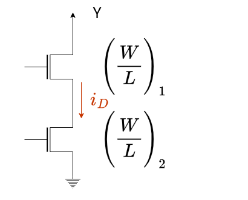

Le due costanti $\alpha$ non saranno più uguali per i due transistori.

Possiamo però vedere la corrente come:
$$
i_D = \Biggl(\frac{W}{L}\Biggr) \cdot V \cdot k
$$

La resistenza equivalente di un `MOSFET` in conduzione sarà quindi:
$$
R_{ON} = \frac{V}{i_D} = \frac{k}{\Bigl(\frac{W}{L}\Bigr)}
$$

Nel nostro circuito quindi, ipotizzando che le due $k$ siano uguali:
$$
\begin{align*}
	R_{EQ} &= R_1 + R_2 \\
	\frac{k}{\Bigl(\frac{W}{L}\Bigr)_{EQ}} &= \frac{k}{\Bigl(\frac{W}{L}\Bigr)_{1}} + \frac{k}{\Bigl(\frac{W}{L}\Bigr)_{2}}
\end{align*}
$$

Nel circuito equivalente quindi:
$$
\Large
\boxed{
	\Biggl(\frac{W}{L}\Biggr)_{EQ} = \frac{1}{\frac{1}{\Bigl(\frac{W}{L}\Bigr)_{EQ}} + \frac{1}{\Bigl(\frac{W}{L}\Bigr)_{2}}}
}
$$

#### 3.3.4.1. Rete `NOR` a 4 Ingressi

Il circuito è ricavato seguendo i ragionamenti [fatti in precedenza sui 2 ingressi](#3331-porta-nor-a-2-ingressi).

Ragioniamo stavolta sul _**dimensionamento**_.

Partiamo dalla `PUN`, nella quale troviamo **4 mosfet in serie**.

L'unica combinazione possibile è quella nella quale conducono tutti e quattro. In questi casi si fa la scelta di **dimensionarli tutti nello stesso modo**.

Chiamiamo:
$$
x_1 = \Biggl(\frac{W}{L}\Biggr)_{1,2,3,4}
$$

La nostra relazione sarà quindi:
$$
\frac{1}{x_1} + \frac{1}{x_1} + \frac{1}{x_1} + \frac{1}{x_1} = \frac{1}{\Bigl(\frac{W}{L}\Bigr)_{EQ}} = \frac{1}{p}
$$

Se risolviamo troviamo che:
$$
\begin{align*}
	\frac{4}{x_1} &= \frac{1}{p} \\
	x_1 &= 4p
\end{align*}
$$

Ogni singolo `PMOS` avrà quindi come rapporto largezza/lunghezza un valore di $4p$.

Per quanto riguarda invece la `PDN`, abbiamo **4 mosfet in parallelo**.

In questa combinazione, il nostro _Worst-Case_ è quando è necessario più tempo per commutare la capacità equivalente. Questo accade quando la corrente è minima, ovvero abbiamo uno solo degli `NMOS` in conduzione.

Chiamiamo:
$$
x_1 = \Biggl(\frac{W}{L}\Biggr)_{5,6,7,8}
$$

**Considerando il _Worst-Case_**:
$$
x_1 = n
$$

Gli `NMOS` avranno rapporto dimensioni $n$.

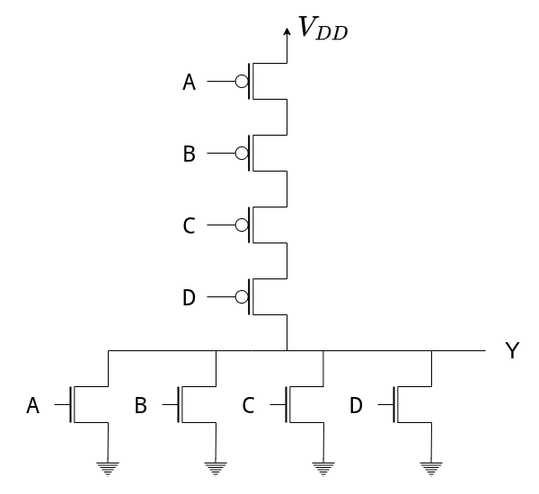

Per calcolare l'area occupata da questa porta:
$$
\begin{align*}
	A_{EQ} &= A_{PUN} + A_{PDN}
		   &= \boxed{(16p + 4n)L^2}
\end{align*}
$$

#### 3.3.4.2. Rete `NAND` a 4 Ingressi

Anche questo circuito è stato ricavato seguendo i ragionamenti [fatti in precedenza sui 2 ingressi](#3332-porta-nand-a-2-ingressi).

Ragioniamo nuovamente separando `PUN` e `PDN`.

Il _Worst-Case_ nella `PUN` è sempre quando conduce solo uno dei `PMOS`, perciò:
$$
\Biggl(\frac{W}{L}\Biggr)_{1,2,3,4} = p
$$

Nel `PDN`, essendo in serie **tutti conducono contemporaneamente**, quindi chiamando
$$
\Biggl(\frac{W}{L}\Biggr)_{5,6,7,8} = x
$$

Otteniamo come prima che:
$$
\begin{align*}
	\frac{4}{x} &= \frac{1}{n} \\
	x &= 4n
\end{align*}
$$

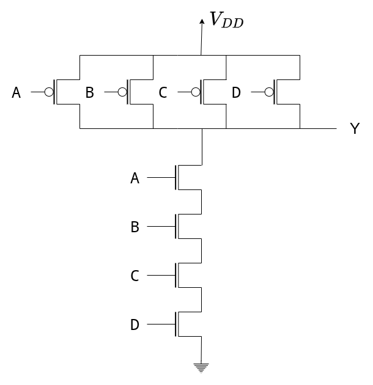

Per calcolare l'area occupata da questa porta:
$$
\begin{align*}
	A_{EQ} &= A_{PUN} + A_{PDN}
		   &= \boxed{(4p + 16n)L^2}
\end{align*}
$$

Sembrerebbe quindi che le dimensioni siano simili a quelle calcolate prima per la `NOR`.

Tuttavia, nei vari processi tecnologici i valori di $p$ e $n$ sono diversi.
Tipicamente $n = 2$ e $p = 5$.

Questo significa che:
$$
\begin{matrix}
	\text{Area NOR} && \text{Area NAND} \\ \hline
	\\
	(80 + 8)L^2 = 88L^2 && (20 + 32)L^2 = 52L^2
\end{matrix}
$$

Notiamo quindi che la porta `NOR` è $1.7$ volte più grande della `NAND`.

Questo è il motivo principale per il quale storicamente le porte in tecnologia `CMOS` sono costruite a partire da **porte `NAND`**.
Inoltre, la regola tipicamente dice di evitare le porte con **più di 4 ingressi**, poiché si hanno peggiormaneti notevoli sui tempi di risposta.

### 3.3.5. Circuito di Protezione

Prendendo sempre come riferimento un _inverter_, sappiamo che si questo comporta come un condensatore, per il quale sarà vera la relazione:
$$
V = \frac{Q}{C}
$$

Con un valore $C \approx 10^{-15} F$

La tensione ai capi del transistore è quindi direttamente proporzionale al numero di cariche:
$$
V = Q \cdot 10^{15}\;[V]
$$

Per ogni carica che si aggiunge, la tensione aumenta di un fattore di $10^{15}$.
Nel caso in cui un numeor nemmeno così elevato di _cariche esterne_ (elettrostatiche, contatto, ...) dovesse entrare in contatto con il `MOSFET`, il componente **potrebbe bruciarsi**.

Esistono diversi metodi di protezione "esterni" al circuito, ad esempio:
- _Buste Elettrostatiche_ per i trasporti
- Anelli di Metallo: collegati a ground e agganciati al polso di chi deve maneggiare i componenti
- ...

Internamente alla porta quello che possiamo fare è aggiungere un _**Circuito di Protezione**_.

Questo circuito, composto da 2 _diodi_ (che trattiamo con il modello ideale), permette di evitare i problemi relativi alle cariche esterne, mantenendo il funzionamento corretto della porta come da specifiche.

Infatti, quando $0 \le V_k \le V_{DD}$, entrambi i diodi sono $OFF$, e la nostra porta funziona come desiderato.

Se la tensione sale a $V_K \ge V_{DD} + V_\gamma$, il diodo $1$ entra in _conduzione_ imponendo la tensione a $V_{DD} + V_\gamma$

Analogamente, se scende $V_K \le -V_\gamma$ è il diodo $2$ ad entrare in _conduzione_, imponendo la tensione a $-V_\gamma$

<figure class="70">
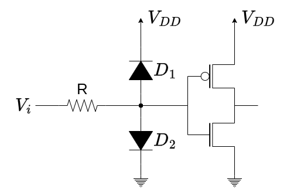
<figcaption>

La resistenza $R$ serve a limitare la corrente che potrebbe scorrere nei diodi quando entrano in conduzione.
</figcaption>
</figure>

Il circuito di protezione impone quindi che _**la tensione al nodo $K$**_:
$$
\large
\boxed{
	-V_\gamma \le V_K \le V_{DD} + V_\gamma
}
$$

Questo circuito, perfettamente funzionante, va però utilizzato _**con parsimonia**_. Questo è dovuto al fatto che se lo interponiamo tra due porte logiche (ad esempio 2 _inverter_), quando i diodi sono in interdizione su di loro in realtà passa una corrente $I_S$.

Al nodo $K$  i condizione statiche vorremmo che sui `MOSFET` **non passasse corrente**.
Tuttavia con l'introduzione dei diodi, al nodo $K$:
$$
	I = I_{S1} - I_{S2}
$$

La nostra richiesta diventa quindi vera se:
- Entrambe le correnti sono nulle
- Le due correnti sono uguali tra loro

Se analizziamo il caso quando $V_K = 0$:
- $V_{D1} = -V_{DD}$ &emsp; Passa una piccola corrente $I_{S1}$
- $V_{D2} = 0$ $V$ &emsp; Non passa corrente $I_{S2}$

La corrente $I = I_{S1} \ne 0$ comporta che _**staticamente, passa corrente sull'`NMOS`**_.

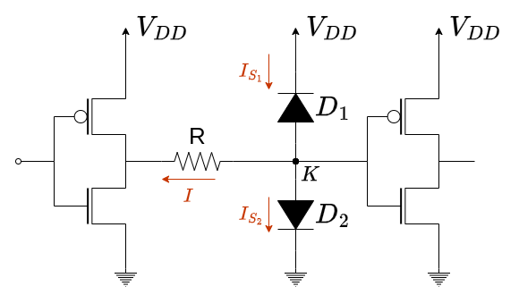

Questa corrente va a cambiare il punto di lavoro nell'`NMOS`, che _**sposta la tensione associata allo `0` logico**_.

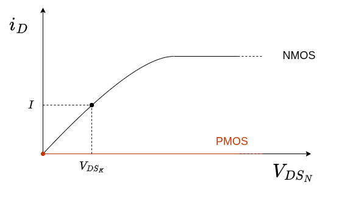

Se aumentassimo il numero di inverter pilotati, ognuno con il proprio circuito di protezione, aumenteremmo ancora di più la tensione associata allo `0` logico, provocando diversi effetti negativi sul _margine di rumore_, sul _FAN IN_, sul _FAN OUT_, ...

In realtà questo _**non è un vero problema**_ perché il circuito di protezione messo tra due porte dello stesso circuito _**è completamente inutile e privo di senso**_, dato che non si ha accesso diretto a quei punti del circuito.

Ha senso inserire un circuito di protezione **esclusivamente** sui _**contatti verso il mondo esterno**_.

## 3.4. Famiglia Logica Pass-Transistor

Il problema di creare porte logiche in tecnologia `CMOS` è che per ogni variabile logica _**dobbiamo aggiungere due transistor**_. Questo comporta che in porte più complesse, necessitiamo un elevato numero di `MOSFET` e quindi un ampia area.

Per ovviare a questo problema vediamo quindi la famiglia di porte _**Pass-Transistor Logic**_, che tratta i transistori come interruttori.

Immaginiamo di avere una una tensione $V_A$ alla quale è associata una _variabile logica_ `A`.
A questa tensione mettiamo in serie due interruttori, il primo associato alla _variabile logica_ `B` e il secondo alla _variabile logica_ `C`.

Alla tensione $V_Y$ ai capi del carico del circuito $R$, associamo la _variabile logica_ `Y`

In termini logici abbiamo che:
$$
	Y = A \cdot B \cdot C
$$

Abbiamo quindi apparentemente costruito un `AND` a 3 ingressi utilizzando solo 2 `MOSFET`, invece dei **6** che avremmo utilizzato in logica `CMOS` complementare

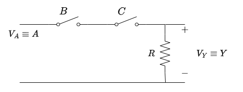

Dobbiamo però fare attenzione ad un dettaglio. Mentre in `CMOS` complementare abbiamo la certezza che l'uscita sia o a $V_{DD}$ o a _ground_, data la bassa impedenza delle `PUN` e `PDN`, non abbiamo questa certezza in questo tipo di porte.

Immaginiamo di avere due inverter in cascata in tecnologia `CMOS` complementare, collegati tra loro da un interruttore associato alla variabile logica `B`.

Quando `B = 1`, ovvero l'interruttore è chiuso, abbiamo la certezza che _**la tensione sul nodo $K$ è ben definita**_: vale $0$ o $V_{DD}$.

Quando invece `B = 0`, _**non abbiamo una tensione ben definita su $K$**_, ma il suo valore dipende da cosa è avvenuto prima dell'apertura:

- Se prima il circuito era collegato a _ground_ $(V_K = 0)$, allora si manterrà a $0$.
- Se prima il circuito era collegato a $V_{DD}$, questo valore _**non si mantiene**_. Infatti sono presenti delle correnti di perdita che scaricano i condensatori dei `MOSFET`, portando ad una _**incertezza sul valore di**_ $V_K$ _**nel tempo**_

La presenza di nodi impredicibili, comporta che a livello statico **abbiamo delle incertezze sui nostri valori**. Una prima soluzione è quella di _**aggiungere dei percorsi che definiscono i valori statici**_.

<figure class="100">
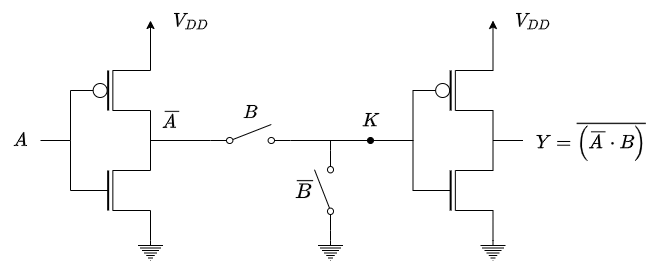
<figcaption>

Aggiungiamo un interruttore tra il nodo $K$ e _ground_ pilotato da $\overline{B}$ per avere un percorso a valore statico.
</figcaption>
</figure>

### 3.4.1. Interruttori Ideali

Dobbiamo quindi capire come riuscire a creare fisicamente degli _**Interruttori Ideali**_, come quello sulla destra.

Per fare ciò ci sono diverse possibilità:
1. [Utilizzare gli `NMOS`](#3411-interruttore-nmos)
2. [Utilizzare i `PMOS`](#3412-interruttore-pmos)
3. [Utilizzare i `CMOS`](#3413-pass-gate-cmos)

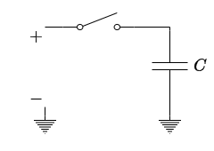

#### 3.4.1.1. Interruttore `NMOS`

Ipotizziamo di utilizzare un transistore `NMOS` integrato, ovvero un transistore nel quale il _drain_ e il _source_ sono **perfettamente intersambiabili**.

Per capire il funzionamento o meno della nostra scelta andiamo a studiare la tensione ai capi del condensatore

Iniziamo studiando la **carica del condensatore**, ovvero che all'istante $t = 0$:
$$
\begin{cases}
	V_C = 0 \\
	V_i = 0
\end{cases}
$$

Successivamente la tensione di ingresso viene commutata a $V_{DD}$. Se l'interruttore funzionasse come ci aspettiamo, dopo un certo tempo $t'$ la tensione ai capi del condensatore varrà anch'essa $V_{DD}$.

Poiché dobbiamo caricare il condensatore, in questa commutazione il _Drain_ e il _Source_ sono presi come in figura, in accordo con il passaggio di corrente.

Per far funzionare correttamente il nostro `NMOS` necessitiamo che la tensione al _Gate_ sia sufficientemente alta. Colleghiamo quindi anche $V_G = V_{DD}$.

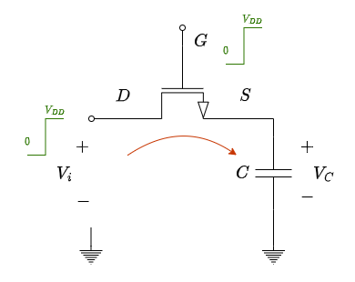

Nell'istante $t = 0$:
$$
\begin{align*}
	V_{GS} &= V_G - V_S \\
		   &= V_{DD} - V_C && \text{Il condensatore è ancora scarico}\\
		   &= V_{DD}
\end{align*}
$$

Dato che la tensione di soglia $V_T$ è **sicuramente inferiore a $V_{DD}$**, abbiamo che l'`NMOS` conduce.
Per capire in che modo è in donduzione analizziamo la $V_{DS}$:
$$
\begin{align*}
	V_{DS} &= V_D - V_S \\
		   &= V_{DD} - V_C \\
		   &= V_{DD}
\end{align*}
$$

Il transistore è quindi **saturo**, dato che $V_{DS}  = V_{DD} \ge V_{GS} - V_T = V_{DD} - V_T$, e il condensatore inizia a caricarsi, aumentando nel tempo la tensione $V_C$ e, di conseguenza, anche $V_S$.

L'aumento di $V_S$ provoca effetti sul `MOSFET` che conduce solo finché $V_{GS} \ge V_T$, ovvero finché $V_C \le V_{DD} - V_T$.

Quello che succede è che il condensatore _**può essere caricato solo fino a $V_{DD} - V_T$**_.

La condizione di saturazione è invece indipendente dalla tensione ai capi del condensatore, infatti:
$$
\begin{align*}
	V_{DS} &\ge V_{GS} - V_T \\
	V_D - V_S &\ge V_G - V_S - V_T \\
	V_D &\ge V_G - V_T \\
	V_{DD} &\ge V_{DD} - V_T \\
	0 &\ge - V_T
\end{align*}
$$

Ciò significa che l'`NMOS` è _**sempre saturo**_. Questa cosa ci permette di studiare cosa accade durante il transitorio di carica senza dover fare attenzione a transizioni tra le diverse ipotesi di lavoro.

Nel grafico sulla destra possiamo vedere l'andamento della corrente durante il transitorio.

Infatti nella saturazione in questo caso:
$$
\begin{cases}
	i_D = k \cdot (V_{GS} - V_T)^2 \\
	V_{GS} = V_{DS}
\end{cases}
$$

Che ci permette di dire:
$$
\Large
\boxed{
	i_D = K \cdot (V_{DS} - V_T)^2
}
$$

Questa relazione ci dice proprio che la corrente, al passare del tempo, si muove sulla **parabola rossa centrata in** $(V_T, 0)$

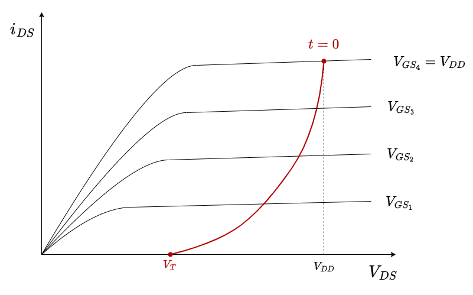

Per tempi $t \to \infty$ (o comunque sufficientemente grandi):
$$
\begin{cases}
	V_{DS} = V_T \\
	V_C = V_{DD} - V_T
\end{cases}
$$

Utilizzare un `NMOS` per trasmettere un livello logico alto comporta una **perdita**.

Studiamo adesso la **scarica del condensatore**, ovvero che a $t = 0$:
$$
\begin{cases}
	V_C = 0 \\
	V_i = 0
\end{cases}
$$

Come prima, il nostro _Gate_ è ancora collegato a $V_{DD}$.

In questo caso la corrente scorrerà nel verso opposto, quindi il _Drain_ e il _Source_ si **scambiano di ruolo**. Questo è possibile solo grazie al fatto che il `MOSFET` è **_integrato_**.

Studiamo se il `MOSFET` conduce:
$$
\begin{align*}
	V_{GS} = V_G - V_S \\
	&= V_{DD} - 0 \\
	&= V_{DD} > V_T
\end{align*}
$$

Il `MOSFET` quindi non solo è _**sempre in conduzione**_, ma lavora sempre seguendo **la stessa caratteristica** $V_{GS} = V_{DD}$.

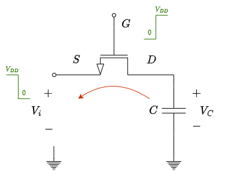

Analogamente a prima studiamo in che ipotesi di lavoro ci troviamo:
$$
\begin{CD}
	{V_{DS} = V_D - V_S = V_{DD}} \\
	@VVV \\
	\begin{aligned}
		V_{DS} &\ge V_{GS} - V_T \\
		V_{DD} &\ge V_{DD} - V_T
	\end{aligned}
\end{CD}
$$

Anche in questo caso abbiamo che l'`NMOS` lavora **sempre in saturazione**.

La scarica quindi procederà a diminuire $V_S$, che farà diminuire $V_{DS}$ finché il transistore continua a condurre corrente. Questo avviene fino a quando $i_{DS} = 0$, che accade quando $V_{DS} = 0$ ovvero $V_S = 0$.

Ciò significa che il nostro condensatore **_si scarica completamente_**.

L'`NMOS` è quindi un **_ottimo interruttore nella trasmissione di livelli bassi_**.

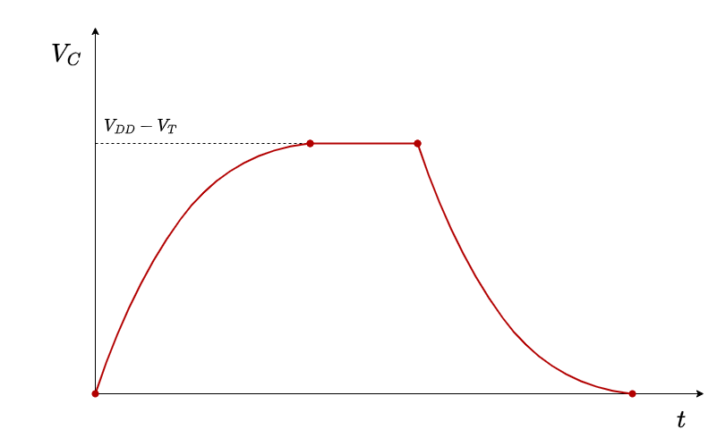

#### 3.4.1.2. Interruttore PMOS

Imagginiamo stavolta di utilizzare un `PMOS` integrato come interruttore.

Ancora una volta vediamo i due processi di carica e scarica, stavolta recuperando i ragionamenti già fatti.

Carica

Per quanto riguarda la carica:

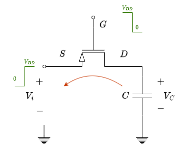

Stavolta colleghiamo a _ground_ il _Gate_.

Notiamo subito che la $V_{GS} = V_G - V_S = -V_{DD}$

È quindi sempre verificata $V_{GS} = -V_{DD} < V_T$, quindi il nostro `PMOS` è sempre in saturazione.

Inoltre, essendo $V_{GS}$ costante, abbiamo che la corrente segue una sola caratteristica.

Al passare del tempo il condensatore si carica, aumentando $V_C$ e diminuendo in modulo la $V_{DS}$, spostando il punto di lavoro **lungo la caratteristica**, fino ad arrivare nell'istante finale quando $i_{DS} = 0$, ovvero $V_{DS} = 0$.

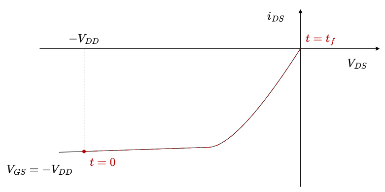

Ciò comporta che $V_D = V_C = V_{DD}$.

L'interruttore `PMOS` è quindi un **_ottimo interruttore nella trasmissione di livelli alti_**.

Scarica

Per quanto riguarda la scarica:

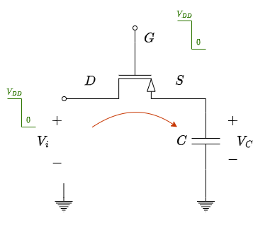

Colleghiamo ancora il _Gate_ a _ground_.

Notiamo stavolta che la $V_{GS} = V_G - V_S = 0$

Stavolta la tensione $V_{GS} = V_G - V_S = -V_C$ non è più costante, ma dipende dalla tensione ai capi del condensatore.

All'inizio $V_C = V_{DD}$ quindi $V_{GS} = -V_C = -V_{DD} \le V_T$, ovvero il nostro transistore **conduce**.

L'ipotesi di lavoro di saturazione è ancora una volta sempre rispettata dato che $V_{DS} = V_D - V_S = -V_C \le V_{GS} - V_T$, condizione vera avendo $V_T < 0$

Al passare del tempo il condensatore si scarica, diminuendo $V_C$ arrivando quindi alla condizione in cui $V_C = -V_T$, che comporta che la corrente sul transistore si annulla prima di aver scaricato completamente il condensatore.

Ciò comporta che per $t \to \infty$:
$$
\begin{cases}
	V_{DS} = V_T < 0 \\
	V_C = -V_T
\end{cases}
$$

Utilizzare un `PMOS` per trasmettere un livello logico basso comporta quindi una **perdita**.

La tensione ai capi del condensatore quindi ha il seguente andamento nel tempo quando la commutiamo:

<figure class="50">
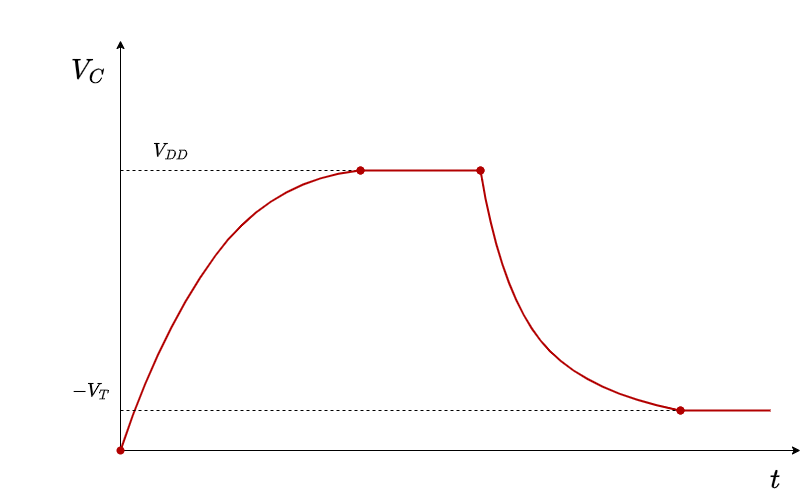
<figcaption>

Immaginiamo che la porta sia appena stata attivata per la trima volta.
Dopo una doppia commutazione, la tensione di partenza sarà $-V_T$.
</figcaption>
</figure>

#### 3.4.1.3. Pass-Gate `CMOS`

Questa tecnica mette in parallelo un transisore `NMOS` con un `PMOS` comandato dalla stessa variabile logica negata.

TODO: foto

I due transistori opereranno parallelamente durante i periodi intermedi, e uno solo dei due procedera a scaricare/caricare la tensione che l'altro perdeva

### 3.4.2. Porte Logiche

#### 3.4.2.1. Multiplexer 2x1

Un multiplexer 2x1 è rappresentato dal seguente schema:

TODO: foto

Questo circuito ha come uscita:
$$
Y = AB + B\overline{C}
$$

In tecnologia `CMOS` complementare abbiamo 4 variabili logiche 3 delle quali necessitano un inverter, per un totale di **14 transistori**.

In tecnologia _Pass-Gate_ `CMOS` invece lo schema è quello sulla destra, infatti ci è sufficiente inserire un inverter per $\overline{C}$ e sostituire agli interruttori due pass-gate, per un totale di soli **6 transistori**

TODO: foto

#### 3.4.2.2. Porta `XOR` a 2 Ingressi

Avevamo [già visto in precedenza](#3335-porta-xor-a-2-ingressi) come sintetizzare uno `XOR` a due ingressi in tecnologia `CMOS` complementare.

Vediamo adesso la logica ad interruttori.

La relazione logica è sempre la solita:
$$
Y = A\overline{B} + \overline{A}B
$$

Possiamo quindi immaginare di avere la variabile $A$ che è in serie con un interruttore pilotato da $\overline{B}$, in parallelo alla variabile $\overline{A}$ in serie all'interruttore pilotato da $B$, come nella figura sotto.

TODO: foto

Possiamo quindi sostituire agli interruttori i circuiti di _pass-gate_ `CMOS` e aggiungere i due _inverter_ per generare $\overline{A}$ e $\overline{B}$, per un totale di **8 transistori**, a fronte dei **12** utilizzati nella tecnologia `CMOS` complementare.

TODO: foto

