# 1. Indice

- [1. Indice](#1-indice)
- [2. Convertitori](#2-convertitori)
	- [2.1. Convertitore Digitale-Analogico - `DAC`](#21-convertitore-digitale-analogico---dac)
		- [2.1.1. DAC con Resistori a Pesi Binari](#211-dac-con-resistori-a-pesi-binari)
		- [2.1.2. DAC con Rete a Scala R-2R](#212-dac-con-rete-a-scala-r-2r)
	- [2.2. Convertitore Analogico-Digitale - `ADC`](#22-convertitore-analogico-digitale---adc)
		- [2.2.1. Convertitore Flash](#221-convertitore-flash)
		- [2.2.2. Convertitore a Singola Rampa](#222-convertitore-a-singola-rampa)
		- [2.2.3. Convertitore a Doppia Rampa](#223-convertitore-a-doppia-rampa)
		- [2.2.4. Convertitore ad Approssimazioni Successive - `SAR`](#224-convertitore-ad-approssimazioni-successive---sar)

# 2. Convertitori

Il **DAC** (_Digitale_ $\to$ _Analogico_) trasforma segnali digitali (_bit_) in **tensioni/correnti** analogiche.

Il **ADC** (_Analogico_ $\to$ _Digitale_) converte invece segnali del mondo reale in segnali digitali per l'elaborazione

## 2.1. Convertitore Digitale-Analogico - `DAC`

Il **Convertitore Digitale-Analogico** elabora un segnale di _tensione_ in uscita sulla base del segnale digitale fornito in ingresso bit a bit, proporzionale ad una tensione di riferimento $V_{REF}$.

Il coefficiente di proporzionalità vale:
$$
F = \frac{D}{2^N} = \frac{1}{2^N} \cdot \sum_{i=0}^{N-1}{d_i2^i}
$$

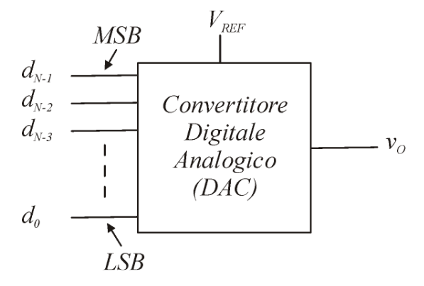

Definiamo due grandezze. La prima è la **minima variazione della tensione di uscita** quando cambiano l'ingresso.

In questo convertitore vale:
$$
	V_{LSB} = \frac{V_{REF}}{2^N}
$$

Il **valore massimo della tensione di uscita**, detta anche _tensione di fondo scala_, varrà invece:
$$
	V_{FS} = \frac{2^N - 1}{2^N}V_{REF} = V_{REF} - V_{LSB}
$$

La caratteristica di ingresso/uscita è costituita da **_un insieme di punti_**:

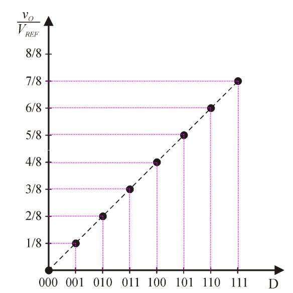

Esistono diversi modi per costruire un convertitore _D/A_, noi ne vediamo due:
- **Resistori a Pesi Binari**
- **Rete a Scala R-2R**

### 2.1.1. DAC con Resistori a Pesi Binari

Il `DAC` con **Resistori a Pesi Binari** è composto da due parti principali:
- **Deviatori**: sono una coppia di switch comandati da segnali complementati. Sono rappresentati in dettaglio in basso a sinistra. L'$i$-esimo deviatore è collegato alla tensione $V_{REF}$ da una resistenza di valore $2^{N-i-1}R$.
- **Amplificatore di transimpedenza**: è un _amplificatore operazionale invertente_, che amplifica la tensione in ingresso mantenendo però costante la corrente.

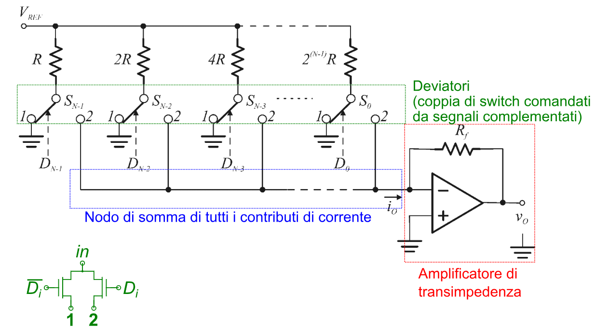

La corrente in ingresso all'amplificatore vale:
$$
	i_0 = V_{REF} \cdot R_{eq}
$$

Dove $R_{eq}$ rappresenta la serie di tutte le resistenze collegate a deviatori settati ad `1`, che collegano la tensione $V_{REF}$ al nodo con **tensione virtuale nulla**.

In generale:
$$
\begin{align*}
	i_0 &= \frac{V_{REF}}{R}d_{N-1} + \frac{V_{REF}}{2R}d_{N-2} + \dots + \frac{V_{REF}}{2^{N-1}R}d_0 \\
		&= \frac{V_{REF}}{2^{N-1}R}(d_{N-1}2^{N-1} + d_{N-2}2^{N-2} + \dots + d_0) \\
		&= \frac{V_{REF}}{2^{N-1}R}D
\end{align*}
$$

La tensione di uscita sarà quindi:
$$
\large
\boxed{
	v_0 = -i_0R_f = -\frac{R_f}{2^{N-1}R}V_{REF}D
}
$$

Se utilizzassimo dei resistori _precisi all'_$1\%$, otterremo che con $N$ bit, supponendo di avere $R_{min} = 1$ $k\Omega$, e quindi $\Delta R = 10$ $k\Omega$:
$$
\begin{cases}
	N = 10 & R_{max} = 1024\;k\Omega & \Delta R = 10.24\;k\Omega \\
	N = 12 & R_{max} = 4096\;k\Omega & \Delta R = 40.96\;k\Omega
\end{cases}
$$

Ciò implica che all'aumentare dei bit, il contributo di corrente delle resistenze più alte può condizionare aleatoriamente in modo non trascurabile la nostra conversione.

Questo tipo di convertitore quindi non scala bene all'aumentare dei bit sui quali codifichiamo le parole.

### 2.1.2. DAC con Rete a Scala R-2R

Questo circuito è molto simile a quello precedente, ma invece di collegare l'$i$-esimo deviatore con una resistenza $2^{N-i-1}R$, sfrutta una **scala R-2R**.

In particolare tutti i deviatori sono collegati ad una resistenza $2R$, e queste sono collegate:
- Il `LSB` con ground è connessa da una resistenza $2R$
- Tra di loro messe in comunicazione con resistenze $R$
- Il `MSB` è cortocircuitato con l'alimentazione

Il circuito a scala così impostato fa sì che all'ingresso di ogni sezione si ha una resistenza vista di esattamente:
$$
	R_{V_i} = \Biggl(\frac{1}{2R} + \frac{1}{R + R_{V_{i-1}}}\Biggr)^{-1} \\
$$

Questo vale fino alla prima resistenza vista che vale:
$$
	R_{V_1} = \Biggl(\frac{1}{2R} + \frac{1}{2R}\Biggr)^{-1} = R
$$

Di conseguenza possiamo proseguire ricorsivamente per capire che all'ingresso di ogni sezione la **resistenza vista** vale $R_V = R$, che ha una corrente di ingresso pari a:
$$
I_R = \frac{V_{REF}}{R_{V_i}} = \frac{V_{REF}}{R}
$$

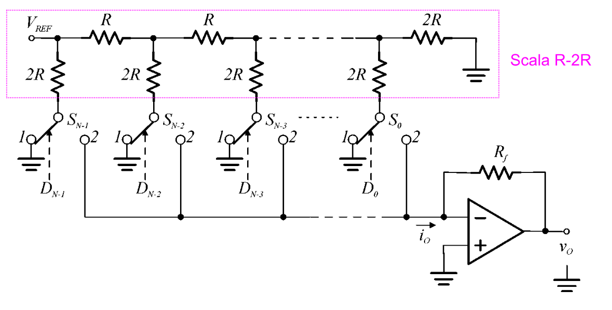

Ad ogni sezione quindi la corrente si divide in **due parti nominalmente uguali**.implica che il contributo di corrente di ogni deviatore è esattamente:
$$
	I_{i} = \frac{I_R}{2^N - i}
$$

Possiamo quindi esprimere la corrente in ingresso:
$$
\begin{align*}
	i_0 &= \frac{V_{REF}}{2R}d_{N-1} + \frac{V_{REF}}{2R}\frac{1}{2}d_{N-2} + \cdots + \frac{V_{REF}}{2R}\frac{1}{2^{N-1}}d_0 \\
		&= \frac{V_{REF}}{2^{N}R}(d_{N-1}2^{N-1} + d_{N-2}2^{N-2}+\cdots + d_0) \\
		&= \frac{V_{REF}}{2^N R}D
\end{align*}
$$

La tensione di uscita sarà quindi:
$$
\Large
\boxed{
	v_0 = -i_0R_f = -\frac{R_f}{2^{N}R}V_{REF}D
}
$$

Questo tipo di convertitori, oltre a richiedere solo resistori $R$ e $2R$, permette una precisione elevata anche per $N \ge 16$, con costi di produzioni bassi.

## 2.2. Convertitore Analogico-Digitale - `ADC`

Il **Convertitore Analogico-Digitale** elabora un segnale di _tensione_ in entrata producendo in uscita un segnale digitale bit a bit.

Per fare ciò la tensione di ingresso è mappata in $2^N$ intervalli, idealmente equispaziati.

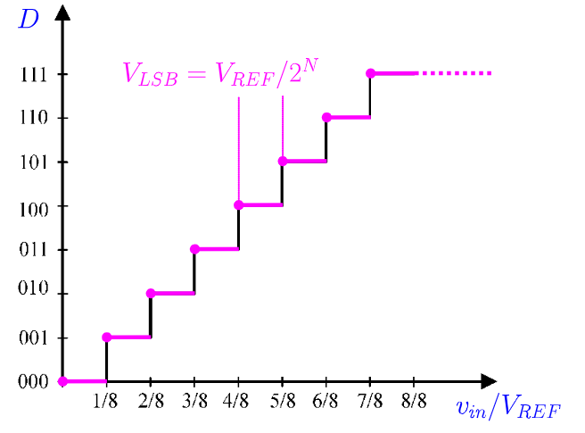

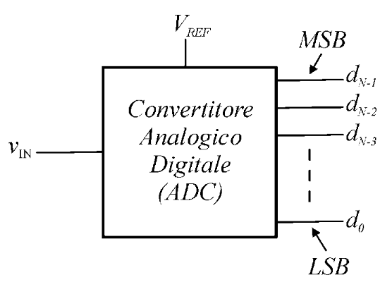

Questi convertitori sono soggetti a quello che si chiama **errore di quantizzazione**.

Se manteniamo infatti la caratteristica vista prima, convertiamo una sequenza di bit solamente se la tensione vale appartiene ad un _intorno destro_, grande al più $V_{LSB}$, di quella conversione, producendo errori:
$$
Q_e = V_{in} - D \frac{V_{REF}}{2^N} = v_{in} - DV_{LSB}
$$

Invece noi vorremmo tradurre degli _intorni centrati_ sulla tensione di conversione.

Per fare ciò dobbiamo **traslare a sinistra di** $\frac{1}{2}V_{LSB}$ la nostra caratteristica.

A questo punto, per discriminare se una tensione di ingresso si trova all'interno di un dato intervallo, possiamo usare di **comparatori di tensione**, per possiamo immaginare come degli _amplificatori operazionali_ utilizzati ad anello aperto per i quali il minimo sbilanciamento del segnale differenziale in ingresso fa saturare la tensione in alto o in basso.

Esistono vari tipi di `ADC`, noi ne vediamo tre:
- **Convertitore Flash**
- **Convertitore a Contatore**
- **Convertitore ad Approssimaizoni Successive**

### 2.2.1. Convertitore Flash

Il _Convertitore AD Flash_ si basa sulla **comparazione diretta** dell'ingresso con un insieme di tensioni di soglia prefissate.

Per fare ciò, un metodo pratico è l'impiego di una **stringa di resistenze**.

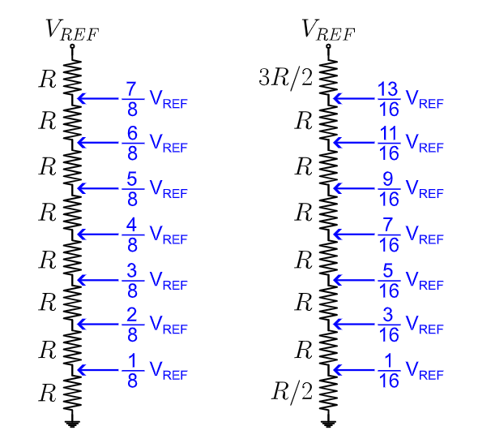

In termini di _hardware_, se vogliamo convertire su $N$ bit necessitiamo di:
- $2^N$ Resistenze
- $(2^N - 1)$ Comparatori

<figure class="40">
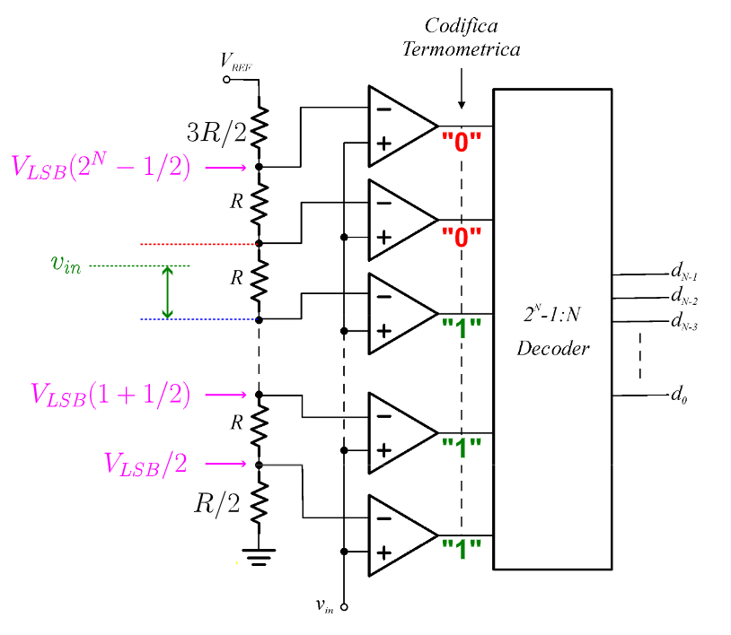
<figcaption>

La resistenza $\frac{R}{2}$ è necessaria per effettuare la **traslazione** della caratteristica di $\frac{1}{2}V_{LSB}$
</figcaption>
</figure>

Per riuscire a risparmiare _hardware_ possiamo invece pensare di **convertire il segnale in due passi**:
1. Determiniamo prima la porzione `MSB` di `D`
2. Sottraendola al segnale originario, dopo una dovuta amplificazione di segnale, procediamo poi a determinare la porzione `LSB` di `D`.

Se determiniamo che la lunghezza di ciascuna porzione dia $\frac{N}{2}$ bit, per ciascuno possiamo utilizzare un `ADC` a $\frac{N}{2}$ bit, che ci permette di avere un costo di $\approx 2^{\frac{N}{2} + 1}$ componenti.

Un esempio di _Folded Flash_ a 8 bit è il seguente:

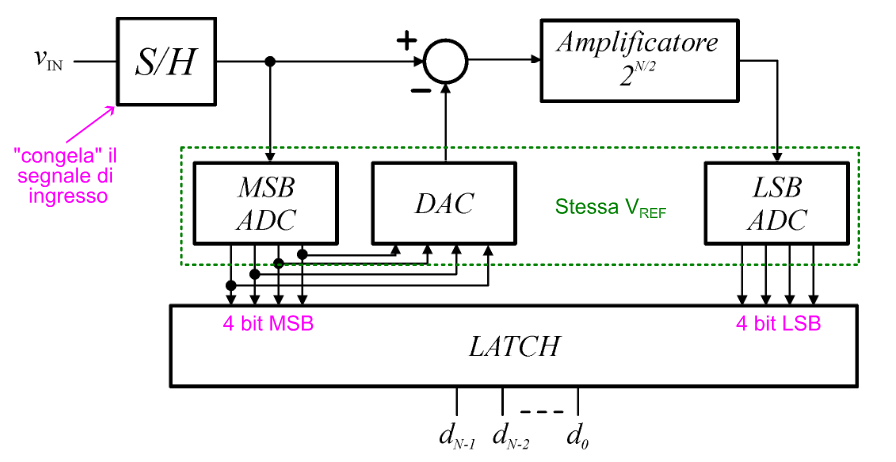

### 2.2.2. Convertitore a Singola Rampa

Il **Convertitore A Singola Rampa** effettua conversione utilizzando **_un solo comparatore_**.

Per riuscire a fare ciò però necessità di un **tempo di buffering**. A differenza del _convertitore flash_, questo convertitore necessita di:
- Un **clock** (segnale di temporizzazione) stabile
- Un **contatore digitale**

Sulla destra possiamo vedere lo schema circuitale del convertitore.

La tensione in ingresso viene salvata temporaneamente in un _latch_ (identificato dal blocco _Sample-and-Hold_) e mandata in ingresso ad un amplificatore operazionale come riferimento del **comparatore**.

La tensione da comparare invece viene recuperata da un _integratore di Miller_, composto da un amplificatore operazionale mandato in retroazione **_con un condensatore_**.

L'uscita del comparatore viene mandata in input all'interno di una logica di controllo che lo propaga:
- _Al contatore_: ad ogni clock ha aumentato il proprio valore di `1`. All'arrivo del segnale dalla logica di controllo reseta il contatore
- _Al latch_: campiona l'uscita del contatore prima che questo venga resettato. Il valore che contiene **rappresenta la codifica della tensione**

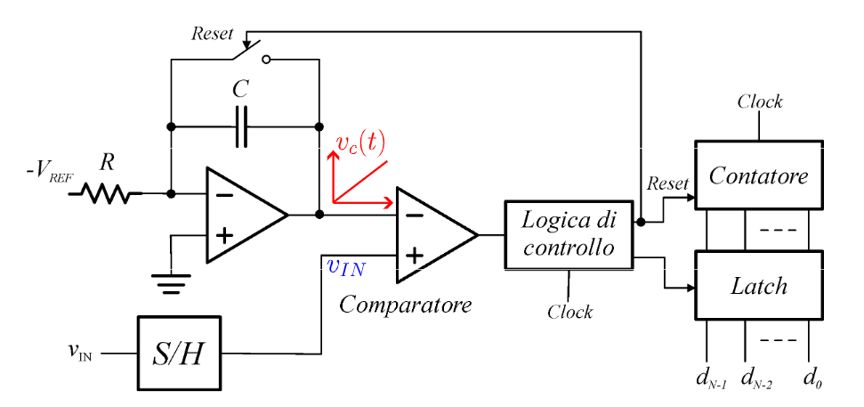

La tensione ai capi del condensatore vale nel tempo:
$$
	V_c = -\frac{1}{RC} \int_{0}^{t_c}{-V_{REF}\;d\tau} = \frac{V_{REF}}{RC}t_c
$$

L'istante $t_c$ è l'istante nel quale la tensione ai capi del condensatore è **uguale alla tensione di ingresso**:
$$
	t_c = \frac{RC}{V_{REF}} \cdot V_{IN}
$$

Anche per il contatore, che si aggiorna ogni $T_{ck}$ secondi, sono passati $t_c$ secondi:
$$
	t_c = D \cdot T_{ck}
$$

La cifra sulla quale siamo arrivati è:
$$
	D = \frac{RC}{V_{REF}} \cdot \frac{1}{T_{ck}} \cdot V_{IN}
$$

Questo circuito però soffre del problema dell'**_incertezza sul valore reale di RC_**.

Se infatti dovessimo cambiare il condensatore o la resistenza, anche con altri componenti nominalmente uguali, l'imprecisione dei componenti rispetto ai loro valori nominali, può provocare _**diverse conversioni della stessa tensione**_.

### 2.2.3. Convertitore a Doppia Rampa

Nel convertitore a dpoppia rampa vengono fatte **due integrazioni**:
1. La prima parte da $0$ e integra la tensione di ingresso $V_{IN}$ in un periodo di tempo pari al _fondoscala del contatore_ $(2^N$ cicli di clock $)$
2. Si integra la tensione costante $V_{REF}$ di segno opposto, in un intervallo di tempo necessario per far rotarnare a $0$ l'uscita dell'integratore

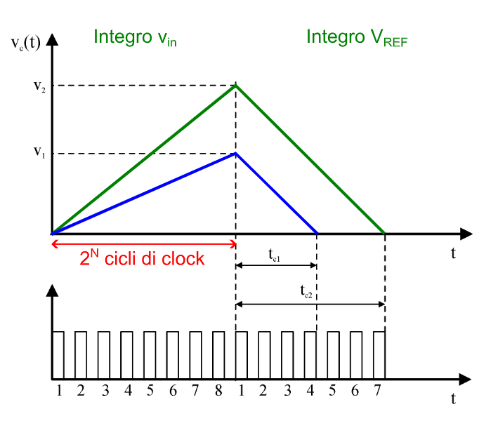

Il risultato della conversione sarà il conteggio _**eseguito nella seconda fase**_.

La prima fase opera esattamente come il convertitore a singola rampa integrando però adesso per un tempo di $2^N$ cicli di clock:
$$
	V_c = \frac{\vert V_{IN} \vert }{RC}2^N T_{ck}
$$

La seconda fase invece scatta quando il contatore setta il comando di _overflow_, che agisce sulla porta tri-state a monte del circuito che campio l'ingresso dalla $V_{IN}$ alla $V_{REF}$.

Questa seconda fase durerà finché la tensione ai capi del condensatore non sarà nulla, ovvero:
$$
\begin{align*}
	\frac{\vert V_{IN} \vert }{RC}2^N T_{ck} - \frac{1}{RC}V_{REF}DT_{ck} &= 0 \\
	\frac{1}{RC}V_{REF}DT_{ck} &= \frac{\vert V_{IN} \vert }{RC}2^N T_{ck}\\
	D &= \frac{\vert V_{IN} \vert}{V_{REF}} 2^N\\
\end{align*}
$$

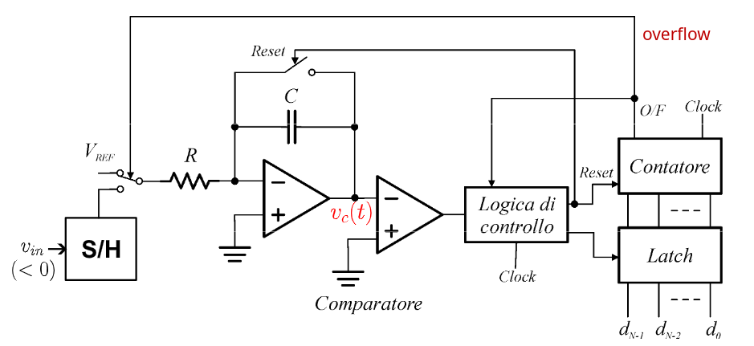

Questo circuito quindi _**non dipende**_ dalla resistenza e dal condensatore che utilizziamo.

Il circuito però **è molto lento**, infatti se $\vert V_{IN} \vert = V_{REF}$ sovremo attendere ben $2^N$ cicli di _clock_ prima di poter ottenere la conversione.

### 2.2.4. Convertitore ad Approssimazioni Successive - `SAR`

Il _**Convertitore ad Approssimazioni Successive**_, detto anche `SAR` (_Successive Approximation Register_), è un convertitore che converte una tensione in un valore digitale **bit per bit**, procedendo tramite confronti binari.

Il circuito, proposto sulla destra, è composto da tre componenti:
1. **Shift Register $N$ bit**
2. **SAR**
3. **Convertitore Digitale-Analogico** `DAC`

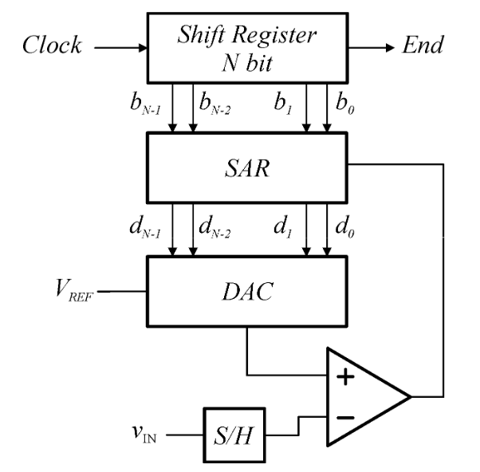

Il funzionamento procede ad _approssimazioni successive_:
1. Al clock viene inserito il valore $1$ su $b_{N-1}$
2. La `SAR`, che inizia con $D = 0$, somma il valore ricevuto dallo shift register, impostando $D = 10...00$
3. Questo valore viene propagato al `DAC` che lo converte in una tensione $V_{DAC}$
4. La tensione $V_{DAC}$ viene **confrontata con la tensione di ingresso** $V_{IN}$.
   1. Se $V_{IN} \ge V_{DAC}$ allora abbiamo certezza che $d_{N-1} = 1$, in quanto la tensione rappresenta un numero maggiore o uguale di $2^{N - 1}$
   2. Se $V_{IN} < V_{DAV}$ allora abbiamo certezza che $d_{N-1} = 0$, in quanto la tensione rappresenta un numero minore di $2^{N - 1}$
5. Lo _shift-register_ sposta il valore da `100...0` a `010...0`
6. La `SAR` somma il contenuto del suo registro $D$ con il valore di $B$ ottenendo `110...0` o `100...0` a seconda del primo ciclo
7. Procede come prima

Questa procedura viene ripetuta $N$ volte, ovvero dura $N$ cicli di clock.

Si ha quindi un ottimizzazione esponenziale rispetto al convertitore a doppia rampa, dovuto proprio al fatto che la ricerca adesso è fatta con ricerca binaria, che ha un tempo logaritmico, a differenza di prima che era lineare.

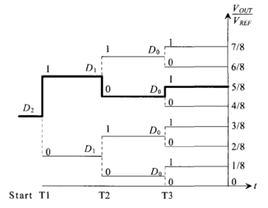