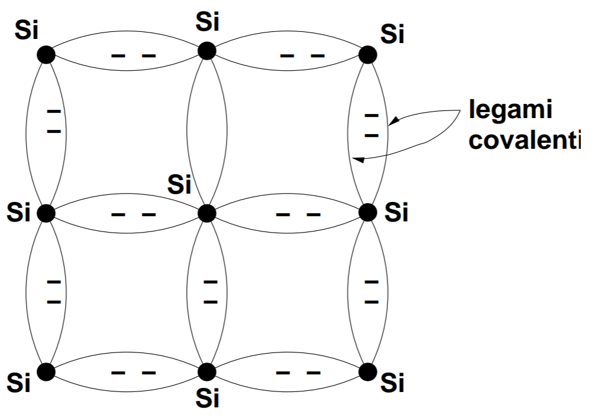
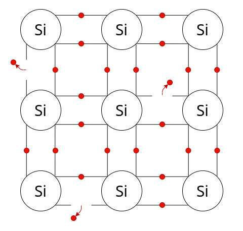
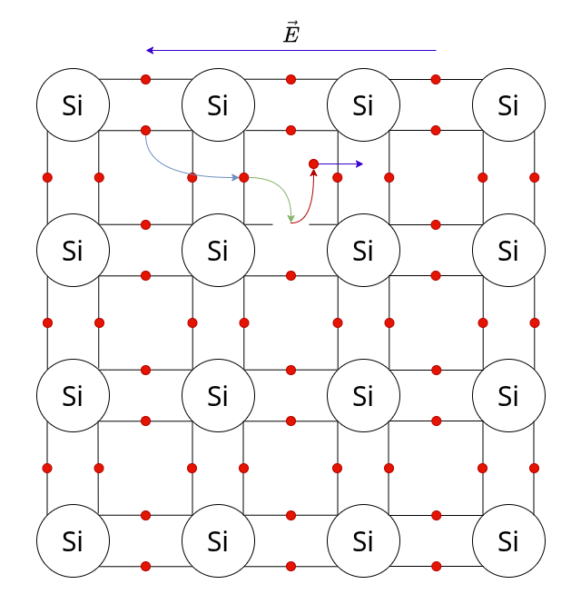
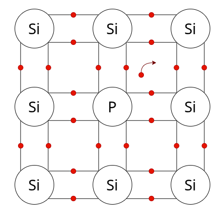
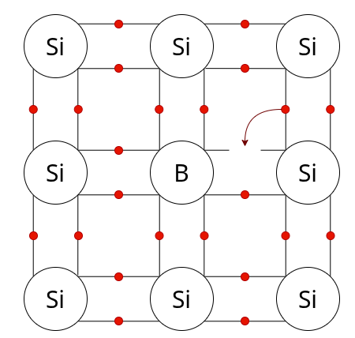

# 1. Indice

- [1. Indice](#1-indice)
- [2. Tipi di Materiale](#2-tipi-di-materiale)
- [3. Corrente di Drift e Modello di Drude](#3-corrente-di-drift-e-modello-di-drude)
	- [3.1. Conduttori](#31-conduttori)
	- [3.2. Semiconduttori](#32-semiconduttori)
	- [3.3. Drogaggio dei Semiconduttori](#33-drogaggio-dei-semiconduttori)
		- [3.3.1. Drogaggio del Gruppo V](#331-drogaggio-del-gruppo-v)
		- [3.3.2. Drogaggio del gruppo III](#332-drogaggio-del-gruppo-iii)
		- [3.3.3. Drogaggi misti](#333-drogaggi-misti)
	- [3.4. Resistività e Temperatura](#34-resistività-e-temperatura)
- [4. Diffusione](#4-diffusione)
- [5. Corrente Totale](#5-corrente-totale)

# 2. Tipi di Materiale

Immaginiamo di avere un conduttore parallelepipedo lungo $L$ e di sezione $S$.

La seconda legge di _Ohm_ ci dice che la **Resistenza** del materiale è:
$$
	R = \frac{L}{S}\cdot \rho = \frac{L}{S} \cdot \frac{1}{\sigma}  \;[\Omega]
$$

Dove $\rho$ è la **_Resistività_** e $\sigma$ e la **_Conducibilità_**.

La seconda legge di Ohm ignora il ruolo nel singolo elettrone, ma si concentra sul trasporto di corrente. Queste riflessioni sono comprese nel parametro $\rho$.

In particolare è proprio a seconda de lvariore di $\rho$ di un materiale che si classifica come:
- **_Conduttore_**: $\rho < 10^-2 \;[\Omega \cdot cm]$
- **_Isolante_**: $\rho > 10^5 \;[\Omega \cdot cm]$
- **_Semiconduttori_**: $10^-2 < \rho < 10^5 \;[\Omega \cdot cm]$

In particolare noi andremo a trattare i _semiconduttori_, in quanto vedremo che abbiamo la possibilità di controllare la resistività a nostro piacimento.

# 3. Corrente di Drift e Modello di Drude

## 3.1. Conduttori

Analizziamo cosa accade all'interno del nostro parallelepipedo.

In assenza di campo elettrico, non abbiamo corrente. Tuttavia questo non significa che gli elettroni al suo interno siano fermi, anzi, questi sono in movimento.

Innanzitutto definiamo la corrente come:
$$
	I = \frac{\Delta Q}{\Delta T} \;[A]
$$

Se gli elettroni si spostano, allora perché non abbiamo una corrente?
Questo avviene perché gli elettroni si muovono casualmente per via dell'_**agitazione termica**_, perciò statisticamente avremo tanti elettroni che si muovono in un verso tanti quanti sono quelli che si muovono nell'altro.

Applicando invece un campo elettrico, quello che facciamo è **sovrapporre** all'agitazione termica una forza ordinata.
Attenzione, questa forza è **_sovrapposta_**, ma non va a **_sovrascrivere_** l'agitazione termica.

Infatti, anche con il campo elettrico **continuiamo ad avere degli urti**, ma otterremo un movimento prevalente, parallelo al campo elettrico ma di direzione opposta.

Il matematico e fisico Drude, propose di studiare il comportamento degli elettroni nei metalli _come se fossero dei gas_.
Facendo diverse ipotesi semplificative, come ad esempio:
- Gli elettroni non interagiscono tra loro
- Gli urti tra elettroni e protono sono perfettamente anaelastici
- ...

Portarono alla seguente conclusione:
> La velocità elettrica di un elettrone cresce linearmente finché questo non partecipa ad un urto.
> L'urto **azzera la velocità**, che successivamente procederà a crescere nuovamente.

Considerando la _velocità media di tutti gli elettroni_, ignorando gli urti dei singoli elettroni ma considerandoli come un flusso, otteniamo la seguente relazione:
$$
	\vec{v}_{MEDIA} = \vec{v}_{DRIFT} = -\mu_n \cdot \vec{E}
$$

Questa relazione **_prende già in considerazione il fatto che gli elettroni si muovono in verso opposto al campo elettrico_**.

La costante $\mu_n$ è detta **_Mobilità dell'elettrone_** $[m^2 \cdot V^{-1} \cdot s^{-1}]$, e rappresenta la facilità con la quale un elettrone è in grado di muoversi nel materiale.

Immaginando di avere $N$ elettroni all'interno del parallelepipedo, analizziamo cosa avviene nella superficie esterna.

Per calcolare la corrente dobbiamo misurare quante carica passano in un determinato intervallo di tempo.

Scelgiamo come intervallo $\Delta T = \frac{L}{v_{DRIFT}} \;[s]$, ovvero l'intervallo epr il quale **_ogni elettrone_**, anche quelli dalla parte opposta del conduttore, sono in grado di arrivare alla superficie.

Ciò ci permette di calcolare:
$$
	I = \frac{\Delta Q}{\Delta T} = \frac{N \cdot q}{\Delta T} = \frac{N \cdot q}{L} \cdot v_{DRIFT}\;[A]
$$

Dove $n$ rappresenta la **_concentrazione di elettroni per unità di volume_** $[cm^{-3}]$.

Per condurre uno studio indipendente dalla sezione, andiamo a calcolare non tanto la corrente, ma la **_Densità di Corrente_** $J \; [A\cdot {cm}^{-2}]$
$$
	J = \frac{N \cdot q}{L\cdot S} \cdot v_{DRIFT} = \frac{N}{V}\cdot q \cdot v_{DRIFT} = n \cdot q \cdot v_{DRIFT}\;[A \cdot {cm}^{-2}]
$$

Tornando in forma vettoriale otteniamo la **_Legge Microscopica di Ohm_**
$$
	\boxed{\vec{J} = n \cdot q \cdot \mu_n \cdot \vec{E}\;[A\cdot cm^{-2}] = \sigma \cdot \vec{E}}
$$

Abbiamo quindi ottenuto una formula chiusa per calcolare la **_conduttività_** di un materiale:
$$
\boxed{\sigma = m \cdot (-q) \cdot (-\mu_n) = n \cdot q \cdot \mu_n}
$$

Possiamo quindi dimostrare qual'è la resistività media dei metalli.
Infatti la concentrazione di elettroni per unità di volume media è $n = 10^{21}\;[cm^{-3}]$ e il valore di mobilità media è di $\mu_n = 500 \;[cm^2\cdot V^{-1} \cdot s^{-1}]$:
$$
\begin{align*}
	\sigma &= n\cdot q\cdot \mu_n = 10^{21} \cdot 1,6 \cdot 10^{-19} \cdot 500 = 8\cdot 10^4 \;[\Omega \cdot cm]^{-1} \\
	\rho &= \frac{1}{\sigma} = \frac{1}{8} \cdot 10^{-4} \simeq 10^{-5} \;[\Omega \cdot cm]
\end{align*}
$$

## 3.2. Semiconduttori

Quando andiamo a studiare i semiconduttori dobbiamo tenere a mente che non abbiamo più legami metallici, ma **legami covalenti**.

Quando il campo elettrico è nullo gli effetti sul materiale sono gli stessi di prima.

Se invece appliccassimo un campo, a differenza dei metalli, **non ci sono elettroni liberi**, perciò non avremo elettroni che generano corrente.
In realtà questo comportamento è vero solamente quando siamo a una temperatura $T = 0 K$.

Se invece la temperatura fosse diversa da $0K$, alcuni legami covalenti sono proni a rompersi qualora l'energia termica fosse maggiore di quella di legame, producendo gli _elettroni liberi_.
Questo effetto è noto come **_Generazione Termica_**.

In un _reticolo cristallino di Silicio perfetto_, detto anche **_Silicio Intrinseco_**, è quindi possibile analizzare il comportamento degli elettroni liberi, stimandone il numero $n_i$.

In particolare, il valore di concentrazione di elettroni liberi per unità di volume è data dalla seguente formula:
$$
	n_i = B \cdot T^{\frac{3}{2}} \cdot e^{-\frac{E_G}{2K_BT}}
$$

Dove $E_G$ è l'energia di legame, e $K_B$ è la costante di _Boltzman_. Questa formula, che tiene conto sia della **Generazione** che della **Ricombinazione Termica**, e ci dice che $n_i$ **_aumenta esponenzialmente con la temperatura_**.

A temperatura ambiente $(T = 300K)$ otteniamo $n_i \approx 10^{10}\;[cm^{-3}]$.
Questo valore non è altissimo, infatti il numero totale di legami per unità di volume nel silicio è:
$$
	\frac{\text{Legami}}{\text{Volume}} = \frac{4\cdot\text{Atomi Si}}{\text{Volume}} \approx 10^{23} \;[cm^{-3}]
$$

Ciò significa che si rompe un legame ogni $10^{13}$.

Oltre agli elettroni che si liberano si verifica un altro fenomeno.
Infatti, quando un elettrone si libera, lascia dietro di se un "buco", detto **lacuna** o **vacanza**.
Gli elettroni nei legami adiacenti, sotto l'effetto del campo elettrico, possono spostarsi nella _lacuna_, generandone un'altra, e così a cascata.

La rottura di un legame covalente quindi ha due effetti:
- **Elettrone libero**
- **Lacuna**

Per studiare il "salto tra le lcaune" degli elettroni in modo furbo, analizziamo in realtà lo **_spostamento della lacuna_**.
Per farlo associamo alla lacuna una **_particella fittizzia_** dotata di una massa propria e di carica $+q$.

Questo comporta che quando studiamo gli effetti del campo elettrico sui semiconduttori dobbiamo analizzare:
- Il movimento degli elettroni opposto al campo elettrico
- Il movimento delle lacune concorde al campo elettrico

La conducibilità del _silicio intrinseco_ sarà quindi:
$$
	\sigma = \underbrace{n \cdot q \cdot \mu_n}_{\text{elettroni}} + \underbrace{p \cdot q \cdot \mu_p}_{\text{lacune}}
$$

Dove:
- $p = n = n_i$ &emsp; il numero di lacune e elettroni liberi è uguale al numero di elettroni intrinsechi
- $\mu_p < \mu_n$ &emsp; la mobilità delle lacune è minore di quella degli elettroni liberi, in quanto sono spostamenti limitati. In particolare quella degli elettroni è circa 2/3 volte quella delle lacune

Possiamo quindi calcolare quanto vale in media la conducibilità all'interno del silicio intrinseco.

In media otteniamo che:
- $\mu_n \approx 1350 \;[cm^2\cdot V \cdot s]$
- $\mu_p \approx 480  \;[cm^2\cdot V \cdot s]$
- $n = p = n_i = 10^{10}\;[cm^{-3}]$

Da questi valori ricaviamo che:
$$
	\sigma = 3 \cdot 10^{-6} \; [\Omega \cdot cm]^{-1} \\[1em]
	\boxed{\rho = \frac{1}{3} \cdot 10^6 = 3 \cdot 10^5\; [\Omega \cdot cm]}
$$

Il silicio intrinseco è quindi un **_materiale che conduce molto poco_**. Per poterlo utilizzare come conduttore è necessario effettuare un'operazione di _**drogaggio**_.

Prima di parlare di drogaggio però nominiamo la **_Legge di Azione di Massa_**:
> Se siamo all'equilibrio termico, gli effetti di generazione termica e di ricombinazione garantiscono che:
> $$
> 	\boxed{n \cdot p = {n_i}^2}
> $$

## 3.3. Drogaggio dei Semiconduttori

Il _**drogaggio**_ consiste nel sostituire alcuni atomi di Silicio con atomi diversi, in particolare le tipologie di atomi che vengono selezionati sono:
- Atomi del gruppo V
- Atomi del gruppo III

### 3.3.1. Drogaggio del Gruppo V

Nel drogaggio con atomi del gruppo V, che haanno quindi 5 elettroni di valenza, gli elementi più utilizzati sono _Fosforo_ $P$ e _Arsenico_ $Ar$.

Quando aggiungiamo un atomo di Fosforo all'interno del reticolo del Silicio, quello che accade è che questo si legherà con 4 elettroni con gli altri atomi di Silicio del reticolo.

Tuttavia, il Fosforo ha un altro elettrone di valenza che sarebbe ancora in grado di legarsi con altri atomi. Quello che accade è il Fosforo diventa **_Atomo Donatore_** di un elettrone che viagga all'interno del reticolo **_come un elettrone libero_**.

Indichiamo il numero degli atomi donatori con $N_D^+$. Questo valore è controllabile dal modo in cui "droghiamo" il Silicio, e varia in un intervallo tra $10^{14}$ e $10^{21}$ $[cm^{-3}]$.

In un materiale drogato con elementi del gruppo V, a temperature non troppo elevate, otteniamo che si arriva all'equilibrio che: $n \approx N_D^+$.

Da questo valore possiamo quindi ricavare anche $p$ a partire dalla **legge di Azione di Massa**, che è ancora valida: $p = \frac{n_i^2}{n} = \frac{n_i^2}{N_D^+}$

Considerando i seguenti valori:
- $N_D^+ = 10^{15} \; [cm^{-3}]$ &emsp; <small>(considerando che ci sono $10^{22}$ atomi di silicio per $cm^{3}$, abbiamo sostituito un atomo ogni $10^7$)</small>.
- $\mu_n \approx 1320 \;[cm^2\cdot V \cdot s]$
- $\mu_p \approx 460  \;[cm^2\cdot V \cdot s]$
- $p = \frac{10^{20}}{10^{15}} = 10^5 \; [cm^{-3}]$

Otteniamo che:
$$
	\sigma = n \cdot q \cdot \mu_n + p \cdot q \cdot \mu_p =  \;[\Omega \cdot cm]^{-1} = 0.2\\[1em]
	\rho = \frac{1}{\sigma} = 4.73 \;[\Omega \cdot cm]
$$

Notiamo che il drogaggio con il gruppo V, immette nel sistema più elettroni liberi, che, oltre ad aumentare $n$, fa anche diminuire $p$, in quanto gli elettroni introdotti artificialmente mitigano il numero di lacune.

Questo tipo di droggaggio è detto di **_tipo N_**, nel quale:
- La concentrazione di elettroni $n$ è detta **_Maggioritaria_**
- La concentrazione di lacune $p$ è detta **_Minoritaria_**

### 3.3.2. Drogaggio del gruppo III

Nel drogaggio con atomi di tipo III, che haanno 3 elettroni di valenza, l'elemento più utilizzato di è il **_Boro_** $B$.

La situazione è duale a quella del Fosforo.

Il Boro, ha un elettrone in meno, introducendo artificialmente quindi una _lacuna_, che viene riempita da uno degli elettroni dei legami adiacenti.

Questi atomi vengono chiamati **_Atomi Accettori_**, e il loro numero è indicato con $N_A^-$. Gli _Atomi Accettori_ possono variare in numero tra i $10^{14}$ e i $10^{21}$ $[cm^{-3}]$.

In un materiale drogato con elementi del gruppo III, a temperature non troppo elevate, otteniamo che si arriva all'equilibrio che: $p \approx N_A^-$.

Ricaviamo sempre con la **legge di Azione di Massa** il valore di $n$: &emsp; $n = \frac{n_i^2}{p} = \frac{n_i^2}{N_A^-}$

Notiamo che il drogaggio con il gruppo III, immette nel sistema delle lacune, che, oltre ad aumentare $p$, fanno anche diminuire $n$, in quanto le lacune introdotte artificialmente sono mitigate dagli elettroni liberi.

Questo tipo di droggaggio è detto di **_tipo P_**, nel quale:
- La _**concentrazione di elettroni**_ $n$ è detta **_Minoritaria_**
- La _**concentrazione di lacune**_ $p$ è detta **_Maggioritaria_**

### 3.3.3. Drogaggi misti

È possibile effettuare entrambi i drogaggi in uno stesso materiale.

In particolare andrà a prevalere il drogaggio più concentrato.

## 3.4. Resistività e Temperatura

Andiamo a cercare se la conducibilità dipende dalla temperatura (espressa in _Kelvin_ $[K]$):
$$
\sigma = n\cdot q \cdot \mu_n + p \cdot q \cdot \mu_p = f(T)
$$

Prima di fare qualsiasi analisi ricordiamo che trattiamo le _lacune_ come **particelle**.

Sicuramente possiamo trascurare la carica dell'elettrone e della lacuna che è costante.

Per quanto riguarda le mobilità $\mu_n$ e $\mu_p$, qualitativamente sappiamo che gli elettorni, a partire dalla propria temperatura (se questa non è troppo elevata o troppo bassa), hanno una certa energia termica che li fa vibrare sulla loro posizione. Più questi vibrano velocemente più il sistema è caotico, e **_aumenta il numero degli urti degli elettroni liberi_**.

Di conseguenza , **_all'aumentare della temperatura $T$ le mobilità $\mu_n$ e $\mu_p$ diminuiscono_**. La relazione è che:
$$
	\mu \propto T^{-\frac{3}{2}}
$$

Per quanto riguarda invece le concentrazioni $n$ e $p$ dobbiamo fare una distinsione tra **Silicio Intriseco** e **Silicio Drogato**.

Silicio Intrinseco

---

Nel silicio intrinseco sappiamo che $n = p = n_i$ e che:
$$
	n_i = B \cdot T^{\frac{3}{2}} \cdot e^{-\frac{E_G}{2K_BT}}
$$

Quindi il numero di elettroni liberi e lacune **_aumenta esponenzialmente_**.

Nel caso quindi di Silicio Intrinseco, all'aumentare della temperatura, la conducibilità aumenta **_esponenzialmente_** (sovrascriviamo gli effetti sulla mobilità) con $T$.

Silicio Drogato P

---

Nel silicio drogato di tipo P abbiamo che:
$$
\begin{cases}
	p \approx N_A \\
	n = \frac{n_i^2}{N_A}
\end{cases}
$$

Il valore di $p$ rimane costante, mentre il valore di $n$ aumenta, in quanto aumenta $n_i$.

Dobbiamo però considerare che $n$ è **un numero piccolo**, che aumenta di poco.

Silicio Drogato Tipo N

---

Nel silicio drogato di tipo N abbiamo che:
$$
\begin{cases}
	n \approx N_D \\
	p = \frac{n_i^2}{N_D}
\end{cases}
$$

Il valore di $n$ rimane costante, mentre il valore di $p$ aumenta, in quanto aumenta $n_i$.

Dobbiamo però considerare nuovamente che $p$ è **un numero piccolo**, che aumenta di poco.

Nel caso quindi di **Silicio Drogato** l'effetto predominante è quello della diminuzione della **mobilità**, perciò la conducibilità **_diminuisce proporzionalmente_**.

# 4. Diffusione

Abbiamo quindi parlato degli effetti della corrente di drift:
$$
	\vec{J}_{DRIFT} = \sigma \cdot \vec{E}
$$

La corrente di drift non è però l'unico effetto che agisce in un materiale immerso in un campo elettrico. Ne compare infatti un altro, detto _**diffusione**_.

Questo effetto è simile a quello che accade quando abbiamo dei gradienti di concentrazione, ovvero un punto dove la concentrazione è molto maggiore di un altro. Così come accade nell'osmosi, le conentrazioni tra questi due punti tendono a trovare un punto medio.

Se quindi aumentiamo la concentrazione degli elettroni in una parte del mio materiale, questi tenderanno a spostari verso la parte dove la concentrazione è minore, finché la concentrazione non sarà nuovamente costante per tutto il materiale.

Questo spostamento di elettroni genera quindi una corrente, detta **_Corrente di Diffusione_**.

L'espressione della _**Densità di Corrente di Diffusione**_ deriva dalla **Legge di Fick** e ha la seguente espressione:
$$
	\vec{J}_{DIFF} = (-q) \cdot D_n \cdot \Biggl(-\frac{\partial n}{\partial x}\Biggr) = q \cdot D_n \cdot \frac{\partial n}{\partial x} \hat{x} \; [A \cdot cm^{-2}]
$$

Dove $D_n$ rappresenta la **_costante di diffusione_**, che a temperatira ambiente vale circa $34$ $cm^2 \cdot s^{-1}$.

Nel caso degli elettroni torna il fatto che la corrente è di senso opposto a quello del movimento degli elettroni, in quanto **_la derivata è sempre negativa_**.

Questo fenomeno accade anche per le lacune:
$$
	\vec{J}_{DIFF} = (+q) \cdot D_p \cdot \Biggl(-\frac{\partial p}{\partial x}\Biggr) \hat{x} = -q \cdot D_p \cdot \frac{\partial p}{\partial x} \hat{x}\; [A \cdot cm^{-2}]
$$

$D_p$ a temperatura ambiente vale circa $12$ $cm^2 \cdot s^{-1}$.

Anche in questo caso torna il fatto che la corrente è di senso concorde a quello del movimento delle lacune, per lo stesso motivo di prima.

Un certo _Einstein_ proposte una correlazione tra **densità di diffusione** e **mobilità**:
$$
\boxed{
	\frac{D_n}{n} = \frac{D_p}{p} = \frac{K_B \cdot T}{q} = V_T
}
$$

Dove $T$ è la temperatura, $q$ è la carica dell'elettrone e $K_B$ è la costante di Boltzman.
IL rapporto tra uqeste quantità si chiama **_Tensione Termica_** (_Thermal Voltage_), e a $T = 300K$ vale circa $26$ $mV$.

# 5. Corrente Totale

Concludiamo quindi dicendo quanto vale la **_Densità di Corrente_** in un materiale:
$$
	\vec{J}_n = \vec{J}_{n,DRIFT} + \vec{J}_{n,DIFF} = n\cdot q \cdot \mu_n \cdot \vec{E} + q \cdot D_N \cdot \frac{\partial n}{\partial x} \hat{x} \\[1em]
	\vec{J}_p = \vec{J}_{p,DRIFT} + \vec{J}_{p,DIFF} = p\cdot q \cdot \mu_p \cdot \vec{E} + q \cdot D_N \cdot \frac{\partial }{\partial x} \hat{x} \\[2em]
	\vec{J}_{TOTALE} = \vec{J}_{n} + \vec{J}_{p}

$$