# 1. Indice

- [1. Indice](#1-indice)
- [2. Giunzioni P/N](#2-giunzioni-pn)
	- [2.1. Collegamento alla corrente](#21-collegamento-alla-corrente)
- [3. Diodo](#3-diodo)
	- [3.1. Effetto Breakdown](#31-effetto-breakdown)
		- [3.1.1. Diodo Zener](#311-diodo-zener)
		- [3.1.2. Relazione Temperatura-Breakdown](#312-relazione-temperatura-breakdown)
- [4. Diodo nei Circuiti](#4-diodo-nei-circuiti)
	- [4.1. Modelli del Diodo per Grandi Segnali](#41-modelli-del-diodo-per-grandi-segnali)
		- [4.1.1. Modello a Caduta Costante](#411-modello-a-caduta-costante)
		- [4.1.2. Modello a Diodo Ideale](#412-modello-a-diodo-ideale)
		- [4.1.3. Modello lineare a Tratti](#413-modello-lineare-a-tratti)
		- [4.1.4. Soluzione circuito](#414-soluzione-circuito)
	- [4.2. Metodi di Analisi dei Circuiti](#42-metodi-di-analisi-dei-circuiti)
	- [4.3. Modelli del Diodo per Piccoli Segnali](#43-modelli-del-diodo-per-piccoli-segnali)
		- [4.3.1. Esempio Applicativo](#431-esempio-applicativo)

# 2. Giunzioni P/N

Immaginiamo di avere un blocco di silicio come quello a destra, che ha subito:
- **Drogaggio di tipo P** sulla parte sinistra:
  - $N_A = 10^{17}\;cm^{-3} \approx p_p$
  - $n_p = \frac{n_i^2}{N_A} = \frac{10^{20}}{10^{17}} = 10^{3}\;cm^{-3}$
- **Drogaggio di tipo N** sulla parte destra.
  - $N_D = 10^{16}\;cm^{-3} \approx n_n$
  - $p_n = \frac{n_i^2}{N_D} = \frac{10^{20}}{10^{16}} = 10^{4}\;cm^{-3}$

Colleghiamo il sislicio ad un circuito, formando:
- **Anodo** $A$ nella parte $P$
- **Catodo** $K$ nella parte $N$

Se guardassimo le concentrazioni (in una scala logaritmica) avremo un andamento delle concentrazioni simile a quello nel grafico in figura.

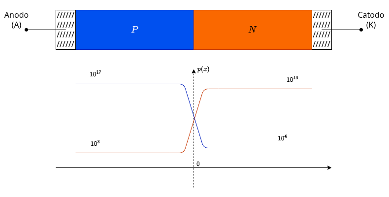

Finché il Silicio non è chiuso in nessuna maglia, abbiamo che:
$$
\begin{CD}
	{\vec{I}_{TOT} = 0} @>>> {\vec{J}_{TOT} = 0}
\end{CD}
$$

Tuttavia, quando colleghiamo i due pezzi di Silicio abbiamo un notevole gradiente di densità delle lacune, cio comporta che avremo una _densità di carica di diffusione_:
$$
	\vec{J}_{p,DIFF} = -q\cdot D_p \cdot \frac{\partial p}{\partial x}\;\hat{x}
$$

Nel nostro caso, $\vec{J}_{p,DIFF}$ è **da sinistra verso destra**.

Analogamente, abbiamo anche un gradiente di densità degli elettroni, che genera anch'esso una _densità di carica di diffusione_:
$$
	\vec{J}_{n,DIFF} = +q \cdot D_n \cdot \frac{\partial n}{\partial x}\;\hat{x}
$$

Anche in questo caso, avremo che $\vec{J}_{n,DIFF}$ è diretta da sinistra verso destra.

Questo sembra andare in contraddizione con quanto affermato prima, in quanto:
$$
	\vec{J}_{TOT} = \vec{J}_{p,DIFF} + \vec{J}_{n,DIFF} \neq 0
$$

Dobbiamo però notare che stiamo ignorando la **corrente di drift**, che è presente **_solo_** in presenza di un campo elettrico. Seppur non sembra il nostro caso, in realtà all'interno del Silicio nel momento in cui abbiamo messo a contatto le due parti drogate si è **_autogenerato un campo elettrico interno_**.

Effettuiamo quindi uno zoom di quello che accade nella zona di confine:

Il materiale $P$ è neutro perché per ogni ione accettore fisso è presente una lacuna associata al drogaggio che compensa lo squilibrio di carica.

Analogamente, il materiale $N$ è neutro perché per ogni ione donatore fisso è presente un elettrone libero associato al drogaggio che compensa lo squilibrio.

Quando rimuoviamo la separazione, le lacune di $P$ si spostano nel materiale $N$. Considerando le concentrazioni relative di lacune ed elettroni è praticamente certo che **_le lacune si ricombinano con elettroni liberi_**.

Questo comporta che le lacune, diffondendosi da $P$ verso $N$ e combinandosi con gli elettroni liberi, scompensano l'equilibrio di carica del materiale $P$, esattamente come accade nel materiale $N$ con gli elettroni che si diffondono in verso opposto.

L'effetto finale di questo ricombinamento è che le cariche fisse, sia di $P$ che di $N$, che si trovano vicino al confine si ritrovano in uno squilibrio, producendo:
- **Carica negativa** nel materiale $P$
- **Carica positiva** nel materiale $N$

La diffusione ha quindi portato ad una regione di spazio, indicata con $W$, dove i due estremi hanno una porzione di spazio a carica positiva e un'altra a carica negativa, che è dimostrabile essere uguale.

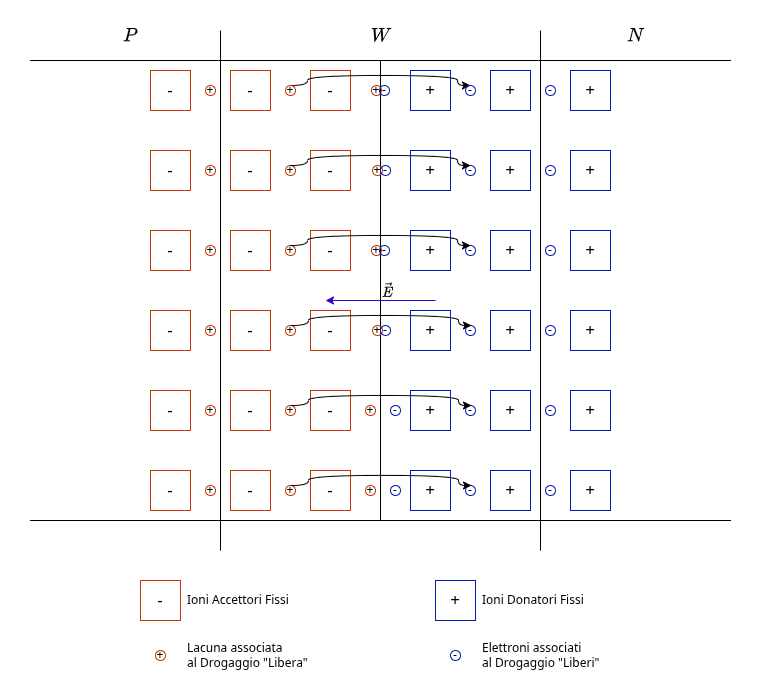

La regione $W$ viene chiamata **_Zona di Svuotamento_**, e agisce **analogamente ad un condensatore**, generando internamente un **_campo Elettrico_** $E$, diretto da $N$ verso $P$.
È quindi banale notare che il campo elettrico, per via del suo verso, va a opporsi sia al movimento delle lacune che a quello degli elettroni.

Ricordando che dobbiamo dimostrare che:
$$
\begin{CD}
	{
		\vec{J}_{TOT} = \vec{J}_{n} + \vec{J}_{p} = 0
	}
	@>\text{Equilibrio Termodinamico}> >
	{
		\vec{J}_{n} = - \vec{J}_{p}
	}
\end{CD}
$$

Dall'analisi qualitativa abbiamo già dedotto che entrambe le cariche **_hanno lo stesso verso_**, quindi dovranno avere lo stesso segno:
$$
\begin{matrix}
	\vec{J}_{n} = 0 & \vec{J}_{p} = 0
\end{matrix}
$$

Ovvero:
$$
\begin{cases}
	\vec{J}_{n} = qD_n \frac{\partial n}{\partial x} \hat{x} + n q \mu_n \vec{E} = 0 \\[0.75em]
	\vec{J}_{p} = -qD_p \frac{\partial p}{\partial x} \hat{x} + p q \mu_p \vec{E} = 0
\end{cases}
$$

Ignoriamo la risoluzione analitica di questo sistema ed effettuiamo uno studio qualitativo.

Sappiamo che la distribuzione di carica si espanderà nello spazio per dimensioni $x_n$ e $x_p$ diverse, così come le densità di carica $\rho(x)$. Questo accade perché i due materiali sono stati drogati con concentrazioni diverse.

A partire dalle concentrazioni di carica, possiamo ricavare l'andamento del grafico del campo elettrico ricordando che: &emsp;
$$
	\frac{dE}{dx} = \frac{\rho(x)}{\varepsilon}
$$

Perciò, all'interno della _Zona di Svuotamento_ avremo un campo elettrico che **aumenta linearmente in modulo più ci si avvicina alla separazione**.

Analogamente ricaviamo il grafico del potenziale ricordando che: &emsp;
$$
	E = - {d\varphi \over dx}
$$

Il potenziale rimane costante nelle zone esterne, e varia crescendo all'interno della zona di svuotamento. Chiamiamo $\varphi_p$ il potenziale nella zona $P$ e $\varphi_n$ il potenziale nella zona $N$.

Chiamiamo la differenza di potenziale $\Delta\varphi$ **_Potenziale di Built-In_** o **_Barriera di Potenziale_**:
$$
	\boxed{\Delta\varphi = V_0 = \frac{K_BT}{q} \cdot \ln{\Biggl(\frac{N_AN_D}{n_i^2}\Biggr)}}
$$

Perciò le lacune $P$ dovranno "vincere" questo potenziale per poter entrare all'interno della zona $N$. Questo fenomeno, per quanto raro, è possibile. Tuttavia i suoi effetti sono compensati dal fatto che quando è presente il campo elettrico, le lacune genrate termicamente da $N$ si spostano per _drift_ verso $P$.

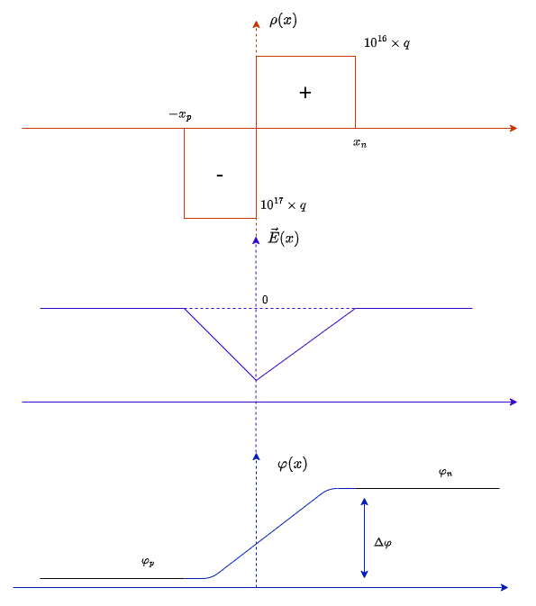

Se noi provassimo a collegare un tensiometro però **_non vedremmo alcun potenziale_**. Questo accade perché, nel momento in cui colleghiamo gli elettrodi con le zone drogate, si genereranno altri **potenziali di contatto**. Il potenziale che andremo quindi a misurare sarà: &emsp; $V_2 + V_1 + V_0 = 0$

## 2.1. Collegamento alla corrente

Analizziamo quindi adesso cosa accade quando applichiamo un potenziale $V$ agli estremi del Silicio.

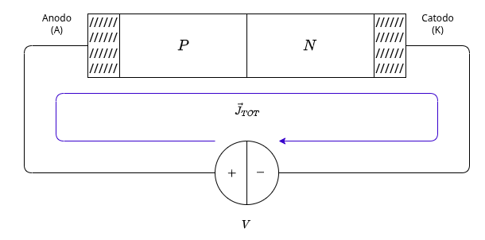

Ipotizziamo, per semplicità, che non ci siano cadute di potenziale fuori dalla **zona di svuotamento** $W$.

Applicando un potenziale positivo alla zona $P$ l'effetto che abbiamo è che la **_barriera di potenziale si abbassa_**, avendo una nuova differenza di potenziale $V_0 - V$.

<figure class="">
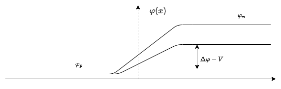
<figcaption>

Nell'immagine manteniamo costante $\varphi_p$.
</figcaption>
</figure>

Abbassando la barriera di diffusione, quello che osserviamo è che la componente di diffusione, sia degli elettroni $J_{n,DIFF}$ che delle lacune $J_{p,DIFF}$, **aumenta in modo esponenziale**, poiché il campo elettrico repulsivo interno è adesso attenuato dal potenziale esterno.

Quello che invece accade alla _corrente di drift_ è particolare, in quanto è proporzionale al campo elettrico quando $n$ e $p$ sono sufficientemente grandi. Nel nostro caso invece, poiché $n$ e $p$ sono rispettivamente cariche minoritarie, diminuiscono per un massimo fattore per noi trascurabile (dopo un po' le cariche che possono spostarsi si sono spostate tutte), al punto che è possibile considerare $J_{n, DRIFT}$ e $J_{p, DRIFT}$ come **piccole e costanti**.

L'effetto complessivo è quindi che:
$$
	\boxed{\vec{J}_{TOT} \neq 0}
$$

In particolare avremo una densità di corrente diretta **_dall'Anodo verso il Catodo_**.

Se invece invertiamo la polarità della tensione, applicando una tensione $V_1 = -V$, avremo degli effetti opposti a quelli precedenti.

Gli effetti di $V_1$ sul _potenziale di barriera_ non è diminuirlo ma bensì **aumentarlo** $V_0 + \vert V_1\vert$.

Alzando la barriera di diffusione, osserviamo che le _componenti di diffusione_ $J_{n,DIFF}$ e $J_{p,DIFF}$ **diminuiscono**, diventando molto piccole.
Le _componenti di drift_ $J_{n, DRIFT}$ e $J_{p, DRIFT}$ rimangono invece **piccole e costanti**.

L'effetto complessivo **_continua ad essere che_** $\vec{J}_{TOT} \neq 0$, ma a differenza di prima questa densità di corrente sarà **piccola**, poiché dovuta principalmente alla componente di drift, e avrà direzione **_dal Catodo verso l'Anodo_**.

# 3. Diodo

Abbiamo quindi detto che la barriera di potenziale è:
$$
	V_0 = \frac{K_BT}{q}\ln{\Biggl(\frac{N_AN_D}{n_i^2}\Biggr)}
$$

La dimensione della zona di svuotameto è data dalla seguente relazione <small>(non è necessario ricordarla)</small>:
$$
	W = \sqrt{\frac{2\varepsilon}{q}\Biggl(\frac{1}{N_A} + \frac{1}{N_D}\Biggr) (V_0 - V_{AK})}
$$

Chiamiamo quindi **_diodo_** quel componente elettronico composto come il blocco di Silicio che abbiamo appena studiato.

Chiamando $I_D$ la corrente che passa nel diodo e $V_D$ la differenza di potenziale ai capi del diodo otteniamo la **_Legge di Shockley_**:
$$
\Large
\boxed{
	I_D = I_S \cdot \Biggl(e^{\frac{V_D}{\eta\cdot V_T}} - 1\Biggr)\;[A]
}
$$

La corrente $I_S$ viene chiamata **_Corrente Inversa di Saturazione_** ed equivale alla corrente di _drift_. È tipicamente molto piccola $(I_S \in [10^{-9}, 10^{-15}]\;A)$.

La tensione $V_T$ è la **tensione termica** (**thermal voltage**):
$$
\begin{CD}
	{
		V_T = \frac{K_BT}{q}
	}
	@>{T = 300°K}> >
	{
		V_T \approx 26\;mV
	}
\end{CD}
$$

La variabile $\eta$ invece è chiamato **_Fattore di Idealità_**, e vale $\eta \in \Set{1, 2}$.

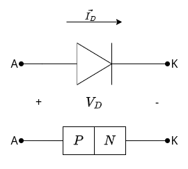

Quando applichiamo $V_D > 0$ si dice che siamo in **_Polarizzazione Diretta_**, e predomina il termine esponenziale.
Se invece applicassimo $V_D < 0$ si dice che siamo in **_Polarizzazione Inversa_**, il termine esponenziale tende a 0 e predomina il fattore $-1$, che quindi produce $I_D = -I_S$, ovvero una corrente di direzione inversa e molto piccola, coerente con la _corrente di drift_.

## 3.1. Effetto Breakdown

Sulla destra possiamo vedere una rappresentazione grafica della corrente al variare della differenza di potenziale.

Notiamo subito che per $V_D = 0 \Rightarrow I_D = 0$, quindi il grafico passerà per l'origine.

Se prendiamo il valore $V_D = 4 \cdot V_T \approx 100mV$, sapendo che $\eta = 1$, otteniamo $I_D = I_S (e^{4} - 1) \approx I_S \cdot e^{4}$

Se prendiamo il valore $V_D = -4 \cdot V_T \approx 100mV$ otteniamo $I_D = I_S (e^{-4} - 1) \approx -I_S$

Ricordando che $I_S \in [10^{9}, 10^{-15}]$ $A$, notiamo perché nella scala proposta il grafico, la corrente sembri quasi nulla.

Notiamo inoltre che a $-70\;V$ torna a manifestarsi corrente nel verso opposto. Questo fenomeno si dice **_Breakdown_** (rottura). Non avviene una vera e propria "rottura", ma in assenza di una resistenza in serie è molto facile che il diodo si bruci.

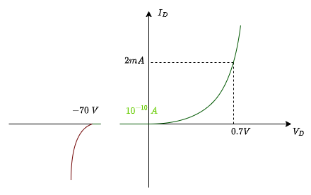

Per capire perché avviene il _breakdown_ dobbiamo nominare due effetti che avvengono all'interno del diodo:
1. **Effetto Zener**
2. **Effetto Valanga**

L'**effetto Zener** si basa sul fenomeno del tunneling interbanda, ed è complesso da spiegare senza conoscere alcuni principi della meccanica quantistica. Semplificando, possiamo dire che il campo elettrico fornisce sufficiente energia da rompere alcuni legami covalenti.

L'effetto _Valanga_ invece si basa su un assunto: all'interno della zona $P$ si liberano elettroni che, spinti dal campo elettrico, accelerano. Quando questi entrano nella zona di svuotamento lo fanno con una certa velocità $v \gg 1$. Nel momento in cui l'elettrone va a urtare un atomo all'interno della zona di svuotamento, quest'urto può **rompere un legame covalente**, producendo un _elettrone libero_ e una _lacuna_.

I due elettroni a loro volta riacquisteranno velocità producendo una altro urto, che raddoppierà ancora una volta, e così via.
A loro volta le lacune producono altri urti producendo altre _lacune_ ed _elettorni_.

La rottura del legame per via dell'urto si chiama **_Ionizzazione per Urto_**.

### 3.1.1. Diodo Zener

I **diodi Zener** sono particolari diodi che abbassano la **tensione di breakdown** $V_{BR}$ di diverse unità.
Questi diodi sono utilizzati nei sistemi per:
- Utilizzare una tensione di riferimento costante a basso costo
- Avere una caduta di corrente praticamente verticale

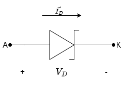

### 3.1.2. Relazione Temperatura-Breakdown

Quando aumenta la temperatura $T$ sappiamo già che la mobilità diminuisce.

L'effetto Zener, all'aumento di $T$, **diminuisce il modulo di** $\vert V_{BR}\vert$, in quanto aumenta l'energia termica, richiedendo meno energia per rompere ogni legame covalente.

Seppur può sembrare che sull'effetto Valanga si abbia lo stessa conseguenza, in realtà la situazione è opposta. Infatti, aumentando l'energia termica di ogni elettrone, è vero che _aumenta il numero di urti_, ma ciò comporta una **diminuzione del tempo tra uno e l'altro**. L'effetto che ha sul singolo elettrone è quello di diminuire l'energia acquisita tra un urto e l'altro, non permettendogli di arrivare al livello necessario per la _ionizzazione per utro_.

L'effetto è quindi quello di **aumentare il modulo di** $\vert V_{BR}\vert$.

I diodi Zener sono costruiti in modo da gestire opportunamente gli effetti della temperatura. In generale:
- Prevale effetto Zener &emsp; $\vert V_{BR} \vert < 5\;V$
- Prevale effetto Valanga &emsp; $\vert V_{BR} \vert > 7\;V$
- Si hanno entrambi gli effetti &emsp; $5\;V < \vert V_{BR} \vert < 7\;V$

Nel caso di diodi che presentano entrambi gli effetti, soprattutto quelli da $5.6$ $V$ si dice che questi sono **termicamente stabili**, in quanto i due effetti tendono a compensarsi a vicenda.

# 4. Diodo nei Circuiti

Partiamo dal seguente circuito:

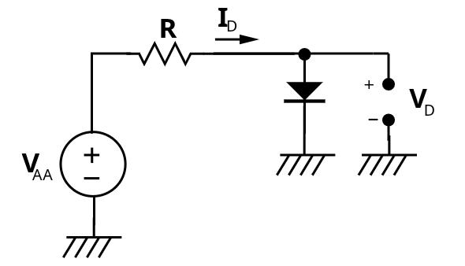

Poiché il diodo **_non è un componente lineare_** non possiamo risolverlo come facevamo ad Elettrotecnica.

Effettuiamo quindi uno studio utilizzando le **Leggi di Kirchoff**:
1. **_Equazione della Maglia_**: &emsp; $V_A = RI_D + V_D$
1. **_Legge di Shockley_**: &emsp; $I_D = I_S\cdot(e^{V_D \over \eta V_T} - 1)$

Risolvere questo sistema è complesso, tuttavia possiamo utilizzare **metodi di risoluzione numerici** sfruttando potenza computazionale.

Un altro metodo per avere almeno un idea di quello che accade si dice **metodo grafico**. È un metodo molto utile se riusciamo a portare in forma grafica la legge di Shockley, che sappiamo essere un esponenziale.

Dalla prima equazione ricaviamo invece che $I_D = \frac{V_A - V_D}{R} = -\frac{V_D}{R} + \frac{V_A}{R}$, ovvero una retta con pendenza $-\frac{1}{R}$.

Un grafico qualitativo è quindi il seguente:

<figure class="">
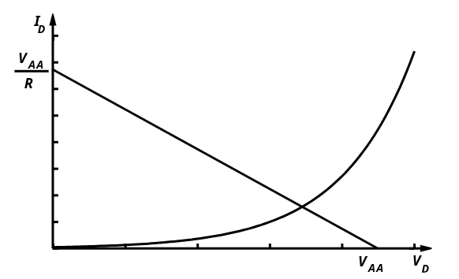
<figcaption>

La retta viene chiamata **_Retta di Carico_**, poiché le sue caratteristiche dipendono esclusivamente da parametri esterni al diodo.
</figcaption>
</figure>

Otteniamo quindi che la soluzione del nostro esercizio è proprio l'**intersezione tra le due curve**, che viene spesso indicato con la lettera $Q$ (_Quiescent_), chiamato **_Punto di Lavoro_** o **_Punto di Riposo_**.
$$
	Q = (V_{DQ}, I_{DQ})
$$

Il metodo grafico, chiamato anche _metodo della retta di carico_, ci fornisce anche informazioni su cosa accade al variare dei parametri:
- Al variare di $R$ otteniamo un **fascio di rette** centrato in $(V_A, 0)$.
- Al variare di $V_A$ otteniamo un **fascio di rette parallele**

Il metodo grafico però presenta anche numerosi svantaggi:
1. La legge di Shockley **varia per ogni componente**, anche per quelli nominalmente identici
2. All'aumentare del numero dei diodi il metodo diventa incredibilmente complesso e inutile

Il vantaggio di entrambi i metodi è quello di non utilizzare alcuna approssimazione nei calcoli.

Ci concentriamo adesso invece su un metodo che sfrutta **_modelli equivalenti del diodo_**, che modellizza la legge di Shockley, approssimando una soluzione.

## 4.1. Modelli del Diodo per Grandi Segnali

Esistono tre modelli principali per approssimare il diodo:
1. [**Modello a Caduta Costante**](#411-modello-a-caduta-costante)
2. [**Modello a Diodo Ideale**](#412-modello-a-diodo-ideale)
3. [**Modello Lineare a Tratti**](#413-modello-lineare-a-tratti)

### 4.1.1. Modello a Caduta Costante

Nel modello a caduta costante rinunciamo alla caratteristica esponenziale della legge di Shockley, ma manteniamo la crescita ripida ad un valore di tensione $V_\gamma$.

La scelta di $V_\gamma$ è variabile, tipicamente vale $0.7$ $V$.

Questo modello approssima il diodo:
- **_Diodo "OFF"_**: per $V_D < V_\gamma$ come un **_circuito aperto_**
- **_Diodo "ON"_** (_in conduzione_): per $V_D \ge V_\gamma$ si comporta come un **_generatore di tensione ideale_** $V_\gamma$.

Per poter utilizzare questo modello quello che si fa è:
1. Fare un ipotesi di lavoro
2. Risolvere il cirucito con l'ipotesi
3. Verificare che la soluzione sia coerente con l'ipotesi fatta
4. Se non è verificata, poiché il diodo è un componente monotono, l'ipotesi corretta è l'altra e procedere a risolverla nuovamente

Il problema è che con $N$ diodi abbiamo un numero totale di $2^N$ potenziali circuiti da risolvere.

La soluzione fornita da questa approssimazione si discosta dalla realtà in media del $10\%$.

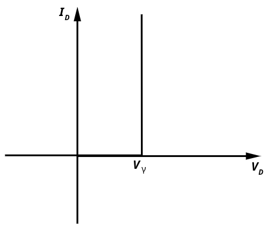

### 4.1.2. Modello a Diodo Ideale

Nel modello a diodo ideale rinunciamo nuovamente alla caratteristica esponenziale della legge di Shockley, ma manteniamo la crescita ripida ad al valore di tensione $V_D = 0$.

Questo modello approssima il diodo:
- Per $V_D < 0$ come un **_circuito aperto_**
- Per $V_D \ge 0$ come un **_corto circuito_**.

Per poter utilizzare questo modello le operazione che si fanno sono le stesse di prima:
1. Fare un ipotesi di lavoro
2. Risolvere il cirucito con l'ipotesi
3. Verificare che la soluzione sia coerente con l'ipotesi fatta
4. Se non è verificata, poiché il diodo è un componente monotono, l'ipotesi corretta è l'altra e procedere a risolverla nuovamente

Anche qui il problema è che con $N$ diodi abbiamo un numero totale di $2^N$ potenziali circuiti da risolvere.

La soluzione fornita da questa approssimazione è ancora più lontana dalla reale soluzione, in quanto ignora la caduta ai capi del diodo.
È comunque molto utile nel caso in cui fossimo interessati nel fare un analisi qualitativa del circuito, oppure nei casi in cui la tensione ai capi del diodo $(\approx 0.7$ $V)$ è **molto minore a quella del circuito**.

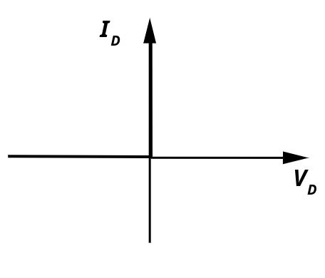

### 4.1.3. Modello lineare a Tratti

Nel modello a diodo ideale rinunciamo ancora una volta alla caratteristica esponenziale della legge di Shockley, e scegliamo una crescita costante a partire da una tensione $V_\gamma$.

Il valore di $V_\gamma$ è leggermente più basso di $0.7$ $V$, ma subentra il problema di non conoscere come scegliere la pendenza.

Questo modello approssima il diodo:
- Per $V_D < V_\gamma$ come un **_circuito aperto_**
- Per $V_D \ge V_\gamma$ come un **_generatore di tensione reale_**, con tensione $V_\gamma$ e resistenza $R_D$

La scelta della resistenza $R_D$ è molto complessa, in quanto solitamente non abbiamo a priori dei punti di riferimento che ci aiutano a fare una scelta ragionevolmente corretta.

Inoltre il circuito è notevokmente più complicato, in quanto abbamo introdotto $N$ generatori reali.

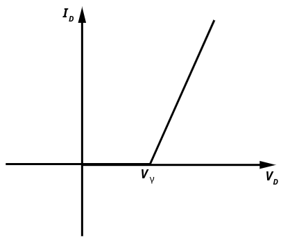

### 4.1.4. Soluzione circuito

Risolviamo quindi l'esercizio visto prima, riproposto sulla destra, con i vari modelli.

Il diodi è un **Diodo 1N4148** con le seguenti caratteristiche reali:
$$
\begin{cases}
	I_D = 4.35\;mA \\
	V_D = 0.653\;mA
\end{cases}
$$

Vediamo quindi come qual è l'errore che commettiamo utilizzando le varie approssimazioni.

Diodo Ideale

---

Nel caso di diodo ideale ipotiziamo di avere un **_Diodo ON_**, ovvero un corto $V_D = 0$.

Di conseguenza otteniamo che:
$$
I_D = \frac{V_A}{R} = 5\;mA
$$

Poiché abbiamo imposto che $V_D = 0$, effettuiamo la verifica dell'ipotesi sulla corrente, ovvero che $I_D > 0$.

La verifica è quindi immediata $5\;mA > 0$, e quindi abbiamo risolto il circuito.

Notiamo che l'errore sulla corrente reale è minore a $1$ $mA$, circa del $15\%$.

Caduta Costante

---

Effettuando sempre l'ipotesi che sia un **Diodo ON**, sostituiamo il diodo con un generatore di tensione pari a $V_\gamma = 0.7\;V$.

Notiamo subito che facciamo un errore del $7\%$, un valore accettabile.

Ricaviamo quindi la corrente:
$$
I_D = \frac{V_A - V_D}{R} = 4.3\;mA
$$

Anche in questo caso la verifica che $I_D > 0$ è superata, in particolare adesso abbiamo un errore solamente del $1\%$.

Notiamo che l'errore sulla corrente è molto minore rispetto a quello prima.

Lineare a Tratti

---

Manteniamo l'ipotesi **Diodo ON**, supponiamo di prendere:
- $V_\gamma = 0.65\;V$
- $R_f = 20\;\Omega$

In questo caso:
$$
I_D = \frac{V_A - V_\gamma}{R + R_F} = \frac{5 - 0.65}{1020} = 4.26\;mA
$$

La tensione $V_D$ è quindi:
$$
	V_D = V_f + R_f I_D = 0.735\;V
$$

La verifica, ancora una volta $I_D > 0$, è ancora una volta superata.

## 4.2. Metodi di Analisi dei Circuiti

L'analisi dei circuiti a diodi si svoge partendo da un'ipotesi dello stato di lavoro del diodo:
- **Conduzione**
- **Interdetto**

Fatta l'ipotesi, il secondo passaggio consiste nell'**_applicazione del modello prescelto in accordo con l'ipotesi effettuata_**.

Nel caso di ipotesi di conduzione dobbiamo scelgiere tra:
- **Diodo Ideale** $\to$ Corto
- **Diodo a Caduta Costante** $\to$ Generatore Di Tensione Costante
- **Diodo Lineare a Tratti** $\to$ Generatore Di Tensione Reale

Se invece siamo nell'ipotesi interdetta dobbiamo sostituire ad ogni diodo un _aperto_.

Effettuata la sostituzione possiamo quindi **_risolvere il circuito_**, ovvero trovare tutte le correnti $I_i$ e le tensioni $V_i$.

Risolto il circuito dobbiamo **effettuare la verifica**:
- **Conduzione**: è necessario verificare che $I_D > 0$
- **Interdetto**: è necessario verificare che $V_{AK} = V_D < V_\gamma$

## 4.3. Modelli del Diodo per Piccoli Segnali

Nel caso di piccoli segnali, ovvero piccole oscillazioni del segnale dato un valore che consideriamo di quiete, abbiamo che i valori di tensione e corrente ai capi del diodo seguono le seguenti leggi:
$$
\begin{matrix}
	v_D(t) = V_{DQ} + v_d(t) \\
	i_D(t) = I_{DQ} + i_d(t)
\end{matrix}
$$

Dove $v_d(t)$ e $i_d(t)$ sono funzioni sinusoidali.

Chiamiamo quindi $Q$ il **punto di riposo** (_quiescente_), ovvero il punto dove $v_d(t) = i_d(t) = 0$. Questo punto avrà coordinate &emsp; $Q = (V_D, I_D)$.

L'idea chiave dei piccoli segnali è che se le variazioni del segnale $v_d$ sono _sufficientemente piccole rispetto alla tensione termica_ $V_T$, allora la **curva esponenziale del diodo** può essere **_approssimata con un segmento rettilineo coincidente con la tangente nel punto $Q$_**.

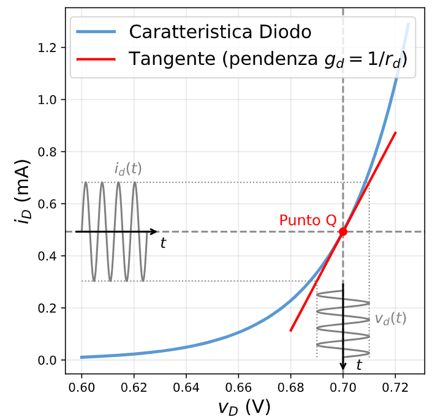

Questa accortezza ci fornisce diversi vantaggi:
1. Ci permette di evitare la risoluzione delle equazioni trascendentali, **trattando il diodo come una resistenza** &emsp; $r_d = \frac{v_d}{i_d} = \frac{1}{g_d}$
2. Possiamo **separare nettamente** l'analisi continua (che fissa il punto $Q$) dall'analisi in alternata che elabora il segnale

La "resistenza per piccoli segnali" è quindi un valore che _dipende dal punto di riposo_ $Q$.

La linearizzazione, vedremo valida solamente se $\vert v_d(t) \vert \ll V_{DQ}$:
$$
\begin{align*}
	i_d(t) &= f(V_{DQ}+v_d(t)) \\
	&= f(V_{DQ}) + \frac{\partial f(V_{DQ})}{\partial v_D} \cdot v_d(t) + \frac{1}{2}\frac{\partial^2 f(V_{DQ})}{\partial v_D^2}\cdot v_d^2(t) + \dotsc \\
	&\approx f(V_{DQ}) + \frac{\partial f(V_{DQ})}{\partial v_D} \cdot v_d(t)
\end{align*}
$$

Possiamo quindi dire:
$$
\begin{CD}
	\begin{matrix}
	i_D(t) \approx f(V_{DQ}) + \frac{\partial f(V_{DQ})}{\partial v_D}\cdot v_d(t) &
	\leftrightarrow & i_D(t) = I_{DQ}+ i_d(t)
\end{matrix} \\
@VVV \\
\begin{matrix}
	I_{DQ} = f(V_{DQ}) & & i_d(t) = \frac{\partial f(V_{DQ})}{\partial v_D} \cdot v_d(t)
\end{matrix}
\end{CD}
$$

In paricolare chiamiamo:
$$
\begin{cases}
	g_d := \frac{i_d}{v_d} = \frac{\partial f(V_{DQ})}{\partial v_D} & \textbf{Conduttanza differenziale} \\[1em]
	r_d := \frac{1}{g_d} = \Bigl(\frac{\partial f(V_{DQ})}{\partial v_D}\Bigr)^{-1} & \textbf{Resistenza differenziale} \\
\end{cases}
$$

È quindi possibile vedere che i parametri differenziali **dipendono dal punto di riposo** $V_{DQ}$.

Possiamo quindi linearizzare la _legge di Shockley_:
$$
\begin{CD}
	{i_D = f(v_D) = I_S\Bigl(e^{v_D/(\eta V_T)} - 1\Bigr)} \\
	@VVV \\
	{
		g_d = \frac{\partial f(V_{DQ})}{\partial v_D} = \frac{I_S}{\eta V_T}\cdot e^{V_D/(\eta V_T)}
	}
\end{CD}
$$

Sommando e sottraendo $I_S$ dal numeratore otteniamo:
$$
\begin{aligned}
	g_d &= \frac{I_S\Bigl(e^{V_D/(\eta V_T)} - 1\Bigr) + I_S}{\eta V_T} \\
		&= \frac{f(V_D) + I_S}{\eta V_T} \\
		&= \frac{I_{DQ} + I_S}{\eta V_T} \\
		&\approx \frac{I_{DQ}}{\eta V_T} & I_{DQ} \gg I_S
\end{aligned}
$$

Questa linearizzazione è valida a patto che sia valida la relazione:
$$
\begin{CD}
{\Biggl| \frac{\partial f(V_{DQ})}{\partial v_D} \cdot v_D(t) \Biggr| \gg \Biggl| \frac{1}{2}\frac{\partial^2 f(V_{DQ})}{\partial v_D^2} \cdot v_D^2(t) \Biggr|} \\
@VVV \\
{\frac{I_{DQ} +  I_S}{\eta V_T} \gg \frac{I_{DQ} + I_S}{2(\eta V_T)^2} \cdot |v_d(t)|} \\
@VVV \\
{|v_d(t)| \ll 2\eta V_T}
\end{CD}
$$

Per $V_T = \frac{K_BT}{q} \approx 26$ $mV$ a $300°K$ e $\eta = 1.1$ ottenuamo quindi che la relazione è valida solamente per oscillazioni di ampiezza molto inferiore a:
$$
|v_d(t)| \ll 57.2\;mV
$$

In generale, per **segnali con ampiezze di pochi milli-volt** la nostra linearizzazione è valida, ottenendo valori:
$$
\begin{cases}
	\textbf{In conduzione } (I_{DQ} = 1\;mA) & r_d = \frac{\eta V_T}{I_{DQ}} = 28.6\;k\Omega \\[1em]
	\textbf{In interdizione con } V_{DQ} = 0 \:(I_{DQ} = 1\;nA) & r_d = \frac{\eta V_T}{I_{DQ}} = 28.6\;G\Omega \\
\end{cases}
$$

### 4.3.1. Esempio Applicativo

Per analizzare un circuito sottoposto a piccole perturbazioni attorno un punto di riposo, lo risolviamo sfruttando la **sovrapposizione degli effetti**:
1. Prima cerchiamo il **punto di riposo**: _spegnamo tutti i generatori AC_ e utilizziamo il _modello del diodo per grandi segnali a caduta costante_. L'obiettivo è quindi trovare $I_{DQ}$, e quindi anche $r_d = \frac{\eta V_T}{I_{DQ}}$
2. Dopo effettuamo l'**analisi alternata**: _spegnamo tutti i generatori DC_ e _sostituiamo al diodo la resistenza_ $r_d$. L'obiettivo è **calcolare il guadagno/perturbazione** di $i_d$ e $v_d$.

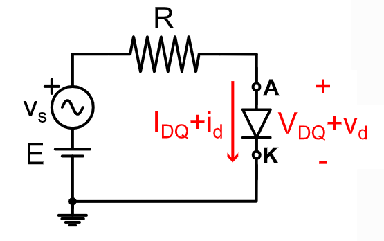

Per quanto riguarda il primo punto possiamo quindi risolvere ipotizzando il diodo in conduzione:
$$
	I_{DQ} = \frac{E - V_\gamma}{R} \\[0.75em]
	r_d = \frac{\eta V_T}{I_{DQ}} \\[0.75em]
$$

Risolvendo invece il secondo circuito, utilizzando il diodo linearizzato:
$$
i_d(t) = \frac{v_s(t)}{R + r_d} \\[0.75em]
$$

La soluzione finale sarà quindi:
$$
	i_D(t) = I_{DQ} + i_d(t)
$$