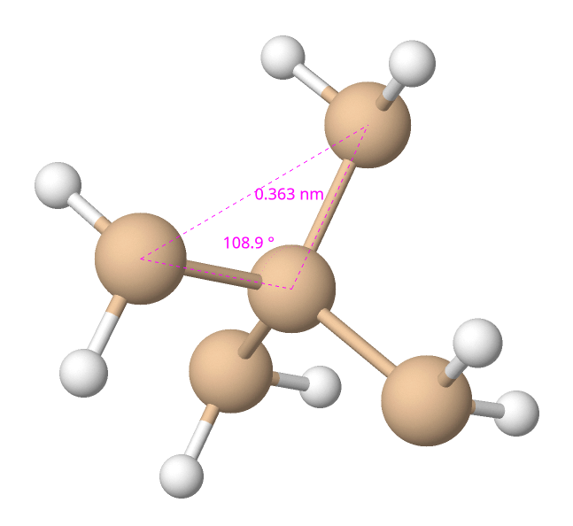

# 1. Indice

- [1. Indice](#1-indice)
- [2. Introduzione](#2-introduzione)
- [3. Chimica](#3-chimica)
	- [3.1. Atomo](#31-atomo)
	- [3.2. Legami](#32-legami)

# 2. Introduzione

> _L'elettronica è la scienza e la tecnologia del movimento delle cariche in un gas, nel vuoto o in un semiconduttore_

I primi dispositivi propri dell'elettronica dono i **diodi a vuoto**, o _valvole_, inventate da _Fleming_ nel 1904, sostituito due anni dopo dai **triodi a vuoto** creati da _De Forest_.

Nel 1947 _Bardeen_, _Brattain_ e _Shockley_, nei laboratori Bell, inventano il primo **transistore bipolare**, che sfrutta lo spostamento di carica all'intenro di un semiconduttore. QUesta invenzione fece vincere loro il Nobel per la fisica.

Nel 1958 _Kilby_, concepisce l'idea di circuito integrato, per la quale riceverà il premio Nobel per la fisica nel 2000.

Nel 1965 viene formulata la **legge di Moore**:
> La complessità di un microcircuito, misurata ad esempio come tramite il numero di transistor per chip, raddoppia ogni 18 mesi

La storia ci dice infatti che il numero di componenti su chip è raddoppiato ogni anno per i primi anni, e ogni due anni dal 1975 ad oggi.

L'evoluzione storica dei chip è legata dalle dimensione degli stessi. Proprio le dimensioni agiscono da _bottleneck_ per le aziende che sono in grado di produrli.
Infatti, se è vero che ci sono circa 30 aziende che fabbricano chip a $180nm$, ne esistono meno di 5 che riescono a creare chip a $5nm$.

Queste dimensioni rappresentavano, fino a qualche anno fa, il diametro del più piccolo canale presente nel chip, ed è preferibilie diminuire le dimensioni poiché
al diminuire delle stesse aumenta il numero di componenti inseribili in uno stesso spazio.

L'evoluzione storica ha quindi portato a due effetti principali:
- Diminuzione delle dimensioni dei transistor
- Aumento del costo per la produzione del singolo transistor

Se si tiene in considerazione che con dimensioni più piccole è possibile inserire più transistor, il costo dei circuiti integrati nel loro complesso è **diminuito nel tempo**.

Oggi i chip non sono più identificati dalle loro dimensioni, ma da sigle più complesse diverse per ogni _manufacturer_ indipendenti dalle dimensioni dei canali degli stessi. Questa scelta di denominazione ha come obiettivo quello di rendere più complesso il confronto tra processori di proprietà diverse all'utente medio.

# 3. Chimica

Per poter proseguire con l'analisi dell'elettronica digitale è necessario ripassare alcune nozioni di chimica, in particolare rivediamo **_l'atomo_** e i **_legami atomici_**.

## 3.1. Atomo

Il primo modello di atomo è proposto nel 1911 da _Rutherford_:
> L'atomo è formato da un nucleo carico positivamente che occupa una perte molto piccolo del suo volume attorno al quale ruotano gli elettroni

Nel 1913 il modello venne sostituito dal **modello di Bohr** basato su 4 postulati:
1. All'elettrone sono permessi solo certi stati di moto stazionari cui competono valori ben definiti di energia
2. Quando gli elettroni si trovano in questi stati gli elettroni non irradiano energia
3. In ognuno di questi stati l'elettrone descrive un orbita circolare intorno al nucleo
4. Gli stati permessi sono quali in cui momenti angolare dell'elettrone è un multiplo intero di $\frac{h}{2\pi}$ dove $h$ è la **costante di Plank**.

Di questi quattro postulati solo i primi due non sono stati confutati. Il terzo è stato completamente confutato, mentre è stato dimostrato che il quarto è vero solo parzialmente.

Per definire un elettrone nell'atomo il _modello atomico di Bohr_ utilizza 4 numeri, detti **_Numeri Quantici_**:
- **Numero quantico principale**: $n = 1,2,3,...$
- **Numero quantico orbitale**: $l = 1,2,3, \cdots, n-2, n-1$
- **Numero quantico magnetico**: $m = 0, \pm 1, \pm 2, ...$
- **Numero quantico di spin**: $s = \pm \frac{1}{2}$

Bohr non aveva bene in mente cosa questi numeri rappresentassero ma trovarono supporto nel _**Principio di Esclusione di Pauli**_:
> Due elettroni non possono occupare lo stesso stato quantico simultaneamente.

Successivamente arrivò il modello quantistico che definì la doppia natura dell'elettrone, **ondulatoria** e **corpuscolare**.

Questo rese quindi impossibile parlare di _posizione di elettrone_, ma piuttosto della probabilità di trovare l'elettrone in una detemrinata posizione.
Non si parla più di orbita dell'elettrone ma piuttosto di **orbitale**, concepito come _lo spazio nella quale esiste probabilità di trovare l'elettrone_.

Per descrivere completamente gli orbitali sono necessari i quattro numeri quantici già citati sopra, che adesso assumono il seguente significato:
- _**Numero quantico legato all'energia**_ $n$
- _**Numero quantico legato alla forma**_ $l$
- _**Numero quantico legato all'orientazioni relative**_ $m$
- _**Numero quantico legato allo spin dell'elettrone**_ $s$

Le proprietà dei materiali dipendono esclusivamente dalla **configurazione elettronica esterna**, in quanto, quasi sempre, sono proprio gli elettroni più esterni che partecipano alla formazione dei legami tra atomi.

Nella Tavola Periodica infatti gli elementi sono rappresentati divisi per:
- **Riga (_Periodo_)**: atomi con lo stesso numero quantico principale
- **Colonna (_Gruppo_)**: atomi con la stessa conformazione elettronica esterna

L'atomo principale per noi è il **_Silicio_** $(Si)$ appartenente al **gruppo IV**, con numero atomico $14$.
In particoare vedremo come si comporta il Silicio quando viene legato ad altri atomi dei gruppi limitrofi come il Boro (gruppo 3) o il Fosforo (gruppo 5), nelle operazioni di **drogaggio_**.

Infatti, in natura, in condizioni normali, soltanto i gas nobili si trovano allo stato atomico, mentre gli altri esistono solo combinati tra loro in un numero molto grande di modi, seguendo tutti la _regola dell'ottetto_, ovvero la configurazione che porta al minimo energetico.

La configurazione dell'ottetto è infatti raggiunta attraverso la _condivisione fra due o più atomi_. Questo comporta che la funzione d'onda associata all'elettrone in condivisione non è più localizzata su un atomo, ma abbraccia più atomi.

## 3.2. Legami

Esistono tre tipi di legami chimici:
- **Legame Ionico**: avviene quando un atomo ha il guscio esterno quasi pieno e l'altro quasi vuoto. Questo comporta un'alta differenza di elettronegatività che permettono ad un atomo di "strappare" l'elettrone.
- **Legame Covalente**: avviene principalmente tra due atomi con guscio parzialmente riempito. Nella configurazione a minima energia ogni atomo compartecipa i propri elettroni con quelli degli atomi vicini. Gli elettroni sono localizzati intorno ai nuclei che fanno parte del legame
- **Legame Metallico**: tipico degli elementi che ahnno un solo elettrone di valenza. È caratteristico dei metalli, dove gli elettroni di valenza sono "distanti" dal nucleo e più liberi di muoversi tra due atomi.

Il _Silicio_ si lega agli altri atomi di Silicio attraverso legami covalenti formando conformazioni **tetraedriche**. Per semplificarci la vita, non utilizzeremo la rappresentazione in tre dimensioni, ma piuttosto quella in due dimensioni.

