# 1. Indice

- [1. Indice](#1-indice)
- [2. Logica Sequenziale](#2-logica-sequenziale)
	- [2.1. Latch](#21-latch)
		- [2.1.1. Implementazione CMOS](#211-implementazione-cmos)
	- [2.2. Latch SR](#22-latch-sr)
		- [2.2.1. Porte NOR](#221-porte-nor)
		- [2.2.2. Latch SR con Enable](#222-latch-sr-con-enable)
	- [2.3. D-Latch](#23-d-latch)
	- [2.4. Flip-Flop](#24-flip-flop)
		- [2.4.1. Flip-Flop di tipo D](#241-flip-flop-di-tipo-d)
- [3. Memorie Volatici CMOS](#3-memorie-volatici-cmos)
	- [3.1. SRAM](#31-sram)
	- [3.2. DRAM](#32-dram)

# 2. Logica Sequenziale

Quando parliamo di _Logica Sequenziale_ possiamo pensare a due tipi di circuiti:
- **Combinatori** $(Y = f(X))$: l'output $Y$ dipende **solo** dagli ingressi correnti $X$
- **Sequenziali** $(Y = g(f(X,S) ,X))$: l'output $Y$ dipende dagli ingressi e dallo _Stato Interno_ $S$

Per modellare il concetto di _Stato_ definiamo:

- **Memoria**: capacità di un sistema di conservare traccia della _storia passata_ degli ingressi. Distinguiamo due tipi di memoria:
  - _Memoria Volatile_: sussiste fintanto che alimentata
  - _Memoria Non Volatile_: si preserva a prescindere dall'alimentazione
- **Variabili di Stato**: rappresentazione matematica e fisica dell'informazione memoriazzata

In elettronica possiamo implementare la memorizzazione con due approcci:
- **Memorizzazione Statica**: sfrutta circuiti _**bistabili**_, in grado di immagazzinare un bit di informazione
- **Memorizzazione Dinamica**: sfrutta la carica di un condensatore per mantenere costante la tensione per un certo tempo

In generale possiamo quindi classificare i tipi di memoria:

|     Tipo     |        Esempi         | Volatile? |     Meccanismo      |   Applicazioni    |
| :----------: | :-------------------: | :-------: | :-----------------: | :---------------: |
|   Statico    |  _Flip-Flop_, _SRAM_  |    Sì     |      Bistabili      |  Cache, Registri  |
|   Dinamico   |        _DRAM_         |    Sì     | Carica Condensatore |  RAM principale   |
| Non Volatile | _ROM_, _Flash_, _SSD_ |    No     | Alterazione fisica  | Firmware, Storage |

## 2.1. Latch

Il _latch_, o _circuito a scatto/aggangio_, richiama il concetto di serratura che scatta e blocca l'informazione in una posizione fissa.

Il latch è il più semplice elemento bistabile capace di memorizzare `1bit` finché è alimentato

È composto da due _inverter_ in **retroazione positiva**, che rafforza il valore dello stato stesso.

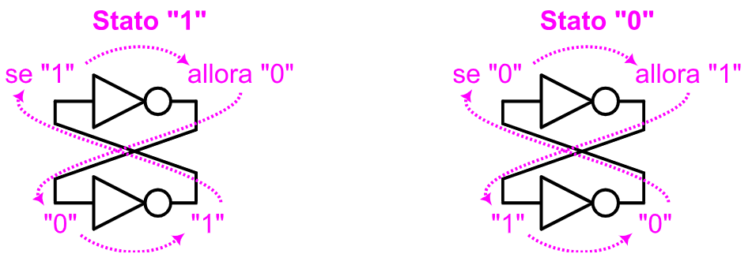

Per studiare il fenomeno di feedback, interrompiamo il meccanismo e inseriamo un generatore di prova $V_i$:

La in entrata al secondo _inverter_, chiamata $V_i$, viene invertita:
$$
	V_{u_1} = f_{NOT}(V_i)
$$

Dopo un piccolo delay dovuto al tempo di propagazione, questa viene poi fornita in entrata al primo inverter, che procede a reinvertirla:
$$
	V_{u_2} = f_{NOT}(V_{u_1}) = f_{NOT}(f_{NOT}(V_i)) = V_i
$$

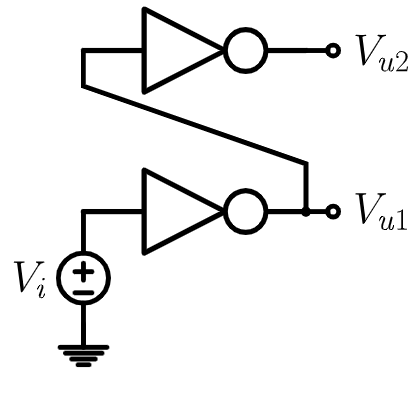

Le due tensioni quindi seguono questo andamento:

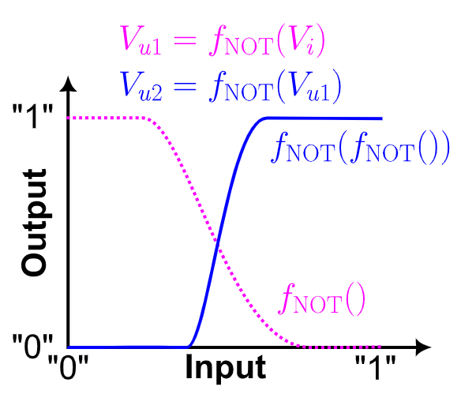

Quando ripristiniamo il _feedback_, collegando l'entrata del secondo inverter a $V_{u_2}$ quello che otteniamo è il grafico sulla destra, dove sono evidenziati i **tre punti di intersezione** tra i grafici delle due tensioni.

Questi punti sono chiamati _**Stati del Latch**_ e rappresentano le possibili soluzioni del circuito.

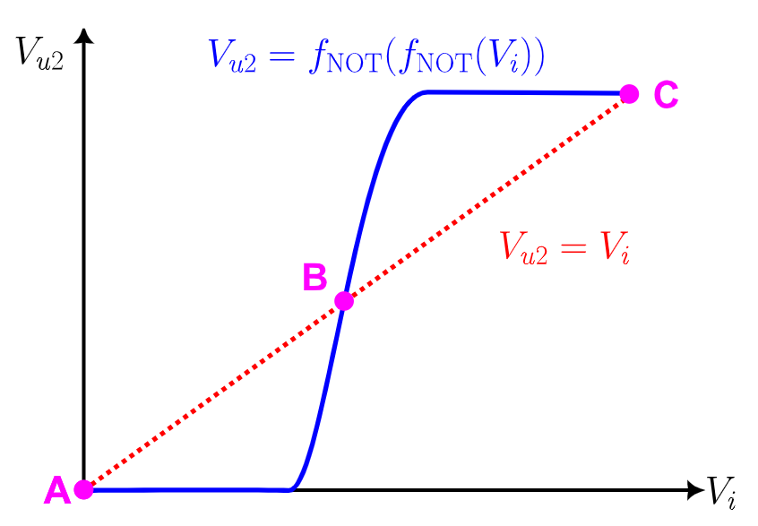

Il punto $B$ è uno _**Stato Instabile**_, di _equilibrio precario_. Infatti una piccola variazione $\Delta V$, che essa sia positiva e/o negativa, innesca la reazione:
- $\Delta V > 0$ &emsp; $\to$ &emsp; Si ha una transizione verso il punto $C$
- $\Delta V < 0$ &emsp; $\to$ &emsp; Si ha una transizione verso il punto $A$

I punti $C$ e $A$ sono invece detti _**Stati Stabili del sistema**_, o punti di aggangio. Infatti piccole variazioni attorno a questi punti non producono un ripristino del punto di equilibrio iniziale.

Matematicamente qeusto avviene perché, definendo $f_{NOT}(V)$ la caratteristica di trasferimento dell'inverter, la pendenza della curva rappresenta il **guadagno totale**:
$$
	G(V_{in}) = \frac{d}{dV_{in}}[f_{NOT}(f_{NOT}(V_{in}))]
$$

Nel punto $B$ il guadagno è massimo, infatti $G \gg 1$. Ogni minima perturbazione viene amplificata portando alla **commutazione rigenerativa**.

Nei punti $A$ e $C$ invece il guadagno è pressocché nullo $G \approx 0$, che procede a attenuare le perturbazioni.

Per funzionare, iL latch sfrutta:
- **Instabilità**: per cambiare stato
- **Stabilità**: per conservare lo stato

### 2.1.1. Implementazione CMOS

Per poter implementare il _latch_ possiamo quindi utilizzare l'implementazione degli inverter a `CMOS` complementare:

Nei punti $A$ e $C$:
- Uno dei due `NMOS` avrà $V_{GS} \sim V_{DD}$, mentre l'altro $V_{GS} \sim 0$
- Uno dei due `PMOS` avrà $\vert V_{GS} \vert \sim V_{DD}$, mentre l'altro $\vert V_{GS} \vert \sim 0$

Ciò significa che in ogni ramo abbiamo un transistor in conduzione mentre l'altro è **interdetto**. Non esiste quindi un cammino diretto tra $V_{DD}$ e _ground_, che comporta l'avere una **potenza statica _idealmente_ nulla**

Nel punto $B$ invece si vverifica un passaggio di **corrente di cortocircuito** $I_{SC}$ elevata.
Questo punto rappresenta il punto di massima dissipazione energetica e massimo guadagno.

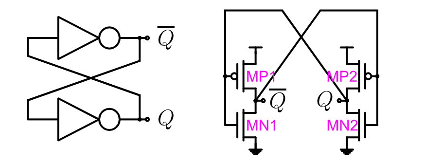

## 2.2. Latch SR

Per poter cambiare lo stato di un _latch_, altrimenti indefinitivamente stabile, occorre modificare la struttura del nostro latch per poterlo accoppiare con dei segnali logici esterni di **Set** `S` e **Reset** `R`.

Vedremo l'implementazione del _Latch SR_ a porte `NOR`, ma è possibile implementare lo stesso principio anche con le porte `NAND`.

### 2.2.1. Porte NOR

Quando $S = 0$ e $R = 0$ gli `NMOS` aggiuntivi sono interdetti, mentre i `PMOS` sono in saturazione, tornando al caso del _latch_ classico.

Se invece $S = 1$ e $R = 0$, per il ramo destro la situazione non cambia, mentre nel lato sinistro abbiamo che:
- Il `PMOS` è interdetto
- L'`NMOS` è in conduzione: collega $\overline{Q}$ a _ground_

Il fatto che $\overline{Q} = 0$ produce sul ramo destra come uscita $Q = 1$. Quando rientra il `PMOS` del _latch_ è anch'esso interdetto, mentre l'`NMOS` è in saturazione, che rafforza il segnale a _ground_.

La situazione è analoga e simmetrica per il caso $S = 0$ e $R = 1$.

Se invece sia $S = 1$ che $R = 1$, quello che a accade è che sia sul ramo destro che su quello sinistro abbiamo $\overline{Q} = Q = 0$ dato che entrambi gli `NMOS` aggiuntivi sono in saturazione, ed entrambi i `PMOS` aggiuntivi sono interdetti.

Logicamente questa casistica viola la nostra logica complementare, elettricamente invece i due segnali sono semplicemente connessi a _ground_. Lo stato non è permesso per via delle transizioni multiple a partire da questo stato.

Se infatti abbassassimo sia $S$ che $R$ insieme:
- Se $R = 0$ prima di $S = 0$ passiamo dallo stato di _set_ e otteniamo un uscita $Q = 1$
- Se $S = 0$ prima di $R = 0$ passiamo dallo stato di _reset_ e otteniamo un uscita $Q = 0$

Negli altri stati invece, qualsiasi sia l'ordine di inversione di $S$ e $R$ il risultato finale sarà sempre lo stesso.

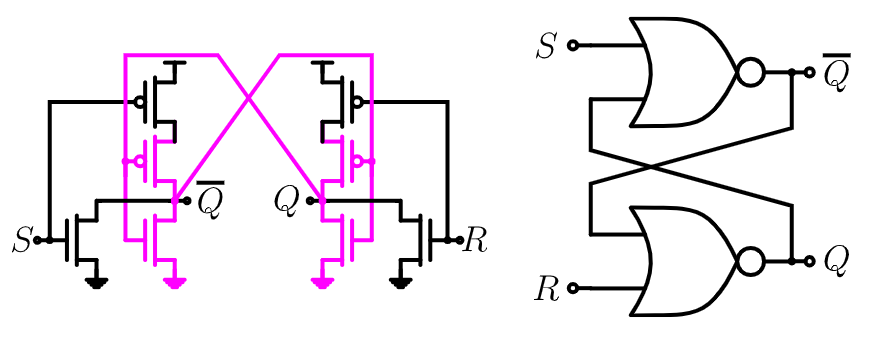

Il _latch SR_ segue quindi la seguente tabella di verità

|  $R$  |  $S$  |   $Q[n+1]$   |
| :---: | :---: | :----------: |
|  $0$  |  $0$  |    $Q[n]$    |
|  $0$  |  $1$  |     $1$      |
|  $1$  |  $0$  |     $0$      |
|  $1$  |  $1$  | Non Permesso |

### 2.2.2. Latch SR con Enable

Il _latch SR_ risponde immediatamente agli ingressi $R$ e $S$. Tuttavia è spesso preferibile ridurre questa sensibilità introducendo un segnale di _enable_ $\phi$.

Questo circuito mette in comunicazione alle uscite $\overline{Q}$ e $Q$ una serie di due `NMOS`:
- Due pilotati da $\phi$
- Uno pilotato da $S$
- Uno pilotato da $R$

Se $\phi = 0$ allora abbiamo che i transistori `M7` e `M8` sono interdetti. Ciò **isola il latch dagli ingressi**, mantenendo quindi lo stato di _**Memorizzazione**_.

Se invece $\phi = 1$ allora `M7` e `M8` sono in saturazione, quindi _trasparenti_ verso gli `NMOS` pilotati dagli ingressi.

In questa fase:
- $S = 0$ e $R = 0$: entrambi i transistor sono interdetti, il che fa mantenere al latch il proprio stato
- $S = 1$ e $R = 0$: l'uscita $\overline{Q}$ viene cortocircuitata a _ground_
- $S = 0$ e $R = 1$: l'uscita $Q$ viene cortocircuitata a _ground_
- $S = 1$ e $R = 1$: situazione non permessa $\overline{Q} = Q = 0$

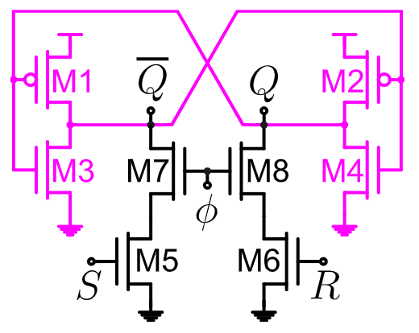

Il _latch SR con Enable_ ha la seguente tabella di verità:

Il _latch SR_ segue quindi la seguente tabella di verità

| $\phi$ |  $R$  |  $S$  |   $Q[n+1]$   |
| :----: | :---: | :---: | :----------: |
|  $0$   |  $X$  |  $X$  |    $Q[n]$    |
|  $1$   |  $0$  |  $0$  |    $Q[n]$    |
|  $1$   |  $0$  |  $1$  |     $1$      |
|  $1$   |  $1$  |  $0$  |     $0$      |
|  $1$   |  $1$  |  $1$  | Non Permesso |

L'implementazione appena vista comporta l'utilizzo di $8$ transistori. Nell'ottica di ridurre il numero di transistori possiamo considerare anche un'implementazione a **6 transistori**, che rimuove gli `NMOS` pilotati dagli ingressi, collegando direttamente gli ingressi ai transitori pilotati da $\phi$, invertendo però i collegamenti rispetto a prima.

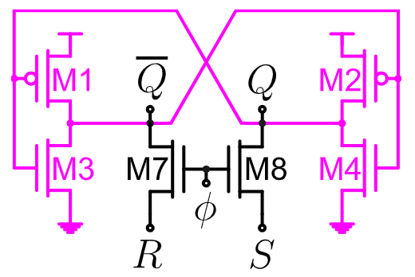

In questo caso abbiamo però due casi non permessi:
- $\phi = 1$, $S = 0$ e $R = 0$: pone $\overline{Q} = Q = 0$, che comporta che nel latch si formi un percorso chiuso con $V_{DD}$
- $\phi = 1$, $S = 1$ e $R = 1$: pone $\overline{Q} = Q = 1$, che comporta che nel latch si formi un percorso chiuso con _ground_

La tabella di verità:

| $\phi$ |  $R$  |  $S$  |   $Q[n+1]$   |
| :----: | :---: | :---: | :----------: |
|  $0$   |  $X$  |  $X$  |    $Q[n]$    |
|  $1$   |  $0$  |  $0$  | Non Permesso |
|  $1$   |  $0$  |  $1$  |     $1$      |
|  $1$   |  $1$  |  $0$  |     $0$      |
|  $1$   |  $1$  |  $1$  | Non Permesso |

## 2.3. D-Latch

Il **D-Latch**, o _Data Latch_, è un miglioramento diretto del _Latch SR con Enable_ pensato per:
- Semplificare la memorizzazione dei bit
- Eliminare stati indeterminati

Se $\phi = 0$ la condizione è analoga a quella precedente. ovvero la **Memorizzazione*: $Q$ mantiene l'ultimo valore di $D$ prima della transizione $1 \to 0$ di $\phi$.

Se invece $\phi = 1$ siamo in _trasparenza_, che significa che $Q = D$ in tempo reale, propagando il segnale e, di conseguenza, eventuali glitch.

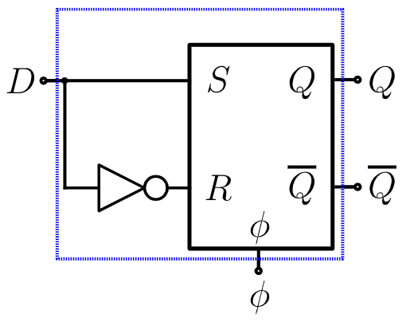

Una possibile implementazione compatta del _D-latch_ si basa sull'utilizzo di due inverter e due porte di trasmissione (o semplici `NMOS`), sfruttando due **fasi non sovrapposte**.

Questa implementazione utilizza due segnali di enable $\phi_1$ e $\phi_2$ che hanno come regola quella di **non doversi mai sovrapporsi** se non in piccoli transienti, che riescono ad essere mitigati dalle capacità di gate degli inverter.

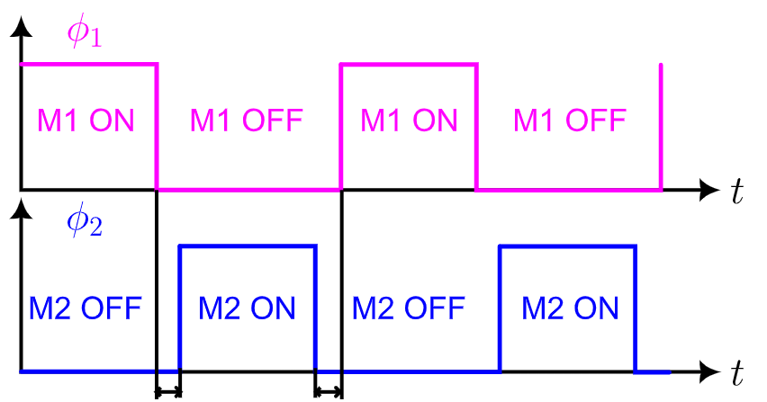

Se infatti $\phi_1 = \phi_2 = 1$, quello che accade è che `D` e `Q` vengono _cortocircuitati_, potendo assumere valori flottanti non conoscibili a priori.

I vari stati della porta sono:
- $\phi_1 = 1$: _trasparenza_
- $\phi_2 = 1$: _memorizzazione_

<figure class="">
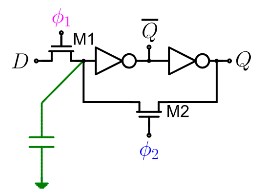
<figcaption>

Il condensatore non è inserito come componente esterno ma serve a rappresentare la capacità di gate degli inverter.
</figcaption>
</figure>

## 2.4. Flip-Flop

A differenza dei latch, i _**Filp-Flop**_, o **Multivibratori Bistabili**, sono circuiti che campionano gli ingressi solo su **un finaco di un segnale** periodico di temporizzazione.

Le uscite cambiano quindi solo su un fianco determinato del _clock_, che _**elimina problemi di trasparenza**_.

### 2.4.1. Flip-Flop di tipo D

Si chiama _**D-Edge Triggered Flip-Flop**_, un _flip-flop_ creato a partire da due _Compact D-latch_ polotati in fasi di clock non sovrapposte, così da evitare la trasparenza tra ingresso e uscita e _race-through_ del risultato.

Questa configurazione è chiamata _master/slave_.

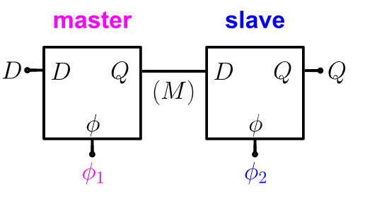

La temporizzazione di questo tipo di configurazione è la seguente:

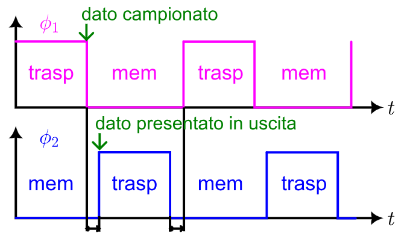

Il circuito completo è quindi il seguente:

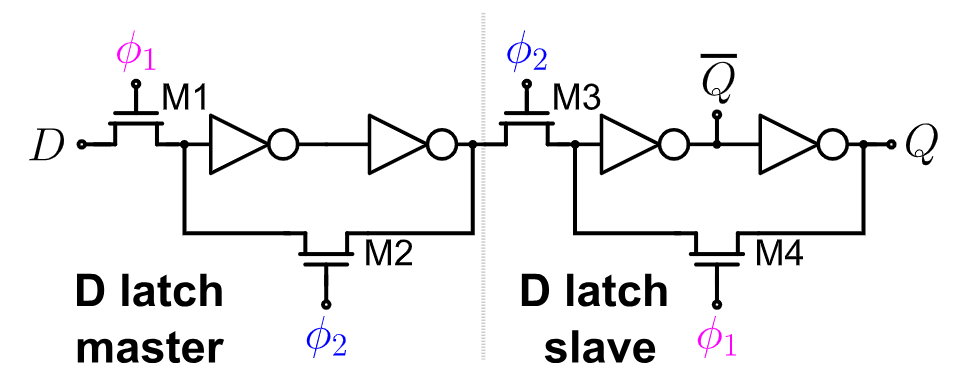

# 3. Memorie Volatici CMOS

Le _memorie a stato solido_ impiegate dai microcontrollori embedded ai data center sono basate su **Tecnologia CMOS**.

Le loro caratteristiche principali sono:
- Scalabilità e Affidabilità
- Basso consumo energetico
- Tempi di Accesso nell'ordine dei nanosecondi

Le `RAM` (_Random Access MEmori_) permettono di accedere a qualsiasi cella in tempo costantem indipendentemente dalla sua posizione fisica.

Le ram si dividono in _Static-RAM_, o `SRAM`, e _Digital-RAM_ o `DRAM`.

Le differenze sono suelle caratteristiche di dimensioni, densità e temppi di accesso:

|  Tipo  |     Densità     |  Area per `1GB`  | Appilcazione Tipica | Velocità  |   Costo    |
| :----: | :-------------: | :--------------: | :-----------------: | :-------: | :--------: |
| `SRAM` | $200$ $Mb/mm^2$ | $\sim 40$ $mm^2$ |      Cache CPU      | $10-100X$ | $\sim 50X$ |
| `DRAM` | $10$ $Gb/mm^2$  | $\sim0.8$ $mm^2$ |   RAM principale    |   $1X$    |    $1X$    |

La loro architettura interna comprende una struttura matriciale e dei circuiti periferici che gestiscono la lettura e la scrittura.

La matrice è spesso quadrata, ed ogni cella al suo interno è identificata da:
- **Word Line** $WL$: identifica l'_indirizzo di riga_
- **Bit Line** $BL$: identifica l'_indirizzo di colonna_

Per avere la rappresentazione binaria di $2^M$ $WL$ si utilizza un decodificatore di indirizzi di `M` bit

Similmente, le $2^N$ $BL$ vengono indirizzate da `N` bit. La differenza è che il dato della cella indirizzata deve poter essere **sia letto che scritto**. È quindi necessario utilizzare un _MuxDemux_ per riuscire a effettuare le due operazioni.

Si utilizzano dei _Sense Amplifier_ per riuscire a garantire la lettura dei segnali _"deboli"_ provenienti dalla cella, e dei _driver_ per scrivere il dato sulla cella identificata.

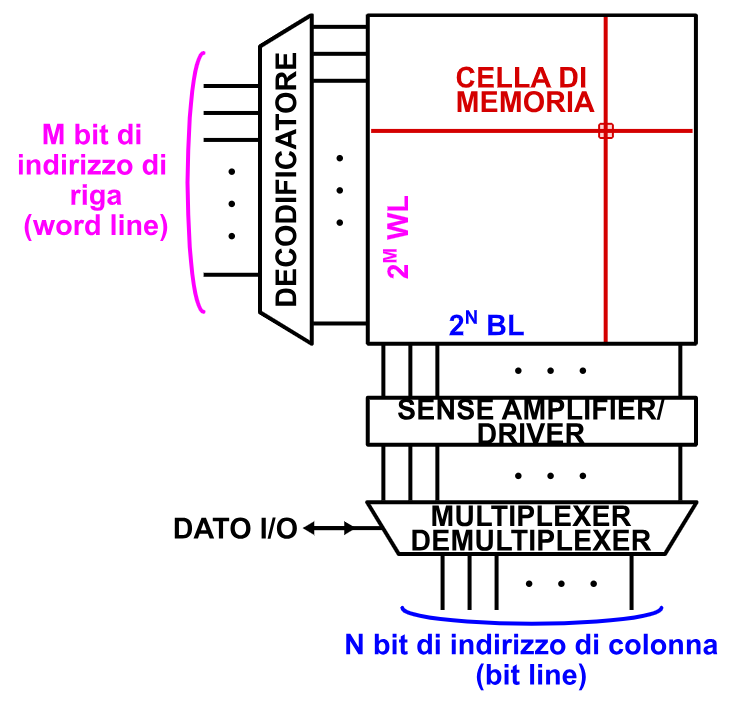

## 3.1. SRAM

La singola cella è costurita a partire da un _latch SR_ a 6 transistori:

Scrittura

I passaggi sono i seguenti
1. Attraverso i circuiti di pilotaggio si forzano $BL$ e $\overline{BL}$
2. Si attiva la $WL$ in modo che i transistori di passo $M1$ e $M2$ permettano l'imposizione dello stato imposto
3. Si rilascia $WL$, isolando il latch dal resto delle $BL$, che rimane quindi in stato di memorizzazione

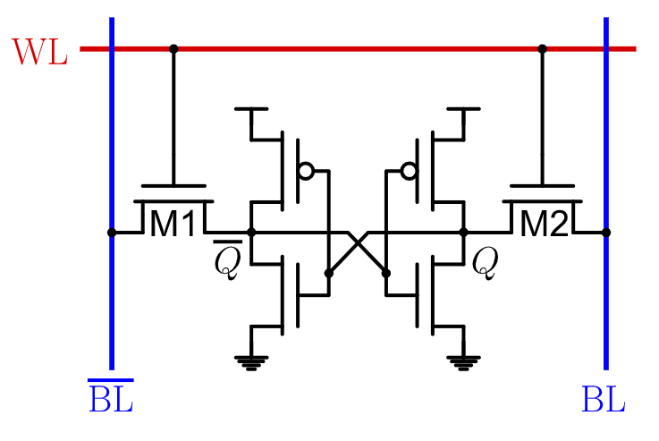

Lettura

Inizialmente si:
- Precarica $BL$ e $\overline{BL}$ a $\frac{V_{DD}}{2}$
- Si attiva la $WL$ per mandare in saturazione i due transistori $M1$ e $M2$

A questo punto le azioni si differenziano a seconda del valore che era contenuto nella cella.

Se $Q = 1$:
- $M3$, che era in saturazione, comincia a **scaricare** $\overline{BL}$ verso _ground_
- $M6$, che era in saturazione, comincia a **caricare** $BL$ verso $V_{DD}$

Se invece $Q = 0$ la situazione è simmetrica:
- $M4$, che era in saturazione, comincia a **scaricare** $BL$ verso _ground_
- $M5$, che era in saturazione, comincia a **caricare** $\overline{BL}$ verso $V_{DD}$

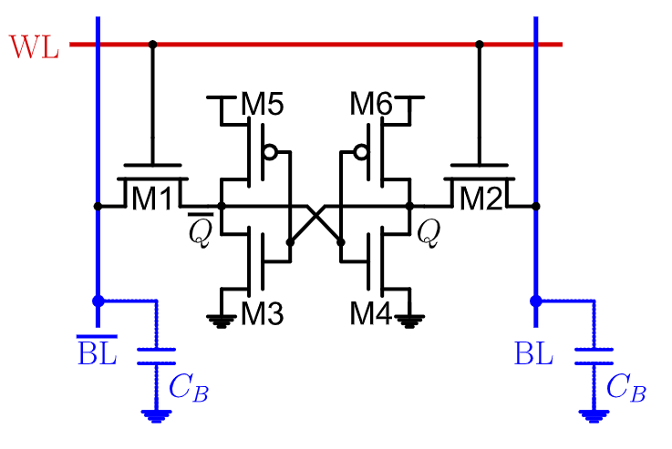

La scarica/carica della $BL$ è molto lenta, dato che i transistori sono molto piccoli e hanno poca capacità di portare grandi correnti. D'altro canto invece $C_B$ è relativamente grande, dato che la $BL$ è tipicamente lunga.

Occorre quindi avere un circuito che interviene per **amplificare velocemente il piccolo sbilanciamento di tesione** che la cella provoca tra $BL$ e $\overline{BL}$.

Ecco che entra in gioco il _**Sense Amplifier**_:

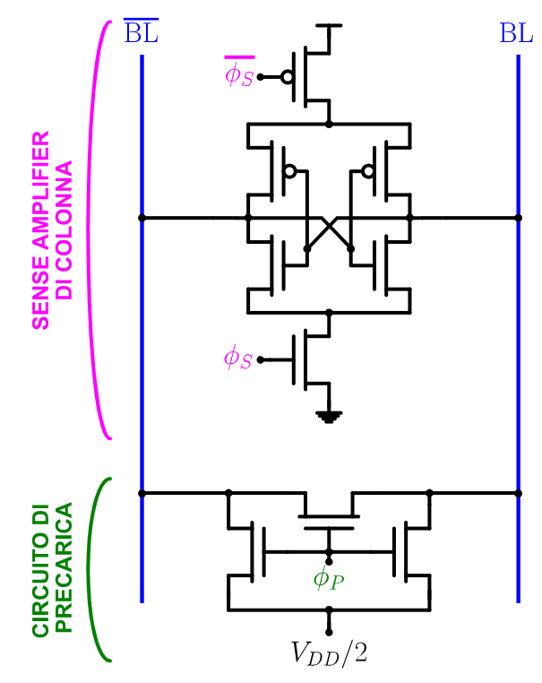

Il circuito di precarica è attivo nella prima fase, e si occupa proprio di portare alla tensione sulle _bitline_ a  $\frac{V_{DD}}{2}$.

Questo valore è legato al fatto che tutti i transistori utilizzati nella memoria e nei vari circuiti abbiano le stesse caratteristiche ($W$, $L$, $\mu$, ...)

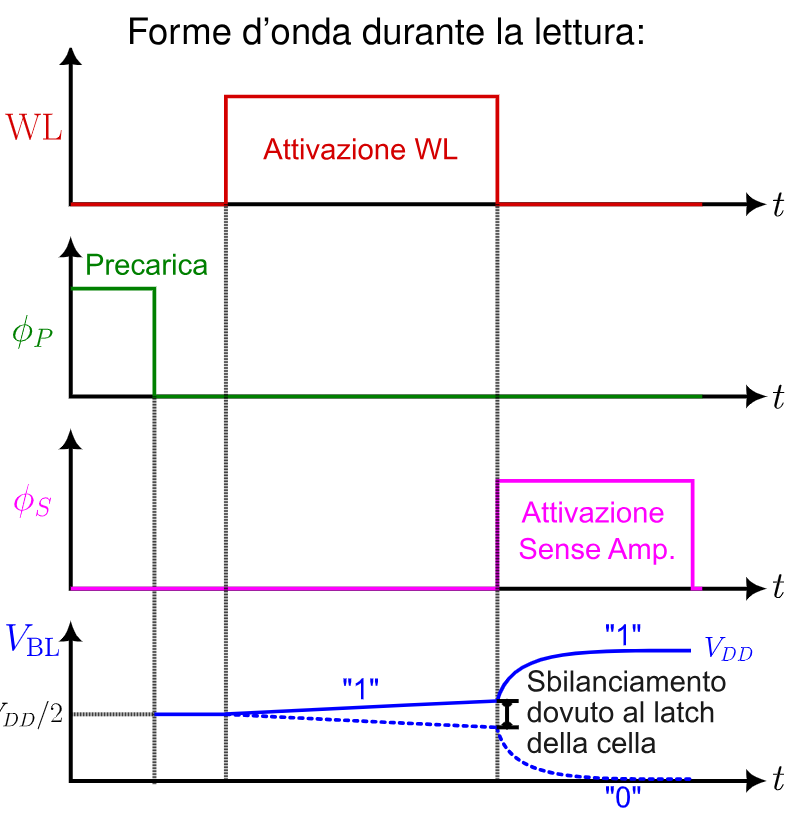

## 3.2. DRAM

Le celle della memoria dinamica sono costruite sfruttando i processi di carica dei transistori.

La cella è quindi basata su un condensatore e e un trasnsitore di passo `NMOS`.

In scrittura per impostare il valore `1` è necessario che
$$
\begin{cases}
	V_{BL} = V_{DD} \\
	V_{C_S} = V_{DD} - V_T
\end{cases}
$$

Se invece volessimo resettare è entrambe le tensioni sarebbero $0$.

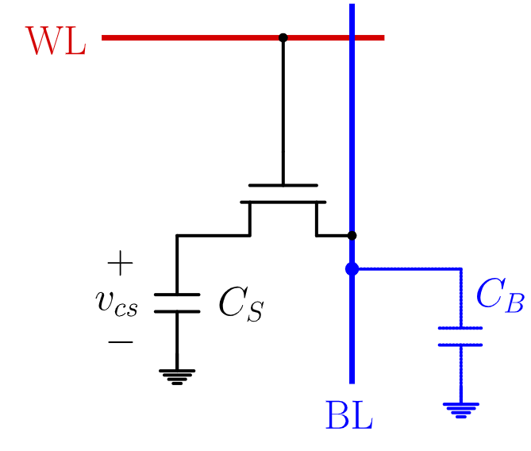

Per quanto riguarda la lettura saranno necessari più passaggi:
1. Precarica di $BL$ a $\frac{V_{DD}}{2}$
2. Attivazione di $WL$

In questo caso i due condensatori $C_B$ e $C_S$ condivideranno la carica dopo un trasitorio (dovuto a $R_{ON} \ne 0$ del trasnsitore). Alla fine del transitorio le tensioni $V_{BL}$ e $V_{CS}$ avranno lo stesso valore.

La carica invece si conserva:
$$
\begin{align*}
	C_S &\cdot V_S + C_B \cdot \frac{V_{DD}}{2} = (C_S + C_B) \cdot V_{BL} \\
	V_{BL} &= \frac{C_S}{C_S + C_B}V_{CS} + \frac{C_B}{C_S + C_B} \cdot \frac{V_{DD}}{2} \\
	V_{BL} &= \frac{C_S}{C_S + C_B}V_{CS} + (1 - \frac{C_S}{C_S + C_B}) \cdot \frac{V_{DD}}{2} \\
	V_{BL} &= \frac{V_{DD}}{2} + \frac{C_S}{C_S + C_B}(V_{CS} - \frac{V_{DD}}{2}) \\
	V_{BL} &= \frac{V_{DD}}{2} + \Delta V
\end{align*}
$$

Se $V_{CS} = V_{DD} - V_T$:
$$
\begin{CD}
	{\Delta V > 0} @>>> {V_{BL} > \frac{V_{DD}}{2}}
\end{CD}
$$

Se invece avessimo $V_{CS} = 0$:
$$
\begin{CD}
	{\Delta V < 0} @>>> {V_{BL} < \frac{V_{DD}}{2}}
\end{CD}
$$

Alcuni valori tipici di queste quantità sono:
$$
\begin{cases}
	C_B = 30 C_S \\
	V_{DD} = 5\;V \\
	V_T = 1.5\;V \\
	\Delta V(0) = −83\; mV
	\Delta V(1) = +33\; mV
\end{cases}
$$

Nelle letture della `DRAM`, il _Sense Amplifier_ avrà una _**Struttura Differenziale**_. È infatti necessario fornire un secondo ingresso collegato ad una cella di memoria fittizia, chiamata _Dummy_.

Il _Sense Amplifier_ viene quindi posizionato a **metà della colonna**, separando la $BL$ in due parti, chiamate $BL_u$ e $BL_d$, ciascuna collegata a uno degli ingressi e ogniuna collegata con la cella _dummy_, precaricate entrambe a $\frac{V_{DD}}{2}$.

Quando l'indirizzo di $WL$ seleziona una cella appartenente a a una delle due zone,verrà attivata la cella _dummy_ dell'altra zona.

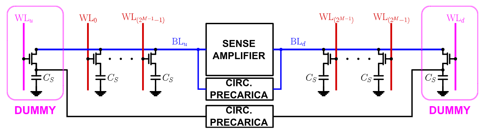
