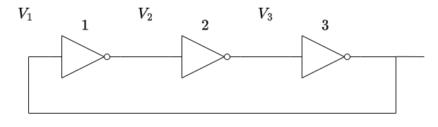
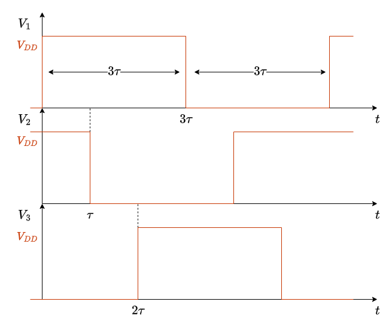
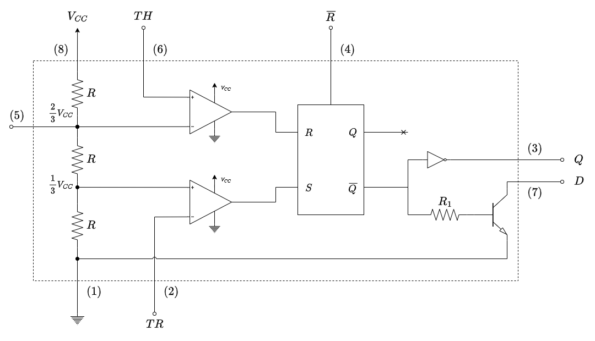
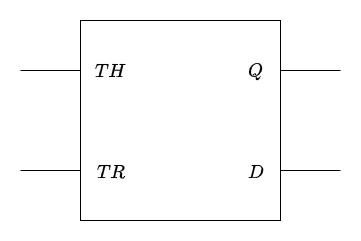
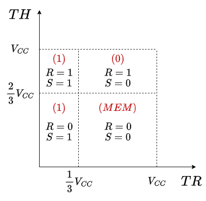
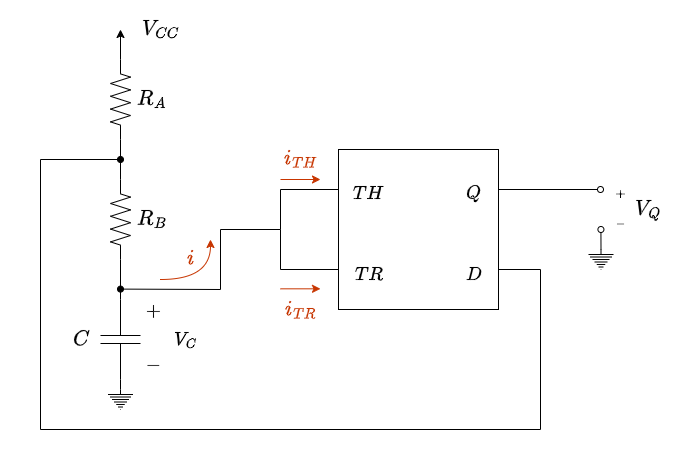
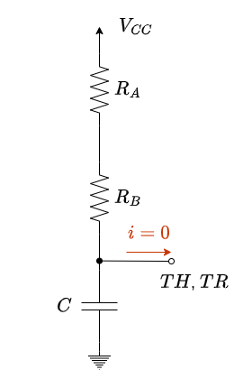
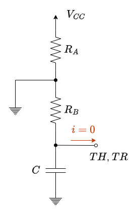
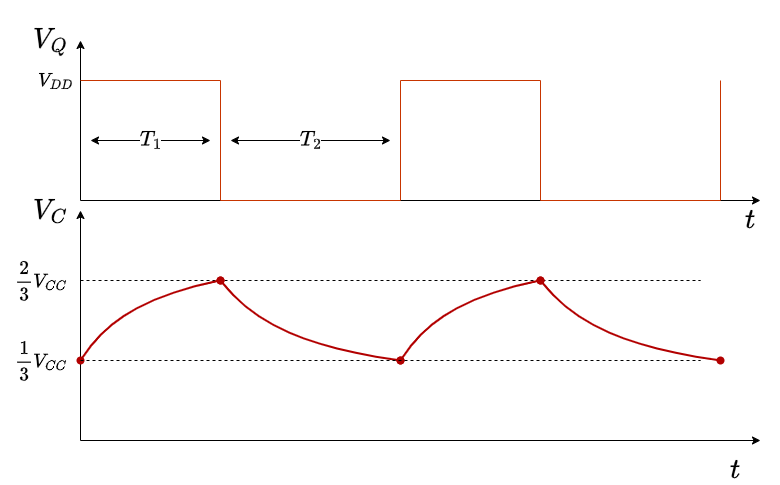

# 1. Indice

- [1. Indice](#1-indice)
- [2. Multivibratori](#2-multivibratori)
	- [2.1. Circuiti Astabili](#21-circuiti-astabili)
		- [2.1.1. Oscillatore ad Anello](#211-oscillatore-ad-anello)
		- [2.1.2. Circuito Integrato - `NE 555`](#212-circuito-integrato---ne-555)

# 2. Multivibratori

I multivibratori sono circuiti "a stati", e si suddividono in tre categorie:
- **Monostabili**: sono circuiti con _un solo stato stabile_. Quando vengono sollecitati da un _trigger_ esterno passano un certo tempo definito $T$ in uno stato _astabile_, per poi tornare alla stabilità. Un esempio classico di _multivibratore monostabile_ è il _timer_
- **Bistabili**: sono circuiti con _due stati stabili_ che si scambiano tra loro quando sollecitati dall'esterno da uno o più comandi. Alcuni esempi classici sono i _flip-flop_ o i _latch_.
- **Astabili**: sono circuiti _che non hanno nessuno stato stabile_, e solitamente continuano ad alternarsi in modo automatico tra più di essi. Un esempio classico è il _generatore clock_.

Ai fini del corso, non vedremo i circuiti monostabili ma ci concentreremo sugli **Astabili** e sui **Bistabili**.

## 2.1. Circuiti Astabili

Sono circuiti senza uno stato stabile, ma che continuano ad alternarsi automaticamente tra più di essi.

Esistono diverse implementazioni per avere dei circuiti astabili, ne vediamo alcune.

### 2.1.1. Oscillatore ad Anello

È costituito da un numero dispari di _inverter_ in serie, dove l'uscita dell'ultimo è collegata all'entrata del primo.

Il fatto che il numero di inverter sia dispari implica che il segnale che entra dal primo uscirà dall'ultimo invertito, e procederà a rientrare nel primo per invertirsi nuovamente e così via.

Studiamo il caso più semplice a $3$ inverter, chiamando $V_1$, $V_2$ e $V_3$ le tensioni tra gli inverter.

Essendo un sistema _astabile_ è più complesso studiare l'andamento delle tensioni dato che non abbiamo una situazione stabile di partenza.

Supponiamo quindi di avere come condizione iniziale che al tempo $t = 0$ la tensione $V_1$ viene commutata a $V_{DD}$ e che gli inverter siano tutti uguali con tempo di ritardo $\tau$.

La tensione $V_2$ si renderà conto della commutazione di $V_1$ solamente dopo un certo tempo $\tau$, per poi andare a $0$.
Analogamente, la tensione $V_3$ si renderà conto dopo un ulteriore tempo $\tau$ che $V_2$ è commutata, per salire a $1$.

Dopo un altro tempo $\tau$, quindi per un totale di $3 \tau$ dall'inizio, la tensione $V_1$ verrà commutata nuovamente a $0$.

Quello che otteniamo è quindi un segnale instabile di periodo $T_3 = 6 \tau$.

In generale, con $n = 2k + 1$ inverter, il periodo sarà di $T_n = 2n \tau$, e di conseguenza la frequenza sarà:

$$
	f_n = \frac{1}{2n\tau}
$$

Il _Duty Cycle_ $D$ di questo circuito è:

$$
	D = \frac{T_{ON}}{T_{S}} = \frac{n \tau}{2n \tau} = \frac{1}{2}
$$

Se i tempi di ritardo degli inverter fossero diversi $(\tau_1, \tau_2, ...)$:

$$
\begin{align*}
	T_S &= 2 \cdot \sum_{i=1}^n{\tau_i} \\
	D &= \frac{\sum_{i=1}^n{\tau_i}}{T_S} = \frac{1}{2}
\end{align*}
$$

In questo caso la frequenza rappresenta una specie di "media" su ogni quanto si ha la commutazione.

### 2.1.2. Circuito Integrato - `NE 555`

L'`NE 555` è un componente degli anni '70 che, poiché è molto semplice da utilizzare, si trova ancora oggi in molti circuiti.

Esternamente è il classico componente ad 8 _pin_.

Al suo interno è composto come sulla destra: tre resistenze uguali in serie collegate tra il piedino $(8)$ $(V_{CC} \in [4 \div 15]$ $V)$ e il piedino $(1)$ collegato a _ground_.

Le tensioni tra le resistenze vengono portate in ingresso a dei comparatori a loop aperto dove:
- $\frac{2}{3}V_{CC}$ viene portato sul meno del comparatore e sul piedino $(5)$. Sul _più_ viene portata una tensione di _threshold_ $TH$ proveniente dal piedino $(6)$
- $\frac{1}{3}V_{CC}$ viene portato sul più del comparatore. Sul _meno_ viene portata una tensione di _trigger_ $TR$ proveniente dal piedino $(2)$

L'uscita dei comparatori viene portato in ingresso ad un **flip-flop SR** che, oltre ad avere in uscita sul piedino $(4)$ $\overline{R}$ con priorità elevata per il reset completo del circuito, collega l'uscita $\overline{Q}$:
- Attraverso un inverter porta $Q$ in uscita sul piedino $(3)$
- Attraverso una resistenza $R$ è portato all'ingresso di un _transistore bipolare_ $Q_1$ che ha come _Collettore_ $D$ il piedino $(7)$, mentre l'emettitore è collegato a _ground_ $(1)$.

Nello schema che utilizzeremo noi negli esercizi noi considereremo solamente **4 pin**:

Se la soglia $TH > \frac{2}{3}V_{CC}$, allora nel comparatore avremo un uscita dal comparatore alta, ovvero $R = 1$. Analogamente, se $TR < \frac{1}{3}V_{CC}$, il comparatore ci fornirà un uscita alta, ovvero $S = 1$.

Il _flip-flop_ p pensato per avere priorità sul **Set**, ovvero:

| `R`\\`S` |   `0`    |  `1`  |
| :------: | :------: | :---: |
|   `0`    | mantiene |  `1`  |
|   `1`    |   `0`    |  `1`  |

L'inveritore è inserito per riuscire ad avere correnti maggiori di quelle che il _flip-flop_ riesce ad erogare.

Il transistore $Q_1$ invece è scelto in modo che quando $\overline{Q} = 1$, allora va in **forte saturazione**, che implica che $D$ è cortocircuitata a _ground_, ovvero $D = 0$.

Se studiamo la correlazione tra $TH$ e $TR$ possiamo individuare quattro quadranti che identificano le nostre zone operative.

Se $TH < \frac{2}{3}V_{CC}$:
- $TH < \frac{1}{3}V_{CC} \to$ `S = 1` e `R = 0` &emsp; L'uscita vale `1`
- $\frac{1}{3}V_{CC} < TH < V_{CC} \to$ `S = 0` e `R = 0` &emsp; L'uscita è in **memorizzazione**

Se $\frac{2}{3}V_{CC} < TH < V_{CC}$:
- $TH < \frac{1}{3}V_{CC} \to$ `S = 1` e `R = 1` &emsp; L'uscita vale `1`
- $\frac{1}{3}V_{CC} < TH < V_{CC} \to$ `S = 0` e `R = 1` &emsp; L'uscita vale `0`

Per capire come utilizziamo il `NE 555` dovviamo analizzare il seguente circuito:

Colleghiamo in entrata una serie di 2 resistenze $R_A$ e $R_B$ e un condensatore $C$.
Colleghiamo in entrata su $TH$ e $TR$ il nodo tra $R_B$ e il condensatore, mentre colleghiamo il nodo tra le resistenze a $D$.

Ricordiamo che in condizioni ideali, i due amplificatori operazionali non assorbono corrente, perciò possiamo considerare $i_{TH} = i_{TR} = i = 0$.

Prenderemo la tensione di uscita $V_Q$ da $Q$ con riferimento a _ground_.

Per analizzarlo studiamo la fase di _set_, storicamente considerata come "prima fase", dove $Q = 1$.
Se $Q = 1$, allora $\overline{Q} = 0$ che significa che il transistore è **interdetto**, perciò $D$ sarà in _**Alta Impedenza**_ ($HI$).

In questo caso quindi la tensione $V_C$ applicata al condensatore è la stessa applicata a $TH$ e $TR$. Poiché abbiamo appena avuto un _set_ dell'uscita, significa che la tensione $TR$ deve essere appena scesa sotto $\frac{1}{3}V_{CC}$.

Poiché $D$ è in alta impedenza, l'unico circuito rimane quello sulla destra.

In questo circuito il condensatore quindi tende a caricarsi, poiché ha una tensione $V_C < V_{CC}$.

In un primo momento la tensione sale fino a $V_C < \frac{2}{3}V_{CC}$, entrando nella fase di memorizzazione che non altera lo stato dell'uscita del nostro `NE 555`.

Quando la tensione sale oltre $V_C > \frac{2}{3}V_{CC}$, succede che `S = 0` e `R = 1`, che provoca la **commutazione dell'uscita**, entrando di fatto nella **fase di reset**.

In questa fase $Q = 0$, ovvero $V_{CC} = 0$. Ciò comporta che $\overline{Q} = 1$, e quindi $D$ viene collegato a _ground_, ovvero $D = 0$.

Proprio perch il terminale $D$ è messo a ground, il circuito equivalente diventa il seguente:

Il condensatore in questo momento ha una tensione $\frac{2}{3}V_{CC}$, quindi **procede a scaricarsi** facendo passare corrente su $R_B$.

Se non ci fosse commutaizone, il condensatore si scaricherebbe completamente.

In realtà quando arriva a $\frac{1}{3}V_{CC}$, l'uscita **commuta nuovamente** tornando nella fase di _set_.

Possiamo vedere di seguito gli andamenti della tensione $V_Q$ e $V_C$ nel tempo:

I tempi $T_1$ e $T_2$ sono legati al condensatore e alle resistenze. Infatti $T_1$ rappresenta il tempo necessario per **caricare un condensatore da $\frac{1}{3}V_{CC}$ a $V_{CC}$**.

Ricordando l'equazione di carica di un condensatore:
$$
	V_C(t) = V_f + (V_i - V_f) e^{-\frac{t}{\tau}}
$$

Ricaviamo un espressione per $T_i$:
$$
\begin{align*}
	V_C(t = t_1) = V_{COM} &= V_f + (V_i - V_f)e^{T_i \over \tau} \\
	e^{T_i \over \tau} &= \frac{V_i - V_f}{V_{COM} - V_f} \\
	T_i &= \tau \cdot \ln{\Biggl(\frac{V_i - V_f}{V_{COM} - V_f}\Biggr)}
\end{align*}
$$

Se la applichiamo alla fase di _set_ abbiamo che
$$
\begin{cases}
	V_{i_1} = \frac{1}{3}V_{CC} \\
	V_{f_1} = V_{CC} \\
	V_{COM_1} = \frac{2}{3}V_{CC} \\
	\tau_1 = C \cdot R_V = C \cdot (R_A + R_B)
\end{cases}
$$

Che quindi ci permette di dire che:
$$
\large
\begin{align*}
	T_1 &= C \cdot (R_A + R_B) \cdot \ln{\Biggl(\frac{\frac{1}{3}V_{CC} - V_{CC}}{\frac{2}{3}V_{CC} - V_{CC}}\Biggr)} \\
		&= C \cdot (R_A + R_B) \cdot \ln{\Biggl(\frac{-\frac{2}{3}V_{CC}}{-\frac{1}{3}V_{CC}}\Biggr)} \\
		&= \boxed{C \cdot (R_A + R_B) \cdot \ln{(2)}} \\
\end{align*}
$$

Se invece lo applichiamo alla fase di _reset_:
$$
\begin{cases}
	V_{i_2} = \frac{2}{3}V_{CC} \\
	V_{f_2} = 0 \\
	V_{COM_2} = \frac{1}{3}V_{CC} \\
	\tau_2 = C \cdot R_V = C \cdot R_B
\end{cases}
$$

Il tempo $T_2$ vale quindi:
$$
\large
\begin{align*}
	T_2 &= C \cdot R_B \cdot \ln{\Biggl(\frac{\frac{2}{3}V_{CC} - 0}{\frac{1}{3}V_{CC} - 0}\Biggr)} \\
		&= \boxed{C \cdot R_B \cdot \ln{(2)}} \\
\end{align*}
$$

Il periodo $T$ quindi:
$$
\Large
\boxed{
	T = T_1 + T_2 = C \cdot \ln{(2)} \cdot (R_A + 2R_B)
}
$$

Mentre il _Duty Cicle_:
$$
\Large
\boxed{
	D = \frac{T_1}{T} = \frac{R_A + R_B}{R_A + 2R_B}
}
$$

Questo circuito ha quindi _Duty Cycle_ **necessariamente minore di** $\frac{1}{2}$, ma comunque, con scelte opportune di $R_A$ e $R_B$, possiamo avvicinarci al valore ideale.

In generale, per questo tipo di circuiti, affinché si verifichi la commutazione astabile è necessario che siano valide le cascate di disuguaglianze:
$$
\LARGE
\boxed{
	\begin{cases}
		V_{i_1} < V_{COM_1} < V_{f_1} \\
		V_{i_2} > V_{COM_2} > V_{f_2}
	\end{cases}
}
$$

