# 1. Indice

- [1. Indice](#1-indice)
- [2. Regolatori di Tensione Lineare Serie](#2-regolatori-di-tensione-lineare-serie)
	- [2.1. Reiezione dei Disturbi](#21-reiezione-dei-disturbi)
	- [2.2. Circuito Integrato](#22-circuito-integrato)
	- [2.3. Regolatore di Corrente](#23-regolatore-di-corrente)
	- [2.4. Considerazioni Energetiche](#24-considerazioni-energetiche)
- [3. Regolatori Switching/a Commutazione](#3-regolatori-switchinga-commutazione)
	- [3.1. Regolatore Flyback](#31-regolatore-flyback)
- [4. Passaggio Tensione Alternata-Costante](#4-passaggio-tensione-alternata-costante)
	- [4.1. Forward con Trasformatore](#41-forward-con-trasformatore)

# 2. Regolatori di Tensione Lineare Serie

È un circuito che ci permette di stabilizzare una tensione variabile.

Per ottenere questo mettiamo un _**Elemento di Passo**_, un elemento di potenza, tra ingresso e uscita che ci permetta di regolare l'ingresso per ottenere l'uscita che desideriamo.
Possiamo utilizzare come    _Elemento di Passo_ sia un **Transistore Bipolare** che un **Transistore MOSFET**.

Noi vedremo la formazione con il **BJT**:

Per riuscire a regolare il comportamento del **BJT** e mantenere costante l'uscita, prendiamo una partizione della tensione di uscita e la portiamo in ingresso ad un **Amplificatore Operazionale**, dove la confrontiamo con un riferimento di tensione.

Il riferimento può essere di tanti tipi, noi utilizziamo un **Diodo Zener** di tensione $V_Z$.

L'uscita dell'amplificatore viene collegata quindi alla base del **BJT**.

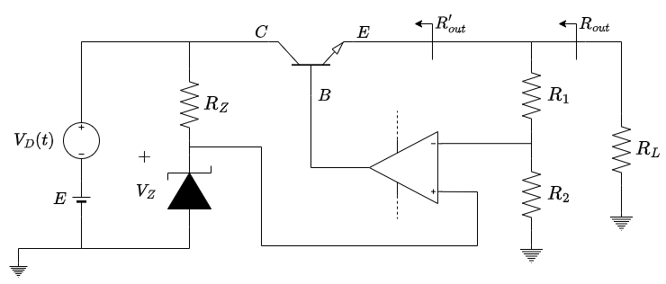

Verifichiamo quindi la reazione negativa ipotizzando:
- $\vert \beta A \vert \gg 1$
- Reazione Negativa
- Regime Lineare

Queste ipotesi ci permettono di operare in `MCCV`:
$$
\begin{CD}
\underbrace{
	\begin{align*}
		V^- &= \frac{R_2}{R_1 + R_2}V_o \\
		V^+ &= V_Z
	\end{align*}} \\
@V{V^+ \approx V^-}VV \\
\begin{align*}
	V_o\frac{R_2}{R_1 + R_2} &\approx V_Z \\
	V_o &= \frac{R_1 + R_2}{R_2} \cdot V_Z
\end{align*}
\end{CD}
$$

Per verificare la _reazione negativa_ iporizziamo che, per qualche motivo, $V_o \to V_o + \Delta V_o > V_o$.

Di conseguenza aumenterà anche $V^-$, mentre $V^+$ **resta costante**, facendo _diminuire_ la tensione di ingresso $V_{in} = V^+ - V^-$.

Questa diminuzione si propagan anche nell'_uscita dal circuito operazionale_, che produce di conseguenza una corrente sulla base inferiore e che fa diminuire anche la corrente $i_E$.

Tuttavia, se $i_E$ diminuisce, diminuisce anche la tensione che viene partizionata e di conseguenza **diminuisce $V_o$** facendolo tornare al valore originale.

Il nostro circuito è quindi in _**Reazione Negativa**_.

A monte della reazione, la resistenza vista sul regolatore $R_{out}'$ è la stessa della resistenza vista sull'emettitore $R_E$, che è tendenzialmente piccola.

Se calcoliamo invece la resistenza vista sul regolatore _comprendendo la reazione_, allora quello che vediamo è:
$$
R_{out} = \frac{R_{out}'}{1 - \beta A} \approx 0
$$

Questo sistema quindi si avvicina molto al caso ideale dei regolatori di tensione, che hanno $R_{out} = 0$.

È inoltre importante sottolineare che la presenza del passo, che sia un `BJT` o un `MOSFET`, provoca inesorabilmente una **caduta di tensione**, per la quale:
$$
	V_C > V_E
$$

La minima differenza di queste tensioni è detta **Dropout** e sarà importante nei circuiti integrati.

## 2.1. Reiezione dei Disturbi

Questo tipo di regolatore funziona finché $\vert \beta A \vert \gg 1$.

Avevamo visto che la risposta in ampiezza dell'amplificazione dell'amplificatore OPA in _open-loop_ è un valore alto per basse frequenze, ma ad alta frqeuenza diminuisce esponenzialmente.

In particolare ad alta frequenza quello che accade è che $\vert \beta A\vert$ non è molto grande.

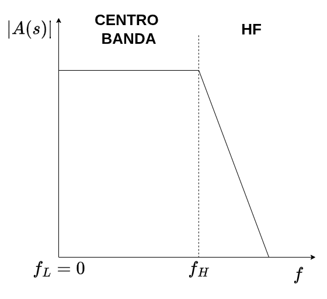

Anche se può sembrare che quelo che accade alle alte frequenze non influenzi il nostro operato in continua, dobbiamo considerare che _**i disturbi operano principalmente nelle alte frequenze**_.

In presenza di questi disturbi quindi non possiamo più utilizzare l'ipotesi `MCCV`, e l'effetto prodotto è che $R_{out} \ne 0$.

Per capire meglio cosa accade, supponiamo di voler caricare due carichi, di cui uno e sottoposto a rumore $V_n(t)$:

Se la corrente $i_2$ è sottoposta a rumore, questo rumore si propaga sulla corrente $i_Z$ e di conseguenza anche sulla corrente $i_1$.

Dobbiamo quindi riuscire a rimuovere le componenti in frequenza, e per farlo la cosa più semplice è mettere _**un condensatore in parallelo all'uscita**_.

Questo condensatore, se scelto opportunamente, nelle frequenze dei disturbi agisce da **corto circiuito**, annullando l'effetto del rumore.

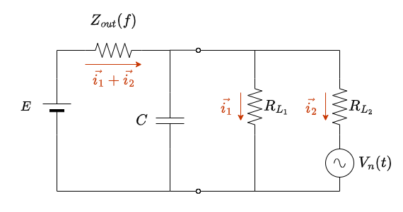

In particolare:
$$
\begin{CD}
		{Z_C = \frac{1}{j\omega C} = \frac{1}{j2\pi f C}} \\
		@VVV \\
		{
			\begin{matrix}
				\vert Z\vert  = \frac{1}{2\pi fC} \approx 0    & & \forall f
			\end{matrix}
		}
\end{CD}
$$

Per ottenere questo risultato scegliamo quindi condensatori con capacità $C$ _**grande**_ $( \in O(\mu F))$.

Questo tipo di condensatori nell'ordine dei _microfarad_ sono chiamati _**Condesatori Elettrolitici**_.

In pratica, l'introduzione di questo tipo di condensatori **rimuove i disturbi nelle basse frequenze** (decine di $kHz$), ma _**non rimuove i disturbu alle alte frequenze**_, ma tende quasi a aumentarli.

Questo accade per come i _condensatori elettrolitici_ sono costruiti:
1. Nelle basse frequenze si comportano come dei **Condensatori**
2. Nelle alte frequenze si comportano come delle **Induttanze**

Infatti il circuito equivalente è il seguente:

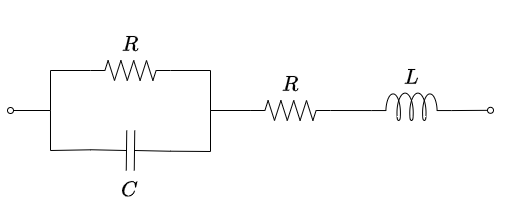

Per ovviare a questo probema si utilizzano _**Condensatori Ceramici**_, che hanno un comportamento in frequenza molto migliore di questo, ma che, per prezzi ragionaevoli, hanno capacità nell'ordine dei $O(nF \div pF)$.

Questi però non riescono bene a attenuare i disturbi a basse frequenze.

La soluzione è mettere nel nostro regolatore di tensione **due condensatori in parallelo**:
1. Un _**Condensatore Elettrolitico**_ $C \in O(\mu F)$ per le reiezioni sulle basse frequenze.
2. Un _**Condensatore Ceramico**_ $C \in O(nF \div pF)$ per le reiezioni alle alte frequenze dei disturbi e degli effetti    induttivi dell'altro condensatore

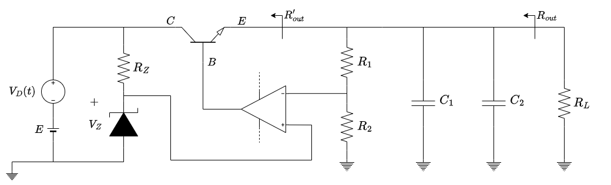

## 2.2. Circuito Integrato

È possibile acquistare i regolatori di tensione lineari serie come **circuiti integrati**.

Questi sono tipicamente identificati sul mercato sono identificati dalle sigle:
- `78XX`, `78` è la famiglia che indica le tensioni positive
- `79XX`, `79` è la famiglia che indica le tensioni negative

In entrambi i casi `XX` indica la tensione che sono in grado di erogare, ad esempio `7805` è un regolatore di tensione che eroga $+5V$, mentre `7905` è un regolatore che eroa $-5V$.

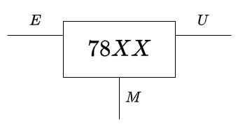

I circuiti integrati possiedono anche un altra specifica, ovvero la tensione di _**Dropout**_:
$$
V_{\operatorname*{DROP-OUT}} = \min{(V_E - V_U)}
$$

Se la differenza ai poli fosse inferiore alla tensione di dropout specificata, _**il regolatore non funziona**_.

## 2.3. Regolatore di Corrente

Attraverso i **Regolatori di Tensione Lineare Serie** è possibile costruire dei _**Regolatori di Corrente**_:

Le correnti $I_R$:
$$
\begin{align*}
	I_R &= \frac{V_x}{R} \\
	I_L &= I_R + I_M
\end{align*}
$$

In condizione di funzionamento la corrente $I_M \in O(mA)$, quindi $I_R \gg I_M$.

Questo comporta che:
$$
	I_L = I_R = \frac{V_X}{R}
$$

Quindi abbiamo in uscita una **corrente costante**, essendo sia $V_x$ che $R$ costanti.

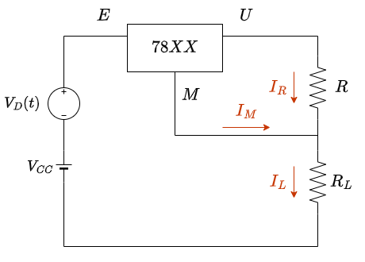

Ancora una volta questo schema **potrebbe non funzionare**, per via della tensione di _dropout_.

Sulla maglia più esterna infatti possiamo scrivere:
$$
\begin{align*}
	V_{CC} + V_D &= V_{EU} + V_X + R_LI_L \\
	V_{EU} &= E_{DC} - V_x - R_LI_L
\end{align*}
$$

Questo ci impone quindi un _**limite sulla**_ $R_L$. Se questa fosse troppo grande il valore di $V_{EU}$ potrebbe essere **inferiore alla tensione di dropout**

In particolare:
$$
\begin{align*}
	E_{DC} - V_X - R_LI_L &\ge V_{\operatorname{DROP-OUT}} \\[1em]
	R_L &\le \frac{E_{DC} - V_X -  V_{\operatorname{DROP-OUT}}}{V_X / R} \\
\end{align*}
$$

## 2.4. Considerazioni Energetiche

Il nostro elemento di passo, che sia `BJT` o `MKSFET`, _**consuma molta energia**_. Questo accade perché tutta la tensione di _dropout_, viene assorbita e necessita di essere "gestita", che sia attraverso raffreddamenti o altro.

Inoltre per riuscire a fornire alti voltaggi/amperaggi le tensioni in ingresso che dobbiamo dare all'amplificatore operazionale, affinché agisca di conseguenza sulla base, sono a loro volta alte.

# 3. Regolatori Switching/a Commutazione

Sono dei regolatori che dal punto di vista funzionale sono più complessi, ma ci permettono di avere alte tensioni con sprechi di energia minimi.

Per riusce a fare ciò si costruiscono questi oggetti con elementi di passo **che non dissipano energia**:
1. **Condensatori**
2. **Induttanze**
3. _**Interruttori**_: in realtà dissipano, ma molto meno delle resistenze

Se abbiamo un circuito come quello proposto sulla destra avremo:
$$
V_u = \begin{cases}
	E & t \in T_{ON} \\
	0 & t \in T_{OFF}
\end{cases}
$$

Dove $T_{ON}$ è il periodo dove l'interruttore è in conduzione, e $T_{OFF}$ è il periodo dove l'interruttore è aperto.

Chiamiamo il periodo $T_S = T_{ON} + T_{OFF}$.

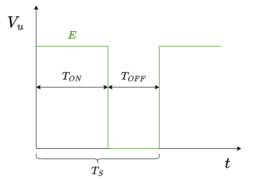

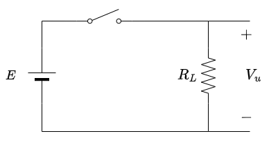

Il **valor medio** della tensione di uscita:
$$
\begin{align*}
	\overline{V}_u  &= \frac{1}{T_S} \int_{0}^{T_S}{V_u(t)\;dt} \\
					&= \frac{1}{T_S} \int_{0}^{T_{ON}}{E\;dt} \\
					&= \frac{T_{ON}}{T_S} \cdot E
\end{align*}
$$

Chiamiamo _**Duty Cycle**_:
$$
	D =\frac{T_{ON}}{T_{S}}
$$

Possiamo quindi manipolare il valor medio della tensione di uscita manipolando il _duty cycle_:
$$
\overline{V}_u = E \cdot D
$$

Per riuscire a elaborare il valor medio della nostra funzione possiamo porre un **filtro passa-basso** che vada a ignorare le armoniche di frequenza superiore del segnale (Trasformate di Fourier).

Utilizziamo un **Filtro Passa Basso Del Second'ordine**, con la frequenza di taglio
$$
\omega = \frac{1}{\sqrt{LC}}
$$

L'analisi in frequenza del circuito sulla destra ci produce un grafico simile a questo:

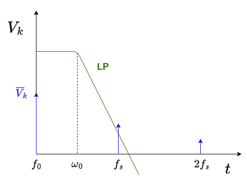

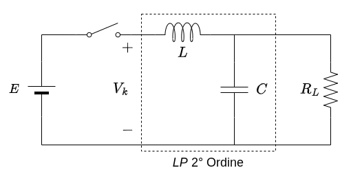

Questo circuito presenta ancora un problema, relativo al fatto di avere in serie **un interruttore** e un **induttanza**.
Infatti, durante i transitori l'interruttore è sottoposto a _**altissime tensioni**_ dovute all'induttanza $L$, che può arrivare a produrre degli archi.

Per ovviare a questo problema si collega tra il nodo tra l'induttanza e l'interruttore e il _ground_ un diodo, detto **_Regolatore di Forward_**:

<figure class="">
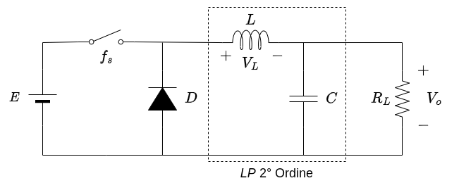
<figcaption>

Il diodo introduce della dissipazione dovuta alla tensione $V_\gamma$, ma è piccola e comunque necessaria per non rischiare di danneggiare l'interruttore.
</figcaption>
</figure>

Interruttore Chiuso

Il circuito equivalente in $T_{ON}$ è il seguente

<figure class="">
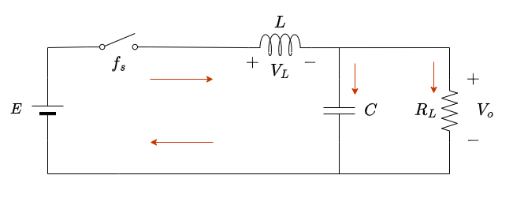
<figcaption>

Il Diodo è $OFF$
</figcaption>
</figure>

Interruttore Aperto

Il circuito equivalente in $T_{OFF}$ è il seguente

<figure class="">
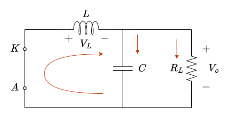
<figcaption>

Il Diodo è $ON$
</figcaption>
</figure>

Per analizzare questo circuito possiamo graficare la tensione ai capi dell'induttore $V_L$ in relazione alla tensione di uscita $V_o$, sapendo che:
- Nella fase $ON$ è data dalla differenza tra l'alimentazione e la tensione di uscita
- Nella fase $OFF$ è _**l'inversa della tensione di uscita**_

Allo stesso modo possiamo graficare la corrente ai capi dell'induttanza nel tempo, ricordando che:
$$
V_L = L \cdot {d i_L \over dt}
$$

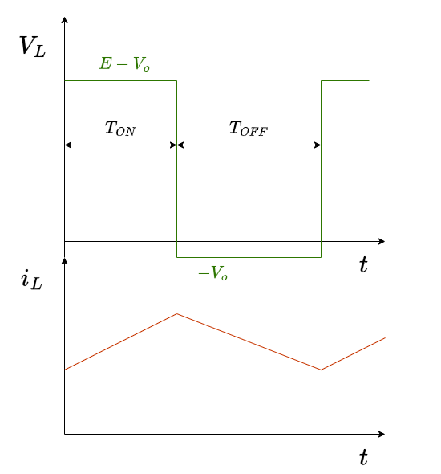

Essendo anche la corrente periodica:
$$
\begin{align*}
	i_L(t) &= i_L(t + T_S)  \\
	&\Downarrow \\
	\frac{1}{L}\int_0^{t}{V_L(\tau)\;d\tau} &= \frac{1}{L}\int_0^{t+T_S}{V_L(\tau)\;d\tau} \\
	\frac{1}{L}\int_0^{t}{V_L(\tau)\;d\tau} &= \frac{1}{L}\int_0^{t}{V_L(\tau)\;d\tau} + \frac{1}{L}\int_t^{t+T_S}{V_L(\tau)\;d\tau} \\
	&\Updownarrow \\
	\frac{1}{L}\int_t^{t+T_S}{V_L(\tau)\;d\tau} &= 0 \\
	&\Updownarrow \\
	\int_0^{T_S}{V_L(\tau)\;d\tau} &= 0
\end{align*}
$$

Abbiamo quindi ottenuto che l'integrale della tensione sul periodo _**deve essere nullo**_:
$$
\Large
\boxed{
	\int_0^{T_S}{V_L(\tau)\;d\tau} = 0
}
$$

Se recuperiamo quindi l'espressione analitica della $V_L$:
$$
\begin{CD}	
	{\int_0^{T_S}{V_L(\tau)\;d\tau} = (E-V_o)T_{ON} - V_oT_{OFF} = 0 }\\
	@VVV \\ 
	\begin{matrix}
		ET_{ON} - V_oT_{ON} - V_oT_S + V_oT_{ON} = 0 \\[1em]
		V_o = \frac{T_{ON}}{T_S} \cdot E = D \cdot E
	\end{matrix}
\end{CD}
$$

A dimostrazione che possiamo ancora regolare la tensione di uscita a partire dal **Duty Cycle**.

## 3.1. Regolatore Flyback

È un altra tipo di regolatore a commutazione, in particolare il circuito è il seguente:

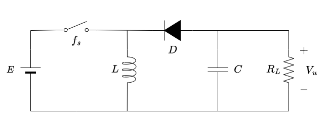

Se studiamo il comportamento del circuito:

Periodo ON

Durante il periodo $T_{ON}$ il circuito è il seguente:

<figure class="75">
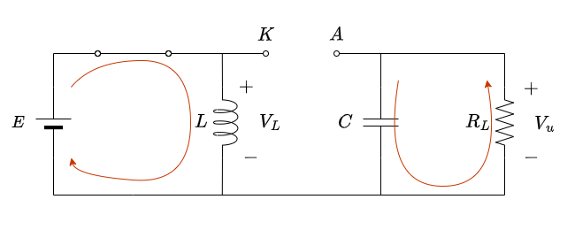
<figcaption>

Il diodo è $OFF$
</figcaption>
</figure>

La corrente circola solo nella maglia che comprende batteria e induttore, che si **carica**.

La resistenza e il condensatore non sono quindi collegate direttamente al generatore.

Periodo OFF

Durante il periodo $T_{ON}$ il circuito è il seguente:

<figure class="75">
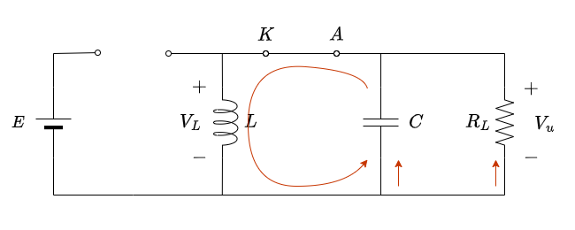
<figcaption>

Il diodo è $ON$
</figcaption>
</figure>

La batteria viene isolata dal circuito.

Nel circuito circola comunque corrente fornita dall'induttore, che si è caricato nel periodo di $ON$.

Durante questo periodo il condensatore si **carica**.

Nel semiperiodo $ON$ quindi sul carico _**ci sarà comunque corrente**_, fornita dal condensatore che si è caricato nel periodo $OFF$.

Graficando i valori della tensione nel circuito nel tempo:

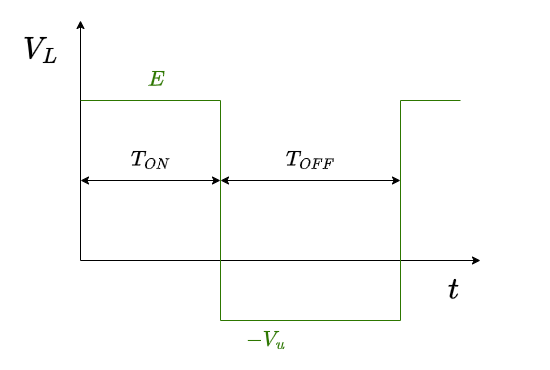

Otteniamo quindi una tensione **periodica**, che vale $E$ nel periodo $T_{ON}$ e $-V_u$ nel periodo $OFF$.

Possiamo quindi applicare il principio che abbiamo visto precedentemente, ovvero che:
$$
\begin{CD}
	{\int{V(t)\;dt} = 0} \\
	@VVV \\
	\begin{cases}
		E \cdot T_{ON} = V_u T_{OFF} \\
		T_{OFF} = T_S - T_{ON}
	\end{cases} \\
	@VVV \\
	\begin{aligned}
		E \cdot T_{ON} &= V_u (T_S - T_{ON}) \\
		E &= \frac{V_u}{D} - V_u = V_u \Bigl(\frac{1}{D} - 1\Bigr)
	\end{aligned}
\end{CD}
$$

La tensione di uscita sarà quindi:
$$
\large
	V_u = \frac{E}{\frac{1}{D} - 1} = \frac{D}{1 - D}\cdot E
$$

Questo significa che con questo circuito possiamo avere in uscita un _**uscita maggiore della tensione $E$ fornita dalla batteria**_, basta che $D > \frac{1}{2}$.
Questo è possibile proprio perché il carico non è connesso direttamente alla batteria, ma al condensatore e all'induttore, che si _**caricano**_ nel tempo.

# 4. Passaggio Tensione Alternata-Costante

Per passare da un'alta-tensione alternata a una tensione continua sul carico, lo schema a blocchi è il seguente:

<figure class="75">
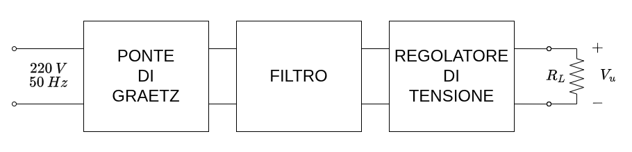
<figcaption>

La corrente arriva da tre fili **Fase**, **Neutro** e **Ground**.
Il cavo _neutro_ (tipicamente blu), se i collegamenti sono fatti bene, si dovrebbe trovare a valori quasi nulli, in quanto è collegato a _ground_.
Il cavo _ground_ (tipicamente giallo/verde) è la _messa a terra_.
</figcaption>
</figure>

In realtà questo schema è _**illegale**_. Questo perché, quando abbiamo un circuito che è connesso alla $220$, è _**obbligatoria la presenza di un isolamento Galvanizzante**_.

Esistono diversi tipi di isolamenti possibili:
- _Condensatori_
- _Ottici_: si separano i circuiti con dei collegamenti dove passano fotoni che poi vengono convertiti in corrente
- _**Trasformatore**_: tra primario e secondario si trova un isolamento elettrico. I due sono collegati infatti dal **campo magnetico**.

Immaginiamo di avere un circuito connesso alla $220$.

Il circuito lo possiamo immaginare come composto da due grandi _impedenze_ $Z_1$ e $Z_2$.
Tra di loro ci sarà una tensione che è compreso tra $0$ e $220$.

Quando qualcuno va a toccare il punto intermedio, formerà un circuito chiuso, in quanto la _**tensione è riferita a terra**_.

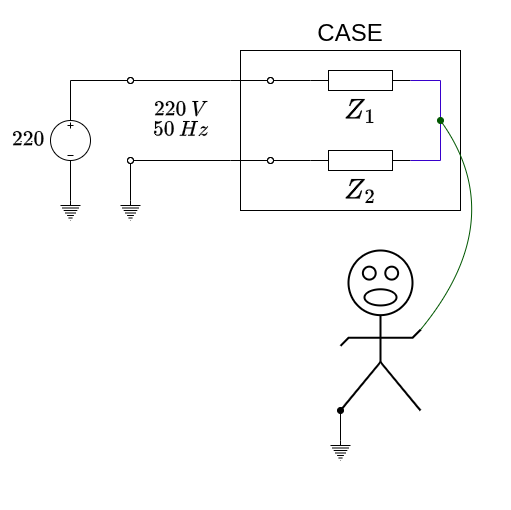

Se introduciamo invece un trasformatore, nella maglia del carico _**la tensione dell'induttore non è riferita a terra**_. 

Ciò significa che se qualcuno tocca _un_ punto del circuito, non passerà alcuna corrente.

Se invece dovesse toccare _due_ punti, allora andrebbe a chiudere il circuito con il proprio corpo.

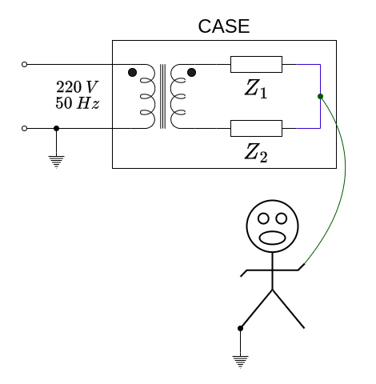

Dobbiamo quindi aggiungere il circuito isolante all'interno del nostro schema.

Se lo mettiamo a monte del circuito, prima del _ponte di graetz_, possiamo:
- Possiamo subito, attraverso il rapporto spire, abbassare la tensione
- _**Deve funzionare bene a $50$ $Hz$**_. I trasformatori che funzionano bene a queste frequenze pesano nell'ordine di _**diversi kilogrammi**_

Questo secondo punto ci spinge a spsotare il trasformatore in un altro punto della nostra catena, in quanto esistono trasformatori che operano nelle centinaia di $kHz$ della grandezza di pochi centimetri.

Il problema è che per come sono fatti i vari blocchi, non possiamo inserirlo in nessun'altro punto del circuito, in quanto dopo il ponte la **tensione è costante**.

Possiamo però _**introdurre un regolatore a commutazione**_ che rende la tensione costante nuovamente alternata (_onda quadra_), permettendoci di trasformarla 

## 4.1. Forward con Trasformatore

Il circuito è il seguente

<figure class="75">
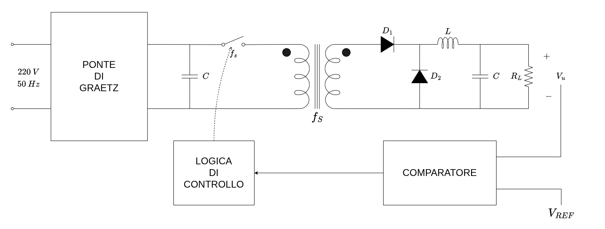
<figcaption>

Il condensatore agisce da _filtro_.
Il diodo $D_1$ serve per forzare la direzione della corrente di scarica nel semiperiodo di $OFF$, evitando che ritorni sul trasformatore.
</figcaption>
</figure>

In questa conformazione, possiamo utilizzare interruttori che operano nelle frequenze del nostro trasformatore, ad esempio $R_L$.

La vera regolazione avviene attraverso il **Comparatore**, che relaziona la tensione di uscita (o una sua partizione) con una _tensione di riferimento_ $V_{REF}$ che successivamente, grazie ad una _logica di controllo_, torna ad operare in reazione all'interruttore agendo sul _Duty Cycle_.