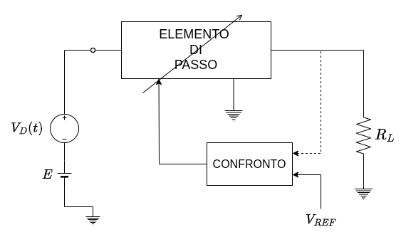
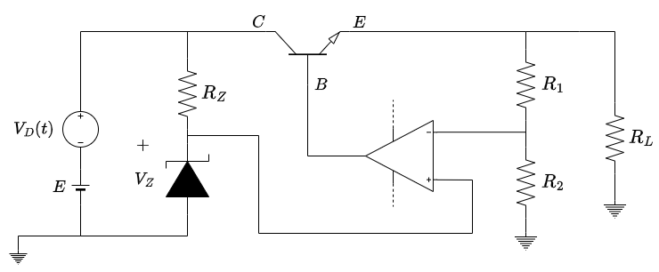

# 1. Indice

- [1. Indice](#1-indice)
- [2. Regolatori di Tensione Lineare Serie](#2-regolatori-di-tensione-lineare-serie)

# 2. Regolatori di Tensione Lineare Serie

È un circuito che ci permette di stabilizzare una tensione variabile.

Per ottenere questo mettiamo un _**Elemento di Passo**_, un elemento di potenza, tra ingresso e uscita che ci permetta di regolare l'ingresso per ottenere l'uscita che desideriamo.
Possiamo utilizzare come  _Elemento di Passo_ sia un **Transistore Bipolare** che un **Transistore MOSFET**.

Noi vedremo la formazione con il **BJT**:

Per riuscire a regolare il comportamento del **BJT** e mantenere costante l'uscita, prendiamo una partizione della tensione di uscita e la portiamo in ingresso ad un **Amplificatore Operazionale**, dove la confrontiamo con un riferimento di tensione.

Il riferimento può essere di tanti tipi, noi utilizziamo un **Diodo Zener** di tensione $V_Z$.

L'uscita dell'amplificatore viene collegata quindi alla base del **BJT**.

Verifichiamo quindi la reazione negativa ipotizzando:
- $|\beta A | \gg 1$
- Reazione Negativa
- Regime Lineare

Queste ipotesi ci permettono di operare in `MCCV`:
$$
\begin{CD}
\underbrace{
  \begin{align*}
    V^- &= \frac{R_2}{R_1 + R_2}V_o \\
    V^+ &= V_Z
  \end{align*}} \\
@V{V^+ \approx V^-}VV \\
\begin{align*}
  V_o\frac{R_2}{R_1 + R_2} &\approx V_Z \\
  V_o &= \frac{R_1 + R_2}{R_2} \cdot V_Z
\end{align*}
\end{CD}
$$

Per verificare la _reazione negativa_ iporizziamo che, per qualche motivo, $V_o \to V_o + \Delta V_o > V_o$.

Di conseguenza aumenterà anche $V^-$, mentre $V^+$ **resta costante**, facendo _diminuire_ la tensione di ingresso $V_{in} = V^+ - V^-$.

Questa diminuzione si propagan anche nell'_uscita dal circuito operazionale_, che produce di conseguenza una corrente sulla base inferiore e che fa diminuire anche la corrente $i_E$.

Tuttavia, se $i_E$ diminuisce, diminuisce anche la tensione che viene partizionata e di conseguenza **diminuisce $V_o$** facendolo tornare al valore originale.

Il nostro circuito è quindi in _**Reazione Negativa**_.

