# 1. Indice

- [1. Indice](#1-indice)
- [2. Rettificatori di Tensione](#2-rettificatori-di-tensione)
	- [2.1. Circuito Rettificatore](#21-circuito-rettificatore)
	- [2.2. Circuito rettificatore con filtro RC](#22-circuito-rettificatore-con-filtro-rc)
		- [2.2.1. Trasformatori](#221-trasformatori)
		- [2.2.2. Rettificatori a doppia semionda](#222-rettificatori-a-doppia-semionda)
		- [2.2.3. Rettificatore basato su ponte di Graetz](#223-rettificatore-basato-su-ponte-di-graetz)
		- [2.2.4. Confronto - Presa Centrale vs Ponte di Graetz](#224-confronto---presa-centrale-vs-ponte-di-graetz)
	- [2.3. Rettificatore a Ponte di Graetz con Diodi Zener](#23-rettificatore-a-ponte-di-graetz-con-diodi-zener)
		- [2.3.1. Operare nel Breakdown con i Diodi Zener](#231-operare-nel-breakdown-con-i-diodi-zener)
	- [2.4. Rettificatore di tensione con Diodo Zener](#24-rettificatore-di-tensione-con-diodo-zener)

# 2. Rettificatori di Tensione

Nell'utilizzo comune abbiamo bisogno di _corrente elettrica continua_, mentre quella che arriva alle pareti delle nostre case è _corrente elettrica alternata_.

Facendoci caso, quando noi colleghiamo un dispositivo alla presa, utiliziamo un cavo che, prima di arrivare al nostro dispositivo, passa per un **_trasformatore_**. Spesso è incluso all'interno dei dispositivi, come i phon, altre volte è un dispositivo visibile come negli alimentatori dei cellulari e dei computer.

Lo scopo di questo componente è **convertire la tensione alternata in continua**.

Esistono diversi modi per costruire questi _convertitori_ sono costruiti in diversi modi.
TRa le varie modalità è possibile costruirli a partire dai **_diodi_**.

Formalmente questi circuiti si definiscono così:
> Data una tensione alternata **a valor medio nullo**, la trasformano in una tensione continua _**a valor medio diverso da zero**_.

Esistono diversi circuiti in grado di fare ciò:
- [**Circuito Rettificatore**](#61-circuito-rettificatore)
- [**Circuito Rettificatore con Filtro RC**](#62-circuito-rettificatore-con-filtro-rc)
- [**Circuito Rettificatore a ponte di Graetz**](#63-rettificatore-a-ponte-di-graetz-con-diodi-zener)

Per le analisi, a meno che non sia esplicitamente detto diversamente, utilizzeremo il **modello a diodo ideale**.

## 2.1. Circuito Rettificatore

Analizziamo il circuito proposto sulla destra.

Il generatore di tensione $V_S$ fornisce una corrente alternata:
$$
	V_S = V_M \cdot \sin{(\omega t)}
$$

Indicando con $t_1$ il primo semi-periodo, e con $t_2$ il secondo, possiamo dire che:
$$
V_S = \begin{cases}
	> 0 & 0 \le t < t_1 \\
	<0 & t_1 \le t < t_2
\end{cases}
$$

Nel primo semi-periodo $(V_S > 0)$, avendo la tensione massima del circuito all'anodo, ha senso ipotizzare il diodo come **ON**.

Avremo quindi $V_u = V_s$, con una corrente $I_D = \frac{V_S}{R} > 0$, che verifica la nostra ipotesi.

Nel secondo semi-periodo $(V_S < 0)$ invece, ha senso ipotizzare il diodo come **OFF**.

Di conseguenza avremo $V_u = 0$ $V$, con una corrente $I_D = 0$ $A$.
La tensione ai capi del diodo sarà quindi $V_D = V_S - V_u = V_S$.

In particolare, avendo $V_s < 0$, otteniamo che la tensione $V_D$ è negativa, perciò minore di $V_\gamma$.

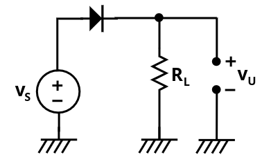

Con il modello ideale quindi, avremo che la tensione nei semiperiodi $V_S > 0$ sarà la stessa in entrata.

<figure class="">
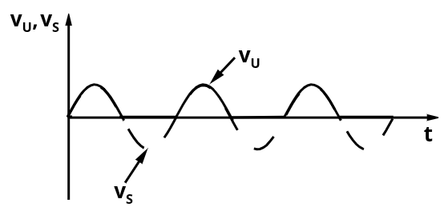
<figcaption>

Le due curve sono sovrapposte quando nella prima metà di ogni periodo.
Quando invece $V_S \le 0$ abbiamo che $V_u = 0$.
</figcaption>
</figure>

Se invece utilizzassimo il **_modello a caduta costante_**, dobbiamo modificare l'analisi nel primo semiperiodo.

In particolare, sostituiendo il diodo con un generatore di tensione $V_\gamma$, otterremo che:
$$
\begin{align*}
	V_u &= V_S - V_\gamma \\
	I_D &= \frac{V_S - V_\gamma}{R}
\end{align*}
$$

Verifichiamo quindi la condizione su $I_D$:
$$
\begin{CD}
\begin{matrix}
	I_D > 0 & \Leftrightarrow & \frac{V_S - V_\gamma}{R} > 0
\end{matrix} \\
@VVV \\
\boxed{V_S > V_\gamma}
\end{CD}
$$

Nono solo quindi la tensione di uscita è inferiore di un fattore $V_\gamma$ rispetto a quella in entrata, ma introduciamo anche un ritardo in entrata e uscita di $\Delta t$ rispetto al segnale originale.

Quantifichiamo quindi il ritardo:
$$
\begin{align*}
V_S &= V_\gamma \\
V_M \cdot \sin{(\omega t)} &= V_\gamma \\
\sin{(\omega t)} &= {V_\gamma \over V_M} \\
\omega t &= \arcsin{\Biggl(\frac{V_\gamma}{V_M}\Biggr)} \\
t^\ast &= \frac{1}{\omega} \cdot \arcsin{\Biggl(\frac{V_\gamma}{V_M}\Biggr)} \\
\end{align*}
$$

Il valore $t^\ast$ varierà in base al valore della tensione in ingresso.

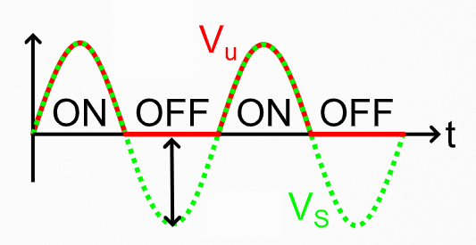

In genere i rettificatori vengono utilizzati a partire dalla tensione alternata a $230$ $V$, $50$ $Hz$ per ottenere una tensione continua da impegare per l'alimentazione di apparacchiature elettroniche.

In particolare definiamo **Peak Inverse Voltage** `PIV` il valore massimo della tensione ai capi del diodo quando questo è interdetto.
Se il `PIV` del circuito supera la soglia della **_Breakdown Voltage_** $(V_{BR})$, si innesca l'_effetto valanga_, ovvero compare una corrente $I_D < 0$ molto forte.

È quindi necessario garantire che:
$$
	\min{(V_{AK})} > -V_{BR}
$$

## 2.2. Circuito rettificatore con filtro RC

Ignorando temporaneamente il carico resistivo, la corrente che passa sul condensatore è:
$$
	I_C = C {dV_u \over dt} = I_D
$$

Ipotizzando il condensatore inizialmente scarico, durante la semionda positiva del generatore, abbiamo che il diodo sarà in condunzione, in quanto:
$$
	{dV_u \over dt} \ge 0 \rArr I_D \ge 0
$$

Dopo aver attraversato il primo picco, in assenza del diodo quello che avremmo visto è che il condensatore si sarebbe scaricato operando da generatore di tensione, producendo una corrente inversa a $I_D$.

Poiché però è presente il diodo, successivamente al primo picco, il diodo agirà come un aperto, mantenendo quindi la tensione all'interno del condensatore.

Da lì in poi avremo quindi che:
$$
	I_C = I_D = 0
$$

Infatti, avendo il condensatore carico:
- Cresta crescente di tensione: il condensatore agisce da aperto
- Cresta decrescente di tensione: il condensatore agirebbe da generatore ma il diodo da aperto quindi non si chiude la maglia

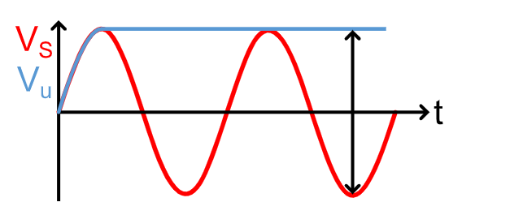

La tensione nel circuito è quindi:

Il `PIV` di questo circuito sarà quindi $\max{(V_A - V_K)} = V_M - (-V_M) = 2V_M$.

Se invece introduciamo anche un **carico resistivo**, otteniamo un filtro _RC_ con il condensatore.

Il tratto in conduzione è analogo a quello precedente.

Quando invece il diodo entra in interdizione, la tensione tende a scaricarsi sulla resistenza $\propto e^{-t/(R_LC)}$.

A differenza del caso di prima, nel quale $I_D$ è nullo dopo il primo picco, adesso, nella seconda cresta in salita, avremo che $V_u \ne V_M$, ma sarà leggermente inferiore.
Quello che accade quindi è che $I_D > 0$ nell'intervallo di tempo successivo all'istante $t$ nel quale la tensione ai capi del generatore avrà superato la $V_u(t)$, fino al picco successivo.

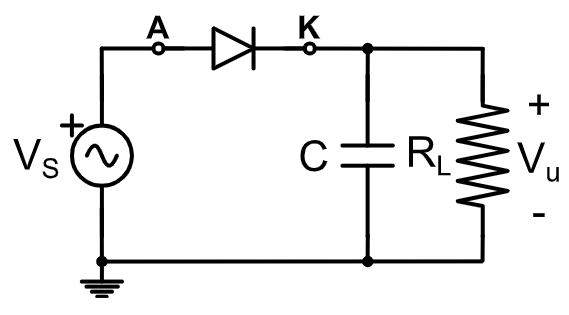

In questo caso `PIV` è inferiore a $2V_M$ in quanto la tensione in $V_K$ quando $V_A$ è al minimo è leggermente inferiore. Tuttavia questa variaizone è spesso trascurabile.

Il circuito rettificatore semplice permette di recuperare la tensione in una piccola porzione del semiperiodo positivo, e di "mantenerla" durante tutta la durata del resto del periodo.

Se potessimo invertire il segno di $V_S$ solo quando questo fosse negativa, avremmo il recupero anche in una piccola porzione del semiperiodo negativo di $V_S$, dimezzando a tutti gli effetti il periodo di attivazione e riducendo il _ripple_.

Per riuscire ad ottenere l'inversione di segno sulla sorgente $V_S$ è possibile utilizzare un **_Trasfromatore_**.

### 2.2.1. Trasformatori

Sono dei componenti magnetici che variano il valore efficace della tensione alternata tramite il rapporto spire $n = \frac{N_1}{N_2}$, preservando la potenza ideale tra primario e secondario.

Noi prenderemo in considerazione soltato i trasformatori ideali, per i quali il flusso magnetico totale piò essere considerato trascurabile.

Questi trasformatori hanno due caratteristiche principali:
- La **forza magnetomotrice** totale è nulla:
$$
\large
\begin{matrix}
N_1I_1 + N_2 I_2 = 0 & \frac{I_2}{I_1} = - \frac{N_1}{N_2}
\end{matrix}
$$

- La **Legge di Faraday** comporta:
$$
\large
\begin{matrix}
	\begin{matrix}
		V_1 = N_1 {d\phi \over dt} \\[0.75em]
		V_2 = N_2 {d\phi \over dt}
	\end{matrix} & \rArr &
	\LARGE \frac{V_1}{V_2} = \frac{N_1}{N_2}
\end{matrix}

$$

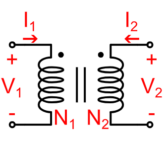

### 2.2.2. Rettificatori a doppia semionda

Introduciamo un **trasformatore a doppio secondario con presa centrale**: &emsp; $N_2 = N_A + N_B$

Durante il primo semiperiodo abbiamo quindi che:
$$
V_1 \ge 0 \rArr {V_A \ge 0 \atop V_B \ge 0}
$$

Mentre nel secondo abbiamo che:
$$
V_1 \le 0 \rArr {V_A \le 0 \atop V_B \le 0}
$$

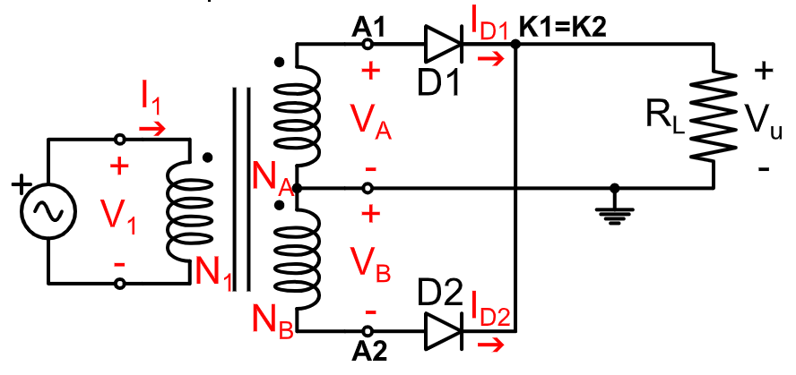

Partiamo quindi dall'ipotesi che il **primo diodo sia ON**, mentre il **secondo diodo sia OFF**, utilizzando il modello a _diodo ideale_.

La verifica di questa ipotesi è banale:
$$
\begin{align*}
	I_{D_1} &= \frac{V_A}{R_L} > 0\\
	V_{D_2} &= V_{A_2} - V_{K_2} = -V_B - V_A < 0
\end{align*}
$$

Partiamo quindi dall'ipotesi che il **primo diodo sia OFF**, mentre il **secondo diodo sia ON**.

La verifica di questa ipotesi, ricordando che $V_A, V_B \le 0$, è altrettanto banale:
$$
\begin{align*}
	V_{D_1} &= V_{A_1} - V_{K_1} = V_A - (-V_B) = V_A + V_B < 0 \\
	I_{D_2} &= -\frac{V_B}{R_L} > 0
\end{align*}
$$

Abbiamo quindi ottenuto un circuito nel quale la tensione è **sempre positiva**:

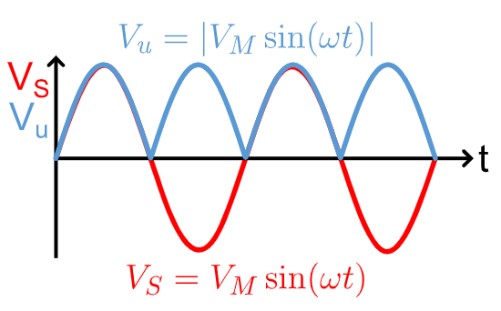

Se reintroduciamo il condensatore vediamo adesso come abbiamo **dimezzato il periodo di attivazione**.

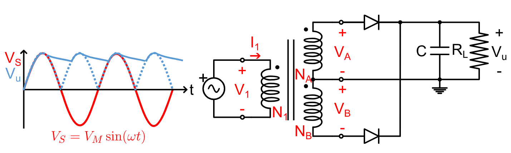

In questo caso abbiamo però reintrodotto un `PIV` di $2V_M$.

### 2.2.3. Rettificatore basato su ponte di Graetz

Questo tipo di rettificatore sfrutta il **ponte di Graetz**, composta da 4 diodi collegati come in figura.

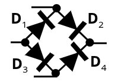

Quando $V_2 \ge 0$, ipotizziamo che $D_1, D_2$ siano **ON**, mentre $D_3, D_4$ sono **OFF**.

La verifica è più che immediata:
$$
\begin{align*}
	I_{D_1} &= \frac{V_2}{R_L} > 0 \\
	I_{D_2} &= \frac{V_2}{R_L} > 0 \\
	V_{D_3} &= V_{A_3} - V_{K_3} = 0 - V_2 = -V_2 < 0 \\
	V_{D_4} &= V_{A_4} - V_{K_4} = 0 - V_2 = -V_2 < 0
\end{align*}
$$

Quando invece $V_2 < 0$, effettuiamo l'ipotesi inversa, ovvero $D_1, D_2$ **OFF** e $D_3, D_4$ **ON**.

Verifichiamo, ricordando sempre che in questo caso $V_2 < 0$:
$$
\begin{align*}
	V_{D_1} &= V_{A_1} - V_{K_1} = 0 - (-V_2) = V_2 < 0 \\
	V_{D_2} &= V_{A_2} - V_{K_2} = 0 - (-V_2) = V_2 < 0 \\
	I_{D_3} &= -\frac{V_2}{R_L} < 0 \\
	I_{D_4} &= -\frac{V_2}{R_L} < 0
\end{align*}
$$

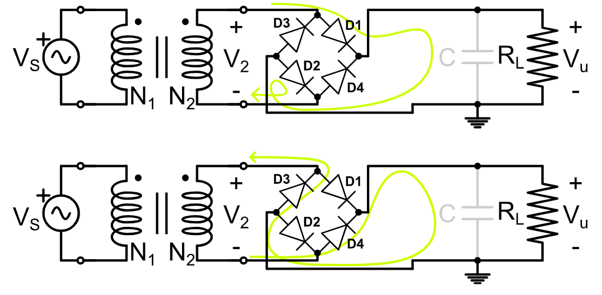

Inoltre in questo caso il `PIV` è di $V_M$, in quanto non abbiamo mai tensioni minori di 0.

### 2.2.4. Confronto - Presa Centrale vs Ponte di Graetz

Facciamo quindi un confronto tra i due raddrizzatori che abbiamo visto:

|   Caratteristica   |    Presa Centrale     |  Ponte di Graetz  |
| :----------------: | :-------------------: | :---------------: |
|  Diodi Necessari   |          $2$          |        $4$        |
|       `PIV`        |        $2V_M$         |       $V_M$       |
|   Ingombro/Peso    | Elevato (Ferro, Rame) |      Ridotto      |
| Caduta di Tensione |      $V_\gamma$       | $2\cdot V_\gamma$ |

Il **Ponte di Graetz** rimuove il limite del trasformatore ingombrante e costoso, ottimizzando il peso e il costo del circuito, in quanto il costo di due diodi extra è trascurabile rispetto quello del trasformatore.

Il ponte di Graetz è oggi lo **_standard moderno_**.

## 2.3. Rettificatore a Ponte di Graetz con Diodi Zener

Il rettificatore ha comunque dei limiti/problemi:
- **Limite del Rettificatore**: ha uscia unidirezionale ma _fortemente pulsante_
- **Ripple**: la fluttuazione di tensione risulta inaccettabile per la maggior parte dei ciruciti elettronici.

Circuiti alimentati a $50Hz$ presentano un _ripple_ a $100Hz$, un valore elevato e che produce diversi effetti indesiderati:
- **Rumore audio**: ronzio a $100Hz$ negli altoparlanti
- **Errori logici**: reset improvvisi di microprocessori
- **Precisione**: errori di misura nei sensori

Il nostro obiettivo finale è quindi quello di **trasformare una tensione sinusoidale** da $230$ $V$ $AC$  in una tensione costante da $5$ $V$ $DC$ (oppure $3.3$ $V$ o $12$ $V$ sempre $DC$) che non presenti _ripple_.

Per riuscire a raggiungere questo obiettivo attuiamo quindi una strategia in due punti:
1. **Filtraggio**: introduciamo un consensatore per "livellare" le valli
2. **Regolazione**: utiizziamo un **diodo Zener** per rendere l'uscita immune alle variazioni di carico

Il _Diodo Zener_ ci fornisce infatti diverse proprietà:
- Permette di lavorare stabilmente nella regione di **breakdown** senza danneggiarsi. In particolare, quando viene sottoposto a grandi variazioni di corrente, il diodo genererà variazioni di tensione _minime_, agendo quasi da generatore di tensione.
- In _diretta_ si comporta come un normale diodo.
- In _inversa_ **blocca la tensione ai capi alla tensione di Zener** $V_Z$. Qualora $V_D < V_Z$, il diodo continuerebbe quindi a fornire $V_Z$ in uscita.

In questo modo non solo abbiamo una tensione costante e nota, ma avremo anche un sistema di **protezione contro i picchi di tensione**.

Valori commerciali tipici per _diodi Zener_ (con tolleranze tra il $2\%$ e il $5\%$) sono `3.3V`, `5.1V`, `5.6V`, `6.2V`, `12V`, `15V`, ...

Nel modello a caduta costante, i nostri _diodi Zener_ saranno quindi caratterizzati da **_3 regioni_**:
$$
\begin{cases}
	& & \text{Verifica}\\
	V_{AK} = V_\gamma & \textbf{Conduzione in polarizzazione Diretta} & I_D \ge 0 \\
	I_D = 0 & \textbf{Interdizione} & -|V_Z| < V_{AK} < V_\gamma \\
	V_{AK} = -|V_Z| & \textbf{Conduzione in polarizzazione Inversa} & I_D \le 0
\end{cases}
$$

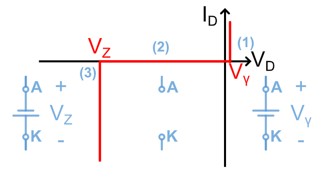

Per quanto riguarda il loro utilizzo all'interno dei rettificatori, avremo come zona di funzionamento quella della **conduzione in polarizzazione inversa**.

### 2.3.1. Operare nel Breakdown con i Diodi Zener

Immaginiamo di avere il circuito sulla destra che opera nella zona di brakdown.
Dobbiamo quindi considerare il diodo zener **non come un'aperto**, come avremmo fatto con un diodo classico, ma come un **generatore di tensione a polarizzazione inversa**.

Immaginiamo che:
$$
\begin{align*}
	V_2 &= 10\;V \\
	R &= 5\;k\Omega \\
	V_Z &= 5.6\;V \\
\end{align*}
$$

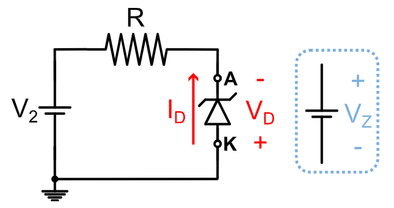

Partendo dalla legge di Kirchoff, possiamo scrivere l'equazione della retta caratteristica:
$$
I_D = -\frac{V_2 + V_D}{R} = - \frac{V_2 - V_Z}{R} = -\frac{10-5.6}{5} = -0.88\;mA
$$

In genere indichiamo $I_Z = -I_D$ per facilitare l'analisi.

Questo valore dipende quindi da $V_2$ e $R$.

<figure class="100">
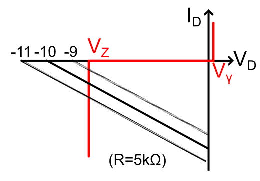
<figcaption>

Se fosse presente del _ripple_ che rende $V_2 = 10 \pm x$, allora avremmo una corrente che sta nel fascio.
</figcaption>
</figure>

<figure class="100">
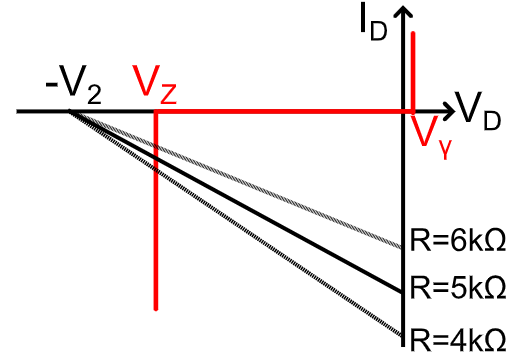
<figcaption>

Al variare della resistenza abbiamo una corrente rappresentata da un fascio di rette centrate in $(-V_2, 0)$.
</figcaption>
</figure>

Oltre a queste considerazioni, se andassimo a vedere la **potenza**:
$$
	P_Z = \underbrace{V_ZI_Z}_{\text{Possibile perché } V_Z \text{ è costante}}
$$

La potenza è importante in quanto indica _quanto si scalda il componente_. Se questa fosse troppo elevata il diodo potrebbe _bruciarsi_.

## 2.4. Rettificatore di tensione con Diodo Zener

Il circuito è il seguente:

<figure class="80">
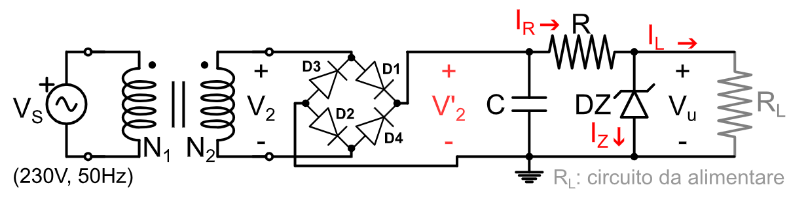
<figcaption>

$R_L$ rappresneta il circuito che vogliamo alimentare.
</figcaption>
</figure>

Possiamo dire subito che se $I_Z > 0$ allora la tensione ai capi del diodo zener è da considerarsi come quella di un generatore, ovvero $V_u = V_Z$.

Le equazioni di Kirchoff ci dicono che:
$$
\begin{CD}
\begin{matrix}
	I_R = \frac{V_2'-V_Z}{R} \\[0.5em]
	I_L = \frac{V_Z}{R_L}
\end{matrix}
@>>>
{I_Z = I_R - I_L = \frac{V_2'-V_Z}{R} - \frac{V_Z}{R_L}}
\end{CD}
$$

Per verificare la conduzione del diodo zener in breakdown occorre verificare che $I_Z > 0$, ovvero:
$$
\frac{V_2'-V_Z}{R} - \frac{V_Z}{R_L} > 0
$$

Di queste variabili, l'unica che è possibile modulare nella progettazione è **_il valore della resistenza_** $R$.

Conosciamo che la tensione dopo il ponte di Graetz è soggetta a _ripple_:
$$
	V'_{2,min} \le V_2' \le V'_{2,max}
$$

Quando il carico non richiede corrente (modellabile ponendo $R_L \to \infty$), abbiamo che $I_L = 0$, che produce:
$$
\begin{CD}
	{I_Z = I_R} @>>> {I_{Z,max} = \frac{V'_{2,max}-V_Z}{R}}
\end{CD}
$$

Affinché il circuito funzioni dobbiamo in ogni momento rispettare che la potenza del diodo sia minore del limite massimo, ovvero $V_ZI_{Z,max} < P_{Z,max}$, che ci permette di calcolare:
$$
\begin{CD}
	{I_{Z,max} < \frac{P_{Z,max}}{V_Z}} 
	@>{I_{Z,max} = \frac{V'_{2,max}-V_Z}{R}}>>
	\boxed{
		R > \frac{(V'_{Z,max} - V_Z)V_Z}{P_{Z,max}}\;\Omega
	}
\end{CD}
$$

Questa dimostrazione ci permette di dire che $R$ **_deve avere un valore superiore ad un minimo tollerabile_**.

Se invece analizziamo il caso in cui **tutta la corrente viene dirottata sul carico**, ovvero $I_{L,max}$, allora possiamo assumere, poiché $I_Z = I_R - I_L$, che $I_Z = 0$:
$$
\begin{CD}
	{I_{L,max} = I_R} @>>> {I_{L,max} = \frac{V'_{2}-V_Z}{R}\;A}
\end{CD}
$$

Per quantificare quindi il minimo valore massimo della corrente, analizziamo quando $V'_{2,min}$, ovvero il **caso peggiore**:
$$
I_{L,max} = \frac{V'_{2,min} - V_Z}{R}\;A
$$