# 1. Indice

- [1. Indice](#1-indice)
- [2. Transistore Bipolare - `BJT`](#2-transistore-bipolare---bjt)
	- [2.1. Modello GCCC](#21-modello-gccc)
	- [2.2. Funzionamento del dispositivo](#22-funzionamento-del-dispositivo)
		- [2.2.1. Effetto Transistore](#221-effetto-transistore)
		- [2.2.2. Differenze tra Collettore e Emettitore](#222-differenze-tra-collettore-e-emettitore)
	- [2.3. Modello di Ebers-Moll](#23-modello-di-ebers-moll)
	- [2.4. Caratteristiche a Emittore Comune](#24-caratteristiche-a-emittore-comune)
	- [2.5. Effetto Early](#25-effetto-early)
	- [2.6. Polarizzazione](#26-polarizzazione)
	- [2.7. Inverter](#27-inverter)
		- [2.7.1. Inverter come amplificatore](#271-inverter-come-amplificatore)
	- [2.8. Polarizzazione BJT - Rete a 4 resistori](#28-polarizzazione-bjt---rete-a-4-resistori)
	- [2.9. Modello Linearizzato per Piccoli Segnali](#29-modello-linearizzato-per-piccoli-segnali)
		- [2.9.1. Ruolo dei parametri](#291-ruolo-dei-parametri)
	- [2.10. Accoppiamento AC con sorgente e carico](#210-accoppiamento-ac-con-sorgente-e-carico)
		- [2.10.1. Analisi di Circuiti con Componenti non lineari](#2101-analisi-di-circuiti-con-componenti-non-lineari)

# 2. Transistore Bipolare - `BJT`

##  2.1. Modello GCCC

Il transistore bipolare (_Bipolar Junction Transistor_) `BJT` è un **_dispositivo attivo a due porte e tre terminali_**.

Idealmente è rappresentato da un **_generatore controllato di corrente_** `GCCC`.

Nel suo uso generico si accoppia con una rete esterna che comprende un generatore di segnale di bassa potenza e un carico.

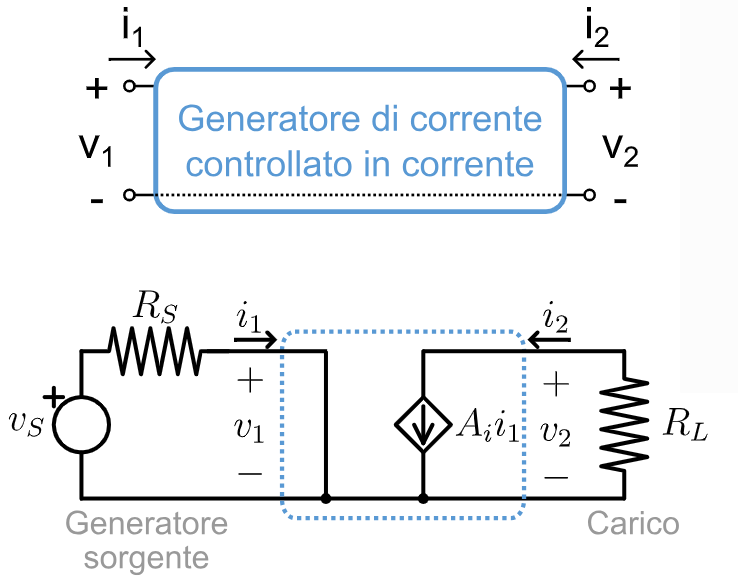

Il guadagno di corrente $A_i$ è calcolabile come il rapporto tra le correnti:
$$
\begin{matrix}
	i_2 = A_ii_1 & \Rightarrow & A_i = \frac{i_2}{i_1}
\end{matrix}
$$

L'accoppiamento con la rete esterna permette quindi di definire un **guadagno di tensione**:
$$
\begin{CD}
	{v_2 = -R_Li_2 = -R_LA_ii_1 = -R_LA_i\frac{v_s}{R_S}} \\
	@VVV \\
	{
		A_V = \frac{v_2}{v_S} = -A_i\frac{R_L}{R_S}
	}
\end{CD}

$$

In generale, per un generico quadripolo:
$$
\begin{matrix}
	A_i := \frac{i_{out}}{i_{in}} & \text{Guadagno di corrente:} \begin{cases}
		A_i > 1 & \text{Amplificatore di corrente} \\
		A_i < 1 & \text{Attenuazione di corrente}
	\end{cases} \\
	A_V := \frac{v_{out}}{v_{in}} & \text{Guadagno di tensione:} \begin{cases}
		A_v > 1 & \text{Amplificatore di tensione} \\
		A_v < 1 & \text{Attenuazione di tensione}
	\end{cases}
\end{matrix}
$$

Se definiamo quindi $P_L = -v_2i_2$ come la **potenza erogata sul carico** e come $P_S = v_si_1$ come la **potenza erogata dalla sorgente** otteniamo che:
$$
	A_P := \frac{P_L}{P_S} = -\frac{v_2 i_2}{v_Si_1} = -A_iA_v = A_i^2 \frac{R_L}{R_S}
$$

Quindi, anche avessimo un **_amplificazione di corrente_**, non è detto che avremo anche un'amplificazione di potenza. Tuttavia, i componenti attivi come `BJT` e `MOSFET` **permettono** $\vert A_P| > 1$, raccogliendola da un'alimentazione a loro interna.

Modellare il `BJT` senza il `GCCC` equivale ad averne uno con $A_i = -1$:
$$
	\begin{matrix}
		v_2 = \frac{R_L}{R_L + R_S}v_S & \Rightarrow & A_V = \frac{R_L}{R_L + R_S} \\
		i_2 = -i_1 & \Rightarrow & A_i = -1
	\end{matrix}
$$

Di conseguenza:
$$
	A_P = \frac{P_L}{P_S} = \frac{-v_2i_2}{v_Si_1} = \frac{R_L}{R_L + R_S} < 1
$$

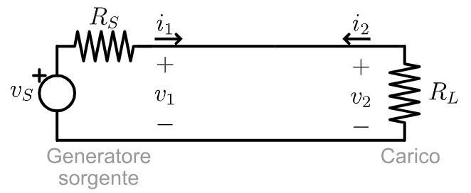

## 2.2. Funzionamento del dispositivo

Il transistore bipolare a giunzione consiste di **due giunzioni $p-n$** poste _una di seguito all'altra_, e orientate in senso inverso.

<figure class="">
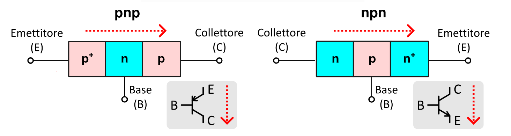
<figcaption>

La figura mostra anche il _verso naturale_ in cui scorre la corrente durante il funzionamento da `GCCC`.
</figcaption>
</figure>

Chiamiamo:
- **Emettitore** $(E)$: emette portatori di carica maggioritari. Nel caso di `pnp` sono _lacune_, nel caso di `npn` sono _elettroni_
- **Collettore**: raccoglie i portatori di carica maggioritari.
- **Base**: modula e controlla il passaggio dei portatori di carica maggioritari.

Se vedessimo in **sezione** il dispositivo vedremmo questo:

<figure class="">
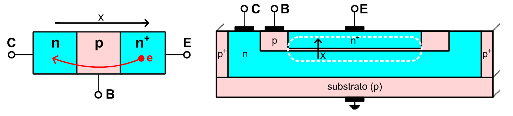
<figcaption>

Le considerazioni sono equivalenti per transistori `pnp`.
</figcaption>
</figure>

Notiamo che la _base_ è **_estremamente sottile_**, così da permettere ai porttatori emessi di "scavalcarla".
Se questa fosse invece molto larga, acvremmo invece una **_configurazione di diodi back-to-back_**, che **non permette l'effetto transistore**.

Trattiamo quindi le due giunzioni di un transistore `pnp` separatamente.

La prima giunzione (`BE`) presa singolarmente equivale letteralmente ad un _diodo_.

Il contributo maggioritario della corrente, quando in polarizzazione diretta $V_{BE} > 0$, è quello delle _lacune_, che producono la **corrente di diffusione**.

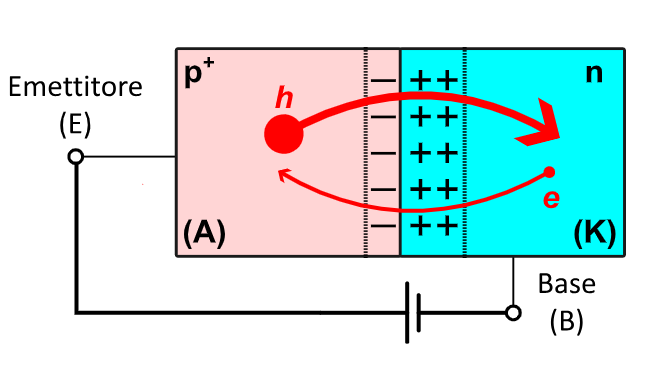

Anche la seconda giunzione (`CB`) singolarmente equivale ad un _diodo_, direzionato inversamente rispetto a quello `BE`.

Avendo preso l'altro in polarizzazione diretta, questo sarà **_polarizzato in inversa_** $(V_{CB} < 0)$.

In questo caso quindi la corrente dei minoritari, ovvero le lacune, sarà **limitata** dal tasso di generazione termica, indipendente dall'intensità del campo elettrico $E$.

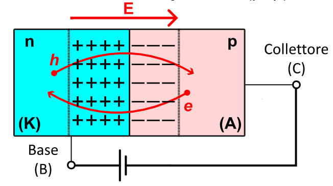

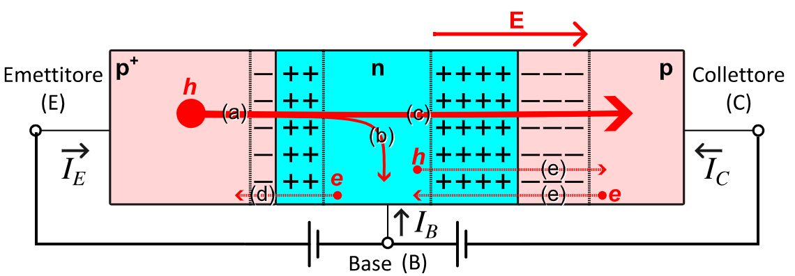

Se lo prendiamo invece nel suo complesso, vediamo che l'**emettitore** rifornisce di lacune la **base**, aumentando quindi in maniera significativa il numero di minoritari che verranno poi attratti nel **collettore**. Questo quindi genera un flusso di lacune che va dall'Emettitore al Collettore.

Diciamo quindi di essere in **_Zona Attiva Diretta_** `ZAD` quando:
- La giunzione `BE` è in polarizzazione diretta
- La giunzione `BC` è in polarizzazione inversa

Nel caso `pnp` abbiamo quindi $V_{EB} > 0$ e $V_{CB} < 0$.

Gli effetti che osserviamo sono:
- Grande flusso di lacune da $E$ a $B$, dovuta alla _corrente di diffusione_
- Piccola porzione di lacune che si _ricombinano nella base_. Questo accade perché nella zona neutra di $B$ abbiamo un'alta concentrazione di elettroni

Le lacune che "sopravvivono" al passaggio attraverso la base arrivano quindi alla **zona di svuotamento** `BC`, dove è presente un _forte campo elettrico_. Queste lacune riforniscono quindi la giunzione `BC` in **inversa**.

Oltre a questo flusso principale se ne hanno altri che sono trascurabili, dovuti a drogaggi assimmetrici e/o generazione termica di minoritari.

### 2.2.1. Effetto Transistore

Chiamiamo **effetto transitore**:
> L'effetto per cui una _piccola corrente di base_ permette di controllare un _elevata corrente emettitore-collettore_.  
> In particolare quest'ultima sarà una versione **amplificata della corrente di base**.

È importante sottolineare che la corrente di base è **piccola** ma **_non nulla_**. $I_B$ infatti si occupa di rifornire i portatori maggioritari necessari per mantenere la neutralità di carica nella zona neutra.
Se questo non accadesse, ovvero $I_B = 0$, i portatori si _accumulerebbero in base_, generando quindi un potenziale che ostacolerebbe l'ulteriore iniezione di portatori, portando ad avere una corrente di uscita $I_E = 0$.
La zona neutra della base quindi **_sparirebbe_**.

La corrente $I_B$ deve quindi essere sottoposta ad un meccanismo di controllo per matenere la zona neutra della base. Il numero di portatori maggioritari che raggiungono il collettore deve essere **_proporzionale_** al numero di portatori che si ricombinano in base. La percentuale di ricombinazione in base è dettata dalle dimensioni geometriche e dai drogaggi.

### 2.2.2. Differenze tra Collettore e Emettitore

Il `BJT` **_non è un dispositivo simmetrico_**.

L'emettitore è infatti **molto più drogato** rispetto al collettore. Proprio questa differenza permette di _trascurare la corrente di elettroni iniettati dalla base_.

Se cambio il ruolo di $E$ con $C$ invertendo le polarizzazioni e agendo nella **_Zona Attiva Inversa_** `ZAI`, nella quale  $V_{EB} < 0$ e $V_{CB} > 0$, continueremmo ad osservare l'_effetto transistore_, ma stavolta la corrente di base $I_B$ **sarebbe più consistente a parità di flusso di portatori**, poiché rimane più coerente

Questo influisce notevolmente nella capacità di controllare una corrente grande con una corrente piccola.

## 2.3. Modello di Ebers-Moll

Abbiamo quindi descritto il meccanismo fisico per cui una corrente di base piccola controlla la grande corrente di attraversamento.

Per dimostrare che il dispositivo si comporta effettivamente come un `GCCC` abbiamo bisogno di un modello, così da dimostrare che il dispositivo permette il guadagno di potenza, recuperandola da una fonte di alimentazione, o _supply_.

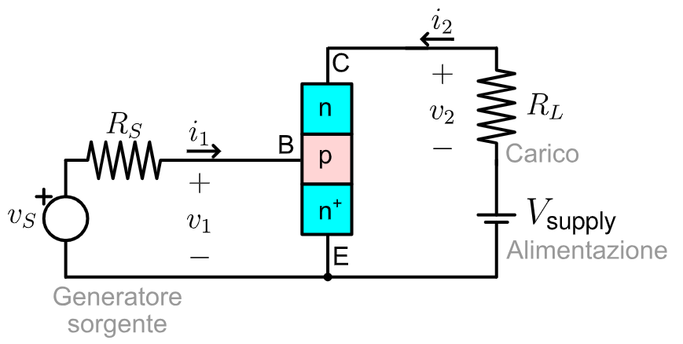

In particolare discuteremo del **_Modello di Ebers-Moll_**, che descrive il comportamento di `BJT` per _grandi segnali_.

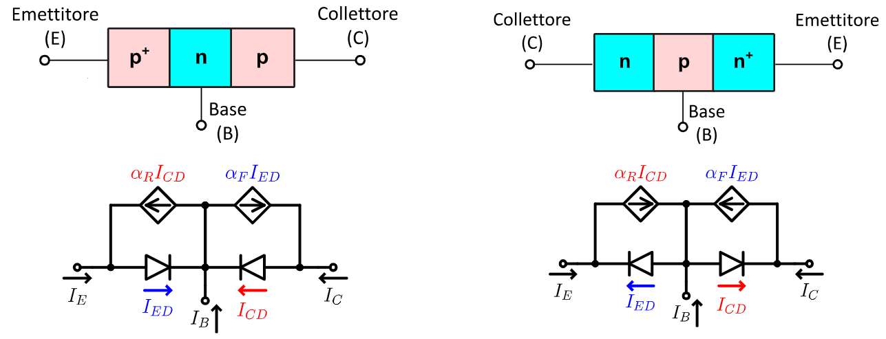

Definiamo:
- **Frazione di corrente diretta** (_forward_) $\alpha_F$: il valore di questo parametro rappresenta la porzione di minoritari che riescono a passare attraverso la _base_ quando operiamo in `ZAD`: &emsp; $0.98 \le \alpha_F \le 0.998$
- **Frazione di corrente inversa** (_reverse_) $\alpha_R$: il valore di questo parametro rappresenta la porzione di minoritari che riescono a passare attraverso la _base_ quando operiamo in `ZAI`: &emsp; $0.4 \le \alpha_R \le 0.8$

Esiste quindi una condizione di reciprocità tra i due generatori ausiliari e le correnti inverse di saturazione dei due diodi:
$$
	\alpha_F I_{E_S} = \alpha_R I_{C_S}
$$

Analizziamo cosa succede nei `pnp`, tenendo a mente che le analisi saranno valide anche nei `npn` con opportune considerazioni sui minoritari/maggioritari.

Le equazioni di _Shockley_ per i diodi, trascurando i fattori di non idealità $\eta$, sono quindi:
$$
\begin{cases}
	I_{ED} = I_{ES}(e^{V_{EB}/U_T} - 1) \\
	I_{CD} = I_{CS}(e^{V_{CB}/U_T} - 1)
\end{cases}
$$

Dalle equazioni ai nodi otteniamo quindi:
$$
\begin{align*}
	I_E &= I_{ED} - \alpha_R I_{CD} \\
	I_C &= I_{CD} - \alpha_F I_{ED} \\
	I_B &= -I_E - I_C
\end{align*}
$$

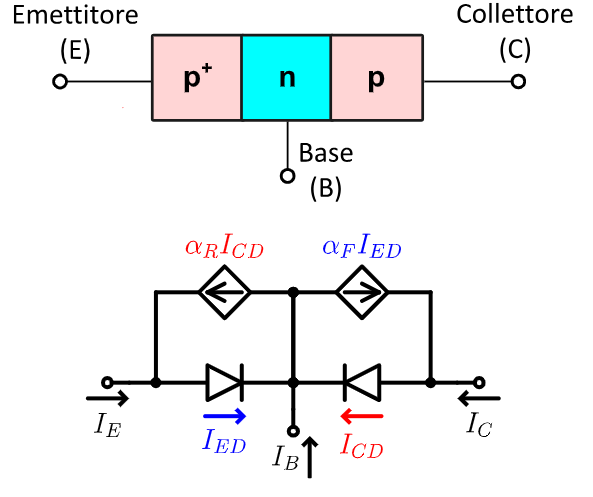

Sostituendo nelle equazioni ai nodi le equazioni di Shockely otteniamo:
$$
\begin{cases}
	\begin{align*}
		I_E &= I_{ES}(e^{V_{EB}/U_T} - 1) - \alpha_R I_{CS}(e^{V_{CB}/U_T} - 1) \\[0.5em]
		I_C &= I_{CS}(e^{V_{CB}/U_T} - 1) - \alpha_F I_{ES}(e^{V_{EB}/U_T} - 1)
	\end{align*}
\end{cases}
$$

Nel modello `npn` è quindi facile ricavare che:
$$
\begin{cases}
	\begin{align*}
		I_E &= - I_{ES}(e^{V_{EB}/U_T} - 1) + \alpha_R I_{CS}(e^{V_{CB}/U_T} - 1) \\[0.5em]
		I_C &= - I_{CS}(e^{V_{CB}/U_T} - 1) + \alpha_F I_{ES}(e^{V_{EB}/U_T} - 1)
	\end{align*}
\end{cases}
$$

Quando operiamo nella **_Zona Attiva Diretta_**, ovvero con $V_{EB} \gg U_T$ e $V_{CB} \ll 0$, possiamo semplificare le nostre equazioni:
$$
\begin{CD}
	\underbrace{\begin{matrix}
		\begin{aligned}
			I_E &= I_{ES}(e^{V_{EB}/U_T} \cancel{- 1}) - \alpha_R I_{CS}(\cancel{e^{V_{CB}/U_T}} - 1) \\
			I_E &= I_{ES}\cdot e^{V_{EB}/U_T} \cancel{+ \alpha_R I_{CS}} \\
			I_E &= I_{ES}\cdot e^{V_{EB}/U_T}
		\end{aligned} & &
		\begin{aligned}
			I_C &= I_{CS}(\cancel{e^{V_{CB}/U_T}} - 1) - \alpha_F I_{ES}(e^{V_{EB}/U_T} \cancel{- 1}) \\
			I_C &= \cancel{-I_{CS}} -\alpha_F I_{ES}\cdot e^{V_{EB}/U_T} \\
			I_C &= -\alpha_F I_{ES}\cdot e^{V_{EB}/U_T}
		\end{aligned}
	\end{matrix}} \\
	@VVV \\
	\boxed{
		\begin{aligned}
			I_E &= I_{ES}e^{V_{EB}/U_T}\\[1em]
			I_C &= -\alpha_F I_E \\[1em]
			I_B &= -(I_E + I_C) = (\alpha_F - 1)I_E
		\end{aligned}
	}
\end{CD}
$$

Se provassimo a mettere in relazione corrente in entrata e corrente di base otterremmo il **rapporto** $\beta_F$, indicato dai costruttori anche come $h_{FE}$:
$$
\beta_F := \frac{I_{in}}{I_B} \Rightarrow \frac{I_C}{I_B} =\frac{\alpha_F}{1 - \alpha_F}
$$

Che, considerando $0.98 \le \alpha_F \le 0.998$, otteniamo che $50 \lesssim \beta_F \lesssim 500$.

Abbiamo quindi dimostrato che in `ZAD` il **transistore `BJT` si comporta da `GCCC`**:
$$
I_C = \beta_F I_B
$$

Quello che accade nelle varie zone:

| Zona di Funzionamento |   Polarizzazione Giunzioni    |           $\beta$           |       Impiego `BJT`        |
| :-------------------: | :---------------------------: | :-------------------------: | :------------------------: |
| Attiva Diretta `ZAD`  | $V_{BE} > 0 \quad V_{BC} < 0$ |    $49 < \beta_F<  499$     |       Amplificatore        |
| Attiva Inversa `ZAI`  | $V_{BE} < 0 \quad V_{BC} > 0$ | $\frac{2}{3} < \beta_R < 4$ | Amplificatore inefficiente |
|  Interdizione `OFF`   | $V_{BE} < 0 \quad V_{BC} < 0$ |        Non definito         |    Interruttore aperto     |
|   Saturazione `ON`    | $V_{BE} > 0 \quad V_{BC} > 0$ |  $\beta_{sat} < \beta _F$   |    Interruttore chiuso     |

Se operiamo in _commutazione_, ovvero in digitale, il `BJT` effettua dei **salti** tra **interdizione** e **Saturazione**.

Per quanto riguarda invece l'amplificazione analogica, restiamo sempre in **attiva diretta**.

## 2.4. Caratteristiche a Emittore Comune

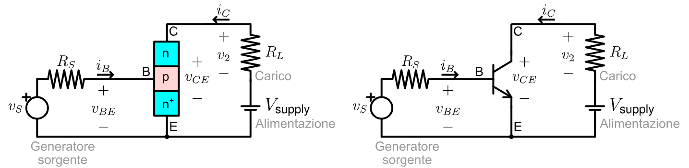

Per il **Principio di Accoppiamento**, nel quale in un dispositivo a tre terminali (o un quadripolo) lo stato elettrico di una porta è intrinsecamente dipendente da una variabile della porta opposta, così da definire l'effetto di _controllo_/_amplificazione_, scegliamo il legame tra grandezze:
- **Di ingresso**: $I_B = f(V_{BE}, V_{CE})$
- **Di uscita**: $I_C = g(V_{CE}, I_B)$

Analizziamo innanzitutto le **caratteristiche di ingresso**.

Dalla soluzione del modello di _Ebers-Moll_ avevamo visto che:
$$
I_B \approx (1 - \alpha_F)|I_E| \approx (1 - \alpha_F)|I_{ES}|\cdot e^{V_{BE}/U_T}
$$

Notiamo che questa caratteristica è analoga a quella del _diodo_.
Per semplicità consideriamo la `ZAD` per $V_{BE} > V_\gamma$.

In questa zona, notiamo che in realtà $I_B = f(V_{BE})$, ovvero che **_non abbiamo dipendenza da_** $V_{CE}$.

Noteremo più avanti che in realtà questa assenza è dovuta a una semplificazione, ma non considerarla non provoca errori così rilevanti.

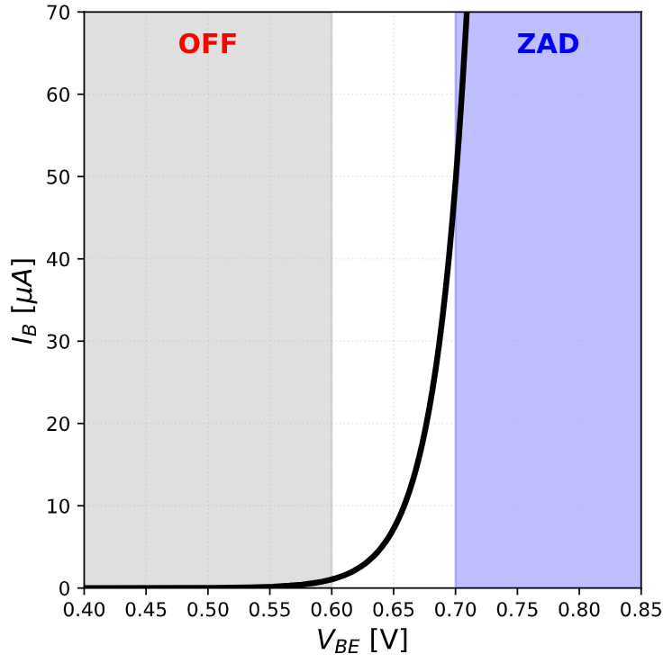

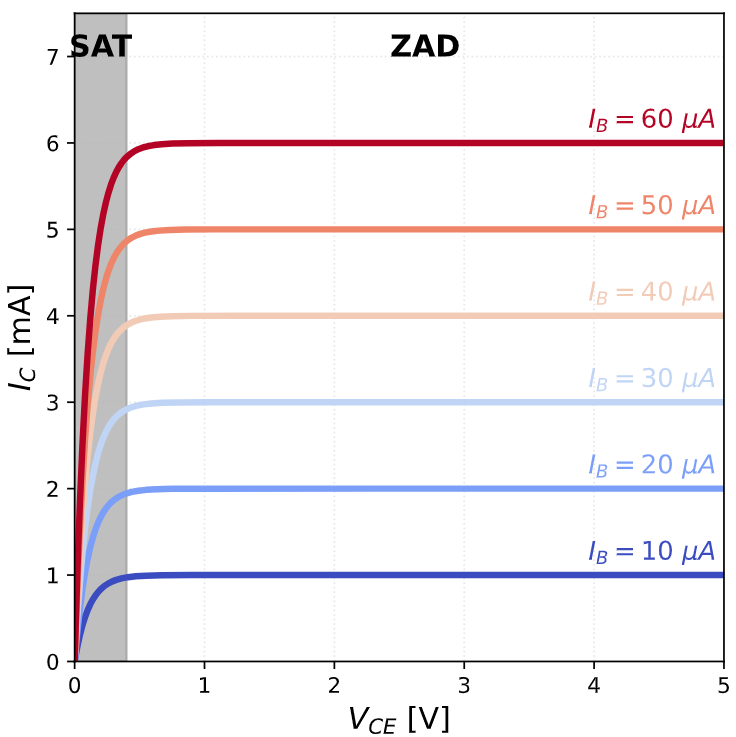

Per quanto riguarda le **caratteristiche di ingresso**, dalla soluzione del modello di _Ebers-Moll_ avevamo ottenuto che:
$$
\begin{matrix}
	I_C = \beta_F I_B & V_{CE} > V_{CE,sat}
\end{matrix}
$$

In `ZAD` quindi la dipendenza da $V_{CE}$ scompare, anche qui per una semplificazione poco rilevante.

Al di sotto di $V_{CE, sat}$ entriamo nella _zona di saturazione_, nella quale $I_D$ crolla a zero.

Questo accade perché in `ZAD` la giunzione `BC` è in **inversa** $(V_{CB} > 0)$, ovvero il collettore agisce da "raccoglitore" dei portatori che arrivano dalla base.

Riducendo la $V_{CE}$:
$$
\begin{matrix}
	V_{CE} = V_C - V_E = V_C - V_B + V_B - V_E = -V_{BC} + \underbrace{V_{BE}}_{V_\gamma} & \Rightarrow & V_{BC} = -V_{CE} + V_\gamma
\end{matrix}
$$

Se $V_{CE}$ scende sotto $\approx 0.7$ $V$ la giunzione `BC` non è più in inversa, ma **inizia a diventare diretta**.

La $V_{CE,sat}$ non è a $0.7$ $V$ come ci si aspetta, ma è un valore leggermente inferiore:
$$
	0.1\;V \le V_{CE, sat} \le 0.3\;V
$$

## 2.5. Effetto Early

L'effetto _Early_ non è evidente dal modello di Ebers-Moll, ma si nota quando **prolunghiamo le caratteristiche** per tensioni negative.

Notiamo infatti che queste convergono su un punto sull'asse delle $V_{CE}$ che chiamiamo **_Tensione di Early_** $V_A$.

<figure class="">
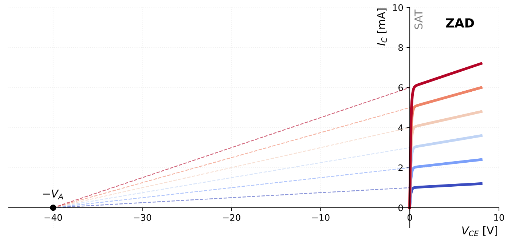
<figcaption>

Più $\vert V_{A}\vert$ è grande, meno notiamo lo "sparpagliamento" delle caratteristiche al variare della corrente di base.
</figcaption>
</figure>

Questo effetto si manifesta (in `ZAD`):
- **In entrata**: con una _riduzione_ di $I_B$ all'_aumentare_ di $V_{CE}$. È un effetto secondario poco evidente
- **In uscita**: con un _aumento_ di $I_C$ all'aumentare di $V_{CE}$. È l'effetto primario, ed è molto evidente

Abbiamo già detto che in `ZAD` la giunzione tra collettore e base è in **inversa**, ovvero:
$$
V_{BC} = V_{EC} - V_{EB} \approx - V_{CE} + V_\gamma
$$

La zona di svuotamento di una giunzione `BC` in polarizzazione inversa **_aumenta all'aumentare della polarizzazione inversa_**:
$$
W_{BC} = \sqrt{\frac{2\varepsilon}{q}\Biggl(\frac{1}{N_A} + \frac{1}{N_D}\Biggr) (V_0 - V_{BC})}
$$

L'aumento di $W_{BC}$ però comporta quindi un'assottigliamento della larghezza della base $L_B$.

Questo comporta la **diminuzione della probabilità di ricombinazione** nella base, comportando l'aumento di $I_C$ e la diminuzione di $I_B$.

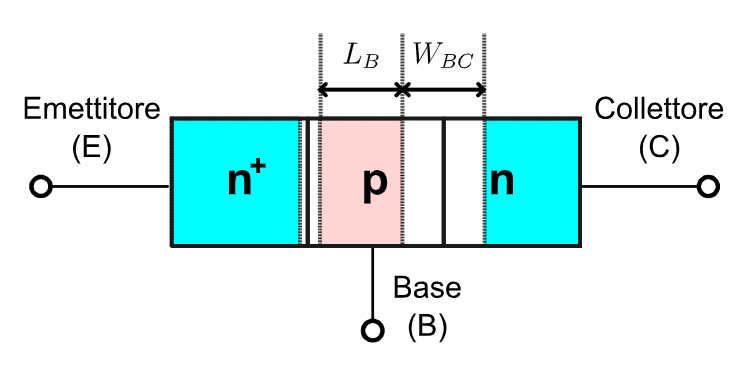

Vediamo quindi l'effetto nei due transistori a parità di $V_{BE}$:

npn

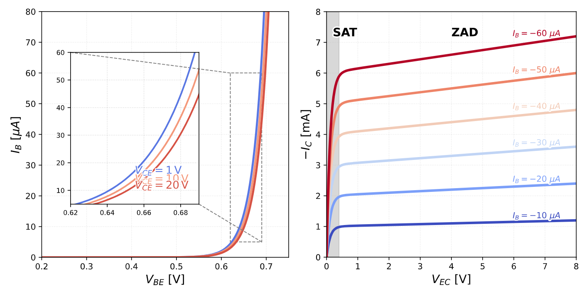

pnp

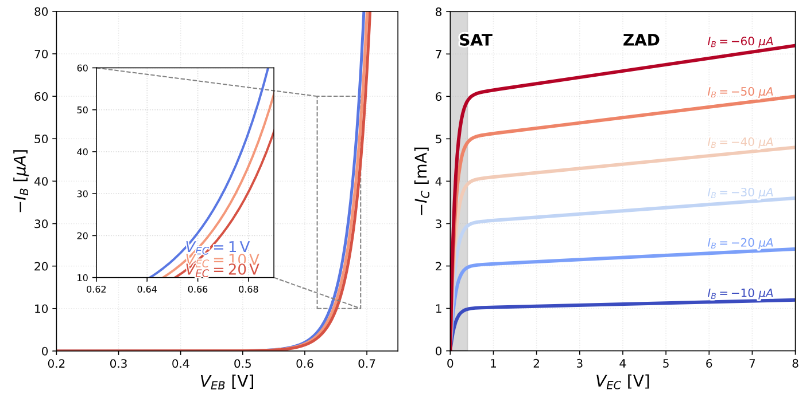

## 2.6. Polarizzazione

Analizziamo adesso come risolvere un circuito nel quale si trova un transistore `BJT`.

Quando abbiamo un transistore inserito in una rete che lo polarizza il primo passo per la risoluzione del circuito è trovare il **_punto di riposo_** &emsp; $(V_{BE_Q}, I_{B_Q}, V_{CE_Q}, I_{C_Q})$

Possiamo scrivere le equazioni alle maglie:
$$
\begin{cases}
	V_{BB} = R_BI_B + V_{BE} \\
	V_{CC} = R_CI_C + V_{CE}
\end{cases}
$$

Queste due equazioni, a quattro incognite, sono affiancate alle equazioni che descrivono le caratteristiche del `BJT`:
$$
\begin{cases}
	I_B = f(V_{BE}, V_{CE}) \\
	I_C = g(B_{CE}, I_B)
\end{cases}
$$

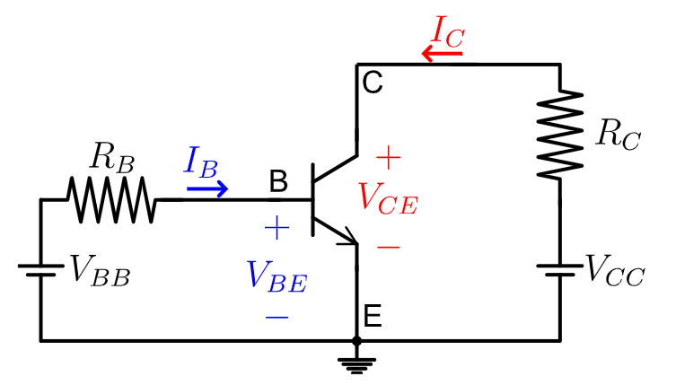

Se abbiamo a disposizione le caratteristiche di ingresso e di uscita del nostro transistore in forma grafica, possiamo effettuare un **analisi grafica**:

<figure class="80">
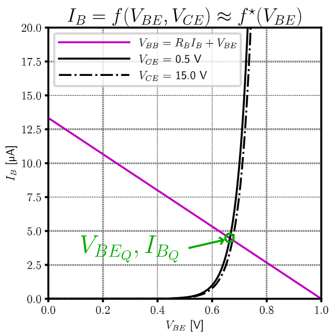
<figcaption>

L'effetto early è trascurabile sulla caratteristica di ingresso: $f(\cdot) \to f^\ast(\cdot)$.

L'intersezione con la retta di carico ci permette di trovare $V_{BE_Q}$ e $I_{B_Q}$
</figcaption>
</figure>

<figure class="80">
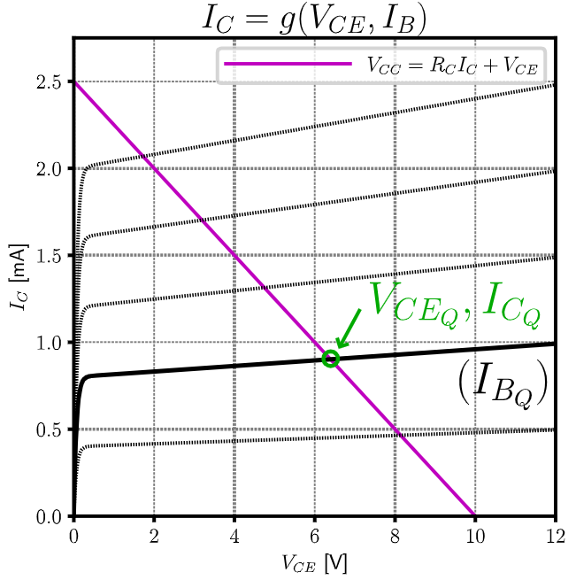
<figcaption>

Avendo già a disposizione $I_{B_Q}$, scegliamo il ramo corretto e determiniamo l'intersezione con la retta di carico per trovare $V_{CE_Q}$ e $I_{C_Q}$
</figcaption>
</figure>

Se invece volessimo fare un **analisi analitica** delle stime, possiamo utilizzare l'equazione che descrive la corrente $I_B$ secondo il modello _Ebers-Moll_ in `ZAD`:
$$
I_{B_Q} = (1 - \alpha_F)I_{ES}e^{V_{BE_Q} \over U_T}
$$

A questo punto possiamo sostituire questo valore nell'equazione della retta di carico:
$$
	V_{BB} = R_B\cdot (1 - \alpha_F)I_{ES}e^{V_{BE_Q} \over U_T} + V_{BE_Q} \\
$$

Questa equazione è un **equazione trascendente** in incognita $V_{BE_Q}$, non risolvibile se non con metodi di _calcolo numerico_.

Possiamo però utilizzare un **metodo analitico semplificato**, sfruttando il **_modello a caduta costante della giunzione $BE$_** in `ZAD`:
$$
	V_{BE_Q}^\ast = V_\gamma = 0.7\;V
$$

Possiamo sostituire questo valore nella retta di carico per trovare immediatamente $I_{B_Q}$:
$$
I_{B_Q}^\ast = \frac{V_{BB} - V_\gamma}{R_B}
$$

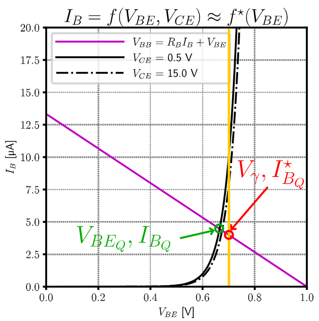

Questa stima permette una risoluzione "carta e penna" semplice, e mantiene un errore piccolo poiché nel transistore `BJT` abbiamo un _coefficiente di non idealità_ unitario $(\eta = 1)$, quindi il valore $V_\gamma$ a temperature non estreme è sufficientemente vicino al valore reale.

Nel metodo analitico semplificato **_trascuriamo l'effetto Early anche sulla caratteristica di uscita_**, utilizzando la relazione:
$$
	I_{C_Q}^\ast = \beta_F I_{B_Q}^\ast
$$

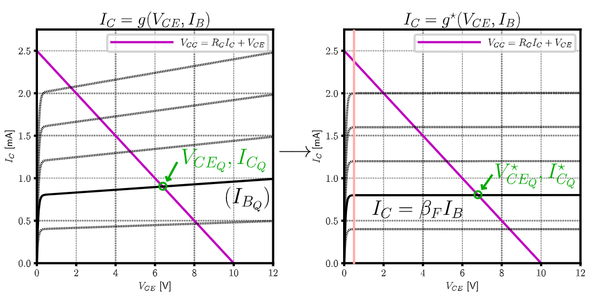

Trovato quindi $V_{CE_Q}^\ast = V_{CC} - R_C\beta_F I_{B_Q}^\ast$.

Poiché la nostra ipotesi è di essere in `ZAD`, dobbiamo semplicemente verificare che:
$$
	V_{CE_Q}^\ast > V_{CE, sat} \approx 0.2\;V
$$

Fatto ciò abbiamo trovato il **punto di riposo approssimato** &emsp; $(V_{BE_Q}^\ast, I_{B_Q}^\ast, V_{CE_Q}^\ast, I_{C_Q}^\ast)$.

Possiamo quindi riassumere la **polarizzazione del transistore BJT** nel seguente modo:

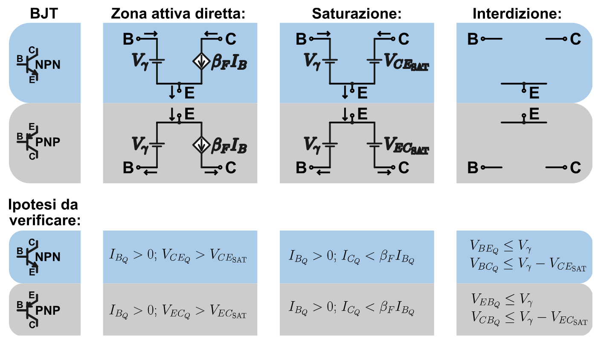

## 2.7. Inverter

La caratteristica statica di trasferimento in tensione, o `VCT` è che il voltaggio di uscita dipende da quello in entrata &emsp; $V_{out(V_{in})}$

In particolare sappiamo che la tensione di ingresso $V_{in}$ varia a passi discreti da $0$ fino al valore $V_{CC}$, tipicamente $5$ $V$.

Il valore della tensione di uscita viene registrata solo una volta esauriti i transitori, dopo che il `BJT` abbia attraversato le varie zone di funzionamento.

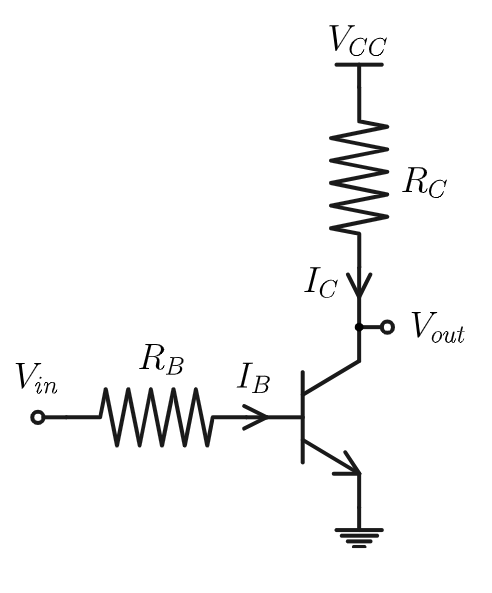

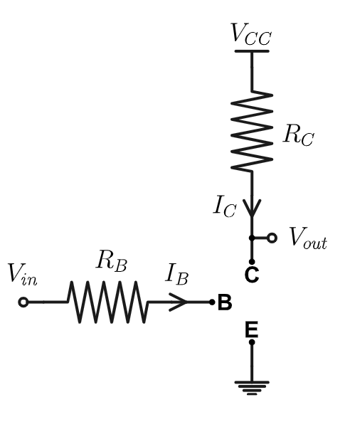

La prima zona che vediamo è la regione:
$$
0 \le V_{in} \le V_\gamma
$$

In questa zona la nostra ipotesi è che il `BJT` sia **interdetto**:
$$
\begin{align*}
	I_B &= I_C = 0 \\
	V_{out} &= V_{CC}
\end{align*}
$$

La verifica è immediata:
$$
\begin{align*}
	V_{BE} &= V_{in} < V_\gamma & \text{Verificata da ipotesi} \\[1em]
	V_{BC} &= V_{BE} - V_{CE} = V_{in} - V_{CC} \\
		   &< V_\gamma - V_{CC} & \text{Verificata da ipotesi} \\
		   &< V_\gamma - V_{CE,sat}
\end{align*}
$$

In questa fase abbiamo quindi un entrata $V_{in}$ identificabile con uno `0` logico, e un uscira $V_{CC}$ equiparabile a un `1` logico.

La seconda zona che analizziamo è la regione:
$$
	V_\gamma \le V_{in} < V_{in,sat}
$$

In questa zona ipotizziamo `BJT` in `ZAD`:
$$
\begin{CD}
	\begin{matrix}
		I_B = \frac{V_{in}-V_\gamma}{R_B} & &	I_C = \beta_F I_B
	\end{matrix} \\
	@VVV \\
	{
		V_{out} = V_{CC} - R_CI_C = V_{CC} - R_C\beta_F \frac{V_{in}-V_\gamma}{R_B}
	}
\end{CD}
$$

Verifichiamo l'ipotesi:
$$
\begin{align*}
	I_B &> 0 & \text{Verificata da ipotesi} \\
	V_{CE} &= V_{out} > V_{CE,sat}
\end{align*}
$$

L'ultima condizione è sicuramente soddisfatta per $V_{in,min} = V_\gamma$, che comporta che $V_{out} = V_{CC} > V_{CE,sat}$, dobbiamo però calcolare $V_{in,max} = V_{in,sat}$ affinché questa relazione sia rispettata sempre.
Calcoliamo quindi il limite superiore:
$$
\begin{CD}
	{V_{CE,sat} = V_{CC} - \frac{R_V\beta_F}{R_B}(V_{in,sat} - V_\gamma)} \\
	@V{\text{Isolo } V_{in,sat}}VV \\
	{
		V_{in,sat} = V_\gamma + \frac{R_B}{R_C\beta_F}(V_{CC} - V_{CE,sat})
	}
\end{CD}
$$

Assumendo quindi questo come valore $V_{in,sat}$ possiamo garantire che le **nostre ipotesi siano verificate**.

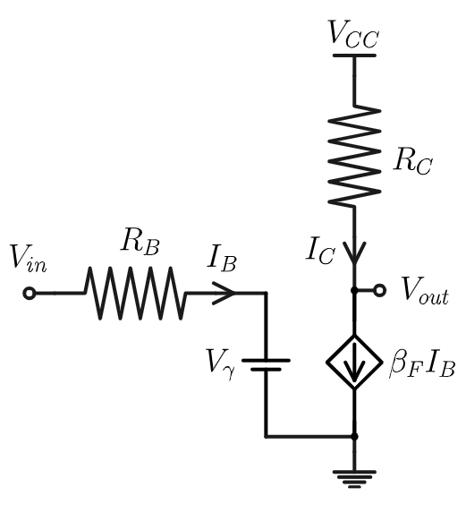

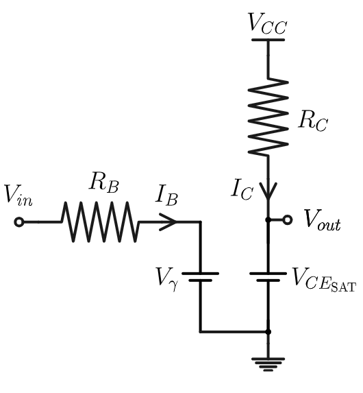

L'ultima regione è quindi:
$$
	V_{in} \ge V_{in,sat}
$$

Che equivale a quando il `BJT` è **_saturo_**:
$$
\begin{CD}
	\begin{matrix}
		I_B = \frac{V_{in}-V_\gamma}{R_B} & &	I_C = \frac{V_{CC} - V_{CE,sat}}{R_C}
	\end{matrix} \\
	@VVV \\
	{
		V_{out} = V_{CE,sat}
	}
\end{CD}
$$

Verifichiamo l'ipotesi di saturazione:
$$
\begin{align*}
	I_B &> 0  & \text{Verificata dalle ipotesi} \\
	I_C &\le \beta_FI_B
\end{align*}
$$

Per dimostrare l'ultima ipotesi, scriviamo la tensione di ingresso come l'aumento rispetto alla tensione di saturazione:
$$
\begin{matrix}
	V_{in} = \Delta V_{in} + V_{in,sat} & \Delta V_{in} > 0
\end{matrix}
$$
A questo punto possiamo riscrivere la corrente di base:
$$
\begin{align*}
	I_B &= \frac{\Delta V_{in}}{R_B} + \frac{V_{in,sat} - V_\gamma}{R_B} & \text{Dallo studio nella regione precedente: } V_{in,sat} = V_\gamma + \frac{R_B}{R_C\beta_F}(V_{CC} - V_{CE,sat}) \\
	I_B &=  \frac{\Delta V_{in}}{R_B} + \frac{V_{CC} - V_{CE,sat}}{\beta_F R_C} \\
	\beta_F I_B &= \frac{\beta_F \Delta V_{in}}{R_B} + I_C
\end{align*}
$$

Poiché sappiamo che $\Delta V_{in} > 0$, allora la nostra condizione è sicuramente rispettata.

In questa fase abbiamo un ingresso rappresentabile con un `1` logico, mentre l'uscita sarà uno `0` logico.

Riassumento abbiamo ottenuto che:
$$
\begin{matrix}
	0 \le V_{in} < V_\gamma & V_{out} = V_{CC} \\
	V_\gamma \le V_{in} < V_{in,sat} & V_{out} = V_{CC} - R_C \beta_F \frac{V_{in} - V_\gamma}{R_B} \\
	V_{in} \ge V_{in,sat} & V_{out} = V_{CE,sat}
\end{matrix}
$$

<figure class="80">
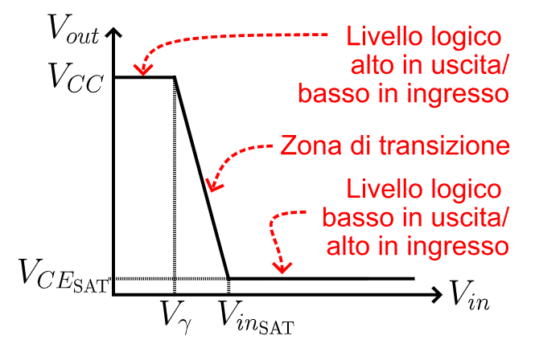
<figcaption>

Quello che abbiamo ottenuto dai calcoli
</figcaption>
</figure>

<figure class="80">

<figcaption>

La simulazione di ciò che accade nella realtà.
Vedremo più avanti cosa significa "punto di inversione"
</figcaption>
</figure>

Nella realtà tendiamo a non utilizzare inverter costruiti così poiché sono soggetti ad un **_consumo statico_** di energia, che aumenta all'aumentare della tensione.

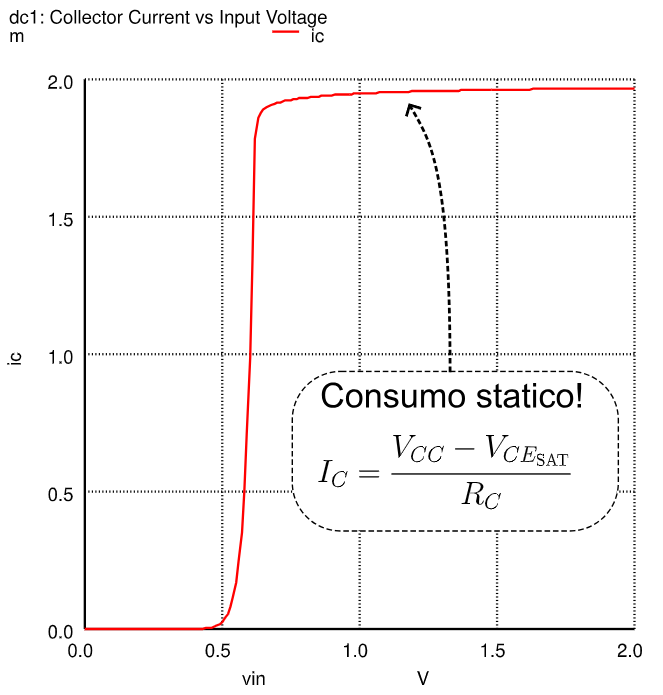

### 2.7.1. Inverter come amplificatore

Immaginiamo di avere tensioni di ingresso sinusoidali, di ampiezza $2V_M$.

Se l'inverter lavora in `ZAD`,  quello che otteniamo è un ampiezza di uscita di ben $2 \frac{R_C}{R_B}\beta_F V_M$.

Otteniamo quindi un fattore di amplificazione:
$$
A = - \frac{A_{out}}{A_{in}} = - \frac{\beta_F R_C}{R_B}
$$

L'amplificazione è quindi linearmente dipendente da $\beta_F$, e quindi può variare fortemente con i parametri del transistore e la **temperatura**.

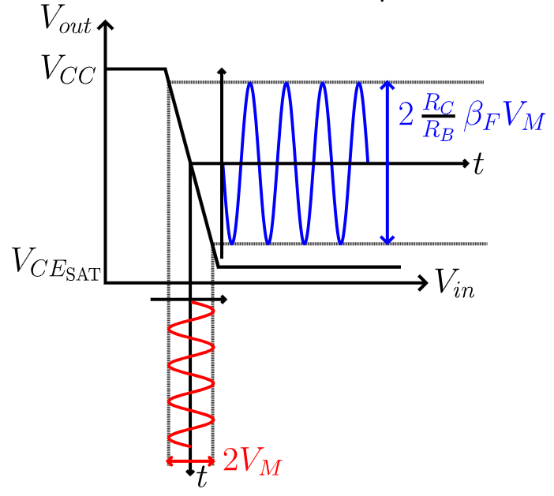

## 2.8. Polarizzazione BJT - Rete a 4 resistori

Per ottenere una polarizzazione indipendente dalla temperatura è necessario fissare una corrente continua costante di collettore o di emettitore che sia anch'essa **_poco sensibile alle variazioni_** della temperatira.

In particolare utilizziamo un circuito a 4 resistori. Questo circuito, come si può vedere sotto, può essere sostituito effettuando l'_equivalente Thévenin_ per ottenere una struttura più simile a quella già vista:

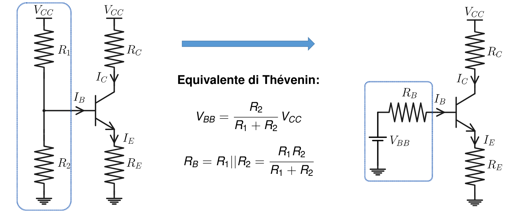

Nel modello semplificato, in ipotesi `ZAD`, questo circuito diventa così:

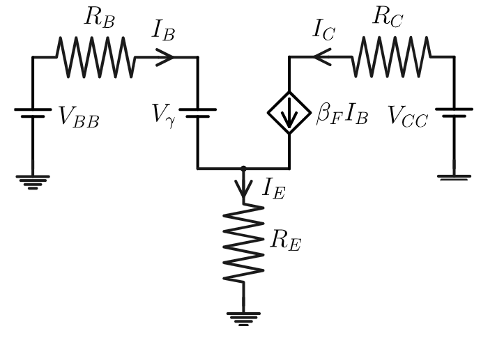

Su questo circuito otteniamo:
$$
\begin{cases}
	V_{BB} = R_BI_B + V_\gamma + R_EI_E \\
	V_{CC} = R_CI_C + V_{CE} + R_EI_E \\
	I_C = \beta_F I_B \\
	I_E = I_C + I_B
\end{cases}
$$

Dove $I_B$, $I_C$, $I_E$ e $V_{CE}$ sono le nostre incognite.

Risolvendo questo sistema di quattro equazioni otteniamo:
$$
\begin{cases}
	I_B = \frac{V_{BB} - V_\gamma}{R_B + R_E(\beta_F + 1)} \\[0.75em]
	I_C = \beta_F I_B  = \beta_F \cdot \frac{V_{BB} - V_\gamma}{R_B + R_E(\beta_F + 1)}\\[0.75em]
	I_E = (\beta_F + 1)I_B = \frac{V_{BB} - V_\gamma}{\frac{R_B}{\beta_F + 1} + R_E} \\[0.75em]
	V_{CE} = V_{CC} - (R_C\beta_F + R_E(\beta_F + 1))I_B
\end{cases}
$$

Se verifichiamo quindi la stabilità del punto di riposo:
$$
\begin{CD}
	\begin{cases}
		V_{BB} \gg V_\gamma \\
		R_E \gg \frac{R_B}{\beta_F + 1}
	\end{cases}
	@>>>
	{I_E \approx \frac{V_{BB}}{R_E} \approx I_C}
\end{CD}
$$

Abbiamo quindi che la corrente di emettitore, e di conseguenza anche quella di collettore, è determinata dai componenti esterni collegati al transistore, **_e non dal transistore stesso_**.

## 2.9. Modello Linearizzato per Piccoli Segnali

Abbiamo già visto come trovare il punto di riposo risolvendo il circuito con il modello per grande segnale.

Ci occupiamo adesso di determinare gli effetti dovuti al piccolo segnale di stimolo $v_{in}(t): \Set{i_b(t), v_{be}(t), i_c(t), v_{ce}(t), v_{out}(t)}$.

Analogamente a quanto avevamo visto con il diodo operiamo una **_linearizzazioen attorno al punto di riposo_**:
$$
\begin{CD}
	\begin{cases}
		v_{BE} = f(i_B, v_{CE}) \\
		i_C = g(i_B, v_{CE}) \\
		i_B(t) = I_{B_Q} + i_b(t) \\
		v_{CE}(t) = V_{CE_Q} + v_{ce}(t)
	\end{cases} \\
	@VVV \\
	\begin{cases}
		v_{BE} = f(I_{B_Q} + i_b(t), V_{CE_Q} + v_{ce}(t)) \\
		i_C = g(I_{B_Q} + i_b(t), V_{CE_Q} + v_{ce}(t))
	\end{cases} \\
	@V\text{Linearizziamo attorno al punto di riposo}VV \\
	\begin{cases}
		v_{BE} \approx f(I_{B_Q}) + \frac{\partial f(I_{B_Q}, V_{CE_Q})}{\partial i_B} \cdot i_b(T) + \frac{\partial f(I_{B_Q}, V_{CE_Q})}{\partial v_{CE}} \cdot v_{ce}(t) \\
		i_{C} \approx g(I_{B_Q}) + \frac{\partial g(I_{B_Q}, V_{CE_Q})}{\partial i_B} \cdot i_b(T) + \frac{\partial g(I_{B_Q}, V_{CE_Q})}{\partial v_{CE}} \cdot v_{ce}(t)
	\end{cases} \\
	@VVV \\
	\begin{cases}
		V_{BE}(t) = V_{BE_Q} + v_{be}(t) \\
		i_C(t) = I_{C_Q} + i_c(t)
	\end{cases}
\end{CD}
$$

Otteniamo quindi le seguenti linearizzazioni per i piccoli segnali attorno al punto di riposo $Q$:
$$
\begin{cases}
	v_{be}(t) \approx \frac{\partial f(I_{B_Q}, V_{CE_Q})}{\partial i_B} \cdot i_b(T) + \frac{\partial f(I_{B_Q}, V_{CE_Q})}{\partial v_{CE}} \cdot v_{ce}(t) \\
	i_c(t) \approx \frac{\partial g(I_{B_Q}, V_{CE_Q})}{\partial i_B} \cdot i_b(T) + \frac{\partial g(I_{B_Q}, V_{CE_Q})}{\partial v_{CE}} \cdot v_{ce}(t)
\end{cases}
$$

Definiamo quindi **parametri ibridi** o _hybrid_:
$$
\begin{align*}
	h_{ie} &:= \frac{\partial f(Q)}{\partial i_B} = \frac{\partial v_{BE}(Q)}{\partial i_B} \\
	h_{re} &:= \frac{\partial f(Q)}{\partial v_{CE}} = \frac{\partial v_{BE}(Q)}{\partial v_{CE}} \\
	h_{fe} &:= \frac{\partial g(Q)}{\partial i_B} = \frac{\partial i_C(Q)}{\partial i_B} \\
	h_{oe} &:= \frac{\partial g(Q)}{\partial v_{CE}} = \frac{\partial i_C(Q)}{\partial v_{CE}} \\
\end{align*}
$$

I pedici stanno per:
- $i$&emsp; input
- $o$&emsp; output
- $f$&emsp; forward
- $r$&emsp; reverse
- $e$&emsp; emettitore comune

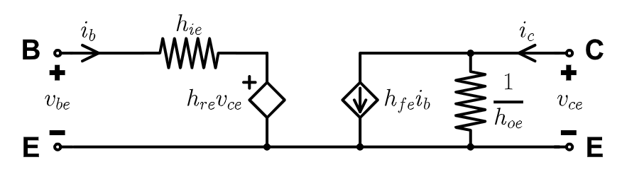

Questo circuito è un quadripolo lineare modellato con parametri $h$:
$$
\begin{cases}
	h_{11} = \frac{v_1}{i_1} = h_{ie} & v_2 = 0 & \text{Impedenza di ingresso} \\[0.5em]
	h_{12} = \frac{v_1}{v_2} = h_{re} & i_1 = 0 & \text{Guadagno di tensione inverso} \\[0.5em]
	h_{21} = \frac{i_2}{i_1} = h_{fe} & v_2 = 0 & \text{Guadagno di corrente diretto} \\[0.5em]
	h_{22} = \frac{i_2}{v_2} = h_{oe} & i_1 = 0 & \text{Ammettenza di uscita} \\
\end{cases}
$$

### 2.9.1. Ruolo dei parametri

Il parametro $h_{ie}$ ci fornisce informazioni sulla pendenza della retta tangente che linearizza la nostra funzione nel punto di riposo.

<figure class="">
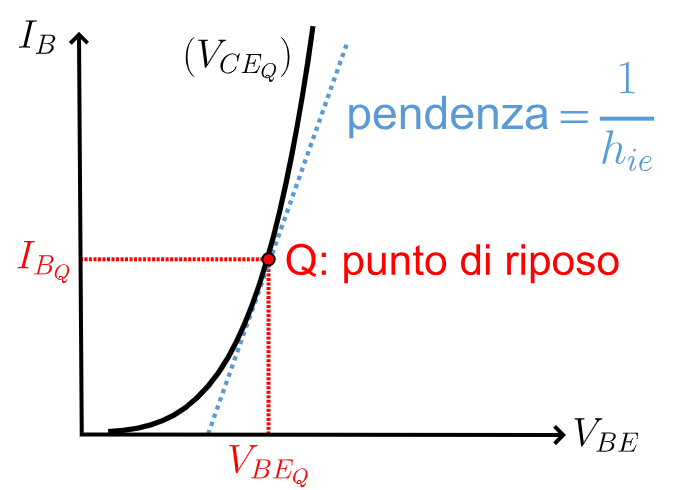
<figcaption>

È analogo alla ressitenza differenziale del diodo
</figcaption>
</figure>

Il parametro $h_{re}$ ci fornisce informazioni riguardo a come varia la corrente di base $I_{B_Q}$ all'oscillamento della tensione $V_{BE}$ .

Se effettuiamo il limite con le oscillazioni nulle otterremo la corrente $I_{B}$ con tensione $V_{CE_Q}$.

<figure class="">
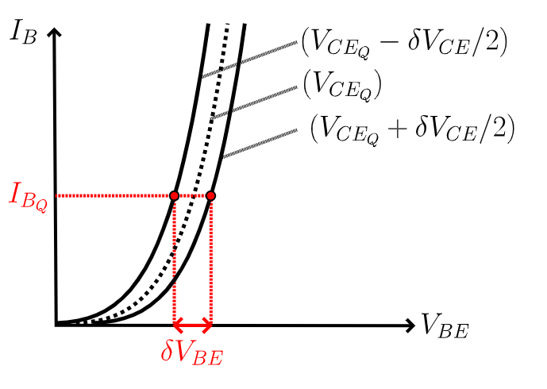
<figcaption>

Se $h_{re} \approx 0$ non avremo _l'effetto Early_ sulla porta di ingresso
</figcaption>
</figure>

Il parametro $h_{fe}$ ci fornisce informazooni relative alla variazione della corrente di uscita $I_C$ al variare della corrente di base $I_B$.

<figure class="">
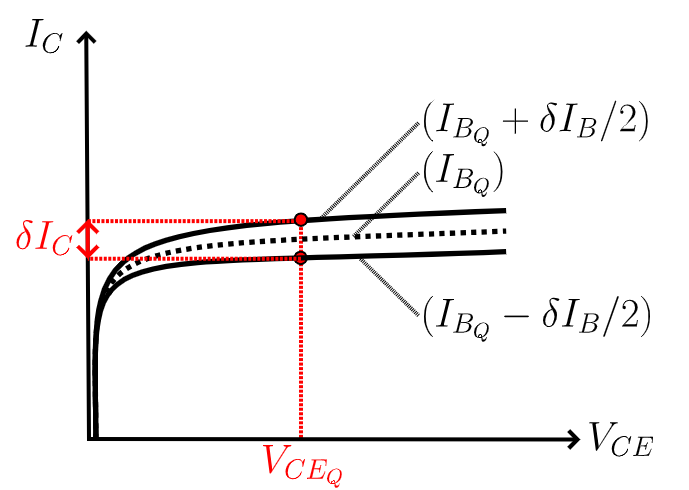
<figcaption>

Come detto in precedenza assumiamo $\beta_F = h_{fe}$, anche se $h_{fe}$ è leggermente superiore.
</figcaption>
</figure>

Il parametro $h_{oe}$ ci fornisce informazioni relative all'_effetto Early sulla porta di uscita_.
In particolare è possibile dimostrare che, chiamata $-V_A$ la _tensione di Early_:
$$
	h_{oe} = \frac{I_{C_Q}}{V_A + V_{CE_Q}}
$$

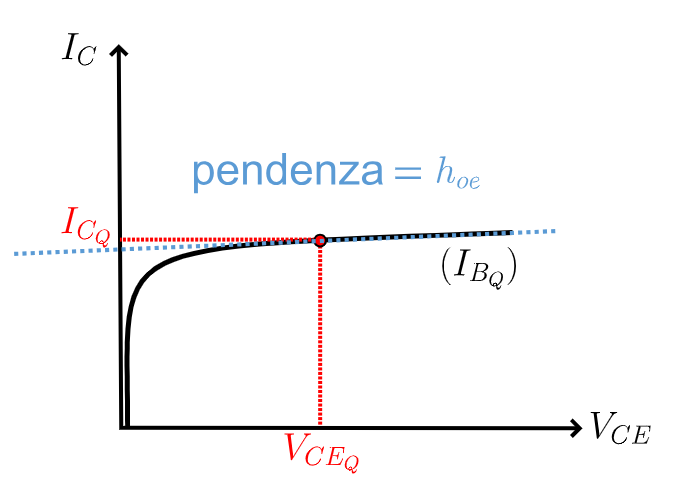

Per quanto riguarda il parametro di uscita $h_{oe}$ spesso faremo la seguente semplificazione:
> Per valori/ordini di grandezza tipici degli esercizi, ovvero:
> - $V_A = 100$ $V$
> - $I_{C_Q} = 1$ $mA$
> - $V_{CE_Q} \ll V_A$
>
> Consideremo:
> $$
> 	\frac{1}{h_{oe}} \approx \frac{V_A}{I_{C_Q}} = 100\;k\Omega
> $$
>
> Se invece i resistori della rete esterna sono di pochi $k\Omega$ possiamo considerare:
> $$
> 	\frac{1}{h_{oe}} \to \infty
> $$

Abbiamo quindi le seguenti linearizzazioni:
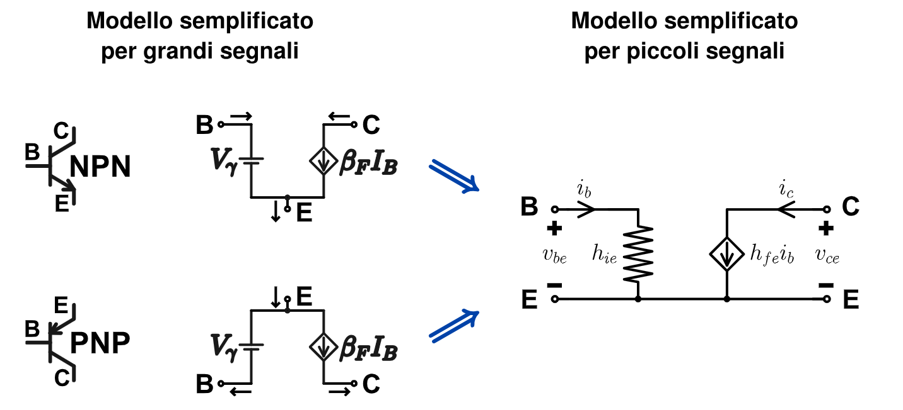

## 2.10. Accoppiamento AC con sorgente e carico

Vediamo cosa succede quando accoppiamo un transistore `BJT` con un generatore alternato $v_S$ e un carico in connessione diretta:

<figure class="90">
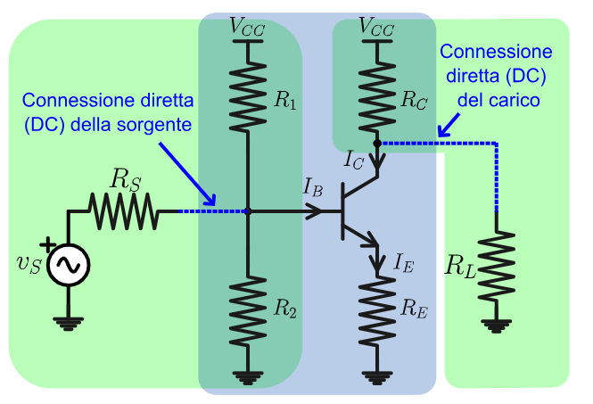
<figcaption>

Esempio di accoppiamento diretto.
Il generatore $V_S$ è da considerarsi un generatore dincontinua per i nostri scopi.
</figcaption>
</figure>

<figure class="80">
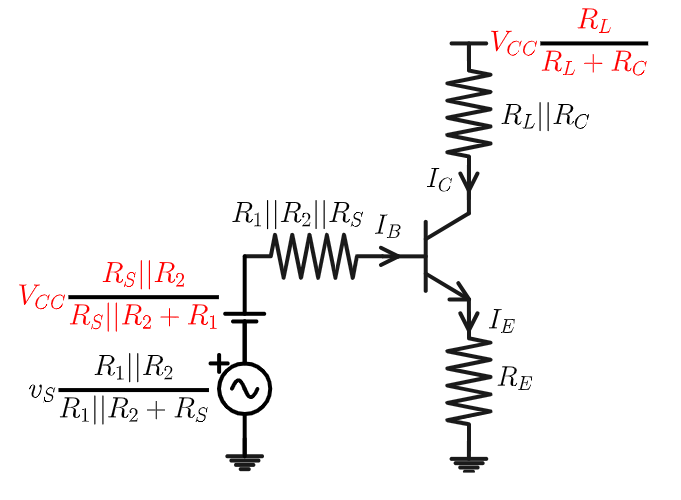
<figcaption>

Equivalente Thévenin
</figcaption>
</figure>

In questa configurazione se il carico fosse molto minore della resistenza del connettore $R_L \ll R_C$ otteniamo che l'alimentazione tenderà a zero, quindi anche la $V_{CE_Q}$ tenderà a zero, **_saturando il `BJT`_**.

In modo analogo, se $R_S \ll R_1,R_2$ abbiamo che la _tensione di base tenderà a zero_, andando a spegnere $V_S$ per sovrapposizione degli effetti.
In questo caso la **corrente di base tende a zero**, **_spegnendo il `BJT` se_** $V_{BE} < V_\gamma$

L'accoppiamento diretto DC **_interferisce con la polarizzazione del carico_** del transistore `BJT`.

Vediamo quindi un altro tipo di connessione, attraverso dei **condensatori**:

<figure class="">
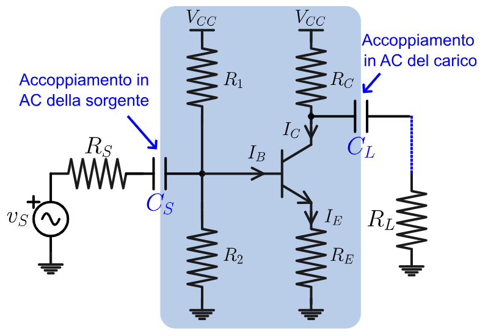
<figcaption>

Sia il generatore di sorgente che il carico vengono connessi **tramite condensatori di disaccoppiamento** $C_S, C_L$
</figcaption>
</figure>

I condensatori non sono scelti casualmente ma devono essere dei **perfetti corto circuiti alla frequenza dei segnali**, così da non introdurre delle attenuazioni né nelle distorsioni nei segnali che transitano.

Quando agiamo in continua, i condensatori offrono una **impedenza infinita** $({1 \over j\omega C})$, aprendo le maglie relative alla sorgente e al carico.
In questo modo il punto carico $Q$ del `BJT` **dipende unicamente dallo schema di polarizzazione**.

In corrente alternata sopra una certa frequenza $(50Hz)$ invece i condensatori si considerano corto-circuiti, permettendo al segnale di attraversare lo stadio amplificatore e raggiungere il carico. Queste frequenze dipendono dalla resistenza vista da ciascuno di essi $(\omega_{z,X} = \frac{1}{R_XC_X})$.
È quindi possibile calcolare $R_X$ dal circuito e decidere $\omega_{z,X}$ dimensionando opportunamente $C_X$.

### 2.10.1. Analisi di Circuiti con Componenti non lineari

1. _**Analisi DC**_ o **_Analisi del Punto di Riposo_**: Determino $Q$ e calcolo i parametri differenziali
   - Disattivare i generatori di segnale $v(t) \to c.c$ &emsp; $i(t) \to c.a.$
   - Sostituire i condensatori con un c.a.
   - Sostituire le induttanze con un c.c.
   - Sostituire i _componenti non lineari_ con il **_modello per grandi segnali_**
2. _**Analisi AC**_ O **_Analisi in Media Frequenza_**: Determino **guadagno a centro banda**, **impedenze viste**, ...
   - Disattivare i generatori di valore costante $V_{CC} \to 0$ &emsp; $I_P \to c.a.$
   - Sostituire i condensatori con un c.c.
   - Sostituire le induttanze con un c.a.
   - Sostituire i _componenti non lineari_ con il **_modello per piccoli segnali_**
   - I condensatori _intrinsechi_ ai componenti non lineari vengono considerati c.a.