# 1. Indice

- [1. Indice](#1-indice)
- [2. Transistore `FET`](#2-transistore-fet)
- [3. Condensatore `MOS`](#3-condensatore-mos)
- [4. Transistore `MOSFET`](#4-transistore-mosfet)
	- [4.1. Analisi del Transistore](#41-analisi-del-transistore)
		- [4.1.1. Zona di funzionamento Triodo](#411-zona-di-funzionamento-triodo)
		- [4.1.2. Zona di Attenuazione](#412-zona-di-attenuazione)
		- [4.1.3. Zona di Saturazione](#413-zona-di-saturazione)
	- [4.2. Modellizzazione del Transitore `MOSFET` a canale N](#42-modellizzazione-del-transitore-mosfet-a-canale-n)
		- [4.2.1. Effetto di Modulazione di Canale](#421-effetto-di-modulazione-di-canale)
	- [4.3. Trans-Caratteristica](#43-trans-caratteristica)
	- [4.4. Modellizzazione del Transitore MOSFET a canale P](#44-modellizzazione-del-transitore-mosfet-a-canale-p)
		- [4.4.1. Confronto `NNOS` - `PMOS`](#441-confronto-nnos---pmos)
	- [4.5. Processi `CMOS`](#45-processi-cmos)
	- [4.6. Simboli circuitali per i `MOSFET`](#46-simboli-circuitali-per-i-mosfet)
	- [4.7. Modello per Grandi Segnali](#47-modello-per-grandi-segnali)
	- [4.8. Circuito di Polarizzazione](#48-circuito-di-polarizzazione)
		- [4.8.1. Modello a Polarizzazione Costante](#481-modello-a-polarizzazione-costante)
		- [4.8.2. Modello a Polarizzazione Dinamica](#482-modello-a-polarizzazione-dinamica)
	- [4.9. Modello per Piccoli Segnali](#49-modello-per-piccoli-segnali)

# 2. Transistore `FET`

Questa famiglia di transistori (_Field Effect Transistor_) sono caratterizzati dal fatto di essere _**pilotati da un Campo Elettrico**_.

Tra tutti i transistori che appartengono alla famiglia, noi ci concrentriamo nell'analisi e lo studio della famiglia `MOSFET` (_Metal Oxide Semiconductor Field Effect Transistor_).

Oltre a questi esistono altri tipi di transistori `FET` come il `JFET` (_Junction FET_) o il `MESFET`, che **non affronteremo in questo corso**.

In generale il `MOSFET` è un _**generatore di corrente controllato in tensione**_.

La sua invenzione risale agli anni '30, precedente anche al transistore bjt. Ma soffrì di molti problemi pratici nella realizzazione fisica degli stessi, che hanno favorito l'utilizzo dei `BJT`. In epoca più moderna abbiamo risolto i problemi realizzativi e oggi vengono utilizzati quasi completamente nella sfera digitale, in quanto sono più piccoli e forniscono più possibilità a chi li utilizza.

# 3. Condensatore `MOS`

Il condensatore `MOS` è costituito da tre strati:
- **Conduttore**: storicamente veniva utilizzato l'_alluminio_ $Al$. Per fare il `MOSFET` oggi si utilizza il _PoliSilicio Drogato_, un polimero ricavato dal silicio
- **Ossido**: storicamente veniva utilizzato l'_ossido di silicio_ $SiO_2$, oggi in processi più raffinati si utilizzano altri ossidi più raffinati
- **Semiconduttore P**: si utilizza il _silicio_ $Si$

Il problema pratico che ha ritardato l'utilizzo di questo tipo di transistori è che lo strato _ossido_ deve essere **_un isolante perfetto_**.

<figure class="80">
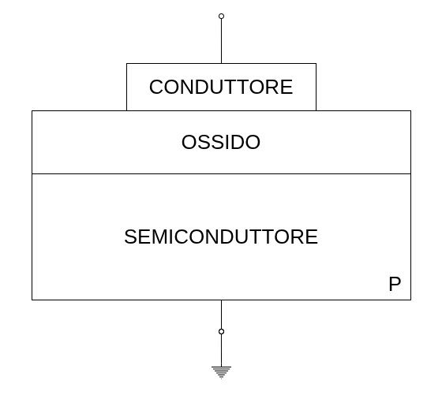
<figcaption>

Disegno non in scala.
Il semiconduttore è circa $300 - 500$ $\mu m$, l'isolante invece è tra i tra $1$ $\mu m$ e $10$ $nm$
</figcaption>
</figure>

Per studiare cosa avviene in questo condensatore colleghiamo alla struttura due contatti:
- Connettiamo il _semiconduttore_ a _ground_
- Connettiamo in conduttore ad un generatore di tensione $V_G$, chiamando il nodo $G$

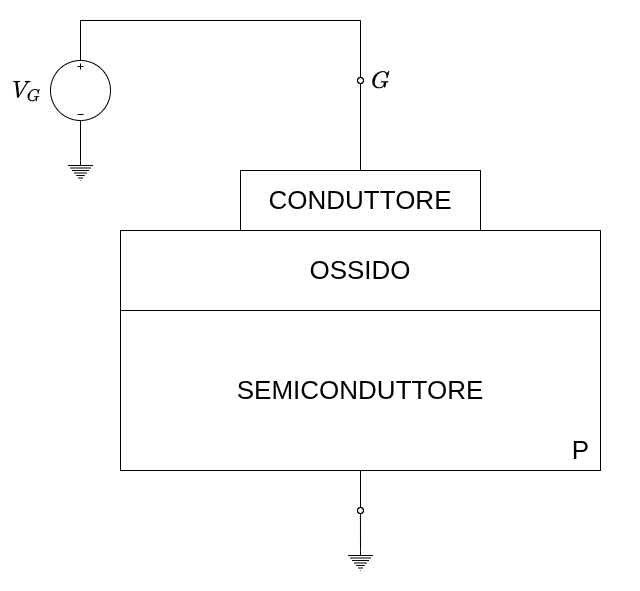

Accumulazione

Il primo caso che analizziamo è quello dove $V_G < 0$.

In questo caso quello che otteniamo è che il conduttore si carica _negativamente_, mentre sul semiconduttore quello che accade è che per effetti di attrazione elettrica, quello che accade è che **si concentrano nel confine con l'ossido _tante lacune quante sono necessarie per ottenere la stessa concentrazione elettrica_ del conduttore**.

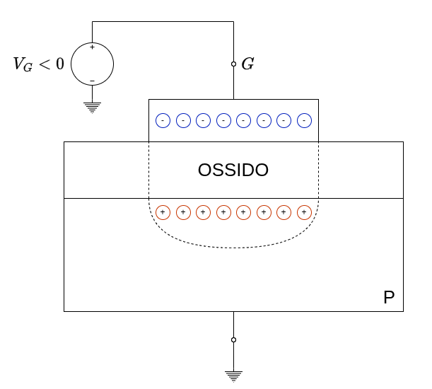

Chiamando $p_\text{substrato}$ la **concentrazione di lacune nel substrato**, e $p_\text{substrato}$ la **concentrazione di lacune nel substrato con l'ossido** otteniamo che:
$$
p_\text{superficiale} > p_\text{substrato}
$$

Questo processo di _accumulo delle lacune_ sulla superficie è detto **_Accumulazione_**.

Svuotamento

Il secondo caso che analizziamo è quello dove $V_G > 0$.

In questo caso quello che otteniamo è che il conduttore si carica _positivamente_. 
Di conseguenza sul semiconduttore, per gli stessi effetti di attrazione elettrica, quello che accade è che **si concentrano nel confine con l'ossido _tante cariche negative quante sono necessarie per ottenere la stessa concentrazione elettrica_ del conduttore**.

Queste cariche negative non sono rappresentate dai pochi _elettroni liberi_ ma piuttosto dall'**_assenza di lacune_**. Questa zona diventa una vera e propria **_zona di svuotamento_**, composta da _cariche fisse_.

<figure class="80">
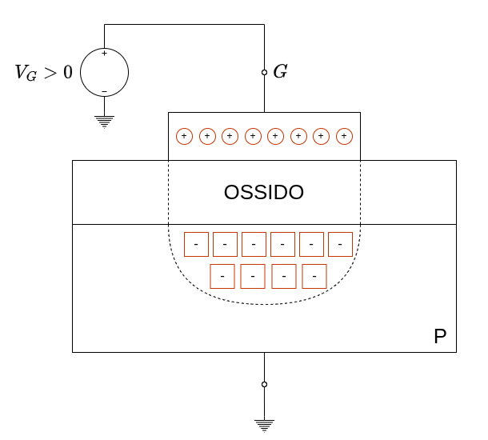
<figcaption>

L'assenza di lacune è rappresentata come un _quadrato con il segno meno_.
Il disegno non è in scala, in quanto la zona di svuotamento è di circa $1$ $\mu m$.
È importante notare che questa zona si estenze _esattamente per la larghezza del conduttore_.
</figcaption>
</figure>

In questo caso avremo che:
$$
p_\text{superficiale} < p_\text{substrato}
$$

Questo processo di _allontanamento delle lacune_ dalla superficie è detto di _**Svuotamento**_.

Esiste un ulteriore caso nel quale in nostro condensatore si comporta in modo "particolare".
Se infatti non solo poniamo $V_G > 0$, ma la impostiamo $V_G > V_T$, ovvero più elevata di una **Tensione di Soglia** (_Threshold Voltage_) <u>**_diversa dal Thermal Voltage_** dei `BJT` e dei diodi</u> otteniamo che in questo caso la _zona di svuotamento_ non sarà composta solo dall'_assenza di lacune_, ma in modo equo anche da **_elettroni liberi_**.

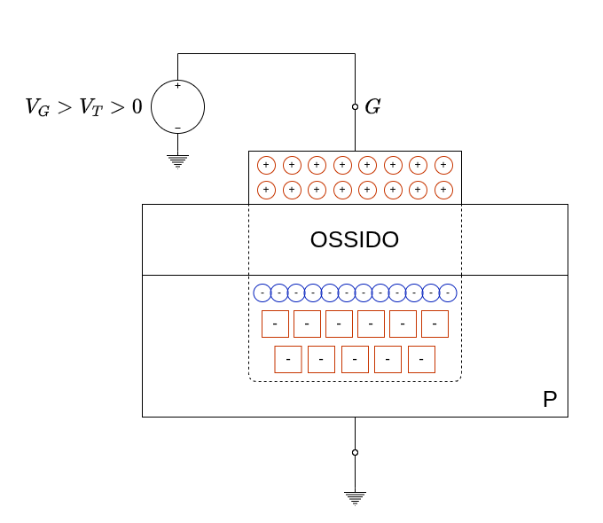

In particolare lo strato superiore è composto dagli elettroni liberi, mentre quello più interno da **ioni fissi**.

La **Tensione di Soglia** è definita:
> Quella tensione per la quale la concentrazione di elettroni in superficie è uguale alla concentrazione di delle lacune nel substrato
> 
> Indicando quindi con $n_s$ la concentrazione degli elettroni liberi in superficie, abbiamo che:
> $$
> \quad n_s = p_\text{substrato} \quad
> $$

In questa conformazione quindi possiamo considerare la parte superficiale, in uno strato molto sottile $(\lesssim 1$ $nm)$, del semiconduttore come se fosse un **_semiconduttore di tipo n_**.

Questo processo di _creazione di un semiconduttore di tipo n_ è detta _**Inversione**_.

Non dobbiamo immaginare la tensione di soglia come un valore enorme, infatti in processi moderni si aggira a circa $1$ $V$, o persino meno.

# 4. Transistore `MOSFET`

Il transistore `MOSFET` si costruisce a partire da un **Condensatore `MOS`**, al quale vengono aggiunti due zone di **serbatoi di cariche**.
Questi _serbatoi_ sono zone del semiconduttore **drogate inversamente ad esso**, e collegate a del conduttori.

<figure class="75">
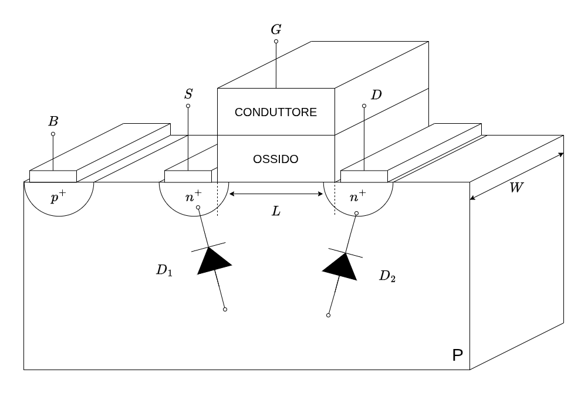
<figcaption>

I serbatoi devono essere **parzialmente sovrapposti** all'elettrodo.
Questo tipo di mosfet si chiama **_a Canale N_** o `NMOS`. Se invertissimo il drogaggio del semiconduttore e delle zone dei serbatori avremmo un `PMOS` (_a Canale P_)
</figcaption>
</figure>

Il transistore `MOSFET` è quindi un circuito a tre terminali:
- **Source** $(S)$: collega il primo serbatoio di cariche al circuito
- **Gate** $(G)$: collega il conduttore al circuito
- **Drain** $(D)$: collega il secondo serbatoio di cariche al circuito
- **Body** $(B)$: collega il semiconduttore in una zona drogata in accordo con esso.

Se volessimo schematizzare le giunzioni tra substrato e _drain_/_source_, è come se avessimo **_due diodi_** che li collegano tra loro.

Affinché il transistore funzioni è necessario che i due diodi $D_1$ e $D_2$ siano **_polarizzati in inversa_**.
In questa configurazione infatti **_non è possibile avere passaggio di corrente tra source e drain_**.

La zona tra _source_ e _draing_ è chiamata **_Lunghezza di Canale_** $(L)$, mentre chiamiamo **_Larghezza di Canale_** $(W)$ la profondità del canale.

## 4.1. Analisi del Transistore

> [!note]
> Le ipotesi sulle quali lavoriamo sono quindi due:
> - L'ossido è perfetto
> - Le giunzioni `D-B` e `S-B` sono in inversa

Analizziamo quindi il nostro transistore

Studiamo quindi cosa accade nel caso in cui:
$$
\begin{align*}
	V_B &= 0 \\
	V_S &= 0 \\
	V_D &= 0 \\
	V_G &> 0 \\
\end{align*}
$$

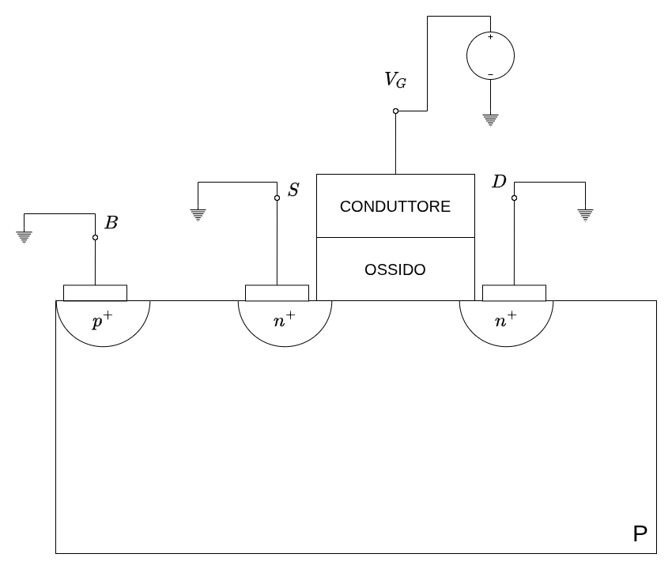

In questa configurazione possiamo identificare i tre casi.
Nel primo si verifica quando:
$$
	\Large
	0 < V_G \ll V_T
$$

In questo caso quello che accade è che, poiché le due giunzioni sono tenute in inversa, **non abbiamo alcun passaggio di corrente**, poiché le zone $S$ e $D$ sono completamente separate.

La seconda configurazione si presenta quando:
$$
	\Large
	0 < V_G < V_T
$$

Equivale alla fase di _svuotamento_ è comporta che la zona di svuotamento si riempie di _ioni fissi_, che non permettono ancora il passaggio di corrente tra i due poli.

L'ultima configurazione, ovvero:
$$
	\Large
	V_G > V_T
$$

È invece quello che permette il passaggio di corrente.

Quando operiamo in **_Zona di Svuotamento_** del condensatore infatti, oltre agli ioni fissi, sono attratti anche gli **elettroni mobili**.
Questi permettono alle zone $S$ e $D$ di mettersi in comunicazione e poter far passare corrente.
Questa zona è chiamata **_Canale_**.

Risulta adesso banale perché avevamo imposto che le zone di accumulo dovessero espandersi anche nella zona sotto l'ossido. Infatti, in questo modo permettiamo agli elettroni mobili di avere superficie di contatto con le zone.

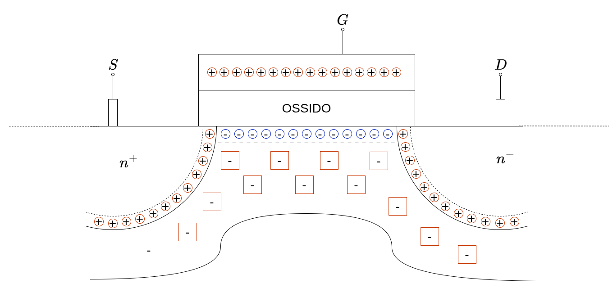

Gli elettroni liberi che formano il canale hanno due sorgenti:
- Generazione termica nel semiconduttore
- Gli elettroni del _source_ e del _drain_ che vengono richiamati dal campo elettrico a formare il canale

A questo punto, se $V_S \neq V_D$ **_abbiamo passaggio di corrente_** attraverso il transistore, ovviamente **_solamente se_** $V_G \ge V_T$.

Studiamo quindi cosa accade nel caso in cui:
$$
\begin{align*}
	V_B &= 0 \\
	V_S &= 0 \\
	V_D &> 0 \\
	V_G &> 0 \\
\end{align*}
$$

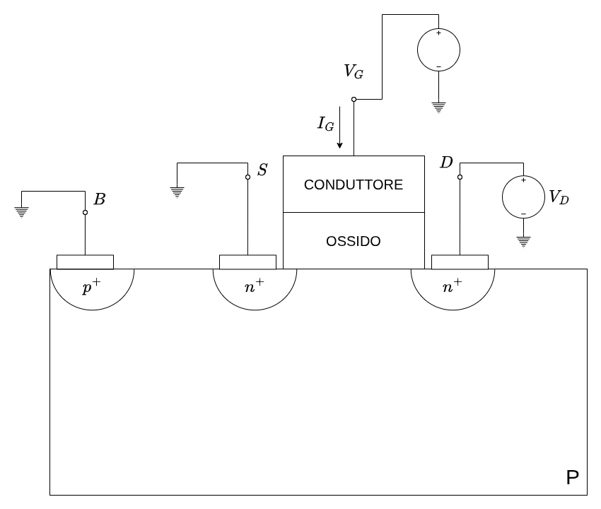

Anche adesso abbiamo più casi da studiare.

### 4.1.1. Zona di funzionamento Triodo

Il primo è quando:
$$
V_{GS} \ge V_T \\ V_{DS} > 0 
$$

In questa configurazione il source fornisce gli elettroni nel canale che sono attratti dalla tensione positiva del _drain_, producendo una corrente:
$$
	I_{DS} > 0
$$

In particolare, il canale opera come se fosse una resistenza, perciò la corrente $I_{DS}$ sarà _direttamente proporzionale_ alla tensione $V_{DS}$.

Se invece aumentassimo $V_{GS}$, mantenendo costante $V_S$ ma aumentando $V_G$ otteniamo che il **canale aumenta di dimensioni**. Mantenedo l'equivalenza con la resistenza quello che accade è che all'aumentare di $V_{GS}$ si a un aumento di $I_{DS}$ a parità di $V_{DS}$.

In generale le correnti e le tensioni che generiamo in questo caso è:
- $V_{DS} \in [0, 150]$ $mV$
- $I_{DS} \in [0.1, 0.3]$ $mA$

In questa zona, detta **_Regione Triodo_** abbiamo che il transistore _MOSFET_ si comporta come una resistenza dipendente dalla tensione.

### 4.1.2. Zona di Attenuazione

La seconda zona di funzionamento si presenta quando aumentiamo il valore di $V_{DS}$.

Prima di poter analizzare questa zona, dobbiamo ricordare che:
> Se la concentrazione di elettroni è uniforme in un segmento di lunghezza $L$ dove i due poli sono sottoposti a tensioni $V_1$ e $V_2$, la tensione in un punto $x$ del segmento crescerà/diminuirà proporzionalmente con la posizioen del punto.

Nel canale, come si vede dall'immagine a destra, il tensione tra $S$ e $D$ cresce linearmente da $0$ fino a $V_{DS}$.

Prendendo un punto generico $x_i$ all'interno del canale, sapppiamo che abbiamo inversione solo se:
$$
	V_{Gx_i} \ge V_T
$$

Se avessimo $V_{DS} = 0$, allora ogni punto sul canale è allo stesso potenziale, altrimenti ogni per ogni coppia di punti $V_{x_i} \ne V_{x_j}$.

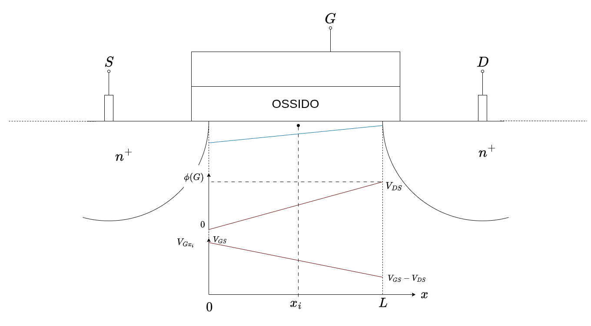

In particolare possiamo quindi scrivere:
$$
\begin{align*}
V_{Gx_i} &= V_{GS} - V_{x_iS}	\\
		 &= V_G - V_S - V_{x_i} + V_S \\
		 &= V_G - V_{x_i} \\
		 &= V_{GS} - \phi(x_i) \\
		 &= \begin{cases}
			V_{GS} & x_i = 0 \\
			V_{GS} - V_{DS} & x_i = L
		 \end{cases}
\end{align*}
$$

Abbiamo quindi dimostrato che la tensione in ogni punto $x_i$ è diversa, in particolare diminuisce linearmente dall'_source_ fino al _drain_.

Questo comporta che anche _**lo spessore del canale diminuirà avvicinandosi al drain**_.

Gli effetti sulla corrente $I_{DS}$ è quindi quello di attenuazione della crescita. Infatti la diminuzione della sezione aumenta la resistenza che il canale fa, producendo una crescita _**non più lineare**_ .

### 4.1.3. Zona di Saturazione

Accade quando **_contnuiamo ad aumentare $V_{DS}$_** fino al punto in cui:
$$
\large
	V_{GS} - V_{DS} = V_T
$$

Questo fenomeno si chiama **_Pinch-Off_** ed è una vera e propria _chiusura anticipata del canale_, che adesso fa molta più fatica a far passare gli elettroni.

Se aumentassimo _ancora di più_ $V_{DS}$ avremmo che:
$$
\exist x_P \quad | \quad V_{GS} - V_{x_PS} = V_L
$$

Questo significa che abbiamo **_chiuso anticipatamente il canale_** di una porzione $\Delta L = L - x_P$.

In questo caso **_la corrente che passa attraverso il canale è costante_**.

Questo risultato, a primo acchitto controintuitivo, si verifica per diversi motivi.

Non dobbiamo infatti scordarci che sotto al canale è presente una _zona di svuotamento_ costituita da cariche fisse. Quando chiudiamo anticipatamente il canale la zona di svuotamento si propaga anche nella zona chiusa anticipatamente.

La superficie della zona $n^+$ produce quindi un campo elettrico $E$ che è ancora presente nella zona di svuotamento.
Quando gli elettroni arrivano alla chiusura del canale quindi risentono di questo campo elettrico e procedono fino a $D$.

Il motivo per il quale la corrente è costante ha a che fare con la dimensione $\Delta L$.

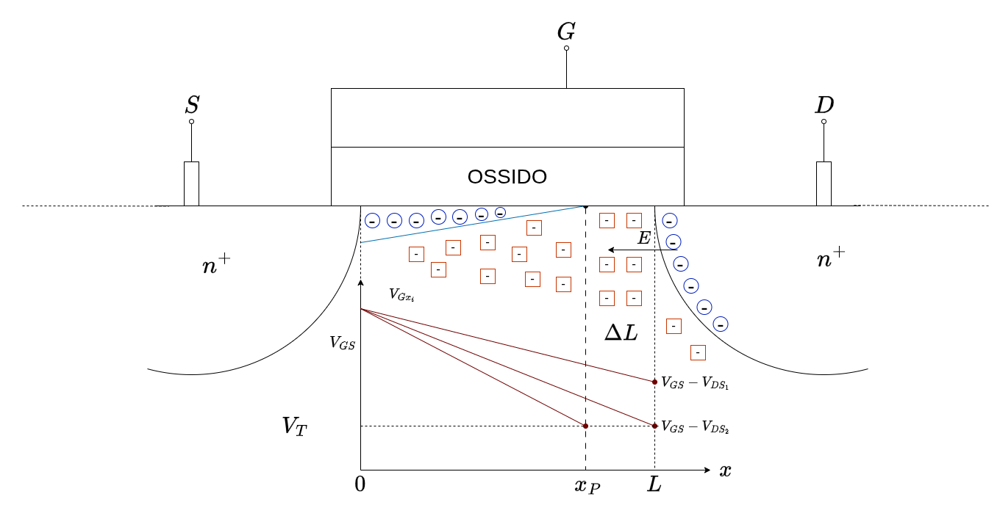

Se $\Delta L \ll L$ abbiamo una resistenza:
$$
	R = \rho \frac{L}{S} \to \rho\frac{L - \Delta L}{S} \approx R
$$

Infatti in questo caso la sezione del tratto ridotto è praticamente la stessa di quella del tratto intero, quindi possiamo sottrarle e notare che la differenza tra le due è praticamente trascurabile.

Quindi abbiamo che la resistenza in un primo frangente è _come se fosse costante_.

In particolare poi dobbiam oricordarci che l{a differenza di potenziale tra il punto di _pinch-off_ e il _source_ è **_sempre_**:
$$
	\phi (x_P) = V_{GS} - V_T
$$

Il motivo per il quale la corrente è costante è proprio questo, gli elettorni in $S$ infatti non risentono più di $V_{DS}$ ma bensì da $V_{PS}$ che **è proprio costante**.

La tensione del _gate_ quindi ci permette semplicemente di **scegliere la corrente che deve attraversare il transistore**, indipendentemente dalla tensione ai suoi capi.

## 4.2. Modellizzazione del Transitore `MOSFET` a canale N

Il modello che utilizziamo per il transistori `MOSFET` a canale **N**, detti anche `NMOS`, ci fornisce due equazioni a seconda della zona nella quale operiamo.

Nella **_Zona Triodo_** l'equazione è la seguente:
$$
\Large
\boxed{
	i_{DS} = \mu_n \cdot C_{ox} \cdot \frac{W}{L} \cdot \Biggl[(V_{GS} - V_T)V_{DS} - \frac{(V_{DS})^2}{2}\Biggr]\;[A]
}
$$

Dove:
- $\mu_n$: mobilità degli elettroni
- $C_{ox} := \frac{\text{Capacità Gate}}{Area} = \frac{\varepsilon_{ox}}{t_{ox}}$ &emsp; rapporto tra la costante dielettrica dell'ossido dallo spessore dello stesso.

Nella **_Zona di Saturazione_** l'equazione è la seguente:
$$
\Large
\boxed{
	i_{DS} = \mu_n \cdot C_{ox} \cdot \frac{W}{L} \cdot \frac{(V_{GS} - V_T)^2}{2}\;[A]
}
$$

Spesso si riassume:
$$
\large
	K = \frac{1}{2}\cdot \mu_n \cdot C_{ox} \cdot \frac{W}{L}
$$

La transizione tra **triodo**/**saturazione** si ha quando:
$$
\LARGE
\boxed{V_{DS} = V_{GS} - V_T}
$$

Quindi possiamo scrivere che la corrente nella **zona di saturazione** varrà:
$$
\large
i_{DS} = K (V_{GS} - T)^2 = K (V_{DS})^2
$$
 

Quindi le due **_Caratteristiche Di Uscita_** sono:
$$
\Large
\boxed{
	\begin{matrix}
\begin{array}{cc:c}
	\textbf{Triodo} & & & \textbf{Saturazione} \\[1em]
	i_{DS} = K \cdot \Biggl[2(V_{GS} - V_T)V_{DS} - (V_{DS})^2\Biggr] & & & i_{DS} = K \cdot (V_{GS} - V_T)^2 \\[1em]
	V_{DS} < V_{GS} - V_T & & & V_{DS} \ge V_{GS} - V_T
\end{array} \\[3em]
K = \frac{1}{2}\mu_n C_{ox} \frac{W}{L}
\end{matrix}
}
$$

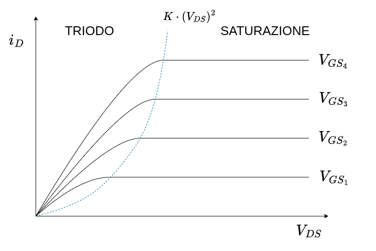

### 4.2.1. Effetto di Modulazione di Canale

In realtà quello che accade quando entriamo in zona di saturazione non è una **corrente costante**, ma una corrente _che cresce poco a poco_.
Questo effetto è molto simile a quello che accadeva nei `BJT` con l'effetto Early.

Questo effetto si manifesta quando $\Delta L$ _**non è trascurabile**_.
Se avessimo sempre $\Delta L \ll L$ allora questo effetto non si presenta.

Esattamente come con l'effetto _Early_, se prolunghiamo queste caratteristiche nell'asse negativo, avremo un intersezione con lo stesso in un punto di tensione:
$$
	V = -\frac{1}{\lambda}
$$

Per tenere conto di questo effetto al'interno delle nostre caratteristiche l'equazione che descrive il comportamento della _corrente in saturazione_ è:
$$
\Large
i_{DS} = \mu_n C_{ox} \frac{W}{L} \cdot \frac{(V_{GS} - V_T)^2}{2} \cdot (1 + \lambda V_{DS})
$$

## 4.3. Trans-Caratteristica

Questa è un altra caratteristica fornita quando parliamo di `MOSFET`.

Questa caratteristica evidenza la **relazione tra $V_{GS}$ e $i_{DS}$**.

In particolare questa relazione descrive _**una parabola**_ che ha origine nel punto $(V_T, 0)$

Questa legge è chiamata anche _**Legge Quadratica del MOSFET**_:

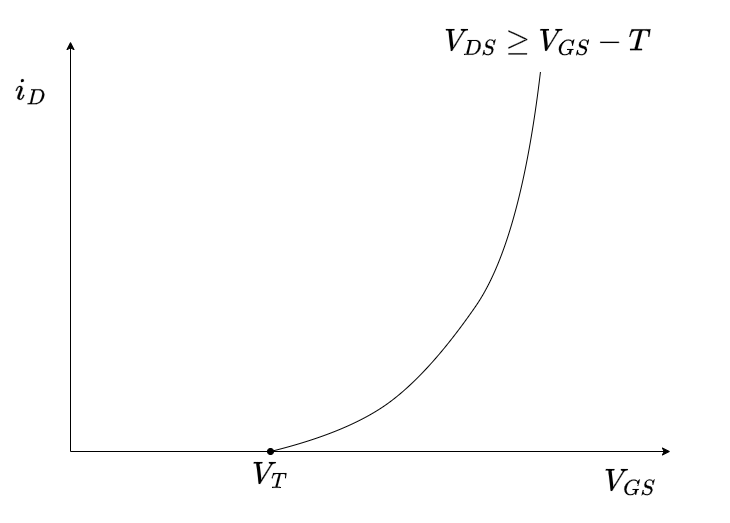

Se consideriamo l'effetto della modulazione nella trans-caratteristica quello che otteniamo è un _**fascio di parabole**_, tutte con la stessa origine:
$$
\large
	i_D = K(1+\lambda V_{DS}) \cdot (V_{GS}-V_T)^2
$$

## 4.4. Modellizzazione del Transitore MOSFET a canale P

Il mosfet a canale P, detto anche `PMOS`, è costituito similmente al `NMOS`, ma si differenzia perché:
- Il Semiconduttore è drogato $n$
- _Source_ e _Drain_ sono drogati $p^+$
- _Base_ è drogata $n^+$

In questo tipo di `MOSFET` _**si crea un canale dove sono le lacune a muoversi in direzione $S \to D$**_, e non gli elettroni.

Il comportamento del `PMOS` _**è il duale del**_ `NMOS`. In particolare, le relazioni sono le stesse ma semplicemente _**cambiamo di segno le tensioni e le correnti**_.

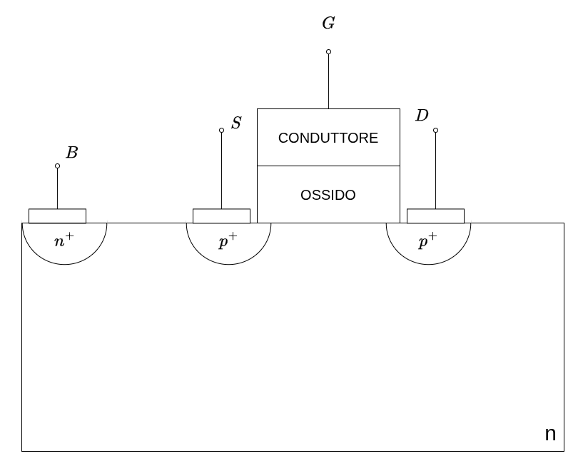

Ad esempio, avevamo visto nel `NMOS` che la tensione $V_{T_N} > 0$ affinché tutto funzioni. Nel caso del `PMOS` invece avremo che $V_{Tp} < 0$.

Di conseguenza non solo anche $V_{GS} < 0$, ma per avere conduzione avremo che $V_{GS} \le V_{Tp} < 0$.

Analogamente alla $V_{GS}$ avremo che anche $V_{DS} < 0$.

La _**Condizione di saturazione**_ diventa quindi:
$$
	\Large
	V_{DS} \le V_{GS} - V_{Tp}
$$

Con questi accorgimenti otteniamo che _**l'equazione della corrente in saturazione è la stessa di prima**_, se non cambiata di verso:
$$
	i_{SD} = \mu_p C_{ox} \frac{W}{L} \cdot \frac{(V_{GS} - V_{Tp})^2}{2} \cdot (1 + \lambda V_{DS})
$$

### 4.4.1. Confronto `NNOS` - `PMOS`

Se lavoriamo sul piano $V_{DS} \times i_{DS}$ otteniamo che le relazioni dell'`NMOS` e del `PMOS` sono _**quasi simmetriche rispetto all'origine**_:

Le due equazioni, ignorando gli effetti di della modulazione di canale, sono quindi:
$$
\LARGE
\boxed{
	\begin{array}{cc:c}
		\textbf{NMOS} &&& \textbf{CMOS} \\[0.5em]
		i_{DS}  = \mu_n C_{ox} \frac{W}{L} \cdot \frac{(V_{GS} - V_{Tn})^2}{2} &&&
		i_{SD}  = \mu_p C_{ox} \frac{W}{L} \cdot \frac{(V_{GS} - V_{Tp})^2}{2}  \\[1em]
		V_{DS} \ge V_{GS} - V_{Tn} &&& V_{DS} \le V_{GS} - V_{Tp}
	\end{array}
}
$$

Dobbiamo però ricordare che:
- $\mu_n > \mu_p$ &emsp; con le tecniche moderne arriviamo ad avere $\mu_n \approx 4 \cdot \mu_p$
- $|V_{Tn}| \ne |V_{Tp}|$

Tendenzialmente avremo quindi che i transistori `NMOS` conducono più corrente.

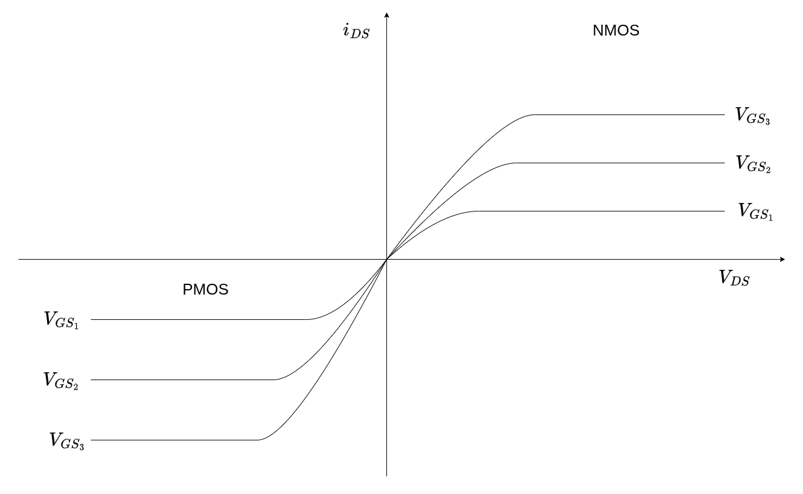

## 4.5. Processi `CMOS`

I processi `CMOS` (_Complementary-MOS_) sono dei processi che permettono di andare a creare dei transistori `NMOS` e `PMOS` che hanno la caratteristica che:
$$\Large
	|V_{Tn}| \approx |V_{Tp}|
$$

Anche se le tensioni di soglia sono simili in modulo, i valori $\mu_p$ e $\mu_n$ continuano ad essere molto diverse.

Per avere due transistori `NMOS` e `PMOS` **complementari**, ovvero per i quali le due caratteristiche di tensione sono **esattamente simmetrici rispetto all'origine** i progettisti possono **_agire sulle dimensioni del transistore_** $W$ e $L$.

Questo valori sono infatti tendenzialmente solamente _limitati inferiormente_, e non hanno dimensioni massime (se non quelle che ci possiamo permettere economicamente). Quindi il progettista può impostare i due parametri in modo che:
$$
	\mu_p\frac{W_p}{L_p} = \mu_n\frac{W_n}{L_n}
$$

## 4.6. Simboli circuitali per i `MOSFET`

All'interno dei circuiti i transistor `MOSFET` hanno **tantissime simbologie**, noi ne vediamo qualcuna più utilizzata.

In particolare abbiamo diversi simboli a seconda che lo stiamo utilizzato nel _campo analogico_ o _campo digitale_.

|        |                                ANALOGICO                                |                                DIGITALE                                 |
| :----: | :---------------------------------------------------------------------: | :---------------------------------------------------------------------: |
| `NMOS` | 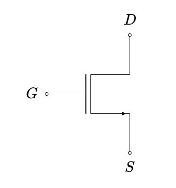 | 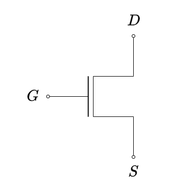 |
| `PMOS` | 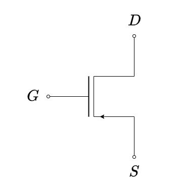 |  |

In campo analogico è possibile anche trovare il seguente simbolo a 4 terminali dove è presente anche la base:

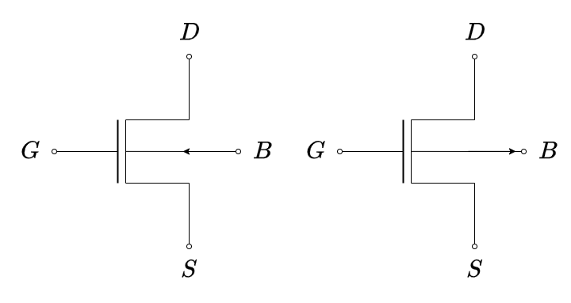

Per il nostro studio sarà raro trovarli quindi possiamo ignorarne l'esistenza.

## 4.7. Modello per Grandi Segnali

Dato che le caratteristiche non sono lineari, dobbiamo fare un _**ipotesi di Lavoro**_.

Tra le tre possibilità scegliamo l'operazione di **_Saturazione_**.

<code>NMOS</code>

<figure class="100">

<figcaption>

È come se avessimo una resistenza infinita tra $G$ e $S$
</figcaption>
</figure>

In questo caso la verifica avviene controllando che:
$$
\LARGE
	V_{DS} \ge (V_{GS} - V_{Tn}) > 0
$$

<code>PMOS</code>

<figure class="100">
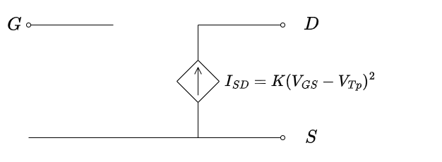
<figcaption>

È come se avessimo una resistenza infinita tra $G$ e $S$
</figcaption>
</figure>

In questo caso la verifica avviene controllando che:
$$
\LARGE
	V_{DS} \le (V_{GS} - V_{Tn}) < 0
$$

## 4.8. Circuito di Polarizzazione

### 4.8.1. Modello a Polarizzazione Costante

Il circuito di polarizzazione più semplice che possiamo immaginare è il seguente:

Questo circuito è caratterizzato dal fatto che $I_G = 0$, che quindi ci permette di calcolare in modo efficiente la tensione $V_G$, sfruttando il _partitore di corrente_:
$$
	V_G = \frac{R_2}{R_1 + R_2}V_{CC}
$$

Questo modello è detto _**Modello a Polarizzazione Costante**:
$$
\large
\begin{cases}
	V_S = 0 \\
	V_{GS} = V_G - V_S = \frac{R_2}{R_1 + R_2}V_{CC}
\end{cases}
$$

Sempre in questa ipotesi abbiamo anche che:
$$
\begin{CD}
\underbrace{
\begin{CD}
	{I_G = 0} @>>> {I_D = I_S} \\
\end{CD}} \\
@VVV \\
{
	V_{CC} = R_D I_D + V_{DS}
}
\end{CD}
$$

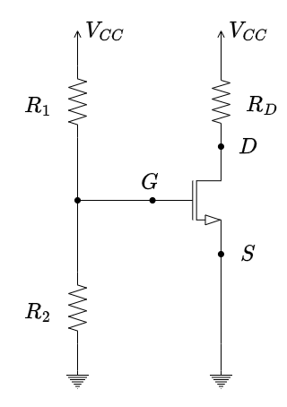

Possiamo quindi graficare il tutto ottenendo qualitativamente il nostro _**Punto Di Lavoro**_:

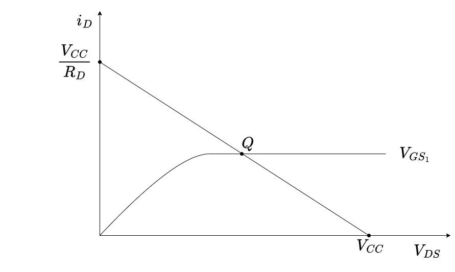

Quantitativamente dobbiamo semplicemente risolvere il circuito sfruttando il _**Modello per Grandi Segnali**_ 
$$
\large
\begin{cases}
	I_D = \frac{1}{R_D}(V_{CC} - V_{DS}) \\
	I_D = K \cdot (V_{GS} - V_{Tn})^2
\end{cases}
$$

Tuttavia questo modello presenta un problema, che si presenta quanto vediamo la trans-caratteristica:

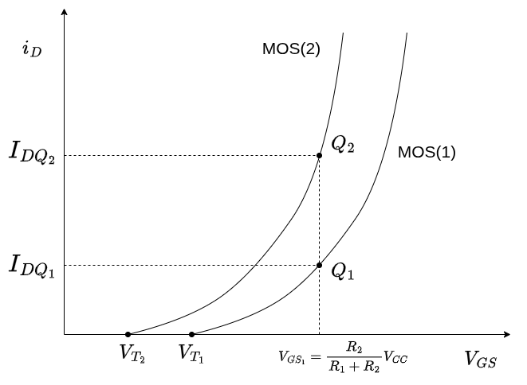

Se infatti mettiamo a confronto due `MOSFET` diversi, anche se sono nominativamente uguali, avranno delle caratteristiche intrinsecamente diverse.

Che faranno _**variare il punto di riposo dei due `MOSFET`**_, producendo correnti e tensioni diverse nei due casi.

Per ovviare a questo problema, utilizziamo altri modelli.

### 4.8.2. Modello a Polarizzazione Dinamica

Si utilizza un _**circuito a 4 resistenze**_:

Per quanto riguarda la tensione $V_G$ non è cambiato niente rispetto a prima:
$$
\begin{CD}
	{I_G = 0} @>>> {V_G = \frac{R_2}{R_1+R_2}V_{CC}}
\end{CD}
$$

Per quanto riguarda invece la tensione $V_S$:
$$
\begin{CD}
\underbrace{
	\begin{CD}
		{I_G = 0} @>>> {I_D = I_S}
	\end{CD}
} \\
@VVV \\
{
V_S = R_S I_S = R_S I_D
} \\
@VVV \\
{
	V_{GS} = V_G - V_S = \frac{R_2}{R_1 + R_2}V_{CC} - R_S I_D = a - R_SI_D
}
\end{CD}
$$

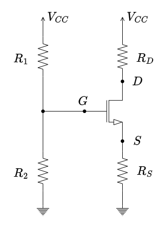

Se tracciamo adesso la _trans-caratteristica_ otteniamo:

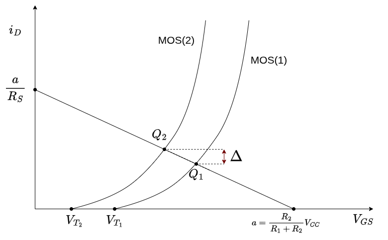

L'introduzione della resistenza $R_S$ ci permette di avere un'_**elevata stabilità del punto di riposo**_.

Se infatti la corrente $i_D$ per qualche motivo dovesse aumentare quello che succede è che anche la $V_S = R_Si_D$ aumenta.
Poiché la tensione $V_G$ è indipendente dalla $i_D$ allora quello che accade è che $V_{GS} = V_G - V_S$ diminuisce.

Tuttavia sappiamo che $i_D = K (V_{GS} - V_T)^2$, quindi al diminuire di $V_{GS}$  diminuisce anche la $i_D$, che ritorna a stabilizzare il sistema.

Se risolviamo il circuito otteniamo la relazione:
$$
\begin{align*}
	V_{CC} &= R_DI_D + V_{DS} + R_SI_D \\
		   &= (R_D+R_S)I_D + V_{DS}
\end{align*}
$$

Quindi dobbiamo risolvere il sistema:
$$
\LARGE
\begin{cases}
	V_{GS} = \frac{R_2}{R_1 + R_2}V_{CC} - R_SI_D \\
	V_{CC} = (R_D+R_S)I_D + V_{DS} \\
	I_D = K \cdot (V_{GS} - V_{Tn})^2
\end{cases}
$$

Questo sistema presenta un secondo grado che ci fornisce due soluzioni. In particolare, una di queste non rispetta una o entrambe le condizioni di verifica $V_{DS} \ge V_{GS} - V_{Tn} > 0$

## 4.9. Modello per Piccoli Segnali

Ricordiamo che in **zona di saturazione**, la corrente:
$$
	i_D = \mu_n C_{ox} \frac{W}{L} \frac{(V_{GS} - V_T)^2}{2}(1 + \lambda V_{DS})
$$

Quello che deduciamo da questa relazione è che $i_D$ dipende da due tensioni diverse, $V_G$ e $V_D$.

Il circuito equivalente nel caso di piccole variazioni di questi segnali è quindi il seguente:

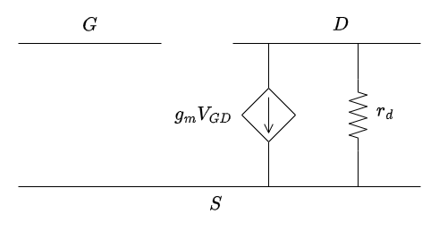

Il termine $g_m$ è detto _**Conduttanza Differenziale**_. È infatti definito come:
$$
	g_m := \frac{\partial i_D}{\partial V_{GS}}\Bigg|_Q
$$

Analogamente ai [parametri di piccolo segnale per il `BJT`](./Transistore%20Bipolare#29-modello-linearizzato-per-piccoli-segnali), indica qui la derivata della relazione _trans-caratteristica_ con la quale approssimiamo la relazione quadratica.

Il termine $r_d$ invece è detta _**Resistenza Differenziale**_, ed è definita:
$$
	r_d := \frac{\partial V_{DS}}{\partial i_D}\Bigg|_Q = \Biggl(\frac{\partial i_D}{\partial V_{DS}}\Bigg|_Q\Biggr)^{-1}
$$

Questo parametri rappresenta l'inversa della derivata della relazione tra $i_D$ e $V_{DS}$. Affinché questo valore abbia senso _**si deve tenere conte dell'effetto di Modulazione di Canale**_.

A differenza dei paramteri del `BJT`, questi parametri sono _**molto semplici da calcolare analiticamente**_:
$$
\begin{align*}
	g_m =  \frac{\partial i_D}{\partial V_{GS}}\Bigg|_Q &= \mu_n C_{ox} \frac{W}{L} \frac{1}{2} \cdot 2 \cdot (V_{GS} - V_T)(1 + \lambda V_{DS}) \\
	&= \frac{i_D}{(V_{GS} - V_T)^2} \cdot 2(V_{GS} - V_T) \\
	&= \frac{2i_D}{(V_{GS} - V_T)}\Bigg|_Q \\[1em]
	&= \frac{2I_{D_Q}}{(V_{GS_Q} - V_T)}
\end{align*}
$$

>  [!important]
> Negli studi che faremo, opereremo due semplificazioni:
> 1. I `MOSFET` non avranno capacità
> 2. La resistenza $r_d \to \infty$, quindi potremo considerarla un aperto

> [!warning]
> Il modello _**è uguale sia per `NMOS` che per `PMOS`**_, in quanto stiamo trattando di relazioni _differenziali_.